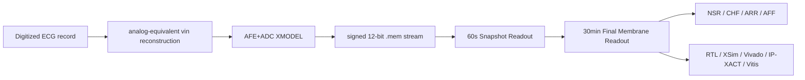

# AFE+ADC XMODEL 연동 SNN 기반 장시간 ECG 4-Class Classification Accelerator IP Core 설계 최종 보고서

## 1. Abstract

본 프로젝트는 공개 digitized ECG record를 analog-equivalent `vin`으로 재구성하고, AFE+ADC XMODEL을 통과시켜 signed 12-bit stream을 생성한 뒤, 이를 SNN-inspired ECG Classification Accelerator IP Core에 입력하여 NSR/CHF/ARR/AFF 4-class 장시간 ECG classification을 수행하는 FPGA/VLSI engineering prototype이다.

최종 모델은 `structural_guarded_silent_aff_1008710`이며, 60초 Snapshot Readout은 고정하고 30분 Final Membrane Readout을 strict record-wise train/validation 기준으로 lock했다. Locked final_test는 selection/search/context에 사용하지 않았고, lock 이후 1회만 평가했다. 최종 성능은 final_test chunk 29/36 = 80.56%, record-majority 16/19 = 84.21%이다.

RTL/XSim, Vivado implementation, AXI/IP-XACT packaging, Vitis/MicroBlaze full-record replay flow를 통해 engineering validation을 수행했다. 단, 본 결과는 direct electrode acquisition, board-level AFE/ADC silicon measurement, transistor-level layout verification, medical diagnosis validation을 의미하지 않는다.

## 2. Introduction

ECG rhythm classification은 단일 sample이나 짧은 beat 단위만으로 안정적으로 결정되기 어렵다. NSR, CHF, ARR, AFF는 rhythm variability, morphology abnormality, QRS evidence, long-window trend가 함께 반영되어야 한다. 따라서 본 프로젝트는 dense CNN/RNN classifier를 FPGA에 그대로 올리는 대신, ECG domain evidence를 spike/event 형태로 압축하고 30분 window에서 final membrane을 누적하는 streaming accelerator 구조를 선택했다.

목표는 높은 resource를 요구하는 multiply-heavy model이 아니라, signed 12-bit ECG stream을 직접 처리하고 counter/comparator/signed accumulator/WTA 기반으로 동작하는 low-resource biomedical accelerator IP를 구현하는 것이다.

## 3. System Overview



전체 flow는 공개 digitized ECG record에서 시작한다. 입력 code는 `vin_v = code / 200000` 기준으로 voltage-equivalent waveform으로 해석하고, AFE+ADC XMODEL을 통해 signed 12-bit `.mem` stream으로 변환한다. 이 stream은 RTL/IP에 입력되어 60초 snapshot evidence를 만들고, 30분 Final Membrane Readout에서 class별 membrane을 누적한 뒤 WTA로 최종 class를 출력한다.

## 4. AFE+ADC XMODEL Input Generation

공개 ECG dataset은 이미 digitized record이므로 원래의 sensor waveform을 복원할 수 없다. 본 프로젝트는 이를 direct acquisition으로 주장하지 않고, virtual DAC/PWL-equivalent reconstruction으로 해석한다.

AFE+ADC nominal chain은 다음과 같이 정리한다.

| Stage | Role |
|---|---|
| `code / 200000` | digitized ECG code를 analog-equivalent `vin`으로 해석 |
| HPF | baseline drift 저감 |
| IA gain x201 | ECG amplitude scaling |
| 60 Hz notch | power-line component suppression |
| LPF 150 Hz | high-frequency noise 제한 |
| 12-bit ADC quantization | RTL 입력 signed 12-bit stream 생성 |

이 flow는 model-based mixed-signal-to-digital verification이다. Board-level AFE, ADC silicon, transistor-level layout 결과는 포함하지 않는다.

## 5. Snapshot SNN Readout

Snapshot Readout은 60초 window마다 ECG evidence를 spike/counter 형태로 압축한다. 주요 feature block은 QRS detection, rhythm prediction/mismatch evidence, morphology evidence, variability evidence, ectopic/abnormal evidence를 포함한다. Snapshot 내부에서는 class membrane과 WTA를 통해 60초 단위 class evidence를 만든다.

최종 제출에서는 locked Final Membrane에 입력되는 고정 Snapshot Readout 구조를 기준으로 설명한다.

### 5.1 Feature block을 왜 나누는가

ECG 4-class classification에서 한 sample의 크기만으로는 NSR, CHF, ARR, AFF를 구분하기 어렵다. 같은 30분 record 안에서도 어떤 60초 구간은 정상처럼 보일 수 있고, 어떤 구간은 rhythm 또는 morphology abnormality가 뚜렷할 수 있다. 그래서 본 설계는 sample stream을 바로 class로 바꾸지 않고, 다음 세 종류의 evidence로 나누어 누적한다.

| Evidence group | 보는 대상 | 직관적 의미 |
|---|---|---|
| Beat/QRS evidence | QRS 위치, R peak, QRS 폭 | “심장이 한 번 뛴 위치와 그 beat 모양이 정상적인가” |
| Rhythm evidence | RR interval, 예측 beat 위치, variability | “박동 간격이 규칙적인가, 갑자기 흔들리는가” |
| Morphology evidence | slope sign flip, energy, terminal activity | “파형이 단순한가, 넓거나 복잡하거나 늦게 끌리는가” |

이 evidence는 모두 integer counter, comparator, signed accumulator로 구현된다. 따라서 floating-point convolution, recurrent state matrix, multiplier-heavy dense layer가 필요 없다.

### 5.2 Adaptive event encoder와 QRS LIF detector

가장 먼저 필요한 것은 beat의 기준점이다. RTL은 현재 sample과 이전 sample의 차이 `delta`를 보고, 절대값이 adaptive threshold를 넘는 순간을 `strong_event`로 만든다. QRS 구간에서는 slope가 짧은 시간에 크게 변하므로 `strong_event`가 연속해서 나타난다.

QRS LIF detector는 이 `strong_event`를 membrane에 적분한다.

```text
strong_event 발생        -> QRS membrane += QRS_W_EVENT
strong_event가 없는 clock -> QRS membrane -= QRS_LEAK
QRS membrane >= QRS_TH   -> beat_spike 발화, membrane reset, refractory 시작
```

단발성 noise 하나는 membrane threshold를 넘기 어렵다. 반대로 실제 QRS처럼 event가 모이면 threshold를 넘고 `beat_spike`가 나온다. `refractory`는 같은 QRS를 여러 번 세지 않게 막는 장치이다. 이 `beat_spike`가 PNN, RDM, RAM, ECP, QRS MAF, RBBB-like delay block의 공통 기준 clock이 된다.

주요 RTL 파일:

```text
rtl/core/ecg_event_encoder_adaptive.v
rtl/core/qrs_lif_detector.v
```

### 5.3 PNN rhythm predictor

PNN rhythm predictor는 “다음 beat가 언제 올 것인가”를 예측하고, 실제 beat가 그 예측 위치 근처에 들어왔는지 확인한다. 직전 RR interval 또는 rhythm hypothesis가 다음 beat timing의 기준이 되고, 실제 `beat_spike`가 그 window 안에 오면 match, 벗어나면 mismatch evidence가 된다.

| Output | 의미 |
|---|---|
| `pnn_match_spike` | rhythm이 예측 가능한 범위 안에서 유지됨 |
| `pnn_mismatch_spike` | beat timing이 예측 window를 벗어남 |

match가 반복되면 규칙적인 rhythm evidence가 되고, mismatch가 반복되면 ARR/AFF 계열의 irregular rhythm evidence가 된다.

주요 RTL 파일:

```text
rtl/core/pnn_rhythm_predictor.v
```

### 5.4 RDM variability neuron

RDM은 PNN보다 직접적으로 RR interval 변화량을 본다. PNN이 “예측 위치를 지켰는가”를 본다면, RDM은 “이번 RR과 직전 RR이 얼마나 달라졌는가”를 level/code로 만든다.

```text
rr_delta = abs(current_rr - previous_rr)
rr_delta가 작음 -> 안정적인 rhythm evidence
rr_delta가 큼   -> beat-to-beat variability evidence
```

RDM evidence는 AFF처럼 RR interval이 불규칙하게 흔들리는 경우, 또는 ARR 구간에서 짧게 튀는 rhythm burst를 잡는 보조 evidence로 사용된다.

주요 RTL 파일:

```text
rtl/core/rdm_variability_neuron.v
```

### 5.5 DSCR spike counter

DSCR은 beat 간격이 아니라 waveform shape를 본다. ECG가 매끈하게 지나가는지, 아니면 slope 방향이 자주 바뀌는 복잡한 morphology를 보이는지 세는 block이다.

| Signal | 직관적 의미 |
|---|---|
| valid slope spike | 의미 있는 waveform 변화가 있음 |
| sign flip spike | slope 방향이 의미 있게 바뀜 |
| sign flip/count 증가 | morphology가 복잡하거나 에너지가 큰 구간 |

이 evidence는 CHF/NSR 분리, ARR/AFF 보조 판단, QRS MAF와 연결된 morphology 판단에 사용된다.

주요 RTL 파일:

```text
rtl/core/dscr_spike_counter.v
```

### 5.6 RAM peak accumulator

RAM은 memory block 이름이 아니라 R-peak amplitude response를 보는 feature block이다. QRS LIF가 beat를 찾으면, RAM은 beat 주변 window에서 baseline 대비 R peak가 얼마나 크게 올라갔는지 threshold bank로 본다.

```text
beat 주변 window open
sample - baseline 계산
양의 amplitude가 threshold bank를 얼마나 통과하는지 code 생성
window 안의 peak response를 ram_amp_code / ram_code_sum으로 누적
```

평균이나 나눗셈을 RTL에 넣지 않고, threshold comparator와 integer sum/count로 amplitude evidence를 만든다.

주요 RTL 파일:

```text
rtl/core/ram_peak_accumulator.v
```

### 5.7 Ectopic pair neuron

Ectopic pair neuron은 RR interval 하나가 짧거나 길다는 사실만으로 바로 class evidence를 만들지 않는다. 기준 RR보다 빠른 beat와 늦은 beat가 교대로 나타나는 early/late pair를 본다.

```text
current_rr < rr_ref - threshold -> early_rr_spike
current_rr > rr_ref + threshold -> late_rr_spike
early 다음 late 또는 late 다음 early -> ectopic_pair_spike
```

즉 단일 outlier가 아니라 “조기 박동 + 보상성 지연”처럼 보이는 pattern이 반복될 때 ARR-like rhythm evidence로 사용된다.

주요 RTL 파일:

```text
rtl/core/ectopic_pair_neuron.v
```

### 5.8 QRS MAF neuron

QRS MAF는 QRS Morphology Abnormality Feature이다. 단일 feature 하나가 아니라 QRS 주변 window에서 width, complexity, energy, pre-QRS bump를 함께 보는 morphology analyzer에 가깝다.

| Sub-feature | 보는 현상 |
|---|---|
| QRS width | QRS activity가 너무 넓게 지속되는가 |
| QRS complexity | QRS window 안의 slope sign flip이 많은가 |
| QRS energy | baseline 대비 energy가 평소 reference에서 벗어나는가 |
| Pre-QRS bump | beat 직전 window에 이상 activity가 있는가 |

이 feature는 rhythm evidence만으로는 구분이 어려운 case에서 morphology evidence를 제공한다.

주요 RTL 파일:

```text
rtl/core/qrs_maf_neuron.v
```

### 5.9 RBBB-like QRS delay bank

RBBB QRS delay bank는 임상적 RBBB 진단 block이 아니다. RTL 관점에서는 “wide QRS + terminal activity”가 반복되는지를 보는 conduction-delay proxy evidence block이다.

```text
QRS onset 이후 observation window open
80 ms, 90 ms, ..., 160 ms 지점 activity 확인
늦은 지점까지 activity가 남으면 wide_qrs_spike
terminal window activity가 많으면 terminal_delay_spike
wide + terminal delay가 함께 나타나면 rbbb_like_beat_spike
60초 안에서 반복되면 rbbb_segment_spike
```

이 evidence는 NSR을 억제하거나 ARR/CHF/AFF 쪽 morphology evidence를 보강하는 방향으로 class score membrane에 반영될 수 있다.

주요 RTL 파일:

```text
rtl/core/rbbb_qrs_delay_bank.v
```

### 5.10 Class score neurons와 60초 WTA

위 feature neuron들이 만든 spike와 count는 `class_score_neurons.v`로 들어간다. 이 block은 NSR/CHF/ARR/AFF class membrane 네 개를 유지하고, 각 feature evidence를 fixed signed weight로 더하거나 뺀다.

```text
feature spike/count 발생:
    class_mem[NSR] += W_feature_to_NSR
    class_mem[CHF] += W_feature_to_CHF
    class_mem[ARR] += W_feature_to_ARR
    class_mem[AFF] += W_feature_to_AFF

60초 segment_done:
    pred_class = WTA(class_mem)
```

weight가 양수이면 해당 class membrane에 흥분성 자극을 주는 것이고, 음수이면 억제성 자극을 주는 것이다. 이 때문에 본 설계는 “feature vector + software classifier”가 아니라 “feature spike + class membrane + WTA” 구조로 설명할 수 있다.

## 6. Final Membrane Readout

Final Membrane Readout은 30개의 60초 snapshot에서 나온 evidence를 class별 membrane에 누적한다. 단순 majority vote와 달리, snapshot WTA에서 드러난 class뿐 아니라 subthreshold evidence와 guard/rescue 조건을 반영한다.

최종 locked candidate:

```text
structural_guarded_silent_aff_1008710
```

이 candidate는 train/validation only structural-grid search 후 lock되었고, final_test 결과를 보고 파라미터를 수정하지 않았다.

## 7. Fully Blind Strict Record-wise Protocol

최종 protocol의 핵심은 record leakage를 막는 것이다. Split unit은 `source_record_id`이며, 동일 source record에서 나온 30분 chunk가 train/validation/final_test에 동시에 들어가지 않도록 구성한다.

| Item | Value |
|---|---|
| Split unit | `source_record_id` |
| Final model | `structural_guarded_silent_aff_1008710` |
| final_test used for selection | false |
| final_test used for parameter search | false |
| final_test used for ChatGPT context | false |
| final_test evaluation count | 1 |
| Validation role | model selection only |

Validation 100%는 최종 일반화 성능이 아니라 model-selection 성능이다. 최종 성능 주장은 locked final_test 결과만 사용한다.

## 8. Results

### 8.1 Strict Record-wise Result

| Split | Correct / Total | Accuracy |
|---|---:|---:|
| Train | 61 / 68 | 89.71% |
| Validation | 32 / 32 | 100.00% |
| Final test chunk | 29 / 36 | 80.56% |
| Final test record-majority | 16 / 19 | 84.21% |

### 8.2 XSim

| Check | Result |
|---|---:|
| final_test cases | 36 |
| final_pred mismatch | 0 |
| final_mem mismatch | 0 |

### 8.3 Vivado / IP / Board

| Item | Result |
|---|---|
| Pure RTL resource | LUT/FF/BRAM/DSP 9719/5038/0/0 |
| Pure RTL timing | WNS 8.184 ns |
| Estimated total power | 0.099 W |
| AXI/IP-XACT | accelerator and sample feeder packaged |
| MicroBlaze full replay system | bitstream/XSA/ELF generated, timing met |
| Board replay | NSR/CHF/ARR/AFF each one 30-minute case, final_pred/final_mem exact 4/4 |

## 9. Hardware Implementation and IP Packaging

The accelerator is implemented as a reusable RTL/IP block with AXI4-Lite control/status and AXI4-Stream sample input. A small MMIO-to-AXIS sample feeder is used for the MicroBlaze board replay path so that 16-bit sample data and TLAST timing can be controlled deterministically.

Final hardware artifacts:

| Artifact | Path |
|---|---|
| Locked params | `configs/recordwise_resplit_seed20260808/best_final_membrane_structural_grid_locked.json` |
| RTL params include | `rtl/strict_recordwise_locked_params.vh` |
| Accelerator IP-XACT | `ip_repo/snn_ecg_axi_accelerator/component.xml` |
| Feeder IP-XACT | `ip_repo/axi_lite_axis_sample_feeder/component.xml` |
| Bitstream | `results/board_replay/microblaze_full_replay/snn_ecg_mb_full_replay.bit` |
| XSA | `results/board_replay/microblaze_full_replay/snn_ecg_mb_full_replay.xsa` |
| MicroBlaze ELF | `results/board_replay/microblaze_full_replay/snn_ecg_mb_full_replay_app.elf` |

## 10. Discussion

본 프로젝트의 기여는 analog physical measurement가 아니라, AFE+ADC XMODEL과 digital accelerator IP를 연결한 biomedical mixed-signal-to-digital FPGA prototype이다. Multiply-heavy neural network 대신 event/spike evidence, counter/comparator, signed membrane accumulation, WTA를 사용해 low-resource RTL 구조를 구성했다.

Board replay는 representative class-wise 4개 30분 record에서 bit-exact 결과를 확인했다. 전체 final_test 36개 case의 board batch replay와 board-level current/power measurement는 남은 확장 검증이다.

## 11. Conclusion

본 repo의 최종 결과는 locked strict record-wise protocol과 hardware validation이 연결된 SNN-inspired ECG 4-class accelerator IP prototype이다. 최종 모델은 train/validation으로 lock되고 final_test를 1회 평가했으며, RTL/XSim/Vivado/IP/Vitis evidence가 같은 locked model 기준으로 정리되었다.

## Appendix. Final Artifact Index

- Source of truth: `configs/final_submission_locked_model.json`
- Final metrics: `reports/final/final_metrics.json`
- Strict record-wise result: `reports/final/strict_recordwise_final_result.md`
- Hardware validation: `reports/final/hardware_validation_result.md`
- Board replay result: `reports/final/board_replay_result.md`
- Figures: `reports/final/figures/`
