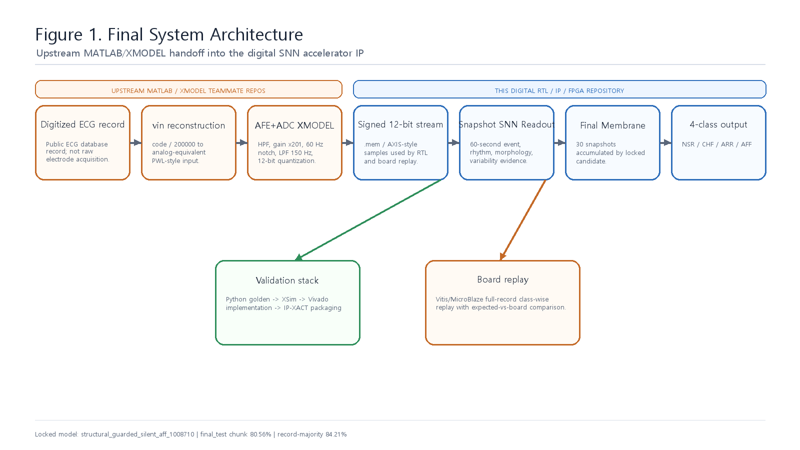
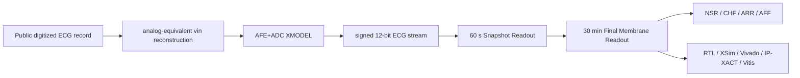
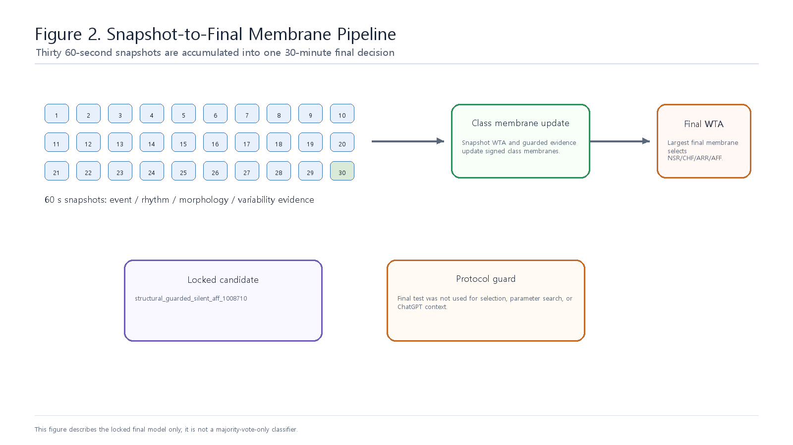
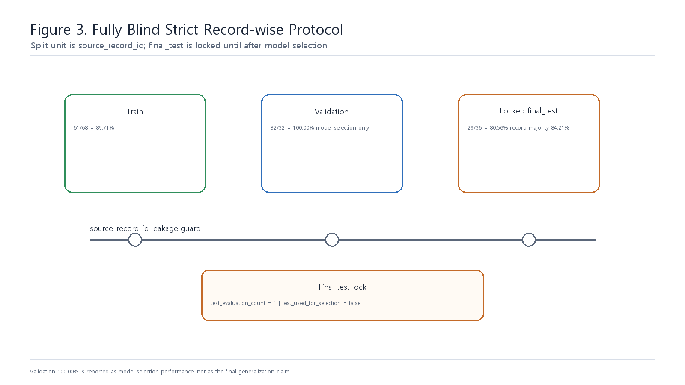
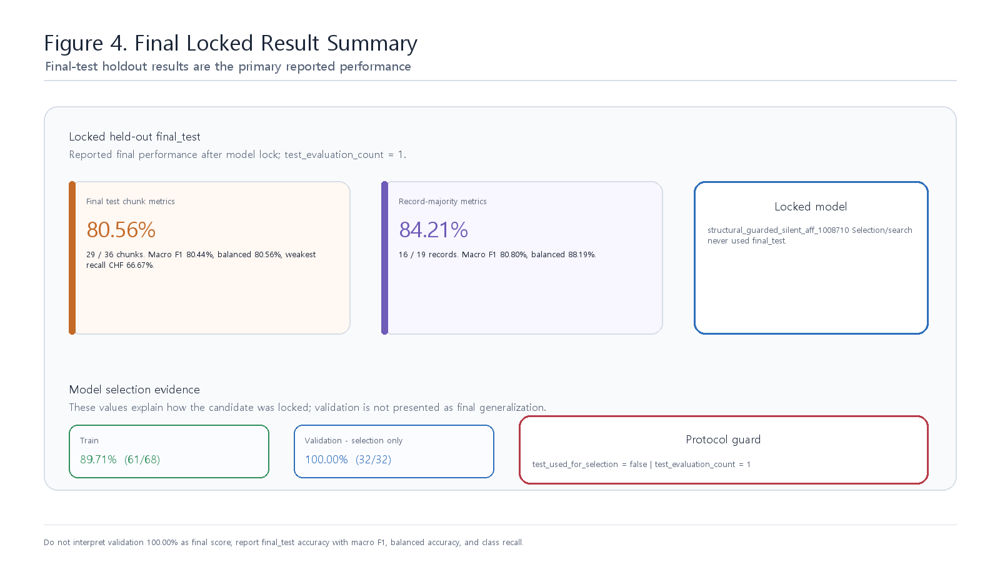
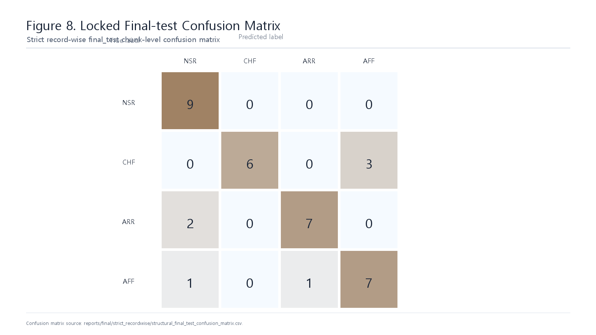
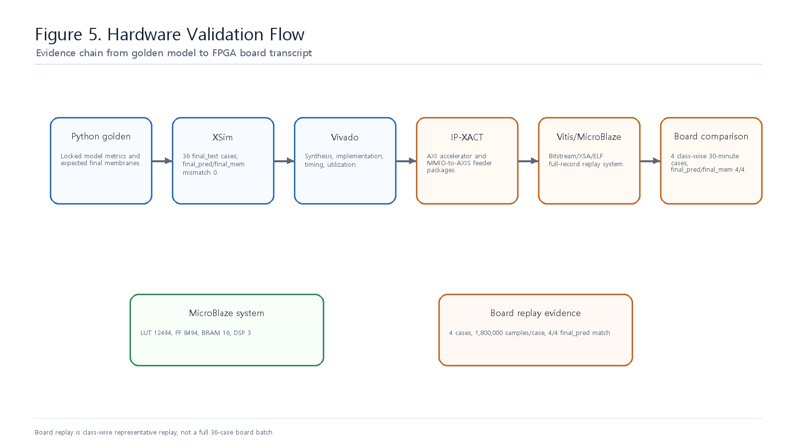
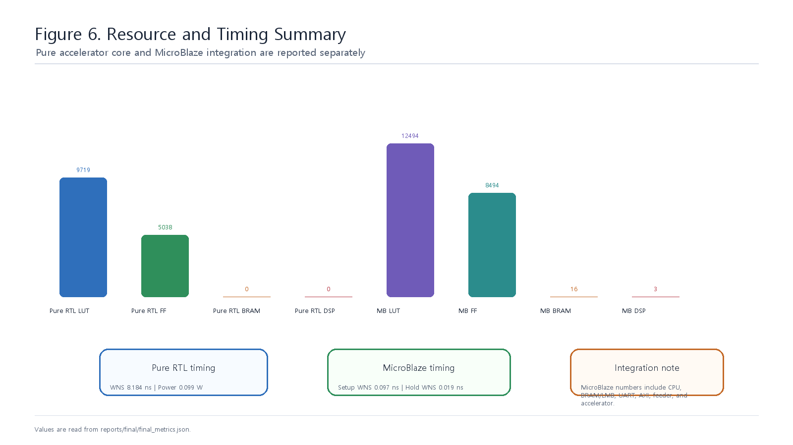
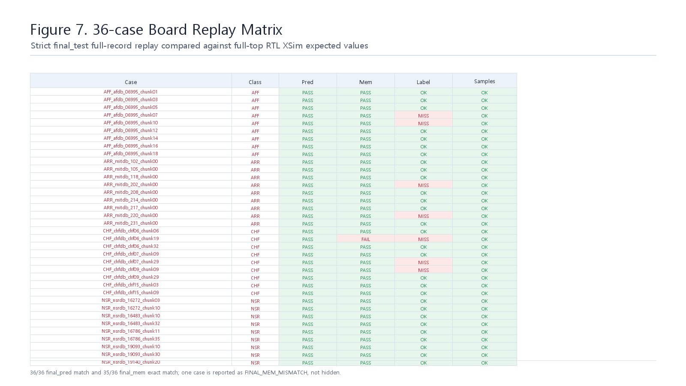

# AFE+ADC XMODEL 연동 SNN 기반 장시간 ECG 4-Class Classification Accelerator IP Core 설계 최종 보고서

## 1. Abstract

본 프로젝트는 공개 digitized ECG record를 analog-equivalent `vin`으로 재구성하고, AFE+ADC XMODEL을 통과시켜 signed 12-bit stream을 생성한 뒤, 이를 SNN-inspired ECG Classification Accelerator IP Core에 입력하여 NSR, CHF, ARR, AFF 4-class 장시간 ECG classification을 수행하는 FPGA/VLSI engineering prototype이다.

최종 모델은 `structural_guarded_silent_aff_1008710`이다. Snapshot Readout은 고정하고, 30분 Final Membrane Readout만 strict record-wise train/validation 기준으로 structural-grid search 후 lock했다. Locked final_test는 모델 선택, 파라미터 탐색, 외부 논의 context에 사용하지 않았고, lock 이후 1회만 평가했다.

최종 성능은 final_test 30분 chunk 기준 29/36 = 80.56%, record-majority 기준 16/19 = 84.21%이다. RTL/XSim bit-accurate 비교, Vivado implementation, AXI/IP-XACT packaging, Vitis/MicroBlaze 36-case full-record board replay까지 engineering validation을 수행했다.

본 결과는 실제 전극 기반 ECG 측정, physical AFE PCB 측정, ADC silicon 측정, transistor-level layout 검증, clinical diagnosis validation을 의미하지 않는다. 본 프로젝트의 핵심 위치는 AFE+ADC XMODEL과 SNN-inspired RTL Accelerator IP Core를 연결한 model-based mixed-signal-to-digital FPGA prototype이다.

## 2. Introduction

ECG rhythm classification은 단일 sample이나 짧은 beat 하나만으로 안정적으로 결정하기 어렵다. NSR, CHF, ARR, AFF는 rhythm regularity, beat-to-beat variability, QRS morphology, 장시간 evidence 누적이 함께 반영되어야 한다.

일반적인 dense CNN/RNN/MLP classifier를 FPGA에 그대로 올리면 multiplier, DSP, BRAM, weight memory, activation buffer가 설계 병목이 된다. 본 프로젝트는 ECG domain knowledge를 event/spike evidence로 바꾸고, counter, comparator, signed accumulator, WTA 기반의 integer-only datapath로 장시간 classification을 수행하도록 설계했다.

목표는 높은 계산량의 generic neural network가 아니라, signed 12-bit ECG stream을 직접 받아 긴 window를 처리할 수 있는 low-resource biomedical streaming accelerator IP를 구현하고 검증하는 것이다.

## 3. System Overview





전체 flow는 공개 digitized ECG record에서 시작한다. 입력 code를 `vin_v = code / 200000` 기준의 voltage-equivalent waveform으로 해석하고, AFE+ADC XMODEL을 통과시켜 signed 12-bit `.mem` stream으로 변환한다.

이 stream은 RTL/IP에 입력되어 60초 단위 Snapshot Readout을 만든다. 이후 30개 snapshot evidence를 Final Membrane Readout이 누적하고, class별 final membrane을 WTA로 비교하여 NSR/CHF/ARR/AFF 중 하나를 출력한다.

## 4. AFE+ADC XMODEL Input Generation

공개 ECG dataset은 이미 digitized record이므로, 본 프로젝트는 원래 sensor waveform을 복원했다고 주장하지 않는다. 대신 digitized code를 analog-equivalent `vin`으로 재구성하고, 이를 AFE+ADC XMODEL에 넣는 virtual DAC/PWL-equivalent input generation flow로 해석한다.

| 단계 | 역할 |
|---|---|
| `code / 200000` | digitized ECG code를 analog-equivalent `vin`으로 해석 |
| HPF | baseline drift 억제 |
| IA gain x201 | ECG amplitude scaling |
| 60 Hz notch | 전원성 간섭 억제 |
| LPF 150 Hz | 고주파 잡음 제한 |
| 12-bit ADC quantization | RTL 입력 signed 12-bit stream 생성 |

이 과정은 단순 scaling이 아니라, AFE+ADC nominal model을 digital accelerator 앞단에 둔 model-in-the-loop 검증이다. 따라서 본 프로젝트의 mixed-signal 성격은 physical board measurement가 아니라 XMODEL 기반 engineering validation으로 정의한다.

## 5. Snapshot SNN Readout

Snapshot Readout은 60초 window마다 ECG stream을 event, rhythm, morphology, variability evidence로 압축한다. 모든 sample에 dense arithmetic을 수행하지 않고, QRS와 beat 주변에서 의미 있는 spike/counter evidence를 만들도록 구성했다.



| Feature block | 직관적 의미 | RTL 역할 |
|---|---|---|
| Adaptive event encoder + QRS LIF | ECG slope가 갑자기 크게 변하는 순간을 누적해 beat/QRS spike를 만든다. | downstream rhythm/morphology block의 기준이 되는 `beat_spike` 생성 |
| PNN rhythm predictor | 다음 beat가 직전 RR hypothesis 예측을 지켰는지 확인한다. | 규칙/불규칙 rhythm에 대한 match/mismatch evidence 생성 |
| RDM variability neuron | 연속 RR interval이 얼마나 변하는지 threshold bank로 본다. | beat-to-beat variability evidence 누적 |
| DSCR spike counter | waveform slope sign change와 유효 slope 변화를 센다. | multiplier 없이 morphology complexity evidence 생성 |
| RAM peak accumulator | R-peak amplitude response를 threshold bank로 측정한다. | beat amplitude behavior를 integer evidence code로 변환 |
| Ectopic pair neuron | early/late RR pair pattern을 본다. | ARR-like ectopic rhythm evidence 생성 |
| QRS MAF neuron | QRS width, complexity, energy, pre-QRS bump를 본다. | morphology abnormality evidence 생성 |
| RBBB-like QRS delay bank | wide QRS와 terminal activity를 conduction-delay proxy로 본다. | 반복 wide/terminal QRS evidence를 snapshot level에 추가 |
| Class score neurons | fixed signed feature weight를 class membrane에 적용한다. | 60초 snapshot WTA output 생성 |

PNN rhythm predictor의 핵심은 현재 RR interval의 winner neuron이 다음 RR interval을 평가할 predictor neuron으로 넘어간다는 점이다. 즉 PNN은 단순히 이번 RR을 분류하는 block이 아니라, 직전 winner가 만든 rhythm expectation을 다음 beat가 지켰는지를 보는 rhythm neuron이다.

RDM은 PNN보다 직접적으로 RR 변화량을 본다. `abs(RR_curr - RR_prev)`가 threshold bank를 얼마나 통과했는지에 따라 variability level evidence를 만든다. DSCR, QRS MAF, RBBB-like delay bank는 rhythm만으로 설명하기 어려운 morphology evidence를 보강한다.

Snapshot 단계의 출력은 final class가 아니라 60초 evidence이다. Borderline record에서는 일부 snapshot이 정상처럼 보일 수 있으므로, 최종 판단은 30분 Final Membrane Readout에서 수행한다.

### 5.1 Adaptive Event Encoder and QRS LIF

가장 먼저 찾아야 하는 것은 QRS 주변의 급격한 변화이다. Adaptive event encoder는 현재 sample과 이전 sample의 차이인 `delta`를 보고, record 초반 calibration에서 잡은 adaptive threshold보다 큰 변화만 `strong_event`로 만든다.

```text
delta = adc_data[n] - adc_data[n-1]
abs(delta) >= adaptive_threshold -> strong_event
delta > 0 -> up_event
delta < 0 -> down_event
```

QRS LIF detector는 `strong_event` 하나를 바로 beat로 확정하지 않는다. Strong event가 짧은 시간 안에 계속 들어올 때 membrane이 threshold를 넘고, 그 순간 `beat_spike`가 발생한다. Refractory counter는 같은 QRS가 여러 번 세어지는 것을 막는다.

```text
strong_event 발생 -> QRS membrane에 excitatory weight 누적
QRS membrane >= threshold -> beat_spike
beat_spike 이후 refractory 동안 재발화 억제
```

즉 QRS LIF는 단발성 noise가 아니라 연속적인 QRS-like event burst에 반응하도록 만든 beat detector이다. 이후 PNN, RDM, RAM, Ectopic pair, QRS MAF, RBBB-like delay block은 이 `beat_spike`를 기준 clock처럼 사용한다.

### 5.2 PNN Rhythm Predictor

PNN은 “다음 beat가 언제 올지 예측하고, 실제 beat가 그 예측을 지켰는지”를 보는 rhythm neuron이다. 내부에는 여러 개의 RR hypothesis neuron이 있으며, 각 neuron은 250 ms, 300 ms, 350 ms처럼 가능한 RR interval 중심값을 나타낸다.

```text
1. beat_spike가 들어온다.
2. 지난 beat 이후 흐른 token_age를 현재 RR interval로 확정한다.
3. 현재 RR과 가장 가까운 RR hypothesis neuron을 current_winner로 고른다.
4. 직전 predictor_id가 있으면 현재 RR이 그 예측 범위 안에 있는지 평가한다.
5. 범위 안이면 pnn_match_spike, 범위 밖이면 pnn_mismatch_spike가 발생한다.
6. current_winner는 다음 beat를 평가할 predictor_id로 저장된다.
```

PNN의 핵심은 현재 RR의 winner neuron이 다음 RR을 평가할 predictor neuron으로 넘어간다는 점이다. 예를 들어 현재 RR이 800 ms 근처라면 800 ms hypothesis가 winner가 되고, 다음 beat도 약 800 ms 근처에 올 것으로 기대한다. 다음 beat가 790 ms에 오면 match이고, 500 ms나 1200 ms에 오면 mismatch이다.

| 신호 | 해석 |
|---|---|
| `pnn_match_spike` | rhythm이 직전 winner가 만든 예측을 지킴 |
| `pnn_mismatch_spike` | rhythm이 직전 winner 예측에서 벗어남 |
| match 반복 | 비교적 규칙적인 rhythm evidence |
| mismatch 반복 | ARR/AFF 계열 irregular rhythm evidence |

### 5.3 RDM Variability Neuron

RDM은 PNN보다 직접적으로 RR interval 변화량을 본다. PNN이 “직전 rhythm hypothesis를 지켰는가”를 본다면, RDM은 “이번 RR과 직전 RR이 얼마나 달라졌는가”를 threshold bank로 측정한다.

```text
rr_diff = abs(RR_curr - RR_prev)
rr_diff >= 10 sample -> level 1
rr_diff >= 20 sample -> level 2
...
rr_diff >= 150 sample -> level 15
```

작은 변화는 낮은 level만 켜지고, 큰 변화는 높은 level까지 켜진다. 따라서 RDM은 floating-point variability metric을 계산하지 않고도 beat-to-beat variability evidence를 integer spike/code로 제공한다.

### 5.4 DSCR Spike Counter

DSCR은 RR interval이 아니라 waveform shape를 본다. ECG가 매끄럽게 지나가는지, 아니면 slope 방향이 자주 바뀌는 복잡한 morphology를 보이는지 감지한다.

```text
filtered_ecg[n] 생성
slope_input = filtered_ecg[n] - filtered_ecg[n-1]
positive / negative slope membrane update
유효 slope spike가 발생할 때 slope sign transition 검사
sign flip 누적이 threshold를 넘으면 dscr_sign_flip_spike
```

DSCR의 장점은 frequency transform이나 convolution 없이 morphology complexity를 counter와 threshold로 표현한다는 점이다. `dscr_valid_slope_spike`는 의미 있는 slope가 감지됐다는 신호이고, `dscr_sign_flip_spike`는 waveform 기울기 방향이 의미 있게 바뀌었다는 신호이다.

### 5.5 RAM Peak Accumulator

RAM peak accumulator는 R-peak amplitude response를 보는 block이다. Beat 주변 window에서 baseline 대비 peak가 어느 threshold까지 올라가는지 bank comparator로 측정하고, 그 결과를 amplitude code로 만든다.

```text
beat 주변 window open
baseline 대비 positive amplitude 관찰
threshold bank 통과 정도를 code로 변환
window 내 최대 code를 해당 beat의 amplitude evidence로 사용
```

이 구조는 평균이나 분산을 직접 계산하지 않는다. 대신 각 beat가 어느 amplitude threshold까지 도달했는지를 integer evidence로 누적한다. 따라서 DSP multiplier 없이 class membrane update에 사용할 수 있다.

### 5.6 Ectopic Pair Neuron

Ectopic pair neuron은 RR outlier 하나만 보고 판단하지 않는다. Early beat와 late beat가 보상 관계처럼 연속해서 나타나는 pattern을 찾는다.

```text
current_rr < rr_ref - threshold -> early_rr_spike
current_rr > rr_ref + threshold -> late_rr_spike
early 다음 late 또는 late 다음 early -> ectopic_pair_spike
```

이 방식은 단일 noise성 RR outlier보다 “짧은 beat와 긴 beat가 pair로 나타나는” rhythm abnormality에 더 민감하다. 따라서 ARR-like ectopic evidence를 보강하는 역할을 한다.

### 5.7 QRS MAF Neuron

QRS MAF는 QRS Morphology Abnormality Feature이다. Beat 주변 window에서 QRS width, slope complexity, energy deviation, pre-QRS bump를 함께 본다.

| 내부 feature | 보는 현상 |
|---|---|
| QRS width | QRS activity가 지나치게 넓게 지속되는가 |
| QRS complexity | QRS window 안의 sign flip이 많은가 |
| QRS energy | baseline reference 대비 energy가 벗어나는가 |
| Pre-QRS bump | beat 직전 window에 이상 activity가 있는가 |

Rhythm evidence만으로 구분이 어려운 case에서는 morphology evidence가 중요하다. QRS MAF는 wide/complex/energy-abnormal beat를 spike evidence로 변환해 class score neuron에 전달한다.

### 5.8 RBBB-like QRS Delay Bank

RBBB-like delay bank는 clinical RBBB diagnosis block이 아니라, RTL 관점에서 wide QRS와 terminal activity가 반복되는지를 보는 conduction-delay proxy이다.

```text
QRS onset 이후 observation window open
80~160 ms delay bank에서 activity가 남는지 확인
terminal activity count가 threshold 이상인지 확인
wide_qrs_spike와 terminal_delay_spike가 함께 만족하면 rbbb_like_beat_spike
60초 안에서 반복되면 rbbb_segment_spike
```

이 evidence는 QRS가 넓고 뒤쪽 terminal 구간에도 activity가 남는 morphology pattern을 class membrane에 반영하기 위해 사용한다.

### 5.9 Class Score Neurons

각 feature block의 spike와 count는 `class_score_neurons.v`로 들어간다. 이 block은 NSR, CHF, ARR, AFF class membrane을 유지하고, feature evidence마다 fixed signed integer weight를 더하거나 뺀다.

```text
feature evidence 발생:
    class_mem[NSR] += W_feature_to_NSR
    class_mem[CHF] += W_feature_to_CHF
    class_mem[ARR] += W_feature_to_ARR
    class_mem[AFF] += W_feature_to_AFF

60초 segment_done:
    snapshot_pred = WTA(class_mem)
```

Positive weight는 해당 class에 excitatory evidence를 주고, negative weight는 inhibitory evidence를 준다. 60초 window가 끝나면 class membrane을 WTA로 비교하여 snapshot-level class evidence를 만든다.

## 6. Final Membrane Readout

Final Membrane Readout은 30개 snapshot의 WTA output과 evidence counter를 class별 signed membrane에 누적한다. 단순 majority vote가 아니라, snapshot winner, guarded evidence, silent AFF guard, rescue/boost 조건이 locked 구조 안에서 class membrane update로 반영된다.

최종 locked candidate는 다음과 같다.

```text
structural_guarded_silent_aff_1008710
```

이 candidate는 train/validation만 사용한 structural-grid search 후 lock되었다. Lock 이후 final_test 결과를 보고 구조나 파라미터를 수정하지 않았다.

## 7. Fully Blind Strict Record-wise Protocol



최종 protocol의 핵심은 record leakage 차단이다. Split 단위는 `source_record_id`이며, 동일 source record에서 나온 30분 chunk가 train, validation, final_test에 동시에 들어가지 않도록 구성했다.

| 항목 | 값 |
|---|---|
| Split 단위 | `source_record_id` |
| Final model | `structural_guarded_silent_aff_1008710` |
| final_test used for selection | false |
| final_test used for parameter search | false |
| final_test used for ChatGPT context | false |
| final_test evaluation count | 1 |
| Validation role | model selection only |

Validation 32/32 = 100.00%는 model-selection 성능이다. 최종 성능 주장은 locked final_test 결과만 기준으로 한다.

## 8. Results



| Split | 정답 / 전체 | Accuracy | Macro F1 | Balanced accuracy |
|---|---:|---:|---:|---:|
| Train | 61 / 68 | 89.71% | - | - |
| Validation | 32 / 32 | 100.00% | - | - |
| Final test 30분 chunk | 29 / 36 | 80.56% | 80.44% | 80.56% |
| Final test record-majority | 16 / 19 | 84.21% | 80.80% | 88.19% |

Class별 recall은 다음과 같다.

| 평가 단위 | NSR recall | CHF recall | ARR recall | AFF recall |
|---|---:|---:|---:|---:|
| Final test 30분 chunk | 100.00% | 66.67% | 77.78% | 77.78% |
| Final test record-majority | 100.00% | 75.00% | 77.78% | 100.00% |

Final test confusion matrix는 `reports/final/strict_recordwise/structural_final_test_confusion_matrix.csv`에 저장되어 있다.
Class별 precision/recall/F1 세부 표는 `reports/final/strict_recordwise/final_test_chunk_class_metrics.csv`와 `reports/final/strict_recordwise/final_test_record_majority_class_metrics.csv`에 저장되어 있다. Chunk 기준 weakest class는 CHF recall 66.67%이며, 이 값은 최종 성능 한계로 같이 보고한다.



XSim locked final-layer comparison은 final_test 36 case에서 final_pred mismatch 0, final_mem mismatch 0을 보였다. 이는 Python locked model과 RTL final-layer behavior가 bit-accurate하게 일치함을 의미한다.

## 9. Hardware Implementation and IP Packaging



Accelerator는 AXI4-Lite control/status와 AXI4-Stream sample input을 갖는 재사용 가능한 RTL/IP block으로 정리했다. MicroBlaze board replay path에서는 작은 MMIO-to-AXIS sample feeder를 사용하여 16-bit sample data와 TLAST timing을 deterministic하게 제어했다.

| 산출물 | 경로 |
|---|---|
| Locked parameter | `configs/recordwise_resplit_seed20260808/best_final_membrane_structural_grid_locked.json` |
| RTL parameter include | `rtl/strict_recordwise_locked_params.vh` |
| Accelerator IP-XACT | `ip_repo/snn_ecg_axi_accelerator/component.xml` |
| Feeder IP-XACT | `ip_repo/axi_lite_axis_sample_feeder/component.xml` |
| Bitstream | `results/board_replay/microblaze_full_replay/snn_ecg_mb_full_replay.bit` |
| XSA | `results/board_replay/microblaze_full_replay/snn_ecg_mb_full_replay.xsa` |
| MicroBlaze ELF | `results/board_replay/microblaze_full_replay/snn_ecg_mb_full_replay_app.elf` |



| 항목 | 결과 |
|---|---:|
| Pure RTL LUT / FF / BRAM / DSP | 9719 / 5038 / 0 / 0 |
| Pure RTL WNS | 8.184 ns |
| Pure RTL estimated total power | 0.099 W |
| OOC/profile LUT / FF / BRAM / DSP | 9905 / 5769 / 0 / 0 |
| OOC/profile WNS | 0.471 ns |
| MicroBlaze full replay LUT / FF / BRAM / DSP | 12494 / 8494 / 16 / 3 |
| MicroBlaze setup WNS / hold WNS | 0.097 ns / 0.019 ns |

MicroBlaze full replay system resource는 CPU, LMB/BRAM, UARTLite, AXI interconnect, interrupt controller, sample feeder, accelerator를 모두 포함한다. 따라서 pure RTL accelerator resource와 동일 기준으로 비교하지 않는다.

Board replay는 strict record-wise final_test 36개 30분 full-record case 전체에서 수행되었다. 각 case는 1,800,000 samples, 30 snapshots, 1 decision을 가지며, board final output은 feeder/UART ready-valid 간격을 반영한 full-top RTL XSim expected와 비교했다. Board-vs-expected final_pred와 final_mem exact match는 모두 36/36 case에서 일치했다. Label 기준 classification accuracy는 29/36 = 80.56%로 locked final_test chunk result와 일치한다.



## 10. Discussion

본 프로젝트의 강점은 장시간 ECG classification을 dense model이 아니라 domain-specific streaming datapath로 변환했다는 점이다. QRS, rhythm, variability, morphology evidence를 integer spike/counter로 압축하고, Final Membrane에서 30분 evidence를 누적함으로써 FPGA 구현에 맞는 구조를 만들었다.

AFE+ADC XMODEL flow는 공개 digitized ECG record의 한계를 명확히 인정하면서도, digital accelerator 입력 앞단에 analog-equivalent reconstruction과 nominal AFE+ADC behavior를 포함시키는 model-based verification 단계로 의미가 있다.

Hardware validation은 Python golden, XSim, Vivado, IP-XACT packaging, Vitis/MicroBlaze board replay로 이어진다. 특히 board replay는 최종 locked RTL/IP/bitstream 기준에서 final_test 36개 30분 record를 실제 FPGA board로 replay하고 UART transcript와 comparison CSV를 남겼다는 점에서 integration evidence로 해석한다.

## 11. Limitations

- Source ECG record는 이미 digitized public dataset이다.
- `vin` reconstruction은 analog-equivalent/PWL-equivalent input generation이며 raw sensor waveform 복원이 아니다.
- AFE+ADC는 XMODEL/nominal model 기반이며 physical AFE PCB 또는 ADC silicon 측정이 아니다.
- Transistor-level layout, CMOS post-layout, silicon measurement는 수행하지 않았다.
- Clinical diagnosis validation은 수행하지 않았으며, 본 결과는 engineering prototype validation이다.
- Validation 100.00%는 model-selection 성능이며 최종 generalization 성능으로 주장하지 않는다.
- Board replay는 strict final_test 36개 30분 case 전체에 대해 수행했지만, physical analog validation은 아니며 final_pred/final_mem exact match는 모두 36/36으로 보고한다.

## 12. Conclusion

본 repo는 locked strict record-wise protocol과 hardware validation evidence를 결합한 SNN-inspired ECG 4-class accelerator IP prototype으로 정리되었다. 최종 모델은 train/validation으로 lock하고 final_test를 1회만 평가했으며, Python/XSim/Vivado/IP-XACT/Vitis evidence가 동일 locked model 기준으로 연결되어 있다.

결론적으로 본 프로젝트는 clinical device validation이 아니라, AFE+ADC XMODEL과 SNN-inspired RTL Accelerator IP Core를 연결한 biomedical mixed-signal-to-digital FPGA prototype이다. 대회 제출 관점에서는 최종 모델 수치, 검증 artifact, board replay evidence, 한계 범위가 일관되게 분리되어 있다.

## 부록. 최종 산출물

- 최종 모델 source of truth: `configs/final_submission_locked_model.json`
- 최종 metric: `reports/final/final_metrics.json`
- Strict record-wise 결과: `reports/final/strict_recordwise_final_result.md`
- Hardware validation: `reports/final/hardware_validation_result.md`
- Board replay 결과: `reports/final/board_replay_36_batch_summary.md`
- Figure index: `reports/final/figures/FIGURE_INDEX.md`
