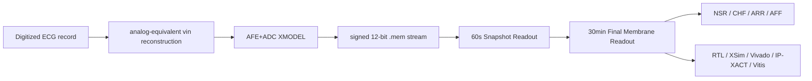

# AFE+ADC XMODEL 연동 SNN 기반 장시간 ECG 4-Class Classification Accelerator IP Core 설계 최종 보고서

## 1. Abstract

본 프로젝트는 공개 digitized ECG record를 analog-equivalent `vin`으로 재구성하고, AFE+ADC XMODEL을 통과시켜 signed 12-bit stream을 생성한 뒤, 이를 SNN-inspired ECG Classification Accelerator IP Core에 입력하여 NSR/CHF/ARR/AFF 4-class 장시간 ECG classification을 수행하는 FPGA/VLSI engineering prototype이다.

최종 모델은 `structural_guarded_silent_aff_1008710`이며, 60초 Snapshot Readout은 고정하고 30분 Final Membrane Readout을 strict record-wise train/validation 기준으로 lock했다. Locked final_test는 selection/search/context에 사용하지 않았고, lock 이후 1회만 평가했다. 최종 성능은 final_test chunk 29/36 = 80.56%, record-majority 16/19 = 84.21%이다.

RTL/XSim, Vivado implementation, AXI/IP-XACT packaging, Vitis/MicroBlaze full-record replay flow를 통해 engineering validation을 수행했다. 단, 본 결과는 direct electrode acquisition, board-level AFE/ADC silicon measurement, transistor-level layout verification, medical diagnosis validation을 의미하지 않는다.

## 2. Introduction

ECG rhythm classification은 단일 sample이나 짧은 beat 단위만으로 안정적으로 결정되기 어렵다. NSR, CHF, ARR, AFF는 rhythm variability, morphology abnormality, QRS evidence, long-window trend가 함께 반영되어야 한다. 따라서 본 프로젝트는 dense CNN/RNN classifier를 FPGA에 그대로 올리는 대신, ECG domain evidence를 spike/event 형태로 압축하고 30분 window에서 final membrane을 누적하는 streaming accelerator 구조를 선택했다.

목표는 높은 resource를 요구하는 multiply-heavy model이 아니라, signed 12-bit ECG stream을 직접 처리하고 counter/comparator/signed accumulator/WTA 기반으로 동작하는 low-resource biomedical accelerator IP를 구현하는 것이다.

## 3. System Overview



전체 flow는 공개 digitized ECG record에서 시작한다. 입력 code는 `vin_v = code / 200000` 기준으로 voltage-equivalent waveform으로 해석하고, AFE+ADC XMODEL을 통해 signed 12-bit `.mem` stream으로 변환한다. 이 stream은 RTL/IP에 입력되어 60초 snapshot evidence를 만들고, 30분 Final Membrane Readout에서 class별 membrane을 누적한 뒤 WTA로 최종 class를 출력한다.

## 4. AFE+ADC XMODEL Input Generation

공개 ECG dataset은 이미 digitized record이므로 원래의 sensor waveform을 복원할 수 없다. 본 프로젝트는 이를 direct acquisition으로 주장하지 않고, virtual DAC/PWL-equivalent reconstruction으로 해석한다.

AFE+ADC nominal chain은 다음과 같이 정리한다.

| Stage | Role |
|---|---|
| `code / 200000` | digitized ECG code를 analog-equivalent `vin`으로 해석 |
| HPF | baseline drift 저감 |
| IA gain x201 | ECG amplitude scaling |
| 60 Hz notch | power-line component suppression |
| LPF 150 Hz | high-frequency noise 제한 |
| 12-bit ADC quantization | RTL 입력 signed 12-bit stream 생성 |

이 flow는 model-based mixed-signal-to-digital verification이다. Board-level AFE, ADC silicon, transistor-level layout 결과는 포함하지 않는다.

## 5. Snapshot SNN Readout

Snapshot Readout은 60초 window마다 ECG evidence를 spike/counter 형태로 압축한다. 주요 feature block은 QRS detection, rhythm prediction/mismatch evidence, morphology evidence, variability evidence, ectopic/abnormal evidence를 포함한다. Snapshot 내부에서는 class membrane과 WTA를 통해 60초 단위 class evidence를 만든다.

최종 제출에서는 중간 후보 탐색 과정이 아니라, locked Final Membrane에 입력되는 고정 Snapshot Readout 구조만을 설명한다.

## 6. Final Membrane Readout

Final Membrane Readout은 30개의 60초 snapshot에서 나온 evidence를 class별 membrane에 누적한다. 단순 majority vote와 달리, snapshot WTA에서 드러난 class뿐 아니라 subthreshold evidence와 guard/rescue 조건을 반영한다.

최종 locked candidate:

```text
structural_guarded_silent_aff_1008710
```

이 candidate는 train/validation only structural-grid search 후 lock되었고, final_test 결과를 보고 파라미터를 수정하지 않았다.

## 7. Fully Blind Strict Record-wise Protocol

최종 protocol의 핵심은 record leakage를 막는 것이다. Split unit은 `source_record_id`이며, 동일 source record에서 나온 30분 chunk가 train/validation/final_test에 동시에 들어가지 않도록 구성한다.

| Item | Value |
|---|---|
| Split unit | `source_record_id` |
| Final model | `structural_guarded_silent_aff_1008710` |
| final_test used for selection | false |
| final_test used for parameter search | false |
| final_test used for ChatGPT context | false |
| final_test evaluation count | 1 |
| Validation role | model selection only |

Validation 100%는 최종 일반화 성능이 아니라 model-selection 성능이다. 최종 성능 주장은 locked final_test 결과만 사용한다.

## 8. Results

### 8.1 Strict Record-wise Result

| Split | Correct / Total | Accuracy |
|---|---:|---:|
| Train | 61 / 68 | 89.71% |
| Validation | 32 / 32 | 100.00% |
| Final test chunk | 29 / 36 | 80.56% |
| Final test record-majority | 16 / 19 | 84.21% |

### 8.2 XSim

| Check | Result |
|---|---:|
| final_test cases | 36 |
| final_pred mismatch | 0 |
| final_mem mismatch | 0 |

### 8.3 Vivado / IP / Board

| Item | Result |
|---|---|
| Pure RTL resource | LUT/FF/BRAM/DSP 9719/5038/0/0 |
| Pure RTL timing | WNS 8.184 ns |
| Estimated total power | 0.099 W |
| AXI/IP-XACT | accelerator and sample feeder packaged |
| MicroBlaze full replay system | bitstream/XSA/ELF generated, timing met |
| Board replay | NSR/CHF/ARR/AFF each one 30-minute case, final_pred/final_mem exact 4/4 |

## 9. Hardware Implementation and IP Packaging

The accelerator is implemented as a reusable RTL/IP block with AXI4-Lite control/status and AXI4-Stream sample input. A small MMIO-to-AXIS sample feeder is used for the MicroBlaze board replay path so that 16-bit sample data and TLAST timing can be controlled deterministically.

Final hardware artifacts:

| Artifact | Path |
|---|---|
| Locked params | `configs/recordwise_resplit_seed20260808/best_final_membrane_structural_grid_locked.json` |
| RTL params include | `rtl/strict_recordwise_locked_params.vh` |
| Accelerator IP-XACT | `ip_repo/snn_ecg_axi_accelerator/component.xml` |
| Feeder IP-XACT | `ip_repo/axi_lite_axis_sample_feeder/component.xml` |
| Bitstream | `results/board_replay/microblaze_full_replay/snn_ecg_mb_full_replay.bit` |
| XSA | `results/board_replay/microblaze_full_replay/snn_ecg_mb_full_replay.xsa` |
| MicroBlaze ELF | `results/board_replay/microblaze_full_replay/snn_ecg_mb_full_replay_app.elf` |

## 10. Discussion

본 프로젝트의 기여는 analog physical measurement가 아니라, AFE+ADC XMODEL과 digital accelerator IP를 연결한 biomedical mixed-signal-to-digital FPGA prototype이다. Multiply-heavy neural network 대신 event/spike evidence, counter/comparator, signed membrane accumulation, WTA를 사용해 low-resource RTL 구조를 구성했다.

Board replay는 representative class-wise 4개 30분 record에서 bit-exact 결과를 확인했다. 전체 final_test 36개 case의 board batch replay와 board-level current/power measurement는 남은 확장 검증이다.

## 11. Conclusion

본 repo의 최종 결과는 locked strict record-wise protocol과 hardware validation이 연결된 SNN-inspired ECG 4-class accelerator IP prototype이다. 최종 모델은 train/validation으로 lock되고 final_test를 1회 평가했으며, RTL/XSim/Vivado/IP/Vitis evidence가 같은 locked model 기준으로 정리되었다.

## Appendix. Final Artifact Index

- Source of truth: `configs/final_submission_locked_model.json`
- Final metrics: `reports/final/final_metrics.json`
- Strict record-wise result: `reports/final/strict_recordwise_final_result.md`
- Hardware validation: `reports/final/hardware_validation_result.md`
- Board replay result: `reports/final/board_replay_result.md`
- Figures: `reports/final/figures/`
