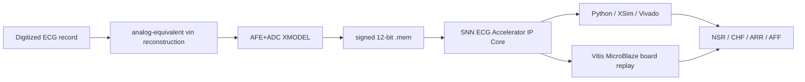

# AFE+ADC XMODEL 연동 SNN 기반 장시간 ECG 4-Class Classification Accelerator IP Core 설계

이 저장소는 AFE+ADC가 완료된 ECG stream을 저전력 RTL 구조로 처리하는 **SNN 기반 장시간 ECG 4-Class Classification Accelerator IP Core**이다.

정식 프로젝트명은 **AFE+ADC XMODEL 연동 SNN 기반 장시간 ECG 4-Class Classification Accelerator IP Core 설계**이다. 본 문서에서는 반복을 줄이기 위해 **장시간 ECG 4-Class Accelerator IP Core**라고도 부른다.

## 1. 프로젝트 한 줄 요약

**AFE+ADC XMODEL output stream을 입력으로 받아 NSR / CHF / ARR / AFF를 분류하는 SNN-inspired ECG Classification Accelerator IP Core**이다.

본 프로젝트는 공개 digitized ECG record를 analog-equivalent `vin`으로 재구성하고, AFE+ADC XMODEL을 통과시켜 signed 12-bit stream을 만든 뒤, 이를 FPGA RTL/IP에 입력해 30분 long-record ECG 4-class classification을 수행하는 biomedical streaming accelerator prototype이다.

## 2. 전체 시스템 flow



## 3. 핵심 결과 요약표

| 항목 | 결과 |
|---|---|
| Chunk-level test accuracy | 32/36 = 88.89% |
| Python-vs-XSim mismatch | final prediction 0/136, final membrane 0/136 |
| Dataset split audit | 70 class-record pairs 중 33 pairs가 여러 split에 걸침 |
| Record-wise regrouping stress test | 30/35 = 85.71% |
| LORO recall | NSR 94.12%, CHF 94.12%, ARR 88.24%, AFF 91.18% |
| Ablation full vs snapshot majority | 125/136 = 91.91% vs 103/136 = 75.74% |
| Vivado board resource | LUT 21002, FF 2803, BRAM 0, DSP 0 |
| Vivado board timing / power | WNS 7.873 ns, estimated total power 0.101 W |
| AXI/IP packaging | accelerator IP-XACT `component.xml`, xgui, AXI wrapper, sample feeder 존재 |
| Board replay | test NSR case 0 full-record PASS, 1,800,000 samples, final_pred 0, final_mem 31/0/1/0 |

위의 88.89%는 chunk-level split 기준이다. strict record-wise 성능으로 주장하지 않으며, record-wise regrouping과 LORO는 frozen rule set에 대한 stress-test evidence로 분리한다.

## 4. 추가 문서 링크

- [Final Submission Summary](docs/FINAL_SUBMISSION_SUMMARY_KR.md)
- [Final Project Positioning](docs/FINAL_PROJECT_POSITIONING_KR.md)
- [Full-Record Board Replay Result](docs/FULL_RECORD_BOARD_REPLAY_RESULT_KR.md)
- [Final Limitations and Defense](docs/FINAL_LIMITATIONS_AND_DEFENSE_KR.md)
- [Accelerator IP Core](<docs/Accelerator IP Core.md>)
- [AFE+ADC XMODEL Flow](docs/AFE_ADC_XMODEL_FLOW_KR.md)
- [Dataset Split Validation](docs/DATASET_SPLIT_VALIDATION_KR.md)
- [AFE XMODEL Evidence](docs/AFE_XMODEL_EVIDENCE_KR.md)
- [Ablation Study](docs/ABLATION_STUDY_KR.md)
- [Performance Baseline](docs/PERFORMANCE_BASELINE_KR.md)
- [Board/IP Packaging Evidence](docs/BOARD_AND_IP_PACKAGING_EVIDENCE_KR.md)
- [Board Replay Test Plan](docs/BOARD_REPLAY_TEST_PLAN_KR.md)
- [Judge Q&A Defense](docs/JUDGE_QA_DEFENSE_KR.md)

## 5. 한계

- Source ECG는 already digitized public record이며, raw analog ECG acquisition이 아니다.
- AFE+ADC는 XMODEL 기반 nominal model이며, physical AFE PCB나 ADC silicon measurement가 아니다.
- Physical DAC replay나 실제 전극 측정은 수행하지 않았다.
- Virtuoso layout/post-layout 검증과 clinical validation은 수행하지 않았다.
- Full-record board replay는 test NSR case 0 한 건의 integration evidence이며, 전체 split board replay batch는 향후 과제이다.

대회 제출/최종 설명 기준의 상세 문서는 반드시 [FINAL_REPORT_KR.md](FINAL_REPORT_KR.md)를 먼저 읽으면 된다. 해당 문서에는 연구 목적, Holter-style 설계 동기, AFE+ADC 조건, Snapshot feature block의 뉴로모픽 동작 설명, 30분 Final Membrane Readout, XSim 성능, Vivado 자원량이 모두 포함되어 있다.

추가 설계 문서:

- [AFE+ADC XMODEL 연동 SNN 기반 장시간 ECG 4-Class Classification Accelerator IP Core 설계](<docs/Accelerator IP Core.md>): RTL을 Vivado-packaged custom accelerator IP 관점에서 정리하고, 병목 원인/해결 구조, AXI wrapper, sample feeder, MicroBlaze smoke 검증 범위를 설명한다.
- [AFE+ADC XMODEL 기반 입력 생성 흐름](docs/AFE_ADC_XMODEL_FLOW_KR.md): digitized ECG record에서 virtual DAC/PWL-equivalent `vin_v`를 만들고, AFE+ADC XMODEL 및 signed 12-bit `.mem` RTL 검증으로 연결하는 흐름을 정리한다.

수상권 보강/검증 문서:

- [수상권 경쟁력 보강 분석](docs/AWARD_READINESS_GAP_ANALYSIS_KR.md): 경쟁작 대비 강점, 약점, 금지해야 할 과장 표현, 제출 전 체크리스트를 정리한다.
- [Dataset Split 검증](docs/DATASET_SPLIT_VALIDATION_KR.md): 현재 chunk-level split 상태, record overlap audit, record-wise fixed-model 평가, leave-one-record-out 결과를 분리해 설명한다.
- [AFE XMODEL Evidence](docs/AFE_XMODEL_EVIDENCE_KR.md): `code / 200000` 기반 PWL-equivalent `vin_v`, HPF/gain/notch/LPF/ADC nominal model figure, model-based 검증 한계를 정리한다.
- [Ablation Study](docs/ABLATION_STUDY_KR.md): final membrane, snapshot-only, feature evidence 제거 실험을 통해 각 구조가 왜 필요한지 수치로 비교한다.
- [Performance Baseline](docs/PERFORMANCE_BASELINE_KR.md): Python fixed-model latency, RTL cycle counter, Vivado resource/power estimate를 같은 관점에서 비교한다.
- [Board and IP Packaging Evidence](docs/BOARD_AND_IP_PACKAGING_EVIDENCE_KR.md): AXI/IP-XACT packaging, MicroBlaze smoke system, Vivado report 산출물을 evidence table로 정리한다.
- [Full-Record Board Replay with Vitis/MicroBlaze](docs/FULL_RECORD_BOARD_REPLAY_VITIS_KR.md): Vitis MicroBlaze + UART chunk-ACK sender로 1,800,000-sample `.mem` full record를 실제 board에서 replay하고 Python/XSim expected와 final_pred/final_mem exact match를 확인한 flow와 transcript를 정리한다.
- [Board Replay Test Plan](docs/BOARD_REPLAY_TEST_PLAN_KR.md): MicroBlaze UART smoke부터 실제 full-record board replay까지의 단계와 남은 batch/throughput 검증 항목을 정리한다.
- [Judge Q&A Defense](docs/JUDGE_QA_DEFENSE_KR.md): 심사에서 나올 수 있는 dataset, AFE, IP, board 검증 질문에 대한 방어 논리를 정리한다.

```text
AFE+ADC XMODEL 연동 SNN 기반 장시간 ECG 4-Class Classification Accelerator IP Core 설계
= AFE+ADC XMODEL 기반 입력 생성 흐름
+ 60초 Snapshot Readout
+ 30분 Final Membrane Readout
+ AXI/Vivado packaged Accelerator IP Core
```

수상권 보강 결과는 별도 산출물로 `reports/award_readiness/`에 정리했다. 현재 기존 88.89% test accuracy는 chunk-level split 기준이며 strict record-wise generalization으로 과장하지 않는다. 새 audit에서는 class-record pair 70개 중 33개가 현재 split 여러 곳에 걸쳐 있음을 확인했고, frozen Python rule set으로 record-wise regrouping test 30/35 = 85.71%, class별 leave-one-record-out recall NSR/CHF/ARR/AFF = 94.12% / 94.12% / 88.24% / 91.18%를 얻었다. Ablation은 full model 125/136 = 91.91%, snapshot majority 103/136 = 75.74%로 final membrane evidence accumulation의 필요성을 보였다.

분류 class는 다음 네 가지이다.

| Class | 의미 |
|---|---|
| NSR | Normal Sinus Rhythm |
| CHF | Congestive Heart Failure |
| ARR | Arrhythmia |
| AFF | Atrial Fibrillation/Flutter 계열 |

## 전체 구조

장시간 ECG 4-Class Accelerator IP Core는 30분 AFE+ADC ECG stream을 직접 입력받고, 내부 timer neuron이 60초마다 snapshot boundary spike를 만든다. 각 60초 구간은 60초 Snapshot Readout으로 분류되고, 30개의 snapshot 결과는 30분 Final Membrane Readout에 누적된다.

```text
30분 signed 12-bit AFE+ADC ECG stream
-> timer neuron: 60000 sample마다 60초 boundary spike 발생
-> 60초 Snapshot Readout: 60초 구간별 class/evidence spike 생성
-> 30분 Final Membrane Readout: class neuron membrane에 흥분성/억제성 자극 누적
-> 30분 chunk_done
-> WTA
-> NSR / CHF / ARR / AFF
```

이 구조는 단순 software classifier가 아니라, RTL에서 counter, comparator, signed accumulator, threshold, WTA로 구현되는 **event-driven membrane readout**이다.

## 60초 Snapshot Readout

60초 Snapshot Readout은 60초 ECG window 하나를 분류하는 고정 snapshot classifier이다.

입력:

- 60초
- 1 kSPS
- signed 12-bit AFE+ADC `.mem`
- 60000 samples/window

출력:

- `pred_class`
- `pred_valid`
- `c24_mem_nsr`
- `c24_mem_chf`
- `c24_mem_arr`
- `c24_mem_aff`

핵심 흐름:

```text
AFE+ADC sample
-> QRS/event/rhythm/morphology feature spike
-> fixed signed synaptic weight
-> class membrane accumulation
-> 60초 segment_done
-> 4-class WTA
```

60초 Snapshot Readout은 기존 C24 folded spike readout을 유지하되, EERG direct class-membrane 기여를 제거한 구조이다. EERG 제거는 validation에서 불필요한 경로를 줄이면서 test 성능을 유지했기 때문에 최종 구조에 반영했다.

60초 Snapshot Readout의 주요 feature neuron은 다음과 같다. 상세 알고리즘은 [FINAL_REPORT_KR.md](FINAL_REPORT_KR.md)의 “Snapshot Feature Block 상세 설명” 절에 정리되어 있다.

| Feature block | 역할 |
|---|---|
| Adaptive QRS LIF | ADC slope event를 적분해 QRS/beat spike를 만든다. |
| PNN Rhythm Predictor | RR interval 예측 window 기반 match/mismatch rhythm evidence를 만든다. |
| RDM Variability Neuron | 연속 RR interval 변화량을 level/count로 누적한다. |
| DSCR Spike Counter | slope sign flip과 morphology complexity evidence를 만든다. |
| RAM Peak Accumulator | R-peak amplitude response를 threshold-bank code로 누적한다. |
| ECP Ectopic Pair Neuron | early beat + compensatory pause pattern을 감지한다. |
| QRS MAF Neuron | QRS width/complexity/energy abnormal evidence를 만든다. |
| RBBB QRS Delay Bank | RBBB-like conduction delay proxy evidence를 만든다. |
| EERG Gate | 검토된 ARR-like rescue gate이며, 최종 구조에서는 direct class-membrane 자극 경로를 제거했다. |

## 30분 Final Membrane Readout

30분 Final Membrane Readout은 30분 동안 들어오는 30개의 snapshot 발화 결과를 모아 최종 class를 판정한다.

가장 단순한 기준은 snapshot `pred_class`의 class별 발화 횟수이다.

```text
pred_count_NSR
pred_count_CHF
pred_count_ARR
pred_count_AFF
```

이것은 majority vote membrane에 해당한다.

하지만 snapshot WTA는 60초마다 하나의 class만 출력하므로, WTA에서 패배한 subthreshold evidence가 사라질 수 있다. 그래서 30분 Final Membrane Readout은 보조 evidence neuron membrane도 함께 누적한다.

예:

- pNN mismatch evidence neuron
- RDM irregularity evidence neuron
- ectopic-pair evidence neuron
- QRS MAF morphology evidence neuron
- RBBB-like conduction evidence neuron
- abnormal evidence neuron

30분 동안 특정 병적 evidence neuron이 충분히 활성화되면, 최종 class neuron에 자극을 넣는다.

- ARR neuron에 양의 자극: ARR membrane 상승
- AFF/NSR/CHF neuron에 음의 자극: 해당 membrane 억제

RTL에서는 이것이 signed add/subtract로 구현된다.

```verilog
final_mem_arr = final_mem_arr + 4;   // ARR neuron 흥분성 자극
final_mem_aff = final_mem_aff - 16;  // AFF neuron 억제성 자극
```

최종 readout rule set은 Python/RTL golden 동기화를 위해 내부 ID `margin_evidence_0038974`로 보존한다.

```text
if 현재 우세 class가 AFF이고
   AFF 우세 margin이 작고
   ARR snapshot 발화가 최소 3회 이상이며
   RDM / pNN mismatch / ectopic / abnormal evidence가 충분하면:
       ARR final neuron에 흥분성 자극 +4
       AFF final neuron에 억제성 자극 -16
```

이 구조는 SVC, XGBoost, dense classifier가 아니다. RTL에서 comparator, counter, signed accumulator, WTA만 사용한다.

## 주요 RTL 파일

```text
rtl/core/class_score_neurons.v
rtl/core/snn_ecg_3feat_top.v
rtl/final_membrane_layer.v
rtl/snn_ecg_30min_final_top.v
rtl/board/snn_ecg_v2_nexys_a7_top.v
```

## 검증 스크립트

```text
scripts/snapshot_c24_rtl_exact.py
scripts/snapshot_c24_v2_search.py
scripts/search_final_membrane_v2_snn.py
scripts/search_final_membrane_v2_arr_focus.py
scripts/run_snapshot_v2_xsim.py
scripts/run_final_membrane_v2_xsim.py
scripts/build_snn_ecg_v2_bitstream.py
```

`snapshot_c24_v2_search.py`, `search_final_membrane_v2_snn.py`, `search_final_membrane_v2_arr_focus.py`는 이름에 `search`가 남아 있지만, 현재 repo에서는 최종 Python 등가모델과 XSim expected 결과 생성에 필요한 고정 모듈로 보존한다.

실행 예:

```powershell
python scripts\run_snapshot_v2_xsim.py --split all
python scripts\run_final_membrane_v2_xsim.py --split all
python scripts\build_snn_ecg_v2_bitstream.py
```

## 60초 Snapshot Readout XSim 성능

60초 window-level 성능이다.

| Split | Correct / Total | Accuracy | Macro-F1 | Balanced Acc. |
|---|---:|---:|---:|---:|
| train | 466 / 512 | 91.02% | 90.96% | 91.02% |
| validation | 231 / 256 | 90.23% | 90.29% | 90.23% |
| test | 205 / 256 | 80.08% | 80.06% | 80.08% |

60초 Snapshot Readout test confusion matrix:

| True \ Pred | NSR | CHF | ARR | AFF |
|---|---:|---:|---:|---:|
| NSR | 50 | 12 | 2 | 0 |
| CHF | 7 | 56 | 0 | 1 |
| ARR | 15 | 3 | 42 | 4 |
| AFF | 0 | 4 | 3 | 57 |

60초 Snapshot Readout test class별 성능:

| Class | Precision | Recall | F1 |
|---|---:|---:|---:|
| NSR | 69.44% | 78.12% | 73.53% |
| CHF | 74.67% | 87.50% | 80.58% |
| ARR | 89.36% | 65.62% | 75.68% |
| AFF | 91.94% | 89.06% | 90.48% |

## AFE+ADC XMODEL 연동 SNN 기반 장시간 ECG 4-Class Classification Accelerator IP Core 설계 30분 XSim 성능

30분 chunk-level 성능이다. Python 등가모델과 RTL/XSim 결과가 `pred_class`와 `final_mem[4]` 기준으로 일치한다.

| Split | Python | XSim | Pred mismatch | Mem mismatch |
|---|---:|---:|---:|---:|
| train | 62 / 68 = 91.18% | 62 / 68 = 91.18% | 0 | 0 |
| validation | 31 / 32 = 96.88% | 31 / 32 = 96.88% | 0 | 0 |
| test | 32 / 36 = 88.89% | 32 / 36 = 88.89% | 0 | 0 |

장시간 ECG 4-Class Accelerator IP Core test confusion matrix:

| True \ Pred | NSR | CHF | ARR | AFF |
|---|---:|---:|---:|---:|
| NSR | 9 | 0 | 0 | 0 |
| CHF | 0 | 9 | 0 | 0 |
| ARR | 2 | 1 | 6 | 0 |
| AFF | 0 | 0 | 1 | 8 |

장시간 ECG 4-Class Accelerator IP Core test class별 성능:

| Class | Precision | Recall | F1 |
|---|---:|---:|---:|
| NSR | 81.82% | 100.00% | 90.00% |
| CHF | 90.00% | 100.00% | 94.74% |
| ARR | 85.71% | 66.67% | 75.00% |
| AFF | 100.00% | 88.89% | 94.12% |

Test macro-F1은 88.46%, balanced accuracy는 88.89%이다.

## Vivado 구현 결과

대상 FPGA:

```text
Nexys A7 / Artix-7 xc7a100tcsg324-1
```

Bitstream:

```text
results/final_membrane_v2_snn/vivado_snn_ecg_v2/bitstream/snn_ecg_v2_nexys_a7_top.bit
```

자원 사용량:

| Resource | Used | Available | Utilization |
|---|---:|---:|---:|
| LUT | 21002 | 63400 | 33.13% |
| FF | 2803 | 126800 | 2.21% |
| BRAM | 0 | 135 | 0.00% |
| DSP | 0 | 240 | 0.00% |
| Bonded IOB | 35 | 210 | 16.67% |
| BUFGCTRL | 2 | 32 | 6.25% |

Vivado power estimate:

| Power | W |
|---|---:|
| Total on-chip | 0.101 |
| Dynamic | 0.004 |
| Static | 0.097 |

Timing:

| Item | Value |
|---|---:|
| sys_clk_pin | 100 MHz |
| core_clk_1mhz | 1 MHz |
| WNS | 7.873 ns |
| TNS | 0.000 ns |
| WHS | 0.032 ns |
| THS | 0.000 ns |
| WPWS | 4.500 ns |
| TPWS | 0.000 ns |

FPGA board programming:

| Item | Value |
|---|---|
| Board target | Digilent / Nexys A7 |
| Detected device | `xc7a100t_0` |
| Program status | OK |
| Startup status | HIGH |
| Programmed at | 2026-07-02 20:19:25 |
| Bitstream size | 3,825,908 bytes |
| Board report | `results/final_membrane_v2_snn/vivado_snn_ecg_v2/board_program_report.txt` |

DSP 0개이므로 multiplier 기반 ML classifier가 아니라, comparator/counter/accumulator 기반 SNN-inspired RTL 구조임을 확인할 수 있다.
보드에는 bitstream이 정상적으로 올라갔고, MicroBlaze/UART chunk-ACK replay로 test NSR case 0의 1,800,000-sample full record를 실제 board에서 끝까지 흘려 final_pred/final_mem exact match를 확인했다. 전체 test split 정확도는 여전히 XSim dataset replay 결과를 기준으로 보고하며, board full replay는 현재 1-case integration evidence로 구분한다.

## 주의사항

- 본 모델은 `SNN-inspired` 구조이다. 완전한 생물학적 SNN이나 STDP 학습 구조라고 주장하지 않는다.
- 30분 Final Membrane Readout은 1 kSPS sample마다 직접 class spike를 내는 층이 아니라, 60초 snapshot event를 시간축으로 누적하는 final readout이다.
- 30분 데이터셋은 class별 30분 chunk 수를 균형화한 `chunk-level balanced` 데이터셋이다. 원천 record 수가 class별로 같지 않기 때문에 모든 chunk가 서로 다른 record에서 나온 strict record-wise holdout은 아니다.
- XSim 정확도는 30분 `.mem` dataset testbench 기준이다.
- Vivado power는 실제 보드 전류 측정값이 아니라 post-implementation 추정값이다.
- ARR test recall은 6/9로 남은 병목이다. 전체 accuracy와 별도로 보고해야 한다.
