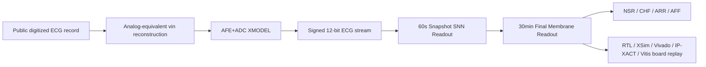

# AFE+ADC XMODEL-linked SNN ECG 4-Class Classification Accelerator IP Core

## Abstract

This repository contains a final FPGA/VLSI engineering prototype for long-record ECG 4-class classification. Public digitized ECG records are reconstructed as analog-equivalent `vin` waveforms, passed through an AFE+ADC XMODEL flow, converted to signed 12-bit sample streams, and classified by an SNN-inspired RTL accelerator. The digital classifier uses 60-second Snapshot Readout followed by a 30-minute Final Membrane Readout for NSR, CHF, ARR, and AFF classification.

The final locked model is `structural_guarded_silent_aff_1008710`. It was selected under a fully blind strict record-wise protocol: train/validation were used for model selection, the locked final test records were evaluated once, and final test was not used for selection or parameter search. Hardware validation includes locked Python/XSim agreement, Vivado implementation, IP-XACT packaging, and Vitis/MicroBlaze class-wise 30-minute board replay.

This project does not claim direct electrode acquisition, physical AFE board measurement, ADC silicon measurement, transistor-level layout verification, or medical diagnosis validation.

## System Overview

## Final Locked Model and Results

| Item | Result |
|---|---|
| Final model | `structural_guarded_silent_aff_1008710` |
| Protocol | fully blind strict record-wise locked final holdout |
| Train | 61/68 = 89.71% |
| Validation | 32/32 = 100.00% |
| Final test chunk | 29/36 = 80.56% |
| Final test record-majority | 16/19 = 84.21% |
| Test evaluation count | 1 |
| Test used for selection | No |

Validation performance is model-selection evidence only. The final generalization result is the locked final test result.

## Hardware Implementation

| Item | Result |
|---|---|
| Locked final-layer XSim | final_pred mismatch 0, final_mem mismatch 0 over 36 final_test cases |
| Pure RTL Vivado | LUT/FF/BRAM/DSP 9719/5038/0/0, WNS 8.184 ns, power estimate 0.099 W |
| OOC/profile Vivado | LUT/FF/BRAM/DSP 9905/5769/0/0, WNS 0.471 ns |
| IP packaging | AXI accelerator IP and MMIO-to-AXIS sample feeder IP-XACT packages |
| MicroBlaze full replay build | bitstream/XSA/ELF generated, timing met |
| Board replay | NSR/CHF/ARR/AFF one 30-minute case each, final_pred/final_mem exact 4/4 |

Board replay evidence is summarized in `reports/final/board_replay_result.md`. Raw transcripts and comparison CSVs are under `reports/final/board_replay/`.

## Repository Structure

| Path | Purpose |
|---|---|
| `FINAL_REPORT_KR.md` | Korean final report |
| `docs/PAPER_SUMMARY_KR.md` | short final paper summary |
| `docs/SYSTEM_ARCHITECTURE_KR.md` | AFE+ADC XMODEL and accelerator architecture |
| `docs/STRICT_RECORDWISE_PROTOCOL_KR.md` | locked dataset/model protocol |
| `docs/HARDWARE_VALIDATION_KR.md` | RTL/XSim/Vivado/IP/Vitis evidence |
| `docs/LIMITATIONS_KR.md` | claim boundaries and limitations |
| `configs/final_submission_locked_model.json` | source of truth for final model, metrics, and claims |
| `reports/final/` | final metrics, evidence summaries, figures, board replay transcripts |
| `rtl/`, `sim/` | final RTL and simulation sources |
| `ip_repo/` | packaged AXI accelerator and sample feeder IP sources |
| `vitis_apps/full_record_replay/` | MicroBlaze full-record replay application |
| `tools/` | final reproduction and consistency-check scripts |

## Limitations

- Source ECG records are already digitized public datasets.
- `vin` is analog-equivalent/PWL-equivalent reconstruction, not original sensor waveform recovery.
- AFE+ADC validation is XMODEL/nominal-model based, not board-level AFE or ADC silicon measurement.
- No transistor-level layout verification is claimed.
- No medical diagnosis validation is claimed.
- Board replay covers representative class-wise 30-minute cases, not a full board batch of every final_test case.

## Main Report

Read `FINAL_REPORT_KR.md` for the full Korean final report.
