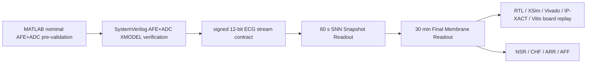

# SNN ECG 4-Class Classification Accelerator IP Core

이 repository는 **signed 12-bit ECG stream**을 입력으로 받아 NSR / CHF / ARR / AFF를 분류하는 **SNN-based Long-window ECG 4-Class Classification Accelerator IP Core**의 디지털 구현과 검증(digital RTL/IP/FPGA validation)을 담당한다. 본 repo가 소유하는 범위는 locked strict record-wise protocol, Snapshot Readout과 Final Membrane Readout RTL, XSim golden comparison, Vivado implementation, AXI/IP-XACT packaging, Vitis/MicroBlaze board replay, 그리고 디지털 hardware evidence이다.

상위 시스템 흐름은 유지하되, MATLAB AFE+ADC nominal pre-validation과 AFE+ADC XMODEL stress/integration verification은 teammate repository에서 관리한다. 이 repo는 그 upstream 검증 결과로 정의되는 **signed 12-bit, 1 kSPS ECG stream input contract**부터 시작하여 digital accelerator path를 검증한다.

Digital verification axis는 `RTL/XSim/Vivado/IP-XACT/Vitis/MicroBlaze board replay`로 고정한다.

## 1. End-to-End Skeleton

Upstream analog chain은 merged paper에서 `HPF 0.482 Hz -> IA x201 -> 60 Hz notch -> LPF 150 Hz -> 12-bit ADC`로 연결된다. 이 repo의 main body에서는 해당 chain의 상세 MATLAB/XMODEL robustness를 재검증하지 않고, digital IP가 소비하는 stream contract와 downstream RTL/IP/FPGA evidence에 집중한다.

## 2. Cross-Repo Ownership

| Repository / teammate | Responsibility | Artifact type | How it connects to this digital repo |
|---|---|---|---|
| MATLAB AFE+ADC nominal pre-validation | Nominal filter/gain/ADC behavior pre-check | MATLAB scripts, plots, nominal response reports | XMODEL verification repo가 사용할 analog-chain intent와 nominal reference를 제공 |
| XMODEL AFE+ADC verification and AFE-to-locked RTL integration | AFE+ADC SystemVerilog XMODEL stress verification, signed 12-bit stream generation, AFE-to-locked RTL integration reproduction | XMODEL testbench, stress reports, generated `.mem`, integration transcripts | 이 repo의 canonical input contract와 `sample_gap_cycles=2` full-top XSim cadence에 맞춰 digital golden과 비교 |
| Digital SNN accelerator RTL/IP/FPGA validation | Locked SNN protocol, RTL, XSim, Vivado, IP-XACT, Vitis/MicroBlaze board replay | RTL, testbenches, Vivado reports, IP-XACT `component.xml`, bitstream/XSA/ELF, board transcripts | signed 12-bit stream 이후의 accelerator behavior와 hardware implementation evidence를 소유 |

## 3. Digital Input Contract

| 항목 | 값 |
|---|---:|
| Input sample format | signed 12-bit ECG stream |
| Sample rate | 1 kSPS |
| Snapshot window | 60,000 samples = 60 s |
| Final decision window | 1,800,000 samples = 30 min |
| Snapshots per final decision | 30 |
| Canonical full-top XSim cadence | `sample_gap_cycles=2` |
| Final classes | NSR, CHF, ARR, AFF |

세 가지 검증 개념은 분리해서 해석한다.

| 개념 | 이 repo에서의 의미 |
|---|---|
| Digital full-top XSim expected outputs | locked RTL full-top XSim으로 만든 board-facing expected `final_pred` / `final_mem` |
| Vitis/MicroBlaze board replay vs expected outputs | MicroBlaze + AXI sample feeder가 30분 stream을 replay하고 board output을 XSim expected와 비교 |
| Upstream AFE-to-locked RTL integration evidence | XMODEL repo에서 이 repo의 signed stream contract와 `sample_gap_cycles=2` cadence를 사용해 유지하는 integration evidence |

## 4. Locked Model and Final Metrics

| 항목 | 결과 |
|---|---:|
| Locked candidate | `structural_guarded_silent_aff_1008710` |
| Train | 61 / 68 = 89.71% |
| Validation | 32 / 32 = 100.00% |
| Validation interpretation | model-selection only |
| Final test 30-minute chunk | 29 / 36 = 80.56% |
| Final test 30-minute chunk macro F1 / balanced accuracy | 80.44% / 80.56% |
| Final test record-majority | 16 / 19 = 84.21% |
| Final test record-majority macro F1 / balanced accuracy | 80.80% / 88.19% |
| Test evaluation count | 1 |
| Test used for selection/search/context | false |

Validation 32/32는 final claim이 아니라 locked candidate를 고르는 model-selection 결과이다. 최종 성능 주장은 locked final_test의 30-minute chunk 결과와 record-majority 결과로만 해석한다.

## 5. Digital Hardware Evidence

| 항목 | 결과 |
|---|---:|
| Locked full-top XSim final_test | final_pred mismatch 0, final_mem mismatch 0 over 36 cases |
| Pure RTL Vivado | LUT 9719, FF 5038, BRAM 0, DSP 0, WNS 8.184 ns |
| Pure RTL estimated power, 1 MHz core | 0.099 W (legacy low-frequency vectorless estimate) |
| Pure RTL estimated power, direct 100 MHz core | 0.183 W total / 0.085 W dynamic / 0.097 W static; WNS 0.035 ns |
| MicroBlaze full replay system | LUT 12494, FF 8494, BRAM 16, DSP 3, setup WNS 0.097 ns |
| IP packaging | AXI accelerator IP + MMIO-to-AXIS sample feeder IP-XACT |
| Board replay | strict final_test 36-case full-record batch, final_pred 36/36, final_mem exact 36/36 |

Pure RTL resource는 accelerator datapath만의 구현 결과이다. MicroBlaze replay system resource는 CPU, LMB/BRAM, UARTLite, AXI interconnect, sample feeder, accelerator를 포함한 integration proof로 분리해서 본다.

## 6. Repository Map

| 경로 | 역할 |
|---|---|
| `FINAL_REPORT_KR.md` | 최종 보고서 본문 |
| `docs/PAPER_SUMMARY_KR.md` | 제출용 압축 요약 |
| `docs/SYSTEM_ARCHITECTURE_KR.md` | accelerator architecture |
| `docs/STRICT_RECORDWISE_PROTOCOL_KR.md` | strict record-wise locked model protocol |
| `docs/HARDWARE_VALIDATION_KR.md` | RTL/XSim/Vivado/IP/Vitis/board evidence |
| `docs/LIMITATIONS_KR.md` | claim boundary |
| `reports/final/digital_ip_scope_and_handoff.md` | cross-repo ownership and handoff scope |
| `reports/final/digital_input_contract.md` | signed 12-bit stream contract and canonical cadence |
| `configs/final_submission_locked_model.json` | final model, metric, claim source of truth |
| `rtl/`, `sim/` | locked RTL and simulation source |
| `ip_repo/` | packaged AXI accelerator and sample feeder IP |
| `vitis_apps/full_record_replay/` | MicroBlaze full-record replay application |

## 7. Claim Boundary

- This repo is the **digital hardware validation repository** for a signed 12-bit ECG-stream SNN accelerator IP.
- MATLAB nominal filter validation is maintained in the MATLAB teammate repo.
- AFE+ADC XMODEL stress verification and AFE-to-locked RTL integration evidence are maintained in the XMODEL teammate repo.
- This repo does not claim raw analog ECG acquisition, physical AFE PCB validation, ADC silicon validation, CMOS layout/post-layout validation, or clinical diagnosis validation.
- Board replay is digital RTL/IP replay equivalence evidence, not physical analog acquisition-chain validation.

The full final report is [FINAL_REPORT_KR.md](FINAL_REPORT_KR.md). Figure sources and final report figures are indexed in [reports/final/figures/FIGURE_INDEX.md](reports/final/figures/FIGURE_INDEX.md).
