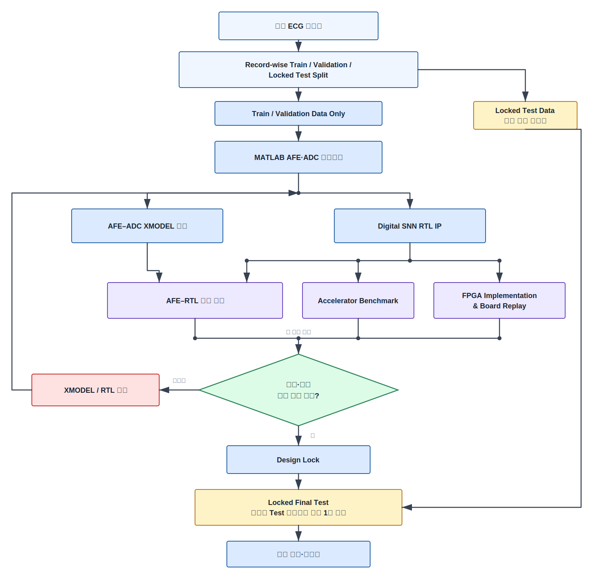
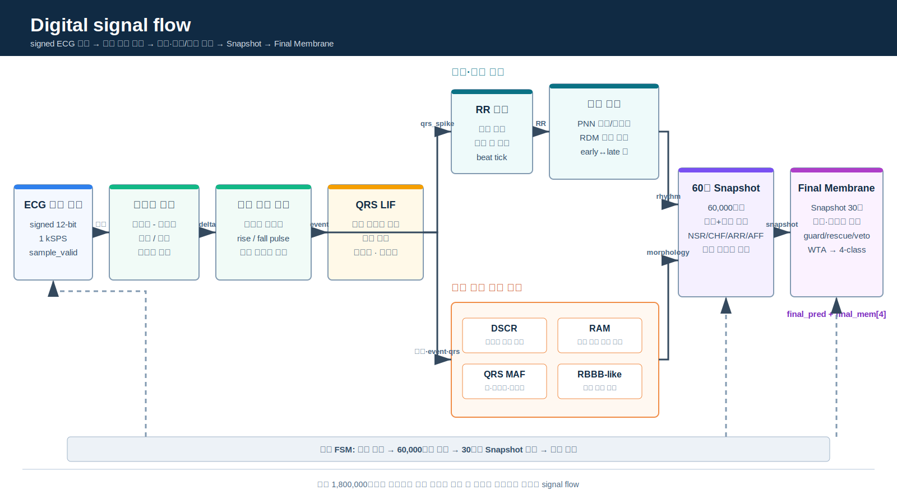

# ECG-SoC Integrated Technical Repository

## 최종 통합 기술보고서

본 저장소의 전체 연구 내용, 설계 구조, 검증 결과, 수치, 한계 및 evidence mapping은 아래 최종 통합 기술보고서에 정리되어 있습니다.

**[최종 통합 기술보고서 핵심 원고 보기](reports/INTEGRATED_TECHNICAL_REPORT_KR.md)**

[기준 논문 서술 구조 분석 및 적용 기록](reports/BASELINE_PAPER_STRUCTURE_REVIEW_KR.md)

대회 제출용 HWP는 본 원고를 기반으로 별도 편집합니다. 공식 신청서·개인정보·서명과 최종 HWP/PDF는 이 공개 Git에 포함하지 않습니다.

## 1. 프로젝트 정체성

본 프로젝트는 공개 ECG로부터 Holter형 장시간 분석을 수행하기 위해 60초 Snapshot Readout과 30분 Final Membrane Readout을 결합한 다중 시간축 SNN-inspired 분류 구조를 제안하고, 이를 1 kSPS signed 12-bit streaming RTL accelerator IP로 구현·검증한 반도체 IP 공학 연구이다. 출력은 NSR·CHF·ARR·AFF 네 public-dataset class이며, 임상 진단이나 상용 wearable과의 성능 비교를 주장하지 않는다.

소비자 ECG 배경은 특정 제품 문서의 사례이며 모든 wearable의 공통 기능으로 일반화하지 않는다.

## 2. 아키텍처 개요

`public ECG → MATLAB nominal AFE+ADC pre-validation → SystemVerilog XMODEL verification → signed 12-bit stream → integer event/state → 60초 Snapshot → 30개 Snapshot의 Final Membrane → RTL/XSim → Vivado/IP-XACT → Vitis/MicroBlaze → FPGA replay`



Digital core는 beat timing, RR variability, slope/morphology, R-peak amplitude, ectopic-like pair와 QRS-related evidence를 sample-by-sample 정수 상태로 갱신한다. 60,000 samples마다 국소 증거를 Snapshot으로 요약하고, 30개 Snapshot의 signed evidence를 Final Membrane에 누적한 뒤 승자독식 방식(WTA)으로 30분 class를 결정한다.




Direct RTL audit에 따르면 pure accelerator는 1,800,000-sample raw input window를 저장하지 않고 고정 크기 event/state와 Final Membrane을 갱신한다 [CLM-023]. 전체 raw window에 해당하는 21,600,000 bit=2,700,000 byte≈2.7 MB decimal은 **회피한 raw-input window storage**이며 측정된 runtime memory 절감량이 아니다. `SNN-inspired`는 event와 membrane-like state를 뜻하며 trained deep SNN 또는 생물학적 등가를 뜻하지 않는다.

## 3. 핵심 결과

| 범주 | 결과 | 해석 범위 |
|---|---:|---|
| Locked final-test 30분 chunk | 29/36=80.56%, macro F1 80.44% | primary public-dataset engineering result |
| Final-test record-majority | 16/19=84.21%, macro F1 80.80% | 같은 final partition의 record별 집계 |
| Pure RTL | LUT 9,719, FF 5,038, BRAM 0, DSP 0, WNS 8.184 ns | device/tool/configuration-specific; WNS는 latency가 아님 |
| MicroBlaze full-replay system | LUT 12,494, register 8,494, BRAM 16, DSP 3, setup WNS 0.097 ns | accelerator가 아닌 whole-system 범위 |
| MATLAB nominal | 대표 네 class clipping 0%, 최소 headroom 약 1.0196 V | selected model-based records |
| Emulator↔XMODEL | 36 segments 평균 RMS 1.95 LSB, lag 0 | model-to-model waveform agreement |
| AFE input identity | SHA256 36/36 | byte identity |
| Canonical AFE→RTL | final_pred/final_mem 36/36, `sample_gap_cycles=2` | 기능 등가성, 정확도 아님 |
| FPGA replay | final_pred/final_mem 36/36 | 기능 등가성; label accuracy는 29/36 |

Train은 61/68=89.71%, validation은 32/32=100.00%였으나 validation은 model selection에만 사용했다. Final test는 selection에 사용하지 않았고 lock 후 평가 횟수는 1회이다. 세 component의 ownership은 서민우(MATLAB nominal), 이수환(XMODEL/integration), 양건(digital/총괄)으로 고정되어 있다.

Validation 100%는 final generalization claim이 아니다.

## 4. 저장소 구조

```text
components/             three curated fixed-commit component snapshots
datasets/               fixed versions, hashes, licenses and fetch policy; no raw waveforms
source_of_truth/        commits, metrics, claims, owners, terms and references
docs/                   research positioning and technical integration narratives
integration_evidence/   upstream status and intentional exclusions
figures/                12 evidence-scoped report figures
tables/                 result, integration and streaming-state tables
benchmarks/             verified NO_BOARD benchmark summary and claim boundaries
reports/                definitive manuscript, evidence map and audits
tools/                  import, generation and fail-closed integrity checks
private_submission/     Git-blocked private-report area
```

PhysioNet raw waveform은 public Git에 번들하지 않는다. 고정 version 1.0.0, DOI, records, expected SHA256, license와 외부 fetch 절차는 [`dataset_manifest.yaml`](datasets/dataset_manifest.yaml), [`DATASET_LICENSES.md`](datasets/DATASET_LICENSES.md), [`datasets/README.md`](datasets/README.md)에 있다.

## 5. 한계와 claim 경계

- NSR·CHF·ARR·AFF가 서로 다른 source DB와 결합되어 database–class confounding이 남는다. Strict source-record-wise split은 직접 record leakage를 막지만 이 confounding을 해소하지 않는다.
- MATLAB/XMODEL은 모델 기반 AFE/ADC 검증이며 physical AFE PCB, ADC silicon, transistor/post-layout, live-electrode 또는 fabricated SoC의 증거가 아니다.
- Board 36/36은 XSim 기준 출력에 대한 기능 등가성이고 classification accuracy는 29/36이다.
- 본 결과는 임상적으로 검증된 진단, 네 질환의 확진, 또는 상용 wearable 대비 우월성을 뜻하지 않는다.
- Pure RTL의 0 BRAM/0 DSP와 timing closure만으로 저전력·고속·에너지 우월성을 주장하지 않는다.

본 prototype은 clinically validated diagnostic device가 아니다. 또한 fabricated silicon이 아니다.

허용·주의·금지 문구는 [`claim_registry.csv`](source_of_truth/claim_registry.csv), 과학적 해석은 [`DATASET_DOMAIN_CONFOUNDING_KR.md`](docs/DATASET_DOMAIN_CONFOUNDING_KR.md), memory 범위는 [`STREAMING_STATE_MEMORY_KR.md`](docs/STREAMING_STATE_MEMORY_KR.md)를 따른다.

## 6. 재현성과 무결성

세 component는 아래 고정 commit의 Git object에서 curated export되었으며 retained imported file의 SHA256은 `artifact_manifest.csv`에 기록된다.

- MATLAB nominal: `907f7e1f081a9d6a5703a32095d962143315a192`
- XMODEL/integration: `4756a5086023547328ef44fd5fd87da3c250dc39`
- Digital RTL/IP/FPGA: `c6b80de19cdcad5b7e43fe7835588b629d847f75`

```powershell
python tools/build_global_metrics.py
python tools/generate_integrated_figures.py
python tools/check_integrated_technical_report.py
python tools/check_integrated_repository.py
```

의도적으로 제외한 upstream path와 raw dataset path는 exclusion registry에 남는다. Fixed commits가 component source의 authority이고, `source_of_truth/`가 integrated report claim의 authority다.

## 7. Accelerator benchmark 상태

Status: `IMPORTED_VERIFIED_NO_BOARD`

Summary: [`benchmarks/accelerator_benefit/README.md`](benchmarks/accelerator_benefit/README.md)

Digital `main` commit `09e4d840827ad20856f5e23be4743ddd01565e30`의 완료된 NO_BOARD package를 반영했다. 저장 데이터 기준 Exact C++ kernel 중앙값은 1,777.699800 ms, cycle-derived FPGA core는 54.012600 ms이며 처리시간 비율은 32.912687배다. 이는 측정 board speedup이 아니고 live 최종 판정은 현재 30분 관찰 창을 필요로 한다. 0.099 W와 0.005347247400 J/decision은 추정값이며 physical board timing·power·energy는 `PENDING_BOARD`다. 속도는 본 연구의 주 기여가 아니라 장시간 네 class 분류 구조를 보조하는 구현 평가 항목이다.
