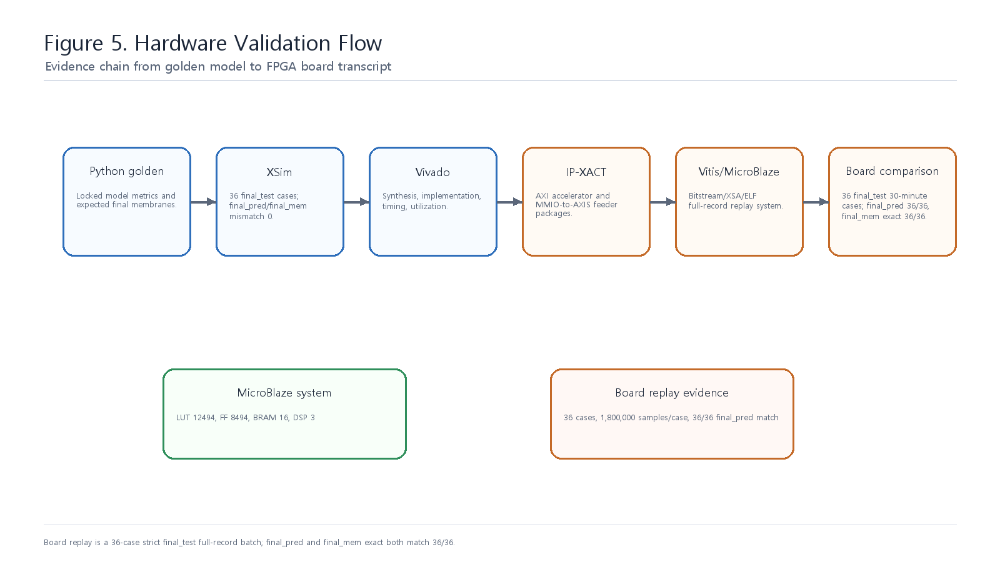
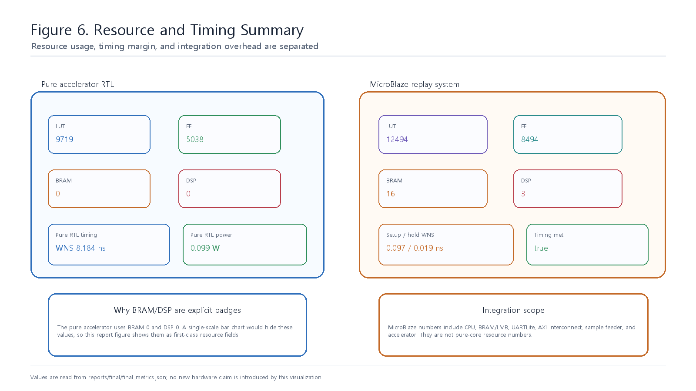
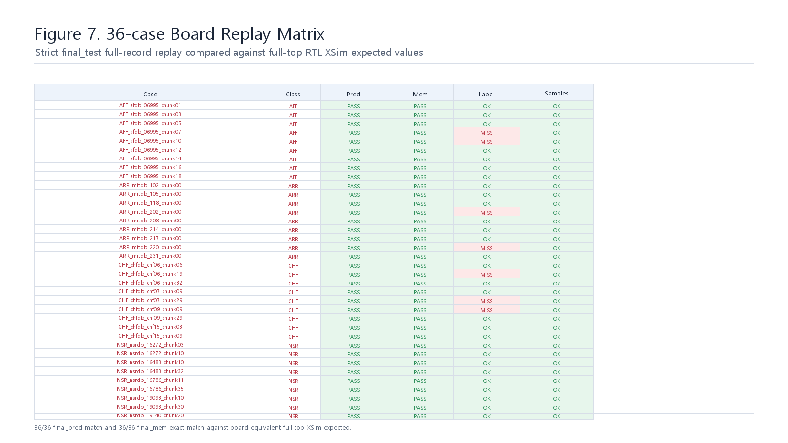

# Hardware Validation

## 검증 계층

| Layer | Evidence |
|---|---|
| Python locked model | `reports/final/final_metrics.json` |
| XSim final-layer check | 36 final_test cases, final_pred/final_mem mismatch 0 |
| Pure RTL Vivado | LUT/FF/BRAM/DSP 9719/5038/0/0, WNS 8.184 ns |
| OOC/profile Vivado | LUT/FF/BRAM/DSP 9905/5769/0/0, WNS 0.471 ns |
| IP packaging | accelerator/sample-feeder `component.xml`, `xgui/*.tcl` |
| MicroBlaze build | bitstream/XSA/ELF generated, timing met |
| Board replay | strict final_test 36-case full-record batch, final_pred 36/36, final_mem exact 36/36 |

## Resource and Timing

| 항목 | 결과 |
|---|---:|
| Pure RTL LUT / FF / BRAM / DSP | 9719 / 5038 / 0 / 0 |
| Pure RTL WNS | 8.184 ns |
| Pure RTL estimated total power | 0.099 W |
| OOC/profile LUT / FF / BRAM / DSP | 9905 / 5769 / 0 / 0 |
| OOC/profile WNS | 0.471 ns |
| MicroBlaze full replay LUT / FF / BRAM / DSP | 12494 / 8494 / 16 / 3 |
| MicroBlaze setup WNS / hold WNS | 0.097 ns / 0.019 ns |

MicroBlaze full replay resource는 CPU, LMB/BRAM, UARTLite, AXI interconnect, interrupt controller, MMIO-to-AXIS sample feeder, accelerator를 모두 포함한다. 따라서 pure RTL accelerator resource와 직접 비교하지 않는다.

## Board Replay

Board replay는 locked model 기준 bitstream/XSA/ELF로 수행되었다. strict record-wise final_test 36개 30분 chunk 전체를 replay했으며, 각 case는 1,800,000 samples, 30 snapshots, 1 decision을 가진다. Board final output은 full-top RTL XSim expected와 비교한다.

| Metric | Result |
|---|---:|
| Final-test full-record cases | 36/36 completed |
| Samples per case | 1,800,000 |
| Snapshots per case | 30 |
| Board-vs-expected final_pred | 36/36 PASS |
| Board-vs-expected final_mem exact | 36/36 PASS |
| Classification accuracy vs label | 29/36 = 80.56% |

기존 class-wise 4-case replay는 smoke/integration evidence로 유지한다. 최종 board batch evidence는 `reports/final/board_replay_36_batch_summary.md`를 기준으로 본다.

## Source Artifacts

| Artifact | Path |
|---|---|
| Bitstream | `results/board_replay/microblaze_full_replay/snn_ecg_mb_full_replay.bit` |
| XSA | `results/board_replay/microblaze_full_replay/snn_ecg_mb_full_replay.xsa` |
| ELF | `results/board_replay/microblaze_full_replay/snn_ecg_mb_full_replay_app.elf` |
| MicroBlaze build summary | `results/board_replay/microblaze_full_replay/microblaze_full_replay_summary.json` |
| 36-case board replay summary | `reports/final/board_replay_36_batch_summary.md` |
| 36-case board replay CSV | `reports/final/board_replay_36_expected_vs_board.csv` |
| 36-case final_mem alignment audit | `reports/final/board_replay_36_final_mem_alignment_audit.md` |
| 36-case board replay transcripts | `reports/final/board_replay_36/transcripts/*.txt` |
| 4-case representative replay summary | `reports/final/board_replay_result.md` |
