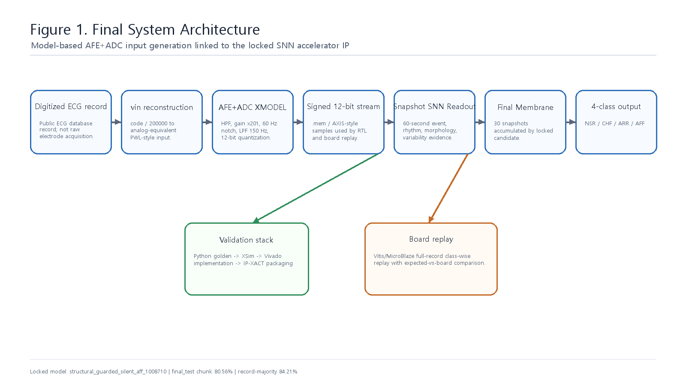
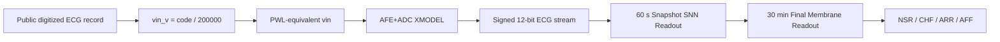
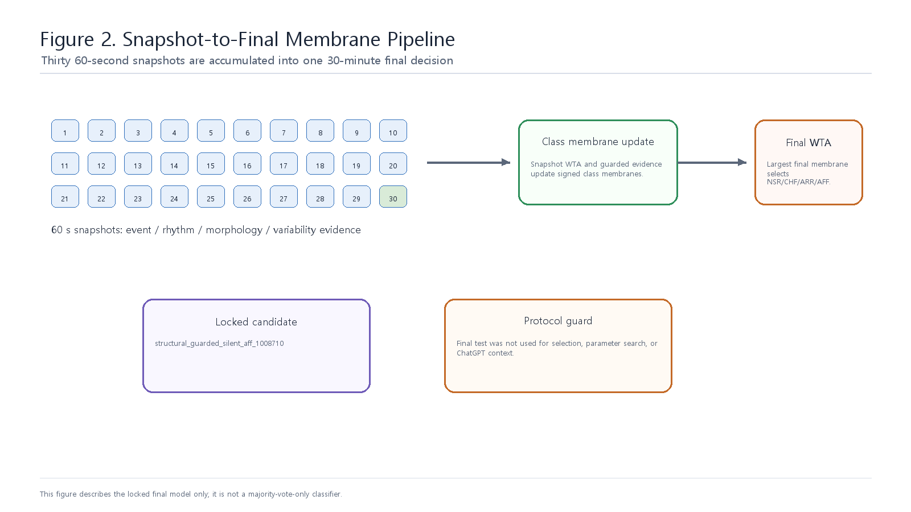

# System Architecture

## 전체 구조

본 시스템은 public ECG record에서 시작하지만, 이를 raw analog acquisition으로 주장하지 않는다. Digitized code를 analog-equivalent `vin`으로 재구성하고 AFE+ADC XMODEL을 통과시켜, digital accelerator가 실제로 받을 signed 12-bit stream을 만든다.

그 뒤의 digital path는 fully streaming 구조다. 60초 Snapshot Readout이 ECG evidence를 만들고, 30개 snapshot을 Final Membrane Readout이 누적하여 30분 단위 final class를 출력한다.

## AFE+ADC XMODEL 입력 생성

| 단계 | 의미 |
|---|---|
| `code / 200000` | public ECG code를 voltage-equivalent input으로 해석 |
| PWL-equivalent reconstruction | physical DAC 대신 XMODEL 입력에 맞는 virtual waveform 구성 |
| HPF | baseline drift 억제 |
| IA gain x201 | ECG amplitude scaling |
| 60 Hz notch | 전원성 간섭 억제 |
| LPF 150 Hz | 고주파 잡음 제한 |
| 12-bit ADC quantization | RTL 입력 signed 12-bit stream 생성 |

이 flow는 physical analog board 검증이 아니라 model-based mixed-signal-to-digital verification이다. 핵심은 AFE+ADC nominal behavior를 digital RTL verification 앞단에 넣어, 단순 dataset scaling보다 더 명확한 입력 생성 과정을 만든 것이다.

## Snapshot-to-Final Pipeline

Snapshot Readout은 ECG stream을 다음 evidence로 압축한다.

| Evidence | RTL block | 직관적 역할 |
|---|---|---|
| Beat/QRS | `ecg_event_encoder_adaptive.v`, `qrs_lif_detector.v` | slope event를 누적해 beat spike 생성 |
| Rhythm prediction | `pnn_rhythm_predictor.v` | 직전 RR winner가 다음 beat를 예측했는지 판단 |
| Variability | `rdm_variability_neuron.v` | 연속 RR interval 변화량을 threshold bank로 측정 |
| Morphology complexity | `dscr_spike_counter.v`, `qrs_maf_neuron.v` | slope sign flip, QRS width, energy, pre-QRS bump 측정 |
| Amplitude | `ram_peak_accumulator.v` | R-peak amplitude response를 integer code로 변환 |
| Ectopic pair | `ectopic_pair_neuron.v` | early/late RR pair pattern 감지 |
| Terminal delay proxy | `rbbb_qrs_delay_bank.v` | wide QRS와 terminal activity 반복 여부 감지 |

Final Membrane Readout은 snapshot WTA 결과만 단순 투표하지 않는다. Snapshot winner와 evidence counter를 class별 signed membrane에 누적하고, guarded/silent AFF/rescue/boost 조건을 통해 30분 evidence를 반영한다.

## Accelerator IP Core 관점

본 설계가 accelerator IP Core로 볼 수 있는 이유는 ECG long-window classification workload를 전용 RTL datapath로 고정했기 때문이다. 입력 stream, control/status, final output, done/irq, profile counter가 명확하며, AXI4-Lite control과 AXI4-Stream input을 갖는 IP-XACT package로 정리되어 있다.

| 항목 | 의미 |
|---|---|
| Input | AFE+ADC XMODEL 이후 signed 12-bit ECG stream |
| Datapath | event/spike extraction, class membrane accumulation, WTA |
| IP packaging | `ip_repo/snn_ecg_axi_accelerator/component.xml` |
| Feeder IP | `ip_repo/axi_lite_axis_sample_feeder/component.xml` |
| Board integration | Vitis/MicroBlaze full-record replay |
