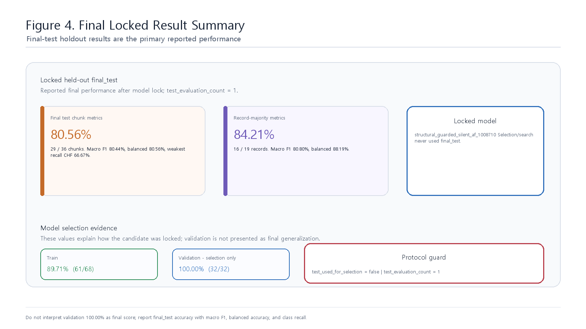

# Paper Summary

## 핵심 요약

본 프로젝트는 AFE+ADC XMODEL output stream을 입력으로 받아 NSR/CHF/ARR/AF를 분류하는 SNN-inspired ECG Classification Accelerator IP Core이다. Upstream MATLAB/XMODEL teammate repositories가 공개 digitized ECG record의 analog-equivalent `vin` 해석, AFE+ADC nominal/XMODEL 검증, signed 12-bit stream 생성을 담당한다. 이 digital repo는 그 stream contract부터 시작하여 60초 Snapshot Readout, 30분 Final Membrane Readout, RTL/XSim/Vivado/IP-XACT/Vitis/board replay 검증을 담당한다.

최종 locked model은 `structural_guarded_silent_af_1008710`이다. Snapshot은 고정하고 Final Membrane만 strict record-wise train/validation 기준으로 lock했다. Locked final_test는 모델 선택이나 파라미터 탐색에 사용하지 않았고, lock 이후 1회만 평가했다.

## 최종 결과

| 항목 | 결과 |
|---|---:|
| Train | 61 / 68 = 89.71% |
| Validation | 32 / 32 = 100.00% |
| Final test 30분 chunk | 29 / 36 = 80.56% |
| Final test 30분 chunk macro F1 / balanced accuracy | 80.44% / 80.56% |
| Final test 30분 chunk class recall | NSR 100.00%, CHF 66.67%, ARR 77.78%, AF 77.78% |
| Final test record-majority | 16 / 19 = 84.21% |
| Final test record-majority macro F1 / balanced accuracy | 80.80% / 88.19% |
| Final test record-majority class recall | NSR 100.00%, CHF 75.00%, ARR 77.78%, AF 100.00% |
| Test evaluation count | 1 |
| Test used for selection | false |

Validation 100.00%는 model-selection 성능으로만 해석한다. 최종 held-out 성능은 final_test accuracy, macro F1, balanced accuracy, class별 recall을 함께 기준으로 보고한다.

## 제출 포지션

본 결과는 실제 전극 기반 의료기기 검증이 아니라, upstream AFE+ADC XMODEL과 SNN-inspired RTL Accelerator IP Core를 signed 12-bit stream contract로 연결한 biomedical mixed-signal-to-digital FPGA prototype이다. MATLAB nominal pre-validation과 XMODEL stress/integration evidence는 teammate repositories에서 유지하며, 이 repo는 Python golden, XSim, Vivado implementation, IP-XACT packaging, Vitis/MicroBlaze board replay로 digital accelerator를 검증한다.

## 한계

- Source ECG는 이미 digitized public record이다.
- AFE+ADC는 upstream teammate repositories가 관리하는 XMODEL/nominal model 기반이다.
- Physical AFE PCB, ADC silicon, transistor-level layout 검증은 수행하지 않았다.
- Clinical diagnosis validation은 수행하지 않았다.
- Board replay는 strict final_test 36개 30분 case 전체에 대해 수행했지만, physical analog validation은 아니며 final_pred/final_mem exact match는 모두 36/36으로 보고한다.
