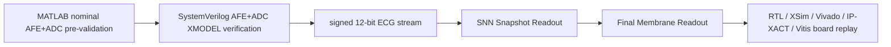

# Digital IP Scope and Cross-Repo Handoff

## 1. Purpose

This report defines the scope of `Sheep-gun/SNN-ECG-4-Class-Classifier` as the **digital SNN ECG 4-Class Classification Accelerator IP Core** repository. It keeps the merged-paper end-to-end skeleton, but separates ownership across the MATLAB AFE, SystemVerilog XMODEL, and digital RTL/IP/FPGA repositories.

## 2. What This Repo Owns

| Area | Owned evidence |
|---|---|
| Locked SNN protocol | `structural_guarded_silent_aff_1008710`, strict record-wise lock, final_test evaluation count 1 |
| Digital model result | final_test 30-minute chunk 29/36 = 80.56%, record-majority 16/19 = 84.21% |
| RTL and XSim | Snapshot Readout, Final Membrane Readout, full-top XSim expected outputs |
| Vivado/IP-XACT | pure RTL resource/timing, AXI accelerator IP, sample feeder IP, `component.xml` artifacts |
| Vitis/MicroBlaze board replay | 36-case full-record replay, final_pred 36/36, final_mem 36/36 |

## 3. What Teammate Repos Own

| Repository / teammate | Responsibility | Artifact type | How it connects to this digital repo |
|---|---|---|---|
| MATLAB AFE+ADC nominal pre-validation | Nominal filter/gain/ADC behavior pre-check | MATLAB scripts, plots, nominal response reports | Provides analog-chain intent and nominal reference for the XMODEL repo |
| XMODEL AFE+ADC verification and AFE-to-locked RTL integration | AFE+ADC SystemVerilog XMODEL stress verification, signed 12-bit stream generation, AFE-to-locked RTL integration reproduction | XMODEL testbench, stress reports, generated `.mem`, integration transcripts | Uses this repo's signed stream contract and canonical `sample_gap_cycles=2` full-top cadence |
| Digital SNN accelerator RTL/IP/FPGA validation | Locked SNN protocol, RTL, XSim, Vivado, IP-XACT, Vitis/MicroBlaze board replay | RTL, testbenches, Vivado reports, IP-XACT `component.xml`, bitstream/XSA/ELF, board transcripts | Owns accelerator behavior and hardware evidence from signed 12-bit stream onward |

## 4. Integration Skeleton for Final Merged Paper



The upstream analog chain is summarized as:

```text
HPF 0.482 Hz -> IA x201 -> 60 Hz notch -> LPF 150 Hz -> 12-bit ADC
```

This digital repo does not restate detailed MATLAB robustness, XMODEL stress, PLI, mismatch, or op-amp verification in its main body. It references those as upstream evidence.

## 5. Claim Boundary

- This repo can claim SNN-inspired ECG Classification Accelerator IP Core engineering validation.
- This repo can claim signed 12-bit AFE+ADC XMODEL stream input compatibility.
- This repo can claim RTL/XSim locked-model equivalence and Vitis/MicroBlaze board replay equivalence.
- This repo must not claim raw analog ECG acquisition, physical AFE PCB validation, ADC silicon validation, CMOS layout/post-layout validation, or clinical validation.
- Board replay is digital RTL/IP replay evidence, not physical analog acquisition-chain validation.
