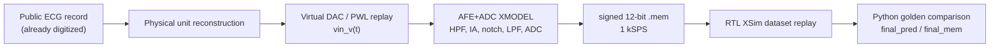

# AFE+ADC XMODEL 기반 입력 생성 흐름

## 1. 전체 목표

이 문서는 공개 ECG dataset에서 시작해 AFE+ADC XMODEL 입력 stimulus를 만들고, 최종적으로 signed 12-bit `.mem` stream이 RTL 검증에 들어가는 흐름을 정리한다.

핵심은 다음 한 문장으로 요약된다.

> 공개 ECG dataset은 이미 digitized record이므로 원래의 raw analog ECG를 복원할 수 없다. 대신 physical-voltage-equivalent waveform을 재구성하고, virtual DAC / PWL-equivalent replay를 통해 AFE+ADC XMODEL에 넣을 수 있는 입력 stimulus를 만든 뒤, 모델화된 AFE+ADC 출력을 signed 12-bit RTL input stream으로 연결한다.

이 flow는 “실제 환자의 아날로그 심전도를 되살리는 절차”가 아니다. 이미 digital sample로 배포된 PhysioNet/WFDB/CSV record를 사용해 mixed-signal model 검증에 필요한 analog-equivalent input을 만드는 절차이다.

## 2. 왜 virtual DAC / PWL-equivalent reconstruction이 필요한가

공개 ECG dataset은 대개 WFDB record 또는 CSV처럼 이미 sampling과 quantization이 끝난 digital record이다. AFE+ADC XMODEL은 analog input node에 시간에 따른 전압 `vin(t)`가 들어간다고 가정하지만, dataset에는 continuous-time waveform이 없다.

따라서 물리적 DAC를 실제로 연결하는 대신, 다음과 같은 virtual DAC replay를 사용한다.

```text
digitized ECG sample
-> physical unit conversion
-> time grid reconstruction
-> DAC replay model
-> vin_v(t)
-> XMODEL AFE+ADC input
```

repo에서 확인된 도구는 `tools/ecg_to_xmodel_stimulus.py`이다. 이 스크립트는 문서 문자열에서 다음 한계를 명시한다.

- source record는 이미 digitized ECG data이다.
- original raw analog ECG를 복원하는 것이 아니다.
- WFDB/CSV sample이 나타내는 physical voltage를 재구성한다.
- DAC replay reconstruction model을 적용해 analog-equivalent XMODEL input stimulus를 만든다.

## 3. repo에서 확인된 구현과 해석 구분

| 구분 | 내용 |
|---|---|
| repo에서 실제 확인된 구현 | `tools/ecg_to_xmodel_stimulus.py`, `tools/batch_make_xmodel_stimulus.py`, `tests/test_ecg_to_xmodel_stimulus.py` |
| repo에서 실제 확인된 출력 | `stimulus_xmodel.csv`, `stimulus_pwl.txt`, `metadata.json`, `qa_plot.png`, `README_stimulus.md` |
| repo 문서에서 확인된 AFE+ADC 조건 | `FINAL_REPORT_KR.md`의 HPF/IA/notch/LPF/ADC/signed conversion 조건 |
| 설계 해석 | digitized ECG -> analog-equivalent stimulus -> AFE+ADC XMODEL -> signed 12-bit RTL stream으로 이어지는 model-based verification flow |
| 확인되지 않은 항목 | 별도 `convert_mem`라는 이름의 script, MIT-BIH ARR 1024 offset 전용 하드코딩, 실제 silicon/실측 AFE 검증 |

이 구분이 중요하다. 문서에서는 “XMODEL-ready stimulus generation flow”와 “model-based mixed-signal-to-digital verification flow”라고 표현할 수 있지만, repo evidence 없이 “실제 analog ECG 복원 완료”, “silicon-level AFE 검증 완료”, “SPICE correlation 완료”라고 쓰면 안 된다.

관련 파일과 산출물은 다음 기준으로 추적할 수 있다.

| 구분 | repo path |
|---|---|
| 단일 record XMODEL stimulus 생성 | `tools/ecg_to_xmodel_stimulus.py` |
| class별 batch stimulus 생성 | `tools/batch_make_xmodel_stimulus.py` |
| stimulus generator unit test | `tests/test_ecg_to_xmodel_stimulus.py` |
| AFE+ADC 조건 문서 | `FINAL_REPORT_KR.md` |
| 30분 full-record dataset | `fullrec_afe_30min_annotation_valid_balanced` |
| 30분 XSim replay runner | `scripts/run_final_membrane_v2_xsim.py` |
| 30분 RTL dataset testbench | `sim/tb_snn_ecg_30min_chunk_dataset.v` |
| full XSim summary | `results/final_membrane_v2_snn/xsim_snn_ecg_v2_summary.json` |
| Python-vs-XSim compare CSV | `results/final_membrane_v2_snn/python_vs_xsim_snn_ecg_v2_compare_*.csv` |

## 4. XMODEL stimulus generator

### 4.1 단일 record 변환

`tools/ecg_to_xmodel_stimulus.py`는 WFDB 또는 CSV record를 입력으로 받아 XMODEL testbench가 읽기 쉬운 voltage stimulus를 만든다.

주요 입력 옵션은 다음과 같다.

| 옵션 | 의미 |
|---|---|
| `--input` | CSV, WFDB `.hea`, `.dat`, 또는 WFDB record path |
| `--out-dir` | stimulus 산출물 directory |
| `--channel` | 사용할 ECG channel index/name |
| `--value-col`, `--time-col` | CSV column 지정 |
| `--fs` | CSV에 time column이 없을 때 source sampling rate |
| `--input-units` | `auto`, `V`, `mV`, `uV` |
| `--start-sec`, `--duration-sec` | 선택 구간 |
| `--stim-fs` | XMODEL stimulus output sample rate, 기본 10000 Hz |
| `--dac-mode` | `zoh`, `linear`, `pchip`, `cubic`, `bandlimited` |

출력 파일은 다음과 같다.

| 파일 | 역할 |
|---|---|
| `stimulus_xmodel.csv` | `time_s,vin_v` column을 갖는 XMODEL용 voltage waveform |
| `stimulus_pwl.txt` | `time_s vin_v` 형식의 PWL-style waveform |
| `metadata.json` | source, unit conversion, DAC mode, warning, assumption 기록 |
| `qa_plot.png` | replay waveform quick visual preview |
| `README_stimulus.md` | 생성 조건과 PowerShell 예시 |

### 4.2 batch 변환

`tools/batch_make_xmodel_stimulus.py`는 여러 record를 class별로 변환하기 위한 batch wrapper이다. class routing은 다음 database naming을 반영한다.

| Source naming | Class |
|---|---|
| `nsrdb` | NSR |
| `chfdb` | CHF |
| `mitdb` / MIT-BIH | ARR |
| `afdb` | AFF |

이 batch flow는 개별 record 변환을 반복하고 manifest를 남기는 역할을 한다. 변환 실패가 있어도 전체 batch를 계속 진행하도록 설계되어 있다.

## 5. AFE+ADC 모델 조건

`FINAL_REPORT_KR.md`에서 확인되는 AFE+ADC conversion 조건은 다음과 같다.

| 항목 | 값 |
|---|---|
| final RTL sample rate | 1 kSPS |
| input scaling | `V = code / 200000` |
| HPF cutoff | 0.482 Hz |
| instrumentation amplifier gain | x201 |
| notch | 60 Hz Twin-T notch, Q 약 5 |
| LPF cutoff | 150 Hz |
| ADC reference | +/- 1.65 V |
| ADC full span | 3.3 V |
| ADC resolution | 12-bit |
| intermediate format | offset-binary unsigned |
| RTL input format | signed = unsigned - 2048 |

흐름으로 쓰면 다음과 같다.

```text
WFDB ECG channel
-> 1 kSPS linear resampling
-> AFE-equivalent filtering/gain
   HPF 0.482 Hz
   IA gain x201
   60 Hz Twin-T notch
   LPF 150 Hz
-> 12-bit ADC quantization
-> offset-binary unsigned code
-> signed 12-bit code = unsigned - 2048
-> readmemh-compatible .mem
-> RTL adc_data input
```

여기서 주의할 점은 sample rate가 두 종류로 등장한다는 것이다.

| 구분 | 의미 |
|---|---|
| XMODEL stimulus fs | `ecg_to_xmodel_stimulus.py`가 만드는 `vin_v(t)` replay grid. 기본 10000 Hz |
| RTL input fs | AFE+ADC 이후 classifier가 소비하는 signed 12-bit stream. `FINAL_REPORT_KR.md` 기준 1 kSPS |

즉 `stimulus_xmodel.csv`의 기본 10 kHz는 analog-equivalent input replay를 위한 시간 grid이고, RTL classifier가 최종적으로 받는 `.mem` stream은 1 ms 간격의 1 kSPS sample이다.

## 6. full-record `.mem` 파이프라인의 역할

30분 RTL/XSim regression은 다음 dataset을 사용한다.

```text
fullrec_afe_30min_annotation_valid_balanced
```

`scripts/run_final_membrane_v2_xsim.py`는 이 dataset의 chunk file을 manifest로 만들고, 30분당 1,800,000 samples를 testbench에 공급한다. script 내부에서는 각 case를 다음 형태로 넘긴다.

```text
case_id class_id 1800000 path/to/chunk.mem
```

즉 repo에서 실제 확인되는 full-record 검증 경계는 다음과 같다.

```text
signed 12-bit .mem chunk
-> sim/tb_snn_ecg_30min_chunk_dataset.v
-> rtl/snn_ecg_30min_final_top.v
-> Python expected result와 final_pred/final_mem 비교
```

사용자 논의에서 언급된 `convert_mem` 역할은 “AFE+ADC 결과를 RTL이 읽을 수 있는 signed 12-bit `.mem`으로 만드는 단계”로 해석할 수 있다. 다만 현재 worktree에서 `convert_mem`이라는 정확한 script 이름은 확인되지 않았다. 따라서 완료된 사실로는 다음까지만 쓴다.

- 최종 signed 12-bit full-record `.mem` dataset은 존재한다.
- XSim runner가 해당 `.mem`을 30분 chunk로 replay한다.
- Python golden과 RTL/XSim의 final prediction/membrane mismatch가 0 / 136으로 확인되었다.
- `convert_mem`이라는 별도 script 이름은 현재 repo evidence로는 확인되지 않았으므로 TODO/명칭 확인 항목으로 남긴다.

## 7. signed 12-bit RTL 입력 형식

RTL snapshot core의 input은 signed 12-bit `adc_data`이다. Python golden 쪽에서도 `.mem`을 12-bit hex로 읽은 뒤 다음 방식으로 signed 값으로 해석한다.

```text
u = hex_to_int(sample)
if u >= 0x800:
    signed = u - 0x1000
else:
    signed = u
```

이 형식은 `FINAL_REPORT_KR.md`의 “signed = unsigned - 2048” 설명과 일치한다. 따라서 AFE+ADC XMODEL 또는 conversion pipeline의 최종 digital output은 RTL 기준에서 다음 조건을 만족해야 한다.

| 조건 | 의미 |
|---|---|
| width | 12-bit |
| representation | two's-complement signed value로 해석 |
| range | -2048 ~ +2047 |
| file format | `readmemh` compatible `.mem` |
| sample interval | 1 ms, 1 kSPS |

## 8. WFDB baseline / MIT-BIH offset 이슈

`tools/ecg_to_xmodel_stimulus.py`는 WFDB metadata에서 gain, baseline, adc_zero를 읽어 physical unit 변환을 수행하는 generic 구조를 갖고 있다. 내부 변환은 baseline이 있으면 baseline을 우선 사용하고, 없으면 `adc_zero`를 사용한다.

다만 사용자가 언급한 “ARR / mitdb의 1024 baseline offset”을 전용으로 처리하는 하드코딩은 현재 repo 검색에서 확인되지 않았다. 따라서 문서상으로는 다음처럼 구분한다.

| 항목 | 현재 상태 |
|---|---|
| WFDB baseline/adc_zero generic handling | repo code에서 확인됨 |
| MIT-BIH format 212 decoding | repo code에서 확인됨 |
| ARR/mitdb 1024 offset 전용 rule | 현재 repo에서 확인되지 않음 |
| 문서화 방식 | “generic WFDB metadata handling은 있음, dataset별 baseline special-case는 추가 확인 필요” |

이 부분은 향후 XMODEL-to-`.mem` 재생산성을 강화할 때 중요한 TODO이다. 특히 record별 baseline, adc_gain, unit, channel 선택이 최종 signed 12-bit code에 영향을 줄 수 있으므로 metadata traceability가 필요하다.

## 9. Model-based mixed-signal-to-digital verification 해석

이 flow는 다음 이유로 model-based mixed-signal-to-digital verification으로 해석할 수 있다.

1. 공개 ECG dataset은 digital source이지만, XMODEL 입력에는 time-voltage waveform이 필요하다.
2. virtual DAC/PWL-equivalent reconstruction이 digital record와 analog behavior model 사이의 interface를 만든다.
3. AFE+ADC model은 HPF, gain, notch, LPF, quantization을 거쳐 RTL-compatible signed 12-bit sample stream을 만든다.
4. RTL classifier는 이 stream을 받아 XSim에서 Python golden과 bit-accurate 비교된다.
5. metadata, QA plot, manifest, XSim result가 source-to-RTL traceability를 제공한다.

전체 흐름은 다음과 같다.



이 해석의 한계도 명확하다. XMODEL stimulus 생성과 RTL XSim 비교는 확인되지만, 현재 문서 근거만으로는 transistor-level SPICE 검증, 실제 silicon correlation, noise/corner/PVT sweep, 물리적 DAC 실험을 완료했다고 말할 수 없다.

## 10. 검증과 한계

### 10.1 확인된 검증

| 항목 | repo evidence |
|---|---|
| XMODEL stimulus generator unit test | `tests/test_ecg_to_xmodel_stimulus.py` |
| generated output file set | CSV/PWL/metadata/QA plot/README test 확인 |
| NaN/interpolation warning | test에서 warning metadata 확인 |
| batch routing | class directory routing test 확인 |
| full-record RTL replay | `scripts/run_final_membrane_v2_xsim.py` |
| Python-vs-XSim final prediction/membrane | mismatch 0 / 136 |

### 10.2 남은 한계와 TODO

| 항목 | 상태 |
|---|---|
| raw analog ECG recovery | 원천적으로 불가. digitized record 기반 reconstruction임 |
| physical DAC replay | 수행하지 않음. virtual DAC/PWL-equivalent replay임 |
| exact `convert_mem` script 명칭 | 현재 repo에서 확인되지 않음 |
| dataset별 baseline special-case | MIT-BIH/ARR 1024 전용 rule은 확인되지 않음 |
| XMODEL simulation run log | stimulus generator 중심. 실제 XMODEL run evidence는 별도 확인 필요 |
| SPICE/silicon correlation | 수행 근거 없음 |
| ADC noise/corner/PVT sweep | 수행 근거 없음 |
| clinical validation | 수행 근거 없음 |

정리하면, 현재 repo의 강점은 “digitized ECG source에서 XMODEL-ready analog-equivalent stimulus를 만들고, AFE+ADC 결과로 해석되는 signed 12-bit `.mem`을 RTL golden/XSim 검증에 연결하는 흐름”이 이미 설명 가능한 수준으로 갖춰졌다는 점이다. 남은 작업은 이 흐름의 각 중간 산출물, 특히 XMODEL 실행 결과와 `.mem` 생성 script 이름/metadata를 더 강하게 연결하는 것이다.
