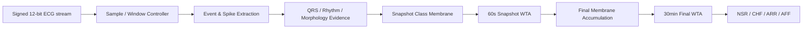
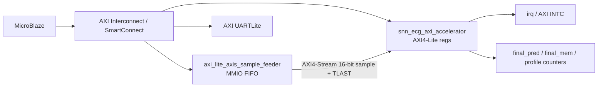

# AFE+ADC XMODEL 연동 SNN 기반 장시간 ECG 4-Class Classification Accelerator IP Core 설계

## 1. 프로젝트 요약

이 문서는 **AFE+ADC XMODEL 연동 SNN 기반 장시간 ECG 4-Class Classification Accelerator IP Core 설계**의 디지털 RTL을 Accelerator IP Core 관점에서 다시 정리한다. 핵심은 “ECG stream을 받으면 정해진 feature/event datapath가 60초 snapshot evidence를 만들고, 30분 동안 누적된 membrane으로 NSR / CHF / ARR / AFF 중 하나를 출력한다”는 점이다.

> 본 IP Core는 AFE+ADC 이후의 ECG sample stream을 직접 받아 60초 단위 snapshot evidence를 생성하고, 이를 30분 단위 final membrane에 누적하여 NSR, CHF, ARR, AFF 중 하나를 출력하는 streaming ECG classification accelerator이다.

본 프로젝트는 CNN/RNN/DNN처럼 dense MAC을 반복하는 classifier가 아니라, ECG domain feature를 event/spike로 변환하고, counter, comparator, signed accumulator, threshold, WTA 기반으로 long-window classification을 수행한다. 목표는 “큰 neural network를 FPGA에 억지로 올리는 것”이 아니라, 작은 FPGA/edge 환경에서도 타이밍과 자원 사용을 설명할 수 있는 biomedical streaming classifier IP를 만드는 것이다.

| 항목 | repo에서 확인된 내용 |
|---|---|
| 입력 | AFE+ADC 이후 signed 12-bit ECG stream |
| sample rate | 1 kSPS |
| snapshot window | 60000 samples = 60초 |
| final window | 30 snapshots = 30분 chunk |
| class | NSR / CHF / ARR / AFF |
| 대표 RTL top | `rtl/snn_ecg_30min_final_top.v` |
| snapshot core | `rtl/core/snn_ecg_3feat_top.v` |
| class score hotspot | `rtl/core/class_score_neurons.v` |
| final readout | `rtl/final_membrane_layer.v` |
| AXI wrapper | `rtl/axi/snn_ecg_axi_lite_stream_top.v` |
| sample feeder | `rtl/axi/axi_lite_axis_sample_feeder.v` |

현재 repo 기준의 주요 검증 수치는 다음과 같다. 이 수치는 해당 dataset split과 tested vector에 대한 결과이며, 임상 진단 성능이나 formal equivalence proof를 의미하지 않는다.

| 검증 항목 | 결과 |
|---|---:|
| 60초 Snapshot Readout test accuracy | 205 / 256 = 80.08% |
| 30분 chunk train XSim accuracy | 62 / 68 = 91.18% |
| 30분 chunk validation XSim accuracy | 31 / 32 = 96.88% |
| 30분 chunk test XSim accuracy | 32 / 36 = 88.89% |
| Python-vs-XSim final prediction mismatch | 0 / 136 |
| Python-vs-XSim final membrane mismatch | 0 / 136 |
| Board wrapper Vivado resource | LUT 21002 / FF 2803 / BRAM 0 / DSP 0 |
| Board wrapper timing | 1 MHz core clock, WNS 7.873 ns |
| Current OOC core 10 ns post-route | LUT 10219 / FF 5981 / BRAM 0 / DSP 0, WNS 0.044 ns |
| Current AXI wrapper OOC 10 ns post-route | LUT 10773 / FF 6931 / BRAM 0 / DSP 0, WNS 0.081 ns |

## 2. 왜 Accelerator IP Core인가

### 2.1 Accelerator라고 부를 수 있는 이유

이 설계는 범용 CPU가 30분 ECG record를 software loop로 반복 분석하는 방식이 아니다. ECG stream 처리, QRS/rhythm/morphology evidence 생성, class membrane accumulation, WTA readout을 전용 RTL datapath로 고정했다. 즉 workload가 “ECG 4-class long-window classification”으로 고정되어 있고, 그 workload를 위한 계산 경로가 counter/comparator/accumulator 중심 하드웨어로 구현되어 있다.

| 구분 | 본 프로젝트에서의 의미 |
|---|---|
| Input stream | AFE+ADC 이후 signed 12-bit ECG sample |
| Core datapath | event/spike extraction, rhythm/morphology evidence, class membrane accumulation, WTA |
| Accelerator성 | ECG classification workload를 전용 RTL datapath로 고정 |
| Dense MAC 회피 | multiplier-heavy CNN/RNN/MLP 대신 threshold, counter, comparator, signed add/subtract 사용 |
| 검증 | Python golden model과 RTL/XSim의 final prediction/membrane 비교 |
| FPGA 구현성 | Vivado synthesis/implementation/timing/utilization report 존재 |

현재 resource 결과에서 core와 AXI wrapper OOC는 BRAM 0, DSP 0으로 보고된다. 이것은 “무조건 더 좋은 구조”라는 의미가 아니라, 본 설계가 weight memory와 multiplier array에 의존하지 않는 fixed-function event datapath라는 점을 보여준다.

### 2.2 IP Core라고 부를 수 있는 이유

IP Core 관점에서 중요한 것은 독립적인 interface와 재사용 가능한 RTL boundary이다. repo에는 순수 RTL top뿐 아니라 AXI wrapper와 Vivado IP-XACT packaging 산출물도 존재한다.

| 구분 | repo에서 확인된 구현 |
|---|---|
| Core RTL | `snn_ecg_30min_final_top` |
| Control/status wrapper | `snn_ecg_axi_lite_stream_top` |
| Control bus | AXI4-Lite style register interface |
| Sample input | AXI4-Stream 16-bit `s_axis_tdata` / `tvalid` / `tready` / `tlast` |
| Interrupt | `irq = done_sticky` |
| Packaged accelerator IP | `ip_repo/snn_ecg_axi_accelerator/component.xml` |
| Accelerator VLNV | `user.org:user:snn_ecg_axi_accelerator:1.0` |
| Packaged feeder IP | `ip_repo/axi_lite_axis_sample_feeder/component.xml` |
| Feeder VLNV | `user.org:user:axi_lite_axis_sample_feeder:1.0` |

따라서 현재 상태는 단순한 testbench용 RTL만 있는 단계가 아니라, **Vivado-packaged custom FPGA accelerator IP**까지 진행된 상태로 볼 수 있다. 다만 이 표현은 production SoC IP, 의료기기 인증 IP, AXI formal-certified IP를 의미하지 않는다. formal AXI protocol proof나 clinical validation은 별도의 향후 작업이다.

## 3. 병목 원인 분석

### 3.1 Long-window ECG classification 병목

ECG class는 단일 sample 하나로 결정되지 않는다. NSR / CHF / ARR / AFF는 rhythm regularity, beat-to-beat variability, morphology abnormality, conduction delay-like evidence 등 긴 시간 구간의 반복 패턴을 봐야 한다.

30분 record를 그대로 dense model에 넣으면 두 가지 문제가 생긴다.

1. 1 kSPS 기준 30분은 1,800,000 samples라서 입력 길이가 매우 길다.
2. dense classifier로 처리하면 weight memory, activation buffer, MAC 연산이 커진다.

이 repo의 해결 방향은 long-window를 직접 큰 vector로 만들지 않고, 60초 snapshot 30개로 나눈 뒤 각 snapshot의 event evidence를 final membrane에 누적하는 것이다.

### 3.2 Dense ML 구조의 병목

CNN/RNN/MLP류를 그대로 RTL에 올리면 multiplier, DSP, BRAM, weight memory, activation buffer가 필요해진다. 작은 FPGA나 low-power edge 환경에서는 DSP/BRAM 사용량과 timing closure가 병목이 된다.

장시간 ECG 4-Class Accelerator IP Core는 multiply-heavy classifier 대신 다음 구조를 사용한다.

- fixed threshold
- counter
- comparator
- signed accumulator
- excitatory/inhibitory signed update
- WTA argmax

Vivado 결과도 이 방향과 일치한다. board wrapper 결과는 LUT 21002 / FF 2803 / BRAM 0 / DSP 0이고, current AXI wrapper OOC 10 ns post-route 결과는 LUT 10773 / FF 6931 / BRAM 0 / DSP 0이다.

### 3.3 Per-sample streaming 처리 병목

ECG sample은 시간 순서대로 계속 들어온다. 모든 sample에 복잡한 multi-class arithmetic을 수행하면 clock과 resource 부담이 커진다. 따라서 sample-level signal을 바로 class로 매핑하지 않고, event/spike evidence로 압축해야 한다.

repo의 snapshot core는 다음 feature block으로 sample stream을 event evidence로 바꾼다.

| Feature block | RTL module | 역할 |
|---|---|---|
| Adaptive QRS LIF / event encoder | `ecg_event_encoder_adaptive.v`, `qrs_lif_detector.v` | slope event를 적분해 beat/QRS spike 생성 |
| PNN Rhythm Predictor | `pnn_rhythm_predictor.v` | RR interval 예측 match/mismatch rhythm evidence |
| RDM Variability Neuron | `rdm_variability_neuron.v` | RR 변화량 기반 variability evidence |
| DSCR Spike Counter | `dscr_spike_counter.v` | slope sign flip / morphology complexity evidence |
| RAM Peak Accumulator | `ram_peak_accumulator.v` | R-peak amplitude response evidence |
| Ectopic Pair Neuron | `ectopic_pair_neuron.v` | early beat + compensatory pause pattern |
| QRS MAF Neuron | `qrs_maf_neuron.v` | QRS width/complexity/energy abnormal evidence |
| RBBB Delay Bank | `rbbb_qrs_delay_bank.v` | RBBB-like conduction delay proxy evidence |

### 3.4 Final classification 병목

60초 snapshot만 보면 borderline case에서 class가 흔들릴 수 있다. 특히 snapshot WTA는 한 class만 출력하므로, 2등 class나 subthreshold evidence가 사라질 수 있다.

그래서 장시간 ECG 4-Class Accelerator IP Core는 두 단계 readout을 사용한다.

1. `class_score_neurons.v`가 60초 snapshot의 class membrane과 WTA를 만든다.
2. `final_membrane_layer.v`가 30개의 snapshot class/evidence를 final membrane에 누적한 뒤 30분 WTA를 수행한다.

이 구조는 60초 단위 local decision과 30분 단위 final decision을 분리한다. 결과적으로 단기 잡음이나 snapshot 경계의 불안정성을 final membrane이 완화할 수 있다.

### 3.5 IP integration 병목

dataset replay testbench에서 RTL이 맞아도, IP로 쓰려면 외부 시스템과의 interface boundary가 필요하다.

IP 통합에서 문제가 되는 항목은 다음과 같다.

- reset과 start sequencing
- sample valid/ready handshake
- 60초 / 30분 boundary와 TLAST의 관계
- done/result latch
- final prediction/membrane register map
- profile counter snapshot
- CPU가 AXI-Stream input을 직접 밀어 넣지 못하는 문제

repo에는 이 병목을 줄이기 위해 AXI wrapper와 sample feeder가 추가되어 있다. `snn_ecg_axi_lite_stream_top.v`는 accelerator를 AXI4-Lite control/status + AXI4-Stream sample input 형태로 감싸고, `axi_lite_axis_sample_feeder.v`는 CPU가 MMIO write로 sample과 TLAST를 FIFO에 넣으면 AXI-Stream으로 내보내는 작은 feeder 역할을 한다.

## 4. 병목 해결 구조

전체 해결 흐름은 “긴 ECG를 event evidence로 압축하고, 긴 combinational readout은 pipeline으로 끊고, 외부 시스템과의 연결은 AXI wrapper/feeder로 분리한다”로 요약할 수 있다.

| 병목 | 해결 구조 | 효과 |
|---|---|---|
| 긴 ECG window | 60초 snapshot + 30분 final membrane | long-term evidence 누적 |
| dense MAC 부담 | counter/comparator/signed accumulator 기반 event logic | DSP/BRAM 의존 감소 |
| sample-level 연산 부담 | QRS/rhythm/morphology spike extraction | 입력 stream을 evidence event로 압축 |
| snapshot class 흔들림 | final membrane + 30분 WTA | chunk-level 안정성 증가 |
| class_score timing hotspot | C24/global readout 및 WTA pipeline | `rdm_level_spike -> pred_class` same-cycle path 제거 |
| IP 연결성 | AXI4-Lite wrapper + AXI4-Stream input + feeder | CPU/MMIO smoke 및 block design 연결 가능 |

### 4.1 class_score_neurons 병목 해결

profiling 기반 timing note에 따르면 원래 hotspot은 `rtl/core/class_score_neurons.v`였다. 기존 OOC 10 ns critical path는 다음 계열이었다.

```text
u_snapshot/u_rdm/rdm_level_spike_reg[*]
-> u_snapshot/u_class/pred_class_reg[*]
```

이 path는 약 90 logic levels, 52 CARRY4로 보고되었고, 당시 `class_score_neurons`는 약 17.5k LUT 규모의 최대 hotspot이었다.

현재 구조에서는 다음 방향으로 path를 끊었다.

- C24/global readout과 final class WTA pipeline 분리
- `segment_done` 시점에 post-update 값을 snapshot으로 잡도록 `*_next` 기반 capture 유지
- C24 event/gate/segment/decision delta register stage 추가
- RDM/RAM code arithmetic을 lookup 기반으로 정리
- score finalization을 snapshot, adjust, commit stage로 분리
- WTA를 pairwise stage로 분리

중요한 점은 arithmetic constant, signedness, WTA tie-break 순서를 바꾸지 않고 pipeline을 넣었다는 것이다. 마지막 spike와 `segment_done`이 같은 cycle에 올 수 있으므로 snapshot은 pre-update 값이 아니라 post-update 값을 잡아야 한다. 이 요구는 timing note에서 명시적으로 보존된 것으로 정리되어 있다.

현재 `rdm_to_pred_class_timing.rpt`는 다음을 보고한다.

```text
No timing paths found.
```

즉 기존 `rdm_level_spike -> pred_class` 한 사이클 조합 경로는 현재 보고서 기준으로 사라졌다. 남은 worst path는 AXI wrapper OOC 10 ns post-route 기준 DSCR 계열이며, slack은 +0.081 ns로 met이다.

### 4.2 final_membrane_layer 병목 해결

final readout에서도 4-class WTA와 margin/post-score logic이 길어질 수 있다. 현재 `final_membrane_layer.v`는 local/final WTA를 pairwise stage로 분리하고, post-score margin 계산을 단계화한다. 이 때문에 final prediction latency는 약간 늘지만, 30분 chunk 종료 후 final_valid가 나오는 구조에서는 허용 가능한 trade-off이다.

### 4.3 IP wrapper와 feeder

AXI wrapper는 accelerator core를 다음 register 중심 block으로 보이게 한다.

| Address | 이름 | 역할 |
|---:|---|---|
| `0x000` | CONTROL | start, soft reset, clear done, profile snapshot, clear errors |
| `0x004` | STATUS | busy/done/result_valid/ready/fifo/snapshot index/final pred 상태 |
| `0x008` | ERROR_STATUS | start-while-busy, TLAST mismatch 등 error latch |
| `0x00c` | CONFIG | magic/config/profile/TLAST/input width 정보 |
| `0x010` | TOTAL_SAMPLES | `SNAPSHOT_SAMPLES * SNAPSHOTS_PER_CHUNK` |
| `0x014` | SAMPLES_ACCEPTED | AXI-Stream에서 accepted된 sample 수 |
| `0x018` | SAMPLES_CONSUMED | core가 consumed한 sample 수 |
| `0x020`..`0x02c` | FINAL_MEM_* | NSR/CHF/ARR/AFF final membrane |
| `0x030` | FINAL_PRED | result_valid, final_pred, done |
| `0x100`..`0x14c` | PROFILE_* | total/busy/run/input_wait/accepted/windows/decisions/latency counters |

sample feeder는 CPU가 AXI-Stream을 직접 만들지 못하는 문제를 해결한다.

| Feeder register | 역할 |
|---|---|
| `CONTROL` | soft reset, clear errors, clear counters |
| `STATUS` | FIFO empty/full, stream valid/ready, error 상태 |
| `SAMPLE` | bit `[15:0]` sample, bit `[16]` TLAST |
| `WRITE_COUNT` | MMIO로 적재한 sample 수 |
| `TX_COUNT` | AXI-Stream으로 전송된 sample 수 |
| `TLAST_COUNT` | AXI-Stream pop 시 관측된 TLAST 수 |

## 5. Accelerator IP Core architecture



실제 RTL hierarchy는 다음처럼 볼 수 있다.

```text
snn_ecg_axi_lite_stream_top
  -> reset_sync
  -> AXI4-Lite register/control logic
  -> 2-entry stream staging FIFO
  -> snn_ecg_30min_final_top
       -> timer neuron / snapshot boundary controller
       -> snn_ecg_3feat_top
            -> event encoder / QRS / PNN / RDM / DSCR / RAM / ECP / QRS MAF / RBBB
            -> class_score_neurons
       -> final_membrane_layer
```

검증과 구현 산출물은 다음 파일들을 기준으로 추적할 수 있다.

| 구분 | repo path |
|---|---|
| 30분 dataset replay testbench | `sim/tb_snn_ecg_30min_chunk_dataset.v` |
| AXI wrapper smoke testbench | `sim/tb_snn_ecg_axi_smoke.v` |
| sample feeder smoke testbench | `sim/tb_axi_lite_axis_sample_feeder.v` |
| snapshot Python exact model | `scripts/snapshot_c24_rtl_exact.py` |
| final membrane Python model | `scripts/search_final_membrane_v2_snn.py`, `scripts/search_final_membrane_v2_arr_focus.py` |
| XSim runner | `scripts/run_final_membrane_v2_xsim.py` |
| full XSim summary | `results/final_membrane_v2_snn/xsim_snn_ecg_v2_summary.json` |
| limited all-split XSim summary | `results/final_membrane_v2_snn/xsim_snn_ecg_v2_summary_all_first2.json` |
| board wrapper Vivado summary | `results/final_membrane_v2_snn/vivado_snn_ecg_v2/snn_ecg_v2_vivado_summary.json` |
| board wrapper timing/util/power reports | `results/final_membrane_v2_snn/vivado_snn_ecg_v2/reports/` |
| OOC core 10 ns timing summary | `results/final_membrane_v2_snn/impl_timing_10ns/impl_timing_10ns_summary.json` |
| OOC AXI 10 ns timing summary | `results/final_membrane_v2_snn/axi_impl_timing_10ns/axi_impl_timing_10ns_summary.json` |
| profiling/timing bottleneck note | `docs/timing_bottlenecks.md` |
| accelerator IP package summary | `results/final_membrane_v2_snn/snn_ecg_axi_ip_package_summary.json` |
| feeder IP package summary | `results/final_membrane_v2_snn/sample_feeder_ip_package_summary.json` |
| MicroBlaze smoke summary | `results/final_membrane_v2_snn/microblaze_smoke/microblaze_smoke_summary.json` |

MicroBlaze smoke block design 관점에서는 다음 구조가 확인된다.



이 block design은 full 30분 record throughput 측정용 DMA system이 아니라, packaged accelerator IP가 CPU-controlled MMIO 환경에서 정상 동작하는지 확인하기 위한 smoke system이다.

## 6. IP 패키징 및 IP화 관점의 구조

repo에는 Vivado IP Packager 산출물이 존재한다.

| IP | 산출물 | VLNV |
|---|---|---|
| Accelerator IP Core | `ip_repo/snn_ecg_axi_accelerator/component.xml` | `user.org:user:snn_ecg_axi_accelerator:1.0` |
| MMIO-to-AXIS feeder | `ip_repo/axi_lite_axis_sample_feeder/component.xml` | `user.org:user:axi_lite_axis_sample_feeder:1.0` |

packaging script는 다음을 수행한다.

- wrapper top module 지정
- source RTL 수집
- AXI4-Lite slave bus interface 지정
- AXI4-Stream sample input 또는 output bus interface 지정
- interrupt interface 지정
- memory map range 지정
- Vivado catalog에서 component 상태 확인

따라서 현재 repo는 “IP화 지향 RTL”을 넘어, 실제 Vivado custom IP repository 형태까지 생성한 상태이다. 다만 OOC timing budget XDC는 재사용 IP 내부에 고정 packaging하지 않고, downstream block design의 board-level clock/IO/physical constraints가 소유하도록 분리되어 있다.

## 7. 검증 결과

### 7.1 RTL/Python golden 비교

| Split | Python/XSim accuracy | pred mismatch | mem mismatch |
|---|---:|---:|---:|
| train | 62 / 68 = 91.18% | 0 | 0 |
| validation | 31 / 32 = 96.88% | 0 | 0 |
| test | 32 / 36 = 88.89% | 0 | 0 |
| total | 125 / 136 = 91.91% | 0 / 136 | 0 / 136 |

limited regression인 `--split all --max-cases 2`에서도 train/val/test 각각 2개 case에 대해 pred/mem mismatch 0이 보고되었고, profiling counter는 다음과 같이 정상 범위로 확인되었다.

| Counter | 값 |
|---|---:|
| accepted_samples | 1,800,000 |
| run_cycles | 1,800,000 |
| windows | 30 |
| decisions | 1 |
| input_wait | 0 |
| cycles/sample total | 1.000733 |

### 7.2 Timing/resource 결과

| Target | LUT | FF | BRAM | DSP | Timing |
|---|---:|---:|---:|---:|---|
| Nexys A7 board wrapper, 1 MHz core | 21002 | 2803 | 0 | 0 | WNS 7.873 ns |
| OOC core, 10 ns post-route | 10219 | 5981 | 0 | 0 | WNS 0.044 ns, WHS 0.050 ns |
| OOC AXI wrapper, 10 ns post-route | 10773 | 6931 | 0 | 0 | WNS 0.081 ns, WHS 0.098 ns |
| MicroBlaze smoke system | 12650 | 8746 | 16 | 3 | WNS 0.185 ns, WHS 0.037 ns |

MicroBlaze system에서 BRAM/DSP가 생기는 이유는 accelerator core가 아니라 MicroBlaze/LMB/BRAM/UART/interrupt 등 system infrastructure가 포함되기 때문이다.

### 7.3 Hardware smoke

MicroBlaze smoke system은 다음 산출물을 만든다.

- `results/final_membrane_v2_snn/microblaze_smoke/snn_ecg_mb_smoke.bit`
- `results/final_membrane_v2_snn/microblaze_smoke/snn_ecg_mb_smoke.xsa`
- timing/CDC/clock interaction/DRC/IO reports

JTAG MMIO smoke는 16-sample deterministic stream으로 다음을 확인했다.

| 항목 | 결과 |
|---|---|
| access path | `MICROBLAZE_INJECTED_LOADSTORE` |
| final_pred | 0 |
| final_mem NSR/CHF/ARR/AFF | 2 / 2 / 0 / 0 |
| samples accepted/consumed | 16 / 16 |
| profile accepted/windows/decisions | 16 / 2 / 1 |
| feeder tx/TLAST | 16 / 1 |
| interrupt pending | set |
| transcript result | `JTAG_MMIO_SMOKE_PASS` |

UART bare-metal C app은 `sw/microblaze_smoke/src/main.c`에 존재하지만, ELF 생성과 UART transcript 검증은 `xsct` 및 MicroBlaze bare-metal GCC toolchain이 필요하다. 현재 repo evidence 기준으로는 JTAG MMIO smoke가 hardware smoke의 완료된 검증이고, UART C smoke는 향후 toolchain 준비 후 실행할 항목이다.

## 8. 한계와 향후 보완

| 구분 | 현재 상태 |
|---|---|
| 임상 검증 | 수행되지 않음. dataset split 기반 engineering validation임 |
| formal equivalence | 수행되지 않음. Python-vs-XSim tested-vector mismatch 0으로 제한 |
| formal AXI protocol proof | 수행되지 않음. RTL smoke/OOC timing/IP packaging 검증으로 제한 |
| full 30분 hardware replay | 아직 DMA/DDR 기반 full-record hardware replay 미구현 |
| UART bare-metal smoke | C app은 작성되어 있으나 local toolchain 의존으로 실행 전제 있음 |
| energy/sample | Vivado power estimate는 있으나 workload 기반 energy/sample 실측은 없음 |
| production IP qualification | Vivado custom IP packaging 완료 수준이며 제품화 검증은 아님 |

현재 문서에서 말하는 Accelerator IP Core는 “검증된 RTL datapath + AXI wrapper + Vivado packaged custom IP + smoke-level system integration”을 의미한다. 다음 단계는 full-record replay와 board-level software transcript를 더 강하게 만드는 것이다.
