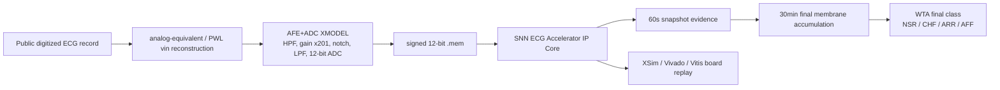

# 최종 제출 요약

## 1. 프로젝트 개요

본 프로젝트는 **AFE+ADC XMODEL output stream을 입력으로 받아 NSR / CHF / ARR / AFF를 분류하는 SNN-inspired ECG Classification Accelerator IP Core**이다.

핵심 포지션은 다음과 같다.

> 공개 digitized ECG record를 analog-equivalent `vin`으로 재구성하고, AFE+ADC XMODEL을 통과시켜 signed 12-bit stream을 생성한 뒤, 이를 SNN-inspired ECG Classification Accelerator IP Core에 입력하여 NSR/CHF/ARR/AFF 4-class long-record classification을 수행하는 biomedical streaming accelerator prototype.

## 2. 핵심 기술 Flow

이 flow는 physical electrode/AFE board 검증이 아니라, 공개 digitized ECG를 기반으로 한 **model-based mixed-signal-to-digital engineering validation**이다.

## 3. Accelerator IP Core 구조

디지털 core는 dense CNN/RNN/MLP가 아니라 ECG domain event를 spike/evidence로 압축하고, counter/comparator/signed accumulator/WTA로 long-window classification을 수행한다.

| 구성 | 역할 |
|---|---|
| event/spike extraction | sample stream에서 QRS/rhythm/morphology/variability evidence 생성 |
| 60초 snapshot readout | 60,000 samples 단위 class evidence 생성 |
| final membrane layer | 30개의 snapshot evidence를 30분 단위로 누적 |
| WTA decision | NSR/CHF/ARR/AFF 중 최종 class 선택 |
| AXI wrapper | AXI4-Lite control/status + AXI4-Stream sample input |
| sample feeder | MicroBlaze MMIO write를 AXI-Stream sample로 변환 |

IP packaging evidence:

| 항목 | 경로 |
|---|---|
| Accelerator IP-XACT | `ip_repo/snn_ecg_axi_accelerator/component.xml` |
| Accelerator xgui | `ip_repo/snn_ecg_axi_accelerator/xgui/snn_ecg_axi_accelerator_v1_0.tcl` |
| Feeder IP-XACT | `ip_repo/axi_lite_axis_sample_feeder/component.xml` |

## 4. AFE+ADC XMODEL 검증

공개 ECG dataset은 이미 digitized record이다. 따라서 본 프로젝트는 raw analog ECG를 복원했다고 주장하지 않고, signed code를 analog-equivalent `vin` 입력으로 해석하는 virtual DAC/PWL-equivalent reconstruction을 사용한다.

repo 기준 AFE+ADC evidence:

| 항목 | 값 |
|---|---|
| input scaling | `vin_v = signed_code / 200000` |
| HPF | 0.482 Hz |
| IA gain | x201 |
| notch | 60 Hz |
| LPF | 150 Hz |
| ADC | 12-bit quantization |
| evidence figures | `reports/award_readiness/figures/` |

이 단계는 단순 file scaling이 아니라, AFE+ADC nominal model을 통과한 signed 12-bit digital stream을 RTL 입력으로 사용하는 model-in-the-loop 검증이다. 다만 physical AFE PCB, ADC silicon, Virtuoso post-layout 검증은 수행하지 않았다.

## 5. Dataset / Ablation / Performance 결과

| 항목 | 결과 |
|---|---:|
| Chunk-level test accuracy | 32/36 = 88.89% |
| Strict record-wise locked Final Membrane | train 61/68, validation 32/32, final_test 29/36 |
| Strict final_test evaluation count | 1 |
| Python-vs-XSim final prediction mismatch | 0/136 |
| Python-vs-XSim final membrane mismatch | 0/136 |
| Strict record-wise dataset | seed 20260808, source/physical overlap 0, class별 train/val/test 17/8/9 chunks |
| Full model ablation | 125/136 = 91.91% |
| Snapshot majority | 103/136 = 75.74% |
| Snapshot membrane sum | 101/136 = 74.26% |
| Feature evidence zeroed | 84/136 = 61.76% |

Vivado/performance evidence:

| 항목 | 결과 |
|---|---:|
| Board wrapper LUT/FF/BRAM/DSP | 21002 / 2803 / 0 / 0 |
| Board wrapper WNS | 7.873 ns |
| Vivado estimated power | 0.101 W |
| AXI OOC LUT/FF/BRAM/DSP | 10773 / 6931 / 0 / 0 |
| AXI OOC WNS @10 ns | 0.081 ns |
| RTL cycles/sample | 1.000267 |
| RTL cycle model @100 MHz | 0.018005 s/chunk |

## 6. Vitis Full-Record Board Replay 결과

실제 FPGA board에서 Vitis/MicroBlaze 기반 full-record replay를 수행했다. 현재 완료 범위는 **test NSR case 0 한 건**이다.

| 항목 | 결과 |
|---|---|
| Input `.mem` | `fullrec_afe_30min_annotation_valid_balanced/test/NSR/16786/16786_30min_w035.mem` |
| Samples | 1,800,000 |
| Sample rate / duration | 1 kSPS / 30 min |
| Board flow | Vitis MicroBlaze + UART chunk-ACK + AXI feeder |
| samples_sent_to_ip | 1,800,000 |
| samples_accepted / consumed | 1,800,000 / 1,800,000 |
| snapshot_count / decision_count | 30 / 1 |
| done / final_valid | 1 / 1 |
| expected_final_pred / board_final_pred | 0 / 0 |
| expected_final_mem / board_final_mem | 31 / 0 / 1 / 0 |
| transcript | `reports/board_replay/transcripts/test_case0_nsr_uart_full_replay.txt` |
| comparison | `reports/board_replay/comparisons/test_case0_nsr_expected_vs_board.csv` |
| result | PASS |

이 결과는 board-level integration evidence이다. UART 전송 시간이 포함되므로 real-time throughput 측정으로 해석하지 않는다.

## 7. 수상권 작품 대비 차별점

| 비교 축 | 본 프로젝트의 위치 |
|---|---|
| 이화여대 biomedical CMOS hybrid system 대비 | physical analog/post-layout은 약하지만, RTL/IP packaging/Vitis board replay evidence는 강함 |
| UNIST GNN force-field accelerator IP 대비 | HBM/대규모 workload는 약하지만, low-resource biomedical streaming accelerator IP로 차별화 |
| SWIR 2-step SS-ADC 대비 | actual ADC circuit proof는 없지만, AFE+ADC XMODEL과 digital accelerator 연결 flow가 명확함 |
| Scara Wafer Vision 대비 | 실물 system demo성은 약할 수 있으나 FPGA/VLSI IP 설계 purity가 높음 |
| WebAssembly/ECDSA/ChaCha20류 IP 수상작 대비 | 특정 workload를 RTL/IP로 고정한 accelerator IP Core라는 성격이 유사함 |

## 8. 남은 한계

- source ECG는 already digitized record이다.
- raw analog ECG acquisition이 아니다.
- physical DAC replay가 아니다.
- actual AFE PCB / ADC silicon measurement가 아니다.
- Virtuoso layout/post-layout 검증이 아니다.
- clinical validation이 아니다.
- full-record board replay는 1-case 완료이며, full split batch는 남아 있다.
