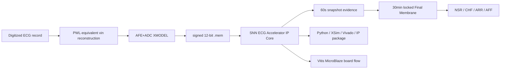

# 최종 제출 요약

## 1. 프로젝트 개요

본 프로젝트는 공개 digitized ECG record를 analog-equivalent `vin`으로 재구성하고, AFE+ADC XMODEL을 통과시켜 signed 12-bit stream을 생성한 뒤, SNN-inspired ECG Classification Accelerator IP Core에 입력하여 NSR/CHF/ARR/AFF 4-class long-record classification을 수행하는 FPGA/VLSI engineering prototype이다.

## 2. 전체 Flow

## 3. Locked Final Model

| 항목 | 결과 |
|---|---:|
| Locked candidate | `structural_guarded_silent_aff_1008710` |
| Train | 61/68 = 89.71% |
| Validation | 32/32 = 100.00% |
| Final test chunk | 29/36 = 80.56% |
| Final test record-majority | 16/19 = 84.21% |
| test_evaluation_count | 1 |
| final_test used for selection/search/ChatGPT context | false |

Validation 100%는 model-selection split 성능이고, 최종 held-out 성능은 final_test 29/36 및 record-majority 16/19로 보고한다.

## 4. RTL/XSim/Vivado 결과

| 항목 | 결과 |
|---|---|
| Python locked recheck | PASS |
| Standalone Final Membrane XSim | final_pred mismatch 0, final_mem mismatch 0 over 36 final_test cases |
| Pure RTL Vivado | LUT/FF/BRAM/DSP 9719/5038/0/0, WNS 8.184 ns, power 0.099 W |
| OOC/profile Vivado | LUT/FF/BRAM/DSP 9905/5769/0/0, WNS 0.471 ns |
| Previous hotspot | targeted `rdm_level_spike -> pred_class` query: `No timing paths found` |
| IP packaging | accelerator IP repackaged, interface/register map unchanged |

## 5. Board/Vitis 상태

| 항목 | 결과 |
|---|---|
| MicroBlaze full-record bitstream | rebuilt |
| XSA | rebuilt |
| Bare-metal ELF | rebuilt |
| MicroBlaze system timing | WNS/WHS 0.294 ns / 0.055 ns |
| MicroBlaze system resource | LUT/reg/BRAM/DSP 12485/8480/16/3 |
| Actual locked UART full-record replay | NSR/CHF/ARR/AFF 각 1건 완료 |
| Locked transcript/comparison | not generated |

Locked board replay는 NSR/CHF/ARR/AFF 각 1건을 실제 수행했다. 네 case 모두 final_pred는 full-top XSim과 일치했고, final_mem exact match는 NSR/AFF 2건에서 확인했다.

## 6. 한계

- Source ECG는 already digitized public record이다.
- 실제 전극 측정이나 physical DAC replay가 아니다.
- AFE+ADC는 XMODEL 기반 nominal model이다.
- physical AFE PCB, ADC silicon, transistor-level post-layout 검증은 수행하지 않았다.
- 의료 진단 유효성 검증이 아니라 engineering validation이다.
- locked full-record board replay는 bit/XSA/ELF build까지만 완료했고, 실제 UART transcript는 추가 확보가 필요하다.
