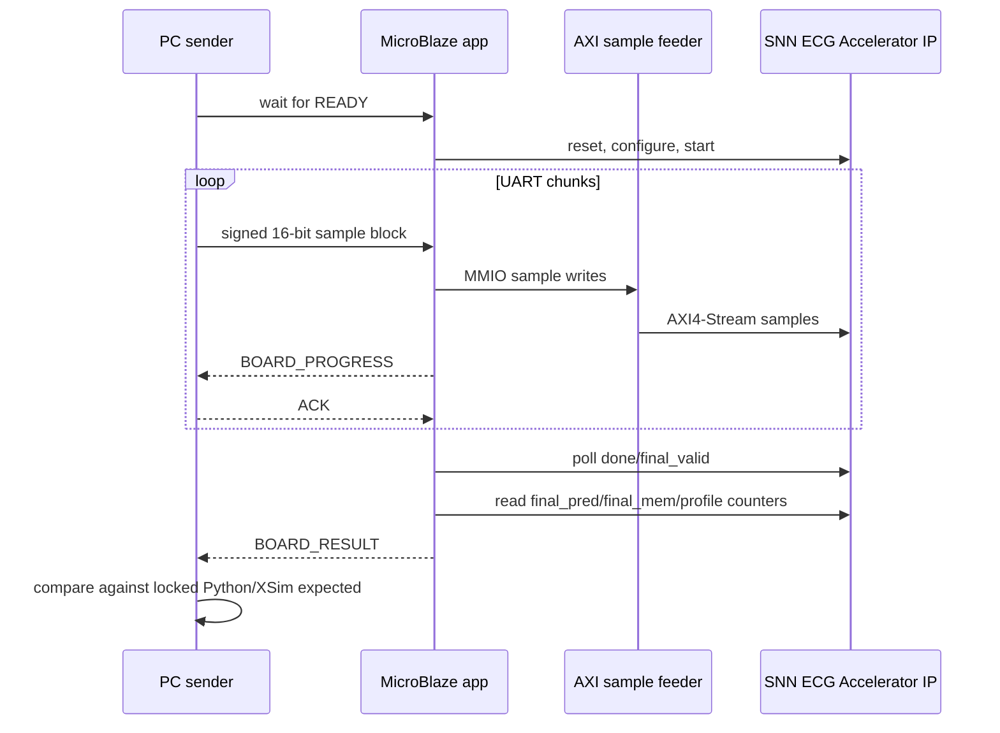

# Full-Record Board Replay Result

## 1. 현재 상태

최종 locked Final Membrane `structural_guarded_silent_aff_1008710` 기준으로 MicroBlaze full-record replay용 bitstream, XSA, ELF는 재생성했다. 그러나 새 locked bitstream을 실제 FPGA board에 program한 뒤 1,800,000-sample UART full-record replay를 다시 수행한 transcript는 아직 없다.

따라서 이 문서에서 locked 모델의 board replay는 **pending**으로 기록한다.

| 항목 | 상태 |
|---|---|
| Locked candidate | `structural_guarded_silent_aff_1008710` |
| Bitstream rebuilt | 완료 |
| XSA rebuilt | 완료 |
| MicroBlaze ELF rebuilt | 완료 |
| Actual locked UART replay | 미수행 |
| Locked transcript | 없음 |
| Locked expected-vs-board comparison | 없음 |
| Locked board PASS/FAIL | pending |

## 2. Rebuilt Artifacts

| 산출물 | 경로 |
|---|---|
| Full replay Vitis app source | `vitis_apps/full_record_replay/src/main.c` |
| PC UART sender | `tools/board_replay/send_full_record_uart.py` |
| Bitstream | `results/board_replay/microblaze_full_replay/snn_ecg_mb_full_replay.bit` |
| XSA | `results/board_replay/microblaze_full_replay/snn_ecg_mb_full_replay.xsa` |
| MicroBlaze ELF | `results/board_replay/microblaze_full_replay/snn_ecg_mb_full_replay_app.elf` |
| System summary | `results/board_replay/microblaze_full_replay/microblaze_full_replay_summary.json` |

## 3. Locked Build Metrics

| 항목 | 값 |
|---|---:|
| Total samples configured | 1,800,000 |
| Snapshots per chunk | 30 |
| UART baud | 230400 |
| LUT / slice_reg / BRAM / DSP | 12485 / 8480 / 16 / 3 |
| WNS / WHS | 0.294 ns / 0.055 ns |
| Timing constraints | Met |

## 4. Replay Flow

## 5. Legacy Transcript Boundary

The repo still contains the earlier `test_case0_nsr` board transcript and comparison:

- `reports/board_replay/transcripts/test_case0_nsr_uart_full_replay.txt`
- `reports/board_replay/comparisons/test_case0_nsr_expected_vs_board.csv`

That evidence is not deleted because it proves the board transport path was exercised before. It is not reported as the locked model result because the expected source was generated before the locked Final Membrane RTL integration.

## 6. 완료 조건

Locked board replay를 완료로 표시하려면 다음이 모두 필요하다.

| 조건 | 필요 결과 |
|---|---|
| samples_sent | expected sample count와 일치 |
| samples_accepted / consumed | expected sample count와 일치 |
| snapshot_count | 30 |
| done / final_valid | 1 / 1 |
| board_final_pred | locked Python/XSim expected와 일치 |
| board_final_mem | 가능하면 locked Python/XSim expected와 일치 |
| transcript | `reports/board_replay/transcripts/locked_model_full_record_replay.txt` |
| comparison | `reports/board_replay/comparisons/locked_model_expected_vs_board.csv` |

## 7. 남은 TODO

- USB-UART COM port 확인 후 새 locked bitstream으로 board program.
- Vitis/MicroBlaze app을 새 XSA 기준으로 실행.
- 대표 full-record 1건을 replay하고 transcript/comparison 저장.
- non-NSR locked board replay case 추가.
