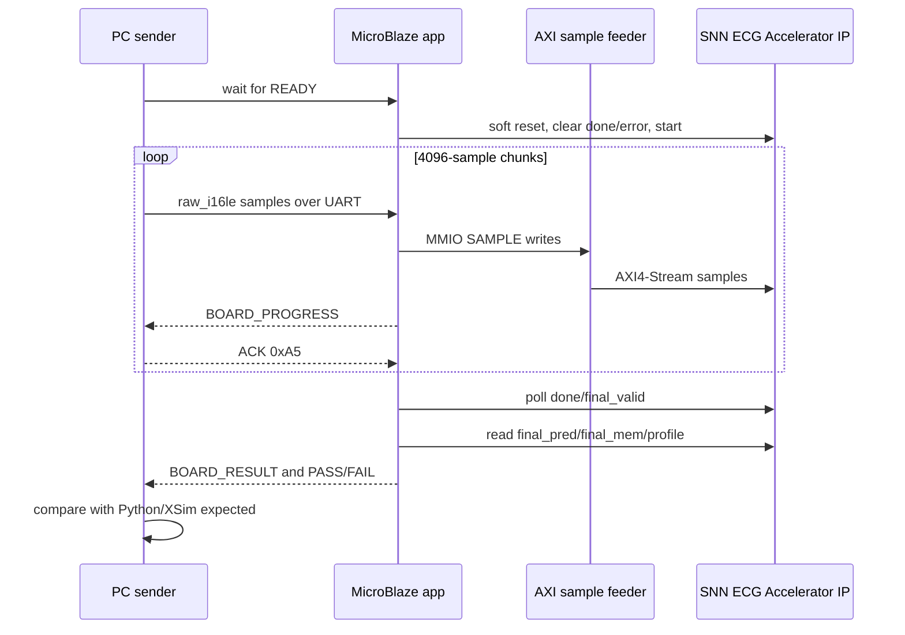

# Full-Record Board Replay Result

## 1. 목적

이 문서는 실제 FPGA board에서 수행한 Vitis/MicroBlaze 기반 30분 full-record ECG replay 결과를 transcript와 expected-vs-board comparison 기준으로 정리한다.

기존 16-sample smoke는 IP 연결과 register map 확인용이고, 이 문서의 full replay는 `1 kSPS x 30분 = 1,800,000 samples`를 실제 board에 입력한 결과이다.

## 2. 사용한 하드웨어/소프트웨어 산출물

| 항목 | 경로 |
|---|---|
| Full replay Vitis app source | `vitis_apps/full_record_replay/src/main.c` |
| PC UART sender | `tools/board_replay/send_full_record_uart.py` |
| Bitstream | `results/board_replay/microblaze_full_replay/snn_ecg_mb_full_replay.bit` |
| XSA | `results/board_replay/microblaze_full_replay/snn_ecg_mb_full_replay.xsa` |
| MicroBlaze ELF | `results/board_replay/microblaze_full_replay/snn_ecg_mb_full_replay_app.elf` |
| System summary | `results/board_replay/microblaze_full_replay/microblaze_full_replay_summary.json` |
| UART transcript | `reports/board_replay/transcripts/test_case0_nsr_uart_full_replay.txt` |
| Expected result snapshot | `reports/board_replay/comparisons/test_case0_nsr_expected_result.json` |
| Expected-vs-board CSV | `reports/board_replay/comparisons/test_case0_nsr_expected_vs_board.csv` |
| Human summary | `reports/board_replay/comparisons/test_case0_nsr_summary.md` |

## 3. Execution Flow



UARTLite는 230400 baud를 사용했다. 초기 단순 raw push 방식은 RX FIFO overrun 위험이 있어, 최종 flow는 4096-sample chunk ACK 방식으로 고정했다.

## 4. Input Case

| 항목 | 값 |
|---|---|
| case name | `test_case0_nsr` |
| split/class | test / NSR |
| input `.mem` | `fullrec_afe_30min_annotation_valid_balanced/test/NSR/16786/16786_30min_w035.mem` |
| samples | 1,800,000 |
| sample rate | 1 kSPS |
| duration | 30 min |
| expected source | `results/final_membrane_v2_snn/xsim_snn_ecg_v2_test_first10_predictions.csv` |

## 5. Board Result

| Metric | Expected | Board | Match |
|---|---:|---:|---:|
| samples_received | 1,800,000 | 1,800,000 | 1 |
| samples_sent_to_ip | 1,800,000 | 1,800,000 | 1 |
| samples_accepted | 1,800,000 | 1,800,000 | 1 |
| samples_consumed | 1,800,000 | 1,800,000 | 1 |
| snapshot_count | 30 | 30 | 1 |
| decision_count | 1 | 1 | 1 |
| final_valid | 1 | 1 | 1 |
| done | 1 | 1 | 1 |
| final_pred | 0 | 0 | 1 |
| final_mem_NSR | 31 | 31 | 1 |
| final_mem_CHF | 0 | 0 | 1 |
| final_mem_ARR | 1 | 1 | 1 |
| final_mem_AFF | 0 | 0 | 1 |
| feeder_tlast_count | 1 | 1 | 1 |
| snn_error | 0 | 0 | 1 |
| feeder_error | 0 | 0 | 1 |

PASS marker:

```text
SNN_ECG_FULL_REPLAY_BOARD_PASS
```

## 6. Board Log Excerpt

```text
SNN_ECG_FULL_REPLAY_READY total_samples=1800000
BOARD_PROGRESS samples_received=1800000 samples_sent_to_ip=1800000
BOARD_RESULT samples_received=1800000 samples_sent_to_ip=1800000
BOARD_RESULT samples_accepted=1800000 samples_consumed=1800000 snapshot_count=30 decision_count=1
BOARD_RESULT final_pred_reg=0x101 final_valid=1 done=1 final_pred=0
BOARD_RESULT final_mem_nsr=31 final_mem_chf=0 final_mem_arr=1 final_mem_aff=0
BOARD_RESULT feeder_write_count=1800000 feeder_tx_count=1800000 feeder_tlast_count=1
BOARD_RESULT status=0x1D06 snn_error=0x0 feeder_error=0x0
SNN_ECG_FULL_REPLAY_BOARD_PASS
```

## 7. 해석

이 결과는 다음을 증명한다.

- packaged accelerator IP와 sample feeder가 MicroBlaze system 안에서 실제 board 위에서 동작한다.
- 1,800,000-sample full record stream이 board에서 손실 없이 feeder/IP에 전달되었다.
- accelerator가 30개의 60초 snapshot을 처리하고 final decision을 생성했다.
- board final prediction과 final membrane이 Python/XSim expected와 exact match했다.

이 결과는 real-time throughput 측정이 아니다. UART 전송과 chunk ACK 대기 시간이 포함되므로 profile counter의 `input_wait`는 PC-board transport delay를 포함한다.

## 8. 남은 Board 확장 검증 TODO

test NSR case 0 한 건의 30분 full-record board replay는 완료되었다. 아래 항목은 같은 flow를 다른 class와 더 많은 case로 확장하기 위한 남은 검증이다.

- non-NSR full-record board replay 1건 추가.
- full test split board replay batch.
- AXI DMA/DDR 기반 faster replay로 throughput 측정.
- board-level current/power measurement.
