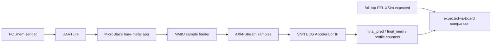

# Full-Record Board Replay with Vitis/MicroBlaze

## 1. 목적

이 문서는 signed 12-bit ECG `.mem` full record를 PC UART sender, MicroBlaze bare-metal app, AXI-Lite sample feeder, AXI4-Stream SNN ECG Accelerator IP로 replay한 board-level 검증 결과를 정리한다.

## 2. System Flow

## 3. Rebuilt Locked Artifacts

| 항목 | 경로 | 상태 |
|---|---|---|
| Locked bitstream | `results/board_replay/microblaze_full_replay/snn_ecg_mb_full_replay.bit` | rebuilt |
| Locked XSA | `results/board_replay/microblaze_full_replay/snn_ecg_mb_full_replay.xsa` | rebuilt |
| Locked ELF | `results/board_replay/microblaze_full_replay/snn_ecg_mb_full_replay_app.elf` | rebuilt |
| System summary | `results/board_replay/microblaze_full_replay/microblaze_full_replay_summary.json` | present |
| PC sender | `tools/board_replay/send_full_record_uart.py` | present |

## 4. Board Replay 결과

| 항목 | 결과 |
|---|---|
| Class-wise full-record replay | NSR / CHF / ARR / AFF 각 1건 |
| Samples per case | 1,800,000 |
| Snapshot count | 30 |
| Decision count | 1 |
| final_pred match vs full-top XSim | 4 / 4 |
| final_mem exact match vs full-top XSim | 2 / 4 |
| Board internal PASS marker | 4 / 4 |

세부 비교:

- `reports/final_submission/fulltop_xsim_locked_class_cases/locked_class_cases_xsim_vs_board_summary.md`
- `reports/board_replay/comparisons/locked_nsr_case117_summary.md`
- `reports/board_replay/comparisons/locked_chf_case91_summary.md`
- `reports/board_replay/comparisons/locked_arr_case45_summary.md`
- `reports/board_replay/comparisons/locked_aff_case16_summary.md`

## 5. 남은 검증 이슈

보드 경로는 UART/MMIO 때문에 샘플 사이에 긴 input gap이 발생한다. direct full-top XSim은 back-to-back sample stream을 사용한다. 현재 final class는 일치하지만 CHF/ARR final_mem exact vector가 달라졌으므로, 최종 engineering note로 다음을 남긴다.

- Direct XSim과 board replay의 input pacing이 다르다.
- ECG sample-indexed state는 `sample_valid/sample_fire` 기준으로만 변해야 한다.
- Gap-injection XSim으로 board-like stall을 재현해 final_mem divergence 원인을 확인해야 한다.
