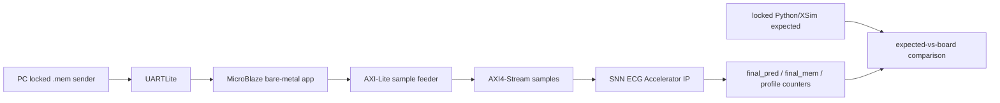

# Full-Record Board Replay with Vitis/MicroBlaze

## 1. 목적

이 문서는 AFE+ADC XMODEL 이후 생성된 signed 12-bit `.mem` full record를 MicroBlaze, AXI sample feeder, SNN ECG Accelerator IP로 replay하는 board-level flow를 정리한다.

현재 최종 locked 모델 기준 상태는 **build 완료 / 실제 locked UART replay pending**이다.

## 2. System Flow

## 3. Rebuilt Locked Artifacts

| 항목 | 경로 | 상태 |
|---|---|---|
| Locked bitstream | `results/board_replay/microblaze_full_replay/snn_ecg_mb_full_replay.bit` | rebuilt |
| Locked XSA | `results/board_replay/microblaze_full_replay/snn_ecg_mb_full_replay.xsa` | rebuilt |
| Locked ELF | `results/board_replay/microblaze_full_replay/snn_ecg_mb_full_replay_app.elf` | rebuilt |
| System summary | `results/board_replay/microblaze_full_replay/microblaze_full_replay_summary.json` | present |
| PC sender | `tools/board_replay/send_full_record_uart.py` | present |
| Vitis app source | `vitis_apps/full_record_replay/src/main.c` | present |

## 4. System Build Metrics

| 항목 | 값 |
|---|---:|
| total_samples | 1,800,000 |
| snapshots_per_chunk | 30 |
| UART baud | 230400 |
| LUT / slice_reg / BRAM / DSP | 12485 / 8480 / 16 / 3 |
| WNS / WHS | 0.294 ns / 0.055 ns |
| Timing constraints | Met |
| CDC/check_timing markers | Clean |

## 5. Locked Replay Status

| 항목 | 결과 |
|---|---|
| Actual locked UART full-record replay | Not executed in this run |
| Locked transcript | Not generated |
| Locked expected-vs-board CSV | Not generated |
| PASS/FAIL | Pending |

The earlier `test_case0_nsr` transcript is retained as pre-locked integration evidence only. It must not be reused as the locked model replay result.

## 6. Completion Checklist

1. Program `snn_ecg_mb_full_replay.bit` onto the board.
2. Boot/run `snn_ecg_mb_full_replay_app.elf`.
3. Send one full 1,800,000-sample locked expected case through `tools/board_replay/send_full_record_uart.py`.
4. Save the UART transcript under `reports/board_replay/transcripts/locked_model_full_record_replay.txt`.
5. Save expected-vs-board comparison under `reports/board_replay/comparisons/locked_model_expected_vs_board.csv`.
6. Record final_pred/final_mem/sample counters in `reports/board_replay/comparisons/locked_model_board_replay_summary.md`.
