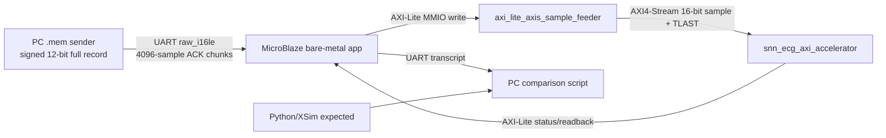

# Full-Record Board Replay with Vitis/MicroBlaze

## 1. 목표

이 문서는 AFE+ADC XMODEL 이후 생성된 signed 12-bit `.mem` full record를 실제 FPGA 보드 위의 SNN ECG Accelerator IP Core에 흘려 넣고, board register 결과가 Python/XSim expected와 일치하는지 확인하는 Vitis/MicroBlaze replay flow를 정리한다.

검증 대상은 아날로그 AFE PCB나 physical DAC가 아니다. 이미 생성된 digital `.mem`을 PC에서 UART로 보내고, MicroBlaze가 MMIO sample feeder에 써서 AXI-Stream 입력으로 accelerator에 전달하는 **board-level digital integration replay**이다.



## 2. Repo에서 확인한 하드웨어 구조

현재 repo에는 smoke용 MicroBlaze system과 별도로 full-record replay용 system build flow가 추가되어 있다.

| 항목 | 확인된 값 |
|---|---|
| FPGA board target | Nexys A7 / `xc7a100tcsg324-1` |
| Accelerator IP | `user.org:user:snn_ecg_axi_accelerator:1.0` |
| Feeder IP | `user.org:user:axi_lite_axis_sample_feeder:1.0` |
| Full replay samples | `60000 * 30 = 1,800,000` |
| UARTLite baud | `230400` |
| Vitis app | `vitis_apps/full_record_replay/src/main.c` |
| Sender script | `tools/board_replay/send_full_record_uart.py` |
| Bitstream | `results/board_replay/microblaze_full_replay/snn_ecg_mb_full_replay.bit` |
| XSA | `results/board_replay/microblaze_full_replay/snn_ecg_mb_full_replay.xsa` |
| ELF | `results/board_replay/microblaze_full_replay/snn_ecg_mb_full_replay_app.elf` |

full replay system build summary:

| 항목 | 값 |
|---|---:|
| LUT / FF / BRAM / DSP | 12638 / 8745 / 16 / 3 |
| WNS / WHS | 0.192 ns / 0.026 ns |
| Timing constraints | Met |
| CDC clean marker | True |

BRAM/DSP는 accelerator core가 아니라 MicroBlaze/LMB/UART/interrupt/system infrastructure가 포함된 system-level resource이다.

## 3. Register map

MicroBlaze address map은 full replay system과 smoke system에서 동일하게 유지했다.

| Block | Base address | 역할 |
|---|---:|---|
| SNN ECG Accelerator | `0x44A00000` | control/status/final/profile register |
| Sample feeder | `0x44A10000` | MMIO sample write to AXI-Stream |
| AXI UARTLite | `0x40600000` | PC-MicroBlaze UART |
| AXI INTC | `0x41200000` | accelerator done IRQ 확인 |

Accelerator register:

| Offset | 이름 | 의미 |
|---:|---|---|
| `0x000` | `CONTROL` | bit0 start, bit1 soft reset, bit2 clear done, bit3 profile snapshot, bit4 clear errors |
| `0x004` | `STATUS` | busy/done/result_valid/sample_ready/fifo/snapshot index/final pred 상태 |
| `0x008` | `ERROR_STATUS` | start-while-busy, TLAST mismatch 등 sticky error |
| `0x00c` | `CONFIG` | wrapper magic/config/profile/TLAST/input width |
| `0x010` | `TOTAL_SAMPLES` | full replay에서는 `1,800,000` |
| `0x014` | `SAMPLES_ACCEPTED` | AXI-Stream accepted sample count |
| `0x018` | `SAMPLES_CONSUMED` | core consumed sample count |
| `0x020`..`0x02c` | `FINAL_MEM_*` | NSR/CHF/ARR/AFF final membrane |
| `0x030` | `FINAL_PRED` | bit0 final_valid, bit[2:1] final_pred, bit8 done |
| `0x100`..`0x134` | `PROFILE_*` | total/busy/run/input_wait/accepted/windows/decisions counter high/low |

Sample feeder register:

| Offset | 이름 | 의미 |
|---:|---|---|
| `0x00` | `CONTROL` | bit0 soft reset, bit1 clear errors, bit2 clear counters |
| `0x04` | `STATUS` | not_full/empty/full/stream valid/ready/error/fifo count |
| `0x08` | `ERROR_STATUS` | overflow/invalid access |
| `0x0c` | `CONFIG` | feeder magic/data width/FIFO depth |
| `0x10` | `SAMPLE` | bit[15:0] sample, bit16 TLAST |
| `0x14` | `WRITE_COUNT` | CPU가 feeder에 쓴 sample count |
| `0x18` | `TX_COUNT` | AXI-Stream으로 나간 sample count |
| `0x1c` | `TLAST_COUNT` | AXI-Stream에서 관측된 TLAST count |

## 4. Replay protocol

초기 단순 UART stream은 full record 전송 중 RX FIFO overrun 위험이 있었다. 따라서 최종 flow는 chunk ACK 방식으로 고정했다.

1. MicroBlaze app이 accelerator/feeder를 reset하고 `TOTAL_SAMPLES`를 읽는다.
2. app이 `SNN_ECG_FULL_REPLAY_READY total_samples=1800000`을 UART로 출력한다.
3. PC sender가 signed 12-bit `.mem`을 little-endian signed 16-bit stream으로 변환한다.
4. PC는 4096 samples 단위로 전송한다.
5. MicroBlaze는 4096 samples를 feeder에 쓴 뒤 `BOARD_PROGRESS samples_received=...`를 출력하고, PC의 `0xA5` ACK를 기다린다.
6. 마지막 sample에는 feeder `SAMPLE` register bit16 TLAST를 함께 쓴다.
7. accelerator done/final_valid 이후 final register와 profile counter를 UART로 출력한다.
8. PC sender가 transcript를 저장하고 Python/XSim expected와 CSV로 비교한다.

이 방식은 UART를 통한 board integration evidence를 만들기 위한 것이다. UART 전송 시간이 profile counter의 `input_wait`에 포함되므로, 이 결과를 real-time throughput 측정으로 해석하면 안 된다.

## 5. 실행 명령어

full replay system과 app 빌드:

```powershell
python scripts\build_microblaze_full_replay_system.py --skip-package
python scripts\build_microblaze_full_replay_app.py
```

expected 확인 dry-run:

```powershell
python tools\board_replay\send_full_record_uart.py `
  --mem fullrec_afe_30min_annotation_valid_balanced\test\NSR\16786\16786_30min_w035.mem `
  --case-id 0 `
  --case-name test_case0_nsr `
  --dry-run
```

실제 board replay:

```powershell
python tools\board_replay\send_full_record_uart.py `
  --program `
  --uart COM8 `
  --mem fullrec_afe_30min_annotation_valid_balanced\test\NSR\16786\16786_30min_w035.mem `
  --case-id 0 `
  --case-name test_case0_nsr `
  --ready-timeout 90 `
  --ack-timeout 60 `
  --done-timeout 600
```

`--program`은 `snn_ecg_mb_full_replay.bit`을 FPGA에 올리고 `snn_ecg_mb_full_replay_app.elf`를 MicroBlaze에 다운로드한 뒤 실행한다.

## 6. 실제 board replay 결과

실제 보드에서 test split NSR case 0 full record를 replay했다.

| 항목 | 값 |
|---|---|
| Input `.mem` | `fullrec_afe_30min_annotation_valid_balanced/test/NSR/16786/16786_30min_w035.mem` |
| Samples sent | `1,800,000` |
| Expected source | `results/final_membrane_v2_snn/xsim_snn_ecg_v2_test_first10_predictions.csv` |
| UART transcript | `reports/board_replay/transcripts/test_case0_nsr_uart_full_replay.txt` |
| Expected-vs-board CSV | `reports/board_replay/comparisons/test_case0_nsr_expected_vs_board.csv` |
| Summary | `reports/board_replay/comparisons/test_case0_nsr_summary.md` |
| Board marker | `SNN_ECG_FULL_REPLAY_BOARD_PASS` |
| Expected-vs-board | PASS |

핵심 비교 결과:

| Metric | Expected | Board | Match |
|---|---:|---:|---:|
| samples_received | 1,800,000 | 1,800,000 | 1 |
| samples_sent_to_ip | 1,800,000 | 1,800,000 | 1 |
| samples_accepted | 1,800,000 | 1,800,000 | 1 |
| samples_consumed | 1,800,000 | 1,800,000 | 1 |
| snapshot_count | 30 | 30 | 1 |
| decision_count | 1 | 1 | 1 |
| final_valid | 1 | 1 | 1 |
| done | 1 | 1 | 1 |
| final_pred | 0 | 0 | 1 |
| final_mem_NSR | 31 | 31 | 1 |
| final_mem_CHF | 0 | 0 | 1 |
| final_mem_ARR | 1 | 1 | 1 |
| final_mem_AFF | 0 | 0 | 1 |
| feeder_tlast_count | 1 | 1 | 1 |
| snn_error | 0 | 0 | 1 |
| feeder_error | 0 | 0 | 1 |

Board transcript의 profile counter는 UART replay 동안 accelerator가 input을 기다린 시간을 포함한다.

| Counter | Board raw |
|---|---:|
| profile_total | `(hi=4, lo=1916506856)` = 19,096,376,040 cycles |
| profile_run | `(hi=4, lo=1916505536)` = 19,096,374,720 cycles |
| profile_input_wait | `(hi=4, lo=1914705536)` = 19,094,574,720 cycles |
| profile_accepted | 1,800,000 |
| profile_windows | 30 |
| profile_decisions | 1 |

## 7. 성공 기준

full-record board replay를 완료로 인정하는 조건은 다음과 같다.

| 조건 | 현재 결과 |
|---|---|
| `samples_sent == 1,800,000` | PASS |
| `samples_accepted == 1,800,000` | PASS |
| `samples_consumed == 1,800,000` | PASS |
| `snapshot_count == 30` | PASS |
| `decision_count == 1` | PASS |
| `done == 1` and `final_valid == 1` | PASS |
| `board_final_pred == expected_final_pred` | PASS |
| `board_final_mem == expected_final_mem` | PASS |
| `snn_error == 0` and `feeder_error == 0` | PASS |
| UART transcript preserved | PASS |

## 8. 한계와 다음 단계

현재 full-record board replay는 **test NSR case 0 한 건**에 대해 완료되었다. 따라서 “board에서 30분 full record 1건을 끝까지 흘려 넣고 Python/XSim expected와 exact match를 확인했다”는 주장은 가능하지만, 전체 test split의 board replay가 끝났다고 말하면 안 된다.

남은 보완:

- test/val/train 여러 class에 대한 board replay batch 자동화
- non-NSR full board replay case 추가
- UART보다 빠른 AXI DMA/DDR 기반 replay
- board-level power/current 측정
- physical AFE/ADC PCB 또는 DAC-loop 검증

특히 이 flow는 digital `.mem` replay이다. AFE+ADC XMODEL 출력이 RTL 입력으로 들어가는 통합 검증이지, 물리 전극/AFE/ADC silicon 검증은 아니다.
