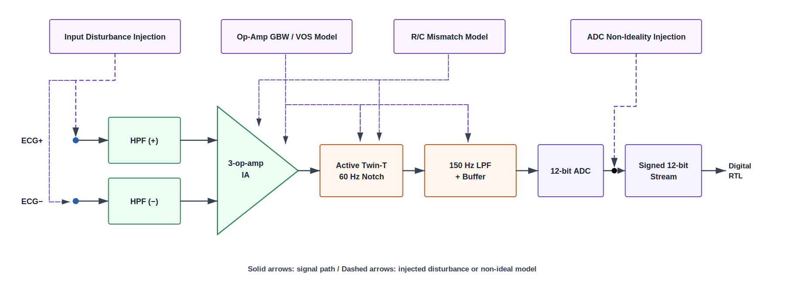
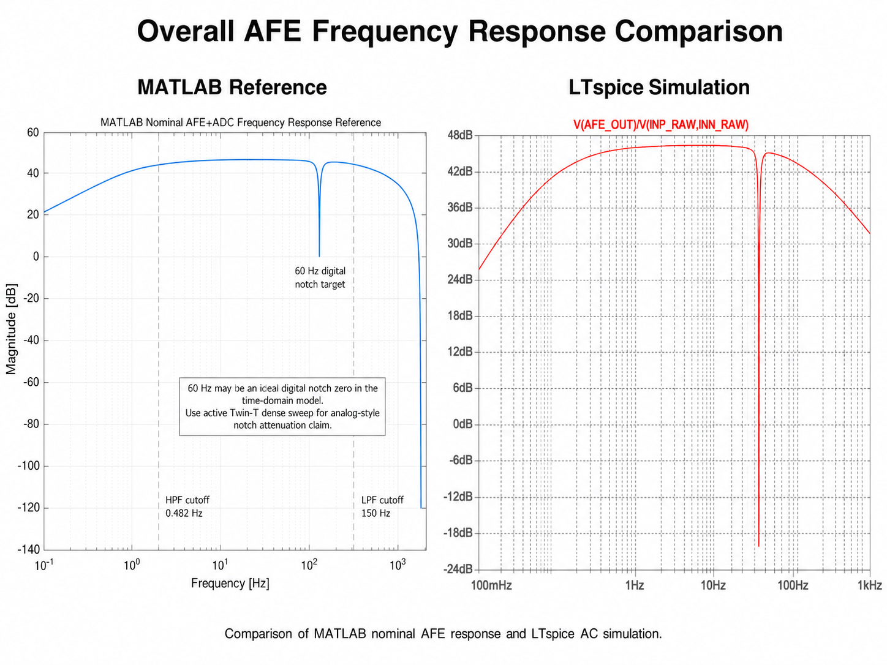
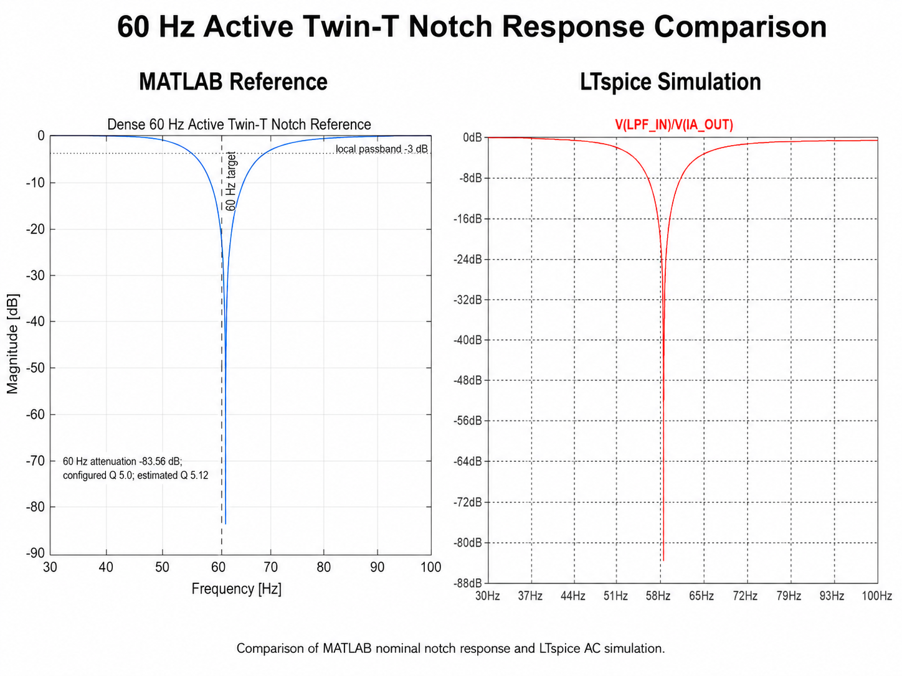
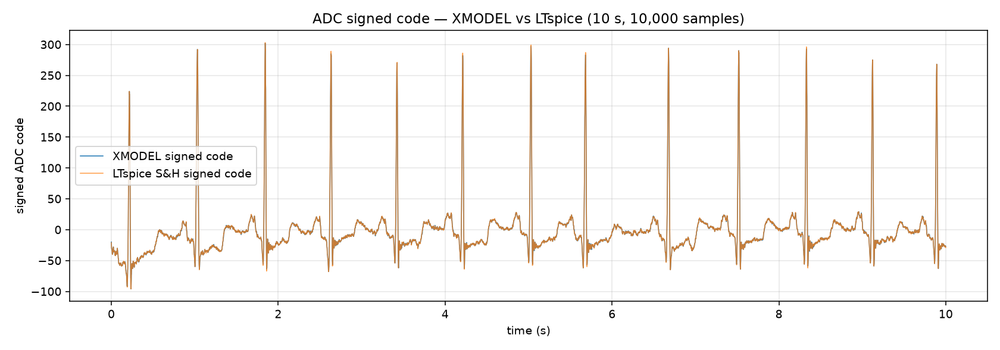
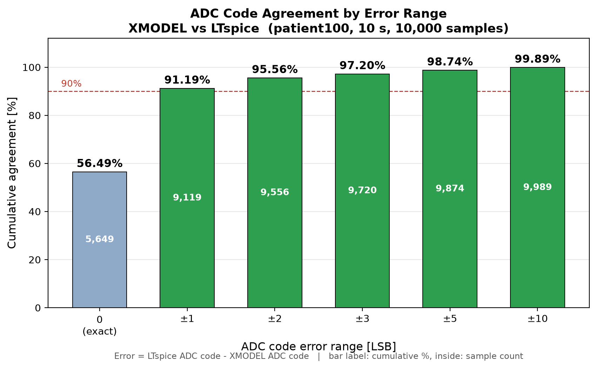

# MATLAB–LTspice–XMODEL 아날로그 검증

## 1. 검증 목적과 역할 분리

본 검증은 하나의 시뮬레이터 결과를 반복 제시하는 것이 아니라, 같은 AFE+ADC를 세 단계에서 서로 다른 질문으로 확인한다.

| 단계 | 핵심 질문 | 직접 산출물 |
|---|---|---|
| MATLAB 사전설계 | 목표 HPF·IA·notch·LPF·ADC 응답이 수학적으로 적절한가? | 공칭 전달함수, cutoff/gain/notch 기준, ADC reference vector |
| LTspice 회로 구현·검증 | 실제 R/C, op-amp, 전원, S/H와 ADC mapping으로 구현해도 목표 응답을 얻는가? | graphical `.asc`, generated `.net`, AC/transient/S&H/ADC/stress 결과 |
| SystemVerilog XMODEL | LTspice로 확인한 회로 계약을 RTL과 함께 실행 가능한 행동모델로 재현하는가? | XMODEL primitive 기반 `.sv`, stress variant, 1 kSPS signed 12-bit stream |

따라서 아날로그 검증의 추적 순서는 다음과 같다.

> **MATLAB 설계 기준 → LTspice 실제 schematic 검증 → SystemVerilog XMODEL 구현 → signed 12-bit RTL 인계**

차동 ECG는 HPF, 3-op-amp instrumentation amplifier, 60 Hz active Twin-T notch, 150 Hz LPF와 buffer, 12-bit ADC를 통과한다. R/C mismatch, op-amp GBW/VOS와 ADC non-ideality는 nominal 신호 경로와 분리해 주입한다.

## 2. MATLAB 사전설계

MATLAB은 실제 부품의 전기적 구현을 주장하지 않는다. HPF cutoff, IA gain, 60 Hz 제거, LPF bandwidth와 ADC 범위를 빠르게 탐색하고, LTspice와 XMODEL이 따라야 할 nominal reference를 고정한다.

| 설계 항목 | 공통 기준 |
|---|---:|
| Differential HPF | 약 0.482 Hz |
| Instrumentation amplifier | 약 201 V/V |
| Power-line rejection | 60 Hz active Twin-T notch |
| Anti-alias LPF | 약 150 Hz |
| ADC | 12-bit, ±1.65 V, 1 kSPS |

전체 응답에서 MATLAB과 LTspice는 약 46 dB의 통과대역 이득, 저주파 HPF roll-off, 60 Hz notch와 150 Hz 이후 LPF roll-off를 같은 위치에서 재현한다.

고정 MATLAB reference와 XMODEL-aligned LTspice의 1초 이후 index-aligned ADC 비교는 MAE 0.678 LSB, RMS 2.225 LSB, correlation 0.998591이었다. MATLAB digital-filter reference와 LTspice analog Twin-T는 구현 방식이 다르므로 bit-exact 대상이 아니라 설계 의도와 파형의 거시적 일치 확인에 사용한다.

## 3. LTspice schematic 구현과 회로 수준 검증

MATLAB에서 정한 사양을 [`FULL_AFE_ADC_SH_xmodel_aligned.asc`](../validation/afe_ltspice_xmodel_aligned/schematics/xmodel_aligned/FULL_AFE_ADC_SH_xmodel_aligned.asc)로 구현하였다. 기존 ±5 V 후보 회로는 pre-alignment 근거로 분리하고, 정본은 XMODEL 계약에 맞춰 ±1.65 V 전원, 전용 op-amp abstraction, `ECG+=patient100`, `ECG−=0 V`, 1 kSPS ADC aperture와 S/H를 사용한다.

### 3.1 공칭 AC·transient 결과

| 항목 | 목표 | LTspice 측정 | 해석 |
|---|---:|---:|---|
| HPF −3 dB | 0.4823 Hz | 0.481174 Hz | −0.2335% |
| IA gain at 10 Hz | 201 V/V | 200.594 V/V | −0.2021% |
| Notch at 60 Hz | 60 Hz rejection | −83.557 dB | 전원선 주파수 억제 |
| Notch minimum | 60 Hz | 59.9995 Hz, −95.435 dB | 중심주파수 정합 |
| LPF −3 dB | 150.15 Hz | 150.211 Hz | +0.0406% |
| Settled AFE output | ±1.65 V 이내 | −0.0540~+0.2466 V | clipping 없음 |
| ADC rail headroom | clipping 없음 | 1.403 V | nominal headroom 확보 |
| S/H hold droop | 최소화 | 최대 0.0276 LSB | ADC code 영향이 작음 |

LTspice 26.0.1에서 graphical run, AC/fine-notch, ADC mapping, timestep convergence, DC/baseline, 50/60 Hz PLI, R/C mismatch, GBW와 VOS를 포함한 35개 run을 실행했다. 모든 run은 `EXECUTED`이며 fatal/warning signature는 0건이다. 실행 목록은 [`xmodel_aligned_execution_manifest.csv`](../validation/afe_ltspice_xmodel_aligned/tables/xmodel_aligned_execution_manifest.csv), 결과는 [`xmodel_aligned_stress_results.csv`](../validation/afe_ltspice_xmodel_aligned/tables/xmodel_aligned_stress_results.csv)에 보존한다.

### 3.2 ADC mapping과 sample-and-hold

ADC는 ±1.65 V를 0~4095로 제한·양자화한 뒤 signed code `code−2048`로 전달한다. −1.65 V, 0 V, +0.5 LSB, +1.65 V와 범위 밖 입력에서 endpoint saturation, signed mapping과 monotonicity를 확인했다. 10초 nominal run은 direct aperture와 LTspice S/H stream 모두 10,000 sample을 생성했고 clipping은 0건이었다.

## 4. SystemVerilog XMODEL 구현

LTspice에서 확인한 토폴로지와 파라미터를 XMODEL solver primitive 기반 SystemVerilog로 작성하였다.

- [`ecg_afe_xmodel.sv`](../validation/afe_ltspice_xmodel_aligned/reference/xmodel_fixed_4756a50_subset/analog/ecg_afe_xmodel.sv): nominal HPF/IA/active Twin-T/LPF/buffer/ADC chain
- [`ecg_afe_xmodel_op.sv`](../validation/afe_ltspice_xmodel_aligned/reference/xmodel_fixed_4756a50_subset/analog/ecg_afe_xmodel_op.sv): finite GBW와 input offset variant
- [`ecg_afe_xmodel_mm.sv`](../validation/afe_ltspice_xmodel_aligned/reference/xmodel_fixed_4756a50_subset/analog/ecg_afe_xmodel_mm.sv): R/C mismatch variant

`xreal`, `resistor`, `capacitor`, `vcvs`, `vlimit` primitive로 회로망을 구성하고 `negedge clk_samp`에서 12-bit ADC를 갱신한다. XMODEL은 LTspice나 물리 측정을 대체하는 모델이 아니라, 회로 수준에서 확인한 동작을 mixed-signal/RTL simulation으로 전달하는 실행 가능한 행동모델이다.

## 5. LTspice–XMODEL 10초 ADC 상관 검증

동일한 `patient100` ECG 10초 입력, ±1.65 V ADC 범위, 1 kSPS sampling과 signed 12-bit mapping으로 10,000개 code를 비교했다. 공식 비교에는 LTspice sample-and-hold 출력을 사용한다.

두 파형은 zero-lag에서 중첩되며, 잔여 차이는 급격한 QRS edge의 sub-sample solver timing 부근에 집중된다.

### 5.1 정량 결과

| Metric | Full 10 s | Settled 1~10 s |
|---|---:|---:|
| Compared samples | 10,000 | 9,001 |
| Mean error | +0.0221 LSB | +0.0270 LSB |
| MAE | 0.6445 LSB | 0.6549 LSB |
| RMS error | 1.3020 LSB | 1.3243 LSB |
| Maximum absolute error | 13 LSB | 13 LSB |
| Zero-lag correlation | 0.999518 | 0.999502 |
| Best lag | 0 sample | 0 sample |
| Bit-exact ratio | 56.49% | 56.23% |
| Clipping | 0 | 0 |

12-bit ±1.65 V ADC에서 1 LSB는 약 0.806 mV다. 따라서 5 LSB와 10 LSB는 ADC 입력 기준 약 4.03 mV와 8.06 mV이며, IA gain 201을 역산하면 ECG 입력 기준 약 20 µV와 40 µV에 해당한다.

### 5.2 판정 기준

서로 다른 analog solver의 출력은 모든 표본의 bit-exact 여부보다 code-error coverage로 평가한다. ±5 LSB를 nominal agreement band, ±10 LSB를 extended QRS-edge band로 사용하였다.

| Error band | Samples inside band | Coverage |
|---|---:|---:|
| 0 LSB, exact | 5,649 | 56.49% |
| ±1 LSB | 9,119 | 91.19% |
| ±2 LSB | 9,556 | 95.56% |
| ±3 LSB | 9,720 | 97.20% |
| ±5 LSB | 9,874 | 98.74% |
| ±10 LSB | 9,989 | 99.89% |

10,000개 중 11개만 ±10 LSB를 초과했고 최대 오차는 13 LSB였다. MAE가 1 LSB보다 작고, lag 0, correlation 0.999518, clipping 0이므로 XMODEL은 LTspice의 nominal AFE+ADC 동작을 RTL integration에 사용할 수 있는 수준으로 재현한다. 다만 이 결과를 sample-wise bit-exact라고 표현하지 않는다.

기존 emulator↔XMODEL 36×60초 검증의 평균 RMS 1.95 LSB, 최대 30 LSB 결과와 본 10초 LTspice↔XMODEL 결과는 비교 대상과 입력 길이가 다르다. 전자는 장시간 XMODEL 구현 검증, 후자는 실제 LTspice schematic과 XMODEL 사이의 회로 계약 검증이며 서로 대체하거나 하나의 수치로 합치지 않는다.

## 6. Digital handoff와 결론

XMODEL ADC 출력은 signed 12-bit, 1 kSPS stream으로 디지털 accelerator에 전달된다. MATLAB은 사전설계, LTspice는 실제 schematic 검증, XMODEL은 SystemVerilog mixed-signal 실행과 RTL handoff를 담당한다.

> MATLAB에서 고정한 AFE+ADC 사양을 LTspice의 ±1.65 V schematic으로 구현하여 nominal, sample-and-hold, ADC mapping과 비이상 조건을 검증하였다. 검증된 회로 계약을 SystemVerilog XMODEL로 구현하고 동일한 10초 ECG 10,000 sample을 비교한 결과, 98.74%가 ±5 LSB, 99.89%가 ±10 LSB 이내였으며 MAE 0.6445 LSB, zero-lag correlation 0.999518, clipping 0을 얻었다.

## 7. 범위와 한계

- Source ECG는 실제 전극에서 이번 설계가 직접 계측한 신호가 아니라 공개 digitized record다.
- LTspice와 XMODEL은 schematic/behavioral model-based verification이며 physical PCB, ADC silicon, transistor-level 또는 post-layout 측정이 아니다.
- MATLAB digital reference와 analog Twin-T, LTspice solver와 XMODEL solver 사이를 bit-exact라고 주장하지 않는다.
- 10초 `patient100` 상관은 대표 nominal case다. 장시간 분류 성능은 별도의 locked RTL/XSim/Vivado/FPGA evidence로 평가한다.

재현 패키지의 시작점은 [`validation/afe_ltspice_xmodel_aligned/README.md`](../validation/afe_ltspice_xmodel_aligned/README.md)이며, 팀 제공 Figure의 원본명과 SHA-256은 [`figures/FIGURE_INDEX.md`](../figures/FIGURE_INDEX.md)에 기록한다.
