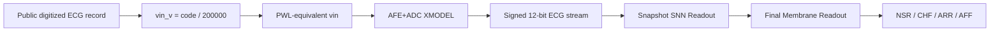

# System Architecture

## 전체 구조

## AFE+ADC XMODEL 입력 생성

공개 ECG record는 이미 digitized data이므로 원래 analog ECG를 복원하는 것이 아니다. 본 프로젝트는 digitized code를 analog-equivalent `vin`으로 재해석하고, virtual DAC/PWL-equivalent waveform으로 AFE+ADC XMODEL에 입력한다.

| Stage | 설명 |
|---|---|
| `code / 200000` | signed code를 voltage-equivalent input으로 변환 |
| HPF | baseline drift 억제 |
| IA gain x201 | ECG amplitude scaling |
| 60 Hz notch | power-line component suppression |
| LPF 150 Hz | 고주파 noise 제한 |
| 12-bit ADC | RTL 입력 signed 12-bit stream 생성 |

## Digital Accelerator

Digital datapath는 dense MAC 기반 neural network가 아니라 ECG domain evidence를 spike/event로 압축하는 구조이다.

| Block | 역할 |
|---|---|
| Input normalizer/event encoder | sample stream에서 event evidence 생성 |
| QRS/rhythm/morphology evidence | ECG-specific feature spike와 counter 생성 |
| Snapshot Readout | 60초 단위 class/evidence membrane 생성 |
| Final Membrane Readout | 30개 snapshot evidence 누적 |
| WTA | NSR/CHF/ARR/AFF 최종 class 결정 |

## Snapshot Feature Datapath 상세

Snapshot Readout은 60초 ECG window를 바로 하나의 software feature vector로 만들지 않는다. 먼저 sample-level event를 만들고, beat-level rhythm/morphology evidence로 압축한 뒤, class score membrane에 signed weight로 누적한다. 그래서 각 feature는 “분류기 입력 변수”라기보다 작은 event neuron 또는 evidence counter에 가깝다.

| Feature block | RTL module | 직관적 의미 | downstream 의미 |
|---|---|---|---|
| Adaptive event encoder | `rtl/core/ecg_event_encoder_adaptive.v` | 현재 sample과 이전 sample의 차이 `delta`를 보고 갑자기 크게 움직인 순간을 `strong_event`로 만든다. | QRS 후보 activity의 원천 event가 된다. |
| QRS LIF detector | `rtl/core/qrs_lif_detector.v` | `strong_event`가 연속해서 들어오면 membrane이 threshold를 넘고 `beat_spike`를 낸다. 단발성 noise는 leak/refractory로 억제된다. | 모든 RR interval, rhythm, morphology window의 기준 clock이 된다. |
| PNN rhythm predictor | `rtl/core/pnn_rhythm_predictor.v` | 직전 rhythm hypothesis가 예측한 위치에 다음 beat가 들어왔는지 본다. | match는 규칙적 rhythm evidence, mismatch 반복은 ARR/AFF 계열 irregular evidence로 쓰인다. |
| RDM variability neuron | `rtl/core/rdm_variability_neuron.v` | 이번 RR interval과 직전 RR interval의 변화량을 level/code로 만든다. | beat-to-beat variability가 큰 구간을 final evidence로 누적한다. |
| DSCR spike counter | `rtl/core/dscr_spike_counter.v` | waveform slope의 유효 변화와 sign flip을 센다. | beat morphology가 단순한지, 복잡한지 판단하는 보조 evidence가 된다. |
| RAM peak accumulator | `rtl/core/ram_peak_accumulator.v` | beat 주변 R-peak amplitude가 threshold bank를 얼마나 통과하는지 본다. | divider 없이 amplitude response를 integer code/count로 class membrane에 전달한다. |
| Ectopic pair neuron | `rtl/core/ectopic_pair_neuron.v` | reference RR보다 빠른 beat와 늦은 beat가 교대로 나타나는 early/late pair를 본다. | 단일 short RR이 아니라 ectopic-like pair pattern을 ARR evidence로 제공한다. |
| QRS MAF neuron | `rtl/core/qrs_maf_neuron.v` | QRS 폭, slope flip 복잡도, energy deviation, pre-QRS bump를 beat window 안에서 본다. | rhythm만으로 구분하기 어려운 morphology abnormality를 보완한다. |
| RBBB QRS delay bank | `rtl/core/rbbb_qrs_delay_bank.v` | QRS가 넓게 지속되고 terminal activity가 남는지 보는 conduction-delay proxy이다. | 반복되는 wide/terminal QRS evidence를 snapshot class score에 전달한다. |
| Class score neurons | `rtl/core/class_score_neurons.v` | feature spike/count를 fixed signed weight로 NSR/CHF/ARR/AFF membrane에 더하거나 뺀다. | 60초 segment end에서 WTA로 snapshot class를 출력한다. |

이 구조의 핵심은 floating-point classifier를 RTL에 복사하지 않았다는 점이다. Feature별 coefficient와 bias는 integer signed weight와 folded bias로 흡수되어 있고, RTL은 comparator, counter, add/sub accumulator, WTA로 동작한다. 따라서 feature 설명은 “어떤 병리명을 직접 진단한다”가 아니라 “어떤 rhythm 또는 morphology evidence를 만든다”로 해석해야 한다.

## Final Membrane Evidence 누적

Final Membrane Readout은 60초 snapshot WTA만 세는 단순 투표기로 끝나지 않는다. Snapshot class spike와 함께 rhythm/morphology evidence counters도 30분 동안 누적한다.

| Final evidence | 입력 의미 | 최종 readout에서의 역할 |
|---|---|---|
| Snapshot class count | 60초마다 나온 NSR/CHF/ARR/AFF local WTA 결과 | 기본 majority-style membrane을 만든다. |
| Rhythm irregularity | PNN mismatch와 RDM variability 계열 evidence | ARR/AFF처럼 불규칙성이 반복되는 class를 보조한다. |
| Morphology evidence | DSCR, QRS MAF, RBBB-like delay 계열 evidence | rhythm만으로 약한 case에서 CHF/ARR/AFF 쪽 구조적 evidence를 제공한다. |
| Ectopic pair count | early/late pair 반복 | ARR-like rhythm pattern을 보조한다. |
| Silent AFF guard | snapshot class spike가 강하지 않아도 low-morphology/low-ectopic 조건이 맞는 AFF-like pattern | locked candidate `structural_guarded_silent_aff_1008710`의 final guard/rescue 조건 중 하나로 쓰인다. |

즉 Final Membrane은 “30개 snapshot 중 가장 많이 나온 class”만 보는 구조가 아니라, snapshot WTA에서 1등으로 드러나지 않은 evidence도 class membrane에 흥분성 또는 억제성 update로 반영한다. 이 점이 본 프로젝트를 단순 majority vote가 아니라 SNN-inspired final membrane readout으로 설명할 수 있는 핵심이다.

## Accelerator IP 관점

본 IP는 ECG stream 처리와 long-window class membrane accumulation을 전용 RTL datapath로 고정한다. AXI4-Lite control/status, AXI4-Stream sample input, IP-XACT packaging, MicroBlaze board replay flow를 갖기 때문에 reusable accelerator IP core로 볼 수 있다.
