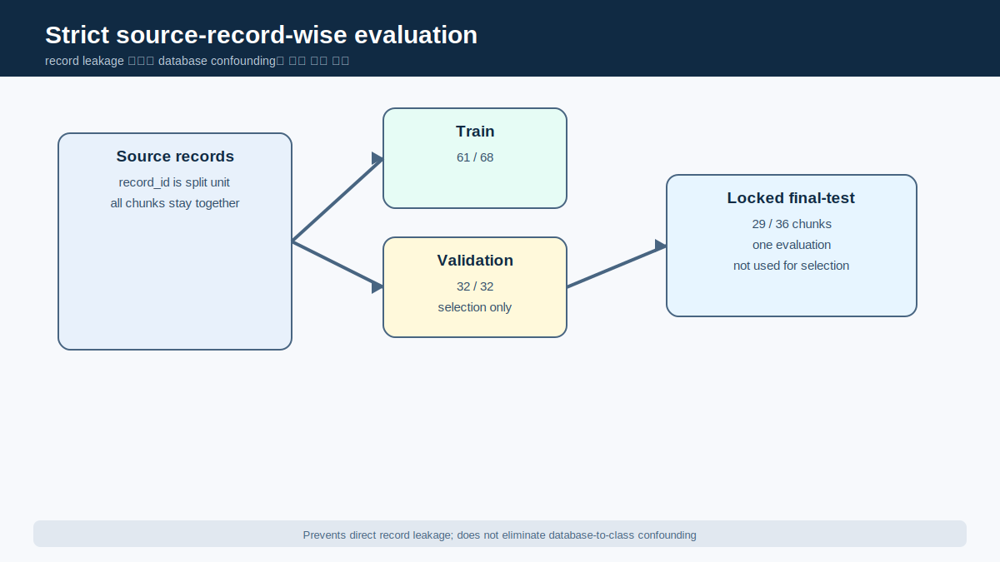
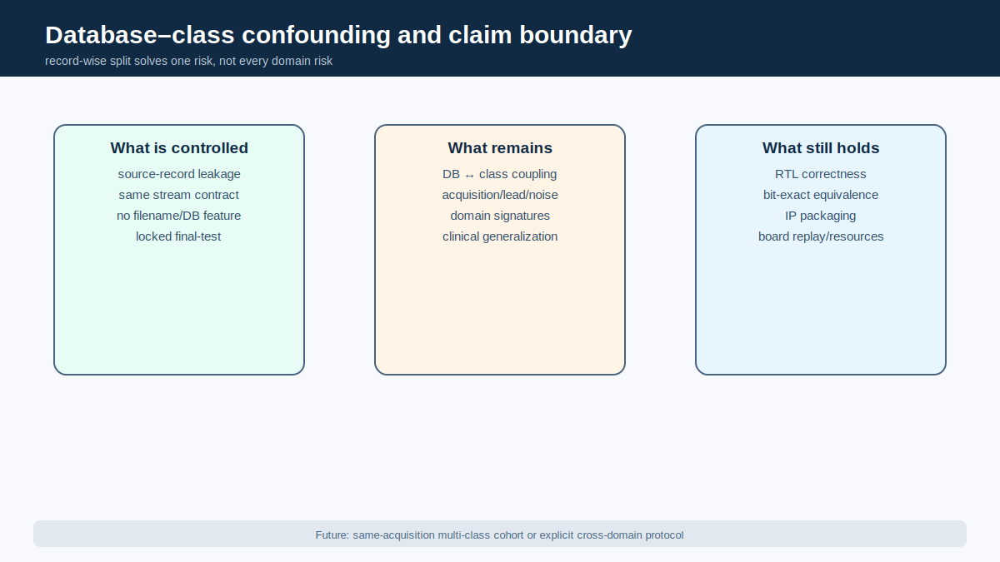
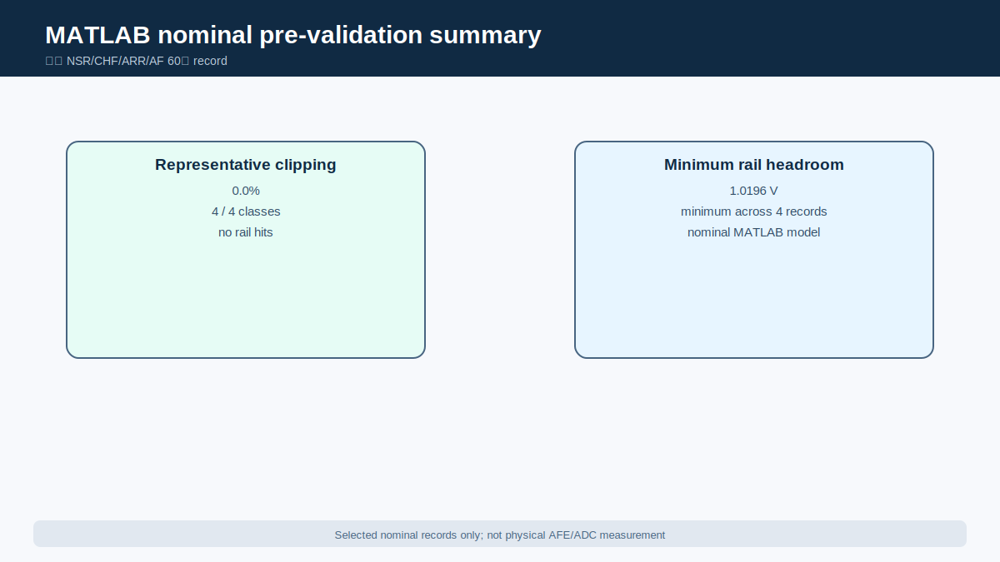
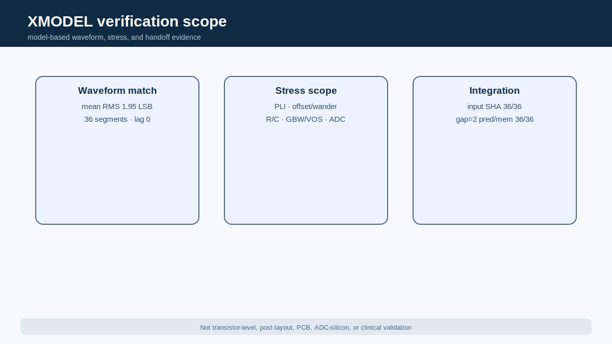
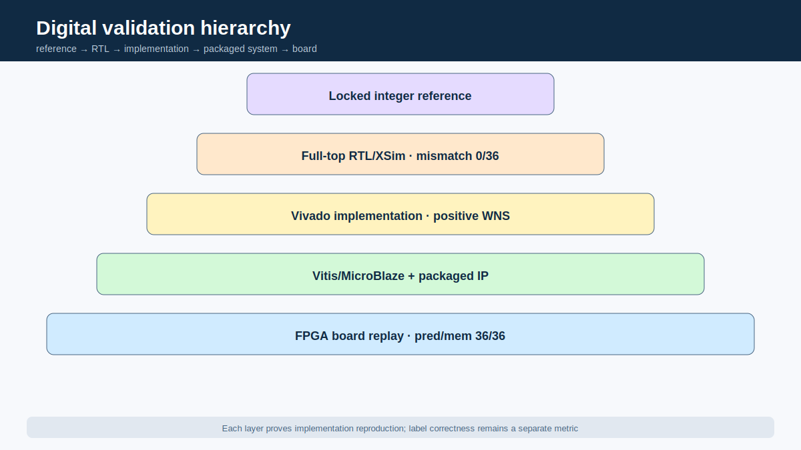

# Holter형 장시간 ECG 4-Class 분류를 위한 다중 시간축 SNN-Inspired Streaming Accelerator IP 설계 및 검증

# 초록

본 연구는 Holter형 장시간 심전도(electrocardiogram, ECG)에서 단기 박동·파형 evidence와 장기 persistence를 함께 반영하기 위한 다중 시간축 SNN-inspired event/state 분류 구조를 제안하고, 이를 합성 가능한 streaming RTL accelerator IP로 구현·검증하였다.

# 1. 서론

## 1.1 연구 배경

대표적인 소비자용 단일유도 ECG 앱의 규제 문서 사례에서는 sinus rhythm과 atrial fibrillation 중심의 rhythm-screening 범위를 제시한다[1]. 이는 특정 제품 문서 사례이며 모든 wearable 제품이 동일한 기능을 가진다는 뜻이 아니다.

Ambulatory monitoring은 증상의 빈도와 관찰 목적에 따라 24/48시간 Holter 또는 더 긴 monitoring 방식이 사용될 수 있다[2].


*그림 1. Sample/beat 수준의 국소 evidence가 60초 Snapshot을 거쳐 30분 Final Membrane으로 축적되는 연구 동기. 이 그림은 architecture motivation을 설명하며 임상 Holter 인증이나 진단 기능을 의미하지 않는다.*

그림 1은 본 연구의 질문을 요약한다.

## 1.2 기존 ECG screening 범위와 문제 인식

위 규제 문서 사례의 AF/sinus screening과 본 연구의 NSR/CHF/ARR/AFF 분류는 class 수만 다른 동일 문제가 아니다. Intended use와 dataset composition이 다르므로 commercial clinical 성능과 본 연구의 80.56% engineering result를 직접 비교하지 않는다.

또한 네 출력 모두를 “네 질환 진단”으로 표현해서는 안 된다.

## 1.3 장시간 ECG 분석의 필요성

ECG 분류에 사용되는 정보는 rhythm과 morphology 양쪽에 분포한다.

본 설계에서 Snapshot Readout은 60초 동안 관찰된 local rhythm/morphology evidence를 class score state로 요약한다.

## 1.4 연구 목표

본 연구의 목표는 공개 ECG에서 생성한 AFE+ADC-compatible signed 12-bit stream을 sample-by-sample으로 받아 네 public-dataset class를 분류하는 hardware-oriented architecture를 설계하고, model-based analog intent에서 FPGA replay까지 traceable하게 검증하는 것이다.

| 연구 목표 | 달성 결과 | 해석 경계 |
|---|---|---|
| 장시간 네 class 분류 | 30분 final-test 29/36=80.56% | public-dataset engineering result |
| 다중 시간축 구조 | 60초 Snapshot × 30 → Final Membrane | clinical temporal model claim 아님 |
| Streaming RTL | sample-by-sample fixed-size state, pure RTL BRAM 0/DSP 0 | BRAM 0만으로 전체 memory architecture를 증명하지 않음 |
| Mixed-signal handoff | input SHA256 36/36, gap=2 pred/mem 36/36 | model-based, physical analog 아님 |
| FPGA integration | board pred/mem 36/36 | functional equivalence, accuracy 100% 아님 |
| Accelerator benefit | 외부 benchmark import 대기 | latency/power/energy claim 보류 |

*표 1. 프로젝트 목표와 현재 달성 결과. 수치의 scope는 `global_metrics.yaml`과 claim registry를 따른다. [근거: CLM-003, CLM-004, CLM-008, CLM-011~CLM-018]*

## 1.5 연구 범위와 기여

주요 기여는 네 단계로 정리된다.

팀 ownership은 다음과 같이 분리한다.

| Contributor | 구현·검증 ownership | Report handoff |
|---|---|---|
| 서민우 | MATLAB nominal AFE+ADC 및 reference vectors | nominal analog intent와 coding convention |
| 이수환 | XMODEL non-ideal/stress 및 AFE-to-digital | signed stream, SHA256, canonical integration evidence |
| 양건 | digital architecture/evaluation/RTL/IP/FPGA 및 총괄 | locked digital golden과 final integration |

*표 2. Contributor ownership. Physical analog 또는 clinical validation ownership은 존재하지 않는다. [근거: `source_of_truth/ownership_matrix.csv`]*

# 2. 전체 시스템 구성

## 2.1 End-to-end processing flow

전체 system은 public digitized ECG, MATLAB nominal AFE+ADC pre-validation, SystemVerilog AFE+ADC XMODEL verification, 1 kSPS signed 12-bit stream, 60초 Snapshot Readout, 30분 Final Membrane Readout, RTL/IP implementation과 FPGA replay로 이어진다.


*그림 2. 세 fixed upstream component와 FPGA replay를 연결한 end-to-end flow. MATLAB/XMODEL은 model-based analog layer이고 FPGA는 digital integration proof이므로 physical mixed-signal SoC를 의미하지 않는다.*

그림 2가 지원하는 핵심 evidence는 “한 저장소 안에 세 코드가 존재한다”는 사실이 아니라 signal contract와 output equivalence가 단계별로 연결된다는 점이다.

## 2.2 MATLAB nominal AFE+ADC pre-validation

MATLAB layer는 HPF, instrumentation-amplifier gain, 60 Hz notch, LPF와 12-bit ADC의 nominal intent를 정리한다.

## 2.3 SystemVerilog XMODEL AFE+ADC verification

XMODEL layer는 analog signal chain을 SystemVerilog/XMODEL 환경에서 구성하고, emulator-to-XMODEL waveform agreement, PLI, baseline wander, electrode offset, R/C mismatch, finite GBW/VOS와 ADC non-ideal condition을 검토한다.

## 2.4 Signed 12-bit digital handoff

Analog-model output과 digital input의 boundary는 1 kSPS signed 12-bit two’s-complement stream으로 고정한다.

| Interface item | Canonical contract | 비고 |
|---|---:|---|
| Sample representation | signed 12-bit two’s-complement | analog voltage가 아니라 quantized code |
| Sample rate | 1,000 samples/s | accelerator throughput 수치가 아님 |
| Snapshot length | 60,000 samples | 60초 local readout |
| Final window | 30 snapshots | 1,800,000 samples, 30분 |
| Canonical XSim cadence | `sample_gap_cycles=2` | noncanonical debug cadence 제외 |
| Output | class + four signed Final Membranes | functional comparison 대상 |

*표 3. Input/interface contract. [근거: CLM-002, CLM-003, CLM-013; `digital_input_contract.md`]*

## 2.5 Digital SNN-inspired accelerator

Digital accelerator는 sample difference와 beat-related event를 dense floating-point feature vector로 저장하지 않고, spike, counter, code와 signed membrane state로 변환한다.

## 2.6 FPGA/IP integration flow

Locked RTL은 full-top XSim에서 Python integer reference와 비교되고, Vivado implementation을 거쳐 AXI/IP-XACT component로 package된다.

# 3. 데이터셋 및 평가 프로토콜

## 3.1 NSR, CHF, ARR, AFF source databases

NSR은 MIT-BIH Normal Sinus Rhythm Database(nsrdb)[3], CHF는 BIDMC Congestive Heart Failure Database(chfdb)[4], ARR은 MIT-BIH Arrhythmia Database(mitdb)[5], AFF는 MIT-BIH Atrial Fibrillation Database(afdb)[6]에서 유래한다.

Public repository는 네 PhysioNet database의 raw waveform을 번들하지 않는다. `datasets/dataset_manifest.yaml`은 version 1.0.0, DOI, records used, source sample rate, external destination과 preprocessing entry를 고정하고, `datasets/SHA256SUMS_EXPECTED.txt`는 official fixed-version hash를 보존한다. Fetch/verify 도구는 저장소 밖에 data를 복원하며 license와 attribution은 `datasets/DATASET_LICENSES.md`에 따른다. Split manifest, locked `.mem`, 평가 CSV와 integration evidence는 project-facing derived evidence로 유지한다.

## 3.2 1 kSPS signed 12-bit stream generation

원 source database의 sampling condition이 서로 다르므로, digital interface 앞에서 1 kSPS와 signed 12-bit convention으로 통일한다.

## 3.3 60-second Snapshot dataset

한 Snapshot은 60,000 accepted samples로 구성된다.

## 3.4 30-minute chunk and source-record organization

한 final chunk는 1,800,000 samples와 30개 Snapshot으로 구성된다.

## 3.5 Strict source-record-wise split

이를 막기 위해 split unit을 `source_record_id`로 고정하였다.



*그림 3. 같은 source record의 chunk를 하나의 partition에만 배치하는 평가 흐름. 이 protocol은 direct record leakage를 막지만 database–class confounding을 제거하지 않는다.*

| Partition | Class별 chunk | 전체 chunk | 역할 |
|---|---:|---:|---|
| Train | 17 × 4 | 68 | model fitting 확인 |
| Validation | 8 × 4 | 32 | Final Membrane model selection |
| Locked final-test | 9 × 4 | 36 | lock 후 1회 평가 |
| Final-test source records | class별 5/4/9/1 | 19 | record-majority aggregation unit |

*표 4. Dataset split 구성. [근거: CLM-007, CLM-016; digital commit `c6b80de...`]*

## 3.6 Model selection and final-test lock

Locked candidate ID는 `structural_guarded_silent_aff_1008710`이다.

## 3.7 Evaluation metrics

평가는 accuracy만으로 끝내지 않고 macro F1, balanced accuracy와 class-wise recall을 함께 본다.

## 3.8 Database–class confounding

네 class는 네 source database와 각각 결합되어 있다. Record-wise split은 direct leakage를 막지만 database–class confounding을 제거하지 않는다. Database-specific acquisition 조건이나 장비·노이즈 특성이 class와 함께 학습될 가능성이 있으며, filename·path·database name·record ID는 입력 feature로 사용하지 않았다. 모든 class에 동일한 AFE/ADC와 signed 12-bit stream 규약을 적용했지만, 이것만으로 domain confounding이 제거되었다고 주장하지 않는다.



*그림 4. Record leakage 방지와 unresolved domain confounding을 분리한 claim boundary. 이 한계는 classification generalization에 영향을 주지만 RTL correctness, bit-exact equivalence, IP packaging, board replay와 implementation resource evidence를 무효화하지 않는다.*

# 4. 제안 SNN-Inspired 디지털 구조

## 4.1 설계 철학

제안 구조의 기본 철학은 waveform을 긴 feature array로 저장한 뒤 software classifier에 전달하는 대신, ECG-domain observation을 event와 persistent state로 변환하는 것이다. Sample마다 필요한 local state만 갱신하고, beat 또는 segment boundary에서 상위 state를 갱신한다.


*그림 5. Signed sample stream에서 event/state, Snapshot, Final Membrane으로 이어지는 temporal hierarchy. 그림은 explanatory architecture이며 개별 threshold나 signal width를 대체하는 literal RTL schematic은 아니다.*


*그림 5-1. Fixed RTL의 adaptive event, QRS LIF, RR/PNN, RDM, DSCR, RAM peak, ectopic pair, QRS MAF, RBBB-like evidence, Snapshot aggregation, Final Membrane, guard/rescue/veto/silent-AFF 및 final WTA를 report-facing으로 묶은 상세 구조. 연결선은 verified RTL block과 boundary의 conceptual grouping이며 literal netlist connectivity나 threshold를 새로 주장하지 않는다. [근거: CLM-023; `tables/streaming_state_inventory.csv`]*

## 4.2 Adaptive event encoder

`ecg_event_encoder_adaptive`는 현재 sample과 이전 sample의 signed difference를 계산하고 absolute delta, up/down event, slope validity와 strong event를 생성한다. Calibration 또는 threshold-bank option을 통해 record 초기 변화량 분포에 대응할 수 있도록 구성되어 있다.

## 4.3 QRS LIF / beat detection

`qrs_lif_detector`는 strong event를 membrane에 더하고 매 sample leak를 적용하는 leaky-integrate-and-fire(LIF) 형태의 detector다. Membrane이 threshold에 도달하면 `beat_spike`를 내고 state를 reset하며 refractory counter를 시작한다.

## 4.4 RR timing and PNN rhythm prediction

`pnn_rhythm_predictor`는 accepted rhythm tick 사이의 token age를 RR interval로 보고, 여러 RR hypothesis center 가운데 현재 interval과 가장 가까운 winner를 순차 탐색한다. 직전 winner는 다음 beat의 predictor가 되며, 실제 다음 RR이 predictor window 안에 있으면 match spike, 밖에 있으면 mismatch spike를 낸다.

## 4.5 RDM variability evidence

`rdm_variability_neuron`은 현재 RR과 이전 RR의 absolute difference를 계산하고 threshold bank를 통과한 수준을 multi-level spike와 integer code로 출력한다. PNN이 hypothesis consistency를 본다면 RDM은 beat-to-beat variability magnitude를 직접 본다.

## 4.6 DSCR morphology evidence

`dscr_spike_counter`는 입력을 fixed-point 형태로 완만하게 추종하는 filter state와 slope membrane을 사용한다. Valid slope가 형성될 때 positive/negative 방향을 추적하고, 유효 slope의 sign이 전환될 때 sign-flip event를 만든다.

## 4.7 R-peak amplitude evidence

`ram_peak_accumulator`는 beat 주변 observation window에서 baseline 대비 positive amplitude를 구하고 threshold bank를 통해 amplitude code를 생성한다. Window 안의 maximum code가 해당 beat의 R-peak amplitude evidence가 되며 Snapshot 동안 code sum/count로 누적된다.

## 4.8 Ectopic-like pair evidence

`ectopic_pair_neuron`은 adaptive RR reference와 현재 RR을 비교해 early 또는 late event를 만들고, 연속 event의 pattern이 early–late 또는 late–early로 교대할 때 ectopic-pair spike를 생성한다. 단일 RR outlier보다 compensation-like pair에 반응하도록 설계한 rhythm evidence다.

## 4.9 QRS morphology and delay evidence

`qrs_maf_neuron`은 beat 전후 window에서 QRS width, sign-flip 기반 complexity, energy code deviation과 pre-QRS bump를 관찰하고 각각 abnormal spike를 만든다. `rbbb_qrs_delay_bank`는 QRS onset 이후 terminal window의 activity, matched width와 repeated wide/terminal pattern을 관찰해 `rbbb_like_beat_spike`와 segment evidence를 생성한다.

## 4.10 Snapshot class readout

`class_score_neurons`는 PNN match/mismatch, RDM level, DSCR slope/flip, RAM code, ectopic pair, QRS-MAF, width/energy, RBBB-like delay 등의 event를 60초 window 동안 counter와 signed class membrane으로 통합한다. Feature별 fixed signed contribution은 특정 class membrane을 excitation하거나 inhibition한다.

| Block | ECG-domain motivation | RTL event/state | Snapshot 기여 | 해석 한계 |
|---|---|---|---|---|
| Adaptive encoder | 급격한 slope 변화 | delta/up/down/strong event | beat·morphology front end | amplitude invariance 보장 아님 |
| QRS LIF | QRS-like event burst | membrane, leak, refractory, beat spike | 모든 beat-based block timing | clinical QRS detector claim 아님 |
| PNN | RR prediction consistency | match/mismatch spike | regular/irregular rhythm | probabilistic NN 아님 |
| RDM | RR 변화량 | level spike/code | variability strength | standard HRV metric과 동일 아님 |
| DSCR | slope sign complexity | valid slope/sign flip | morphology complexity | 특정 질환 morphology 확정 아님 |
| RAM | R-peak amplitude | threshold-bank peak code | amplitude behavior | database/lead 영향 가능 |
| Ectopic pair | early/late compensation pattern | pair spike | ARR-like rhythm evidence | ectopic annotation 확정 아님 |
| QRS MAF | width/complexity/energy | abnormal spikes/codes | morphology abnormality | proxy evidence |
| RBBB delay bank | wide terminal activity | delay/segment spikes | conduction-delay-like evidence | clinical RBBB 진단 아님 |

*표 5. 주요 feature/event block의 역할. Literal threshold 값은 locked RTL과 parameter file을 source of truth로 하며 본 표는 기능적 abstraction이다. [근거: CLM-003; digital RTL commit `c6b80de...`]*

## 4.11 Final Membrane accumulation

`final_membrane_layer`는 60초마다 Snapshot winner count와 beat, PNN mismatch, ectopic pair, RDM, QRS-MAF, RBBB-like, DSCR, RAM 및 aggregated abnormal/rhythm/morphology counters를 32-bit long-window state에 더한다. 30번째 Snapshot에서 base Final Membrane candidate를 계산한 뒤 structural overlay를 적용하고, 네 signed membrane의 WTA로 final class를 출력한다.

## 4.12 Guard, rescue, veto, and silent-AFF logic

Locked candidate의 structural overlay는 base membrane이 특정 source class evidence에 과도하게 끌리는 case를 제한하거나, 충분한 supportive evidence가 있는 class를 rescue하는 조건으로 구성된다. RTL에는 base guard, AFF rescue, NSR/ARR 관련 structural condition과 silent-AFF gate가 명시되어 있다.

Veto와 rescue는 임상적 rule engine이 아니라 membrane update의 bounded control이다. 따라서 “CHF를 특정 단일 feature로 판정한다”거나 “AFF를 rule 하나로 검출한다”는 식으로 해석해서는 안 된다.

## 4.13 Final WTA decision

Base update와 structural overlay가 완료되면 Final Membrane의 NSR, CHF, ARR, AFF 값을 비교해 winner-take-all(WTA) decision을 낸다. RTL은 strict `>` 비교와 고정 tie-break order를 사용해 같은 state에서 deterministic한 결과를 보장한다.

## 4.14 SNN-inspired라는 표현의 범위

본 구조를 SNN-inspired event/state architecture라고 부르는 이유는 event-triggered evidence, leak/threshold를 갖는 membrane-like state, spike/counter update, time accumulation과 WTA readout을 사용하기 때문이다. 반면 repository evidence는 trained deep SNN, backpropagation-through-time, STDP, online learning, neuron biophysical equivalence 또는 biological nervous-system equivalence를 확립하지 않는다.

# 5. MATLAB 및 XMODEL 기반 AFE/ADC 검증

## 5.1 Nominal analog-chain intent

MATLAB nominal chain은 HPF 약 0.4823 Hz, IA gain 201, 60 Hz notch, LPF 약 150.15 Hz와 ±1.65 V 12-bit ADC를 reference로 둔다.

## 5.2 Frequency response and gain

MATLAB frequency-response artifact는 5/10/40 Hz의 ECG passband reference, HPF/LPF cutoff와 60 Hz notch target을 기록한다.

## 5.3 ADC range, clipping, and headroom

대표 네 class 60초 record에서 positive/negative rail hit는 모두 0이고 clipping ratio는 0%였다.



*그림 6. 대표 네 class nominal record의 clipping 0%와 최소 headroom. Selected model-based record에 대한 결과이며 physical rail measurement가 아니다.*

## 5.4 Signed two’s-complement reference vectors

MATLAB package는 NSR/CHF/ARR/AFF별 input, stage output, signed decimal, offset-binary와 signed two’s-complement vector를 포함하고 각 파일의 SHA256을 manifest로 고정한다.

## 5.5 Emulator–XMODEL waveform agreement

Questa/XMODEL과 xmodel-matched emulator를 36개 60초 segment에서 비교했을 때 settling 이후 mean RMS difference는 1.95 LSB, lag는 0이었다.



*그림 7. XMODEL evidence의 세 범위. Waveform agreement, stress scope와 digital handoff를 요약하지만 transistor-level, post-layout, PCB 또는 silicon validation은 포함하지 않는다.*

## 5.6 PLI, baseline wander, offset, and mismatch

PLI stress에서 60 Hz target의 residual은 약 0.92 mV로 보고됐지만 50 Hz injection residual은 약 118 mV로 커졌으며, 50 Hz retuned variant의 system-level 성능은 검증하지 않았다.

Electrode DC offset과 baseline wander stress는 HPF-before-gain 구조의 settling behavior와 residual을 살폈다.

## 5.7 Op-amp and ADC non-ideal stress

Finite GBW/VOS model은 dominant-pole op-amp와 input offset이 ECG output/headroom에 미치는 영향을 검토한다.

## 5.8 AFE-generated long-stream handoff

Full-record AFE output에서 동일 window mapping으로 생성한 36개 final-test chunk는 digital board-replay input과 SHA256이 모두 일치했다.


*그림 8. AFE-generated chunk의 byte identity와 canonical gap=2 output identity. Identity는 functional handoff를 증명하지만 label correctness나 physical analog accuracy를 100%로 만들지 않는다.*

| Verification item | Verified result | Scope/limitation |
|---|---:|---|
| MATLAB representative clipping | 0% (4/4 classes) | nominal selected records |
| MATLAB minimum headroom | 약 1.0196 V | minimum among four representative records |
| Emulator–XMODEL | mean RMS 1.95 LSB, lag 0 | 36 × 60초, model-to-model |
| PLI | 60 Hz residual 약 0.92 mV; 50 Hz 약 118 mV | 60 Hz target, 50 Hz retuning 필요 |
| R/C mismatch | 0.1% CMRR 100.7 dB; 1% 80.0 dB | final_pred는 direct full sweep 아님 |
| ADC non-ideal prediction | 15/16 유지 | 2 LSB rms NSR 한 건 flip |
| Input SHA256 | 36/36 | byte identity |
| Canonical AFE-to-RTL | pred 36/36, mem 36/36 | `sample_gap_cycles=2` |

*표 6. MATLAB/XMODEL verification summary. Stress 수치는 XMODEL commit `4756a508...`의 report scope를 따르며 physical measurement가 아니다. [근거: CLM-012~CLM-015]*

## 5.9 Model-based verification의 해석 범위

MATLAB과 XMODEL은 nominal behavior와 non-ideal sensitivity를 빠르게 탐색하고 digital input contract를 검증하는 데 유용하다. 그러나 이는 physical mixed-signal SoC를 의미하지 않는다. 실제 전극 acquisition, fabricated SoC, ADC silicon, transistor-level 및 post-layout 결과는 본 연구에서 검증하지 않았다.

# 6. RTL 및 FPGA 구현

## 6.1 RTL architecture

Top module `snn_ecg_30min_final_top`은 sample acceptance, 60초 timer membrane, Snapshot start/run/commit state와 Final Membrane pipeline을 연결한다.

## 6.2 Streaming state and memory structure

Architecture는 complete raw window를 먼저 buffer하지 않고 sample마다 fixed-size event/state register를 갱신한다 [CLM-023]. 이 주장은 `snn_ecg_30min_final_top`, core event/QRS/RR/morphology blocks와 `final_membrane_layer`의 persistent signal/group을 직접 조사한 `tables/streaming_state_inventory.csv` 및 `docs/STREAMING_STATE_MEMORY_KR.md`에 근거한다. BRAM=0이나 total FF count만으로 추론한 주장이 아니다. 만약 30분 input 전체를 그대로 저장한다면 필요한 raw storage는 다음과 같다.

```text
1,800,000 × 12 bits
= 21,600,000 bits
= 2,700,000 bytes
≈ 2.7 MB (decimal)
```

본 설계는 이 **avoided full raw-input window storage** 대신 previous sample, finite lookback/filter/membrane, RR token, feature counter와 class state를 유지한다. 2.7 MB는 MicroBlaze runtime memory 측정값이나 exact synthesized memory saving이 아니며, 안전하게 합산하지 못한 parameterized state width는 inventory에서 `UNRESOLVED_FROM_STATIC_AUDIT`로 남겼다.

## 6.3 Top-level FSM and decision flow

Top FSM은 chunk 초기화, Snapshot segment start, sample run, segment commit과 final completion을 순차 제어한다.

## 6.4 Pure RTL implementation

Vivado pure RTL implementation은 LUT 9,719, FF 5,038, BRAM 0, DSP 0을 사용했고 WNS는 8.184 ns였다.

## 6.5 AXI/IP-XACT packaging

Core는 AXI-Lite/stream wrapper와 sample feeder를 포함한 IP-XACT component로 package되었다.

## 6.6 Vitis/MicroBlaze replay system

MicroBlaze full-replay design은 processor, local memory, UART, sample feeder와 accelerator를 포함하는 whole system이다. MicroBlaze full-replay system은 LUT 12,494, register 8,494, BRAM 16, DSP 3이며 setup WNS는 0.097 ns였다.

| Implementation profile | LUT | FF/register | BRAM | DSP | Timing closure |
|---|---:|---:|---:|---:|---:|
| Pure RTL accelerator | 9,719 | 5,038 | 0 | 0 | WNS 8.184 ns |
| MicroBlaze full-replay system | 12,494 | 8,494 | 16 | 3 | setup WNS 0.097 ns |

*표 7. RTL과 MicroBlaze system resource. Scope가 다르며 WNS는 processing latency가 아니다. [근거: CLM-008, CLM-009, CLM-010]*

## 6.7 FPGA board replay procedure

Board replay는 strict final-test 36개 case의 `.mem` input을 MicroBlaze application이 sample feeder에 전달하고, accelerator가 1,800,000 accepted samples와 30 Snapshot을 처리한 뒤 final class와 four membranes를 UART로 출력하는 절차다.



*그림 9. Locked integer reference에서 RTL/XSim, Vivado/IP, MicroBlaze system, FPGA replay로 이어지는 validation hierarchy. 각 layer는 implementation reproduction을 검증하며 ground-truth label correctness는 별도 축이다.*

## 6.8 Classification accuracy와 functional equivalence의 구분

Board final prediction은 expected output과 36/36 일치했고 Final Membrane도 36/36 exact match였다. 이 board 36/36은 locked expected output에 대한 functional equivalence이며, ground-truth label 기준 분류 정확도 100%를 의미하지 않는다.

# 7. 실험 및 검증 결과

## 7.1 Train and validation results

Train 결과는 61/68=89.71%였다. Validation은 32/32=100.00%였지만 model-selection only이며, validation 100%를 final generalization result로 보고하지 않는다.

## 7.2 Locked final-test chunk result

Locked final-test 30분 chunk 결과는 29/36=80.56%, macro F1 80.44%, balanced accuracy 80.56%였다.

## 7.3 Record-majority result

동일 final-test partition의 chunk prediction을 source record별 majority로 합치면 16/19=84.21%, macro F1 80.80%, balanced accuracy 88.19%였다.

## 7.4 Class-wise confusion analysis

Chunk confusion matrix에서 NSR은 9/9, CHF는 6/9, ARR은 7/9, AFF는 7/9였다.


*그림 10. Final-test chunk와 record-majority를 중심에 두고 validation은 model-selection로 분리한 결과. Database–class confounding과 small record support가 남는다.*

| Evaluation | Correct/total | Accuracy | Macro F1 | 해석 |
|---|---:|---:|---:|---|
| Train | 61/68 | 89.71% | — | fitting evidence |
| Validation | 32/32 | 100.00% | — | model selection only |
| Locked final-test chunk | 29/36 | 80.56% | 80.44% | primary held-out result |
| Final-test record-majority | 16/19 | 84.21% | 80.80% | same partition aggregation |

*표 8. Classification results. Validation 100%는 final performance가 아니다. [근거: CLM-004, CLM-005, CLM-006, CLM-007]*

## 7.5 MATLAB nominal results

MATLAB nominal result는 네 representative class record의 clipping 0%, minimum headroom 약 1.0196 V와 signed reference package를 제공했다.

## 7.6 XMODEL waveform/stress results

Emulator–XMODEL mean RMS 1.95 LSB, lag 0은 waveform-level handoff model의 정합성을 지원한다.

## 7.7 AFE input SHA256 identity

AFE full-record output에서 생성한 final-test 36 chunks는 board-replay manifest의 input과 SHA256 36/36 동일했다.

## 7.8 Canonical AFE-to-RTL equivalence

Canonical `sample_gap_cycles=2`에서 AFE-generated 36 chunks를 locked full-top RTL에 넣었을 때 final prediction과 final membrane이 모두 36/36 digital golden과 일치했다.

## 7.9 FPGA board equivalence

FPGA board 36 cases는 final prediction 36/36, final membrane 36/36으로 expected output을 재현하였다. Prediction만 비교하지 않고 membrane까지 비교했기 때문에 같은 winner가 우연히 나온 hidden-state mismatch도 검출할 수 있다. Label accuracy는 별도로 29/36이다.

| Integration boundary | Result | 증명하는 것 | 증명하지 않는 것 |
|---|---:|---|---|
| AFE chunk ↔ board input | SHA256 36/36 | byte-level input identity | analog physical accuracy |
| AFE chunk ↔ locked RTL | pred/mem 36/36 | canonical gap=2 functional reproduction | label accuracy 100% |
| XSim ↔ FPGA board | pred/mem 36/36 | packaged digital system equivalence | clinical validity |
| Board output ↔ label | 29/36 | current dataset classification | domain generalization |

*표 9. Integration equivalence results와 claim boundary. [근거: CLM-011~CLM-013, CLM-021]*

## 7.10 Hardware resource and timing-closure result

Pure RTL의 0 BRAM/0 DSP, positive WNS와 MicroBlaze system의 positive setup/hold WNS는 FPGA implementation feasibility를 지원한다.

## 7.11 Accelerator benchmark status

Accelerator-benefit benchmark status는 `PENDING_EXTERNAL_BENCHMARK_IMPORT`이다.

| Benchmark item | Current value | Import gate |
|---|---|---|
| CPU kernel/end-to-end latency | Pending independent benchmark import | environment와 raw runs 검증 |
| RTL processing latency | Pending independent benchmark import | cycle definition과 scope 검증 |
| RTL throughput/realtime headroom | Pending independent benchmark import | input/decision unit 검증 |
| Power/energy | Pending independent benchmark import | estimated vs measured 분리 |
| Board latency/power | Pending independent benchmark import | instrumented board evidence 필요 |

*표 10. Pending benchmark placeholder. Null은 zero가 아니며 현재 report에 benchmark conclusion을 포함하지 않는다. [근거: CLM-018; `benchmarks/accelerator_benefit/README.md`]*

# 8. 연구의 차별성 및 기술적 의의

## 8.1 Four-class long-window engineering target

본 연구는 AF-versus-sinus binary screening과 다른 네 public-dataset class long-window target을 정의하였다. 이 차별성은 임상적 우월성이 아니라, rhythm과 morphology가 섞인 더 넓은 engineering target을 transparent hardware architecture로 구현했다는 데 있다.

## 8.2 Multi-timescale temporal hierarchy

60초 Snapshot은 local evidence를 빠르게 요약하고, 30분 Final Membrane은 transient error를 그대로 확정하지 않고 repetition과 persistence를 재평가한다. 두 readout의 의미를 분리함으로써 “짧은 구간의 관찰”과 “장기 상태의 결정”을 RTL state hierarchy로 명확히 표현하였다.

## 8.3 SNN-inspired event/state realization

Rhythm/morphology evidence를 threshold event와 membrane-like state로 바꾸고, WTA readout을 사용하는 구조는 conventional full-vector software classifier와 구별된다.

## 8.4 Full-window buffering을 요구하지 않는 streaming structure

전체 2.7 MB decimal raw input window를 먼저 저장하지 않고 current sample, previous state, finite event/beat counter와 class membrane을 갱신한다 [CLM-023]. 이 값은 `avoided full raw-input window storage`이며 exact inference-memory total이나 board benchmark가 아니다.

## 8.5 Mixed-signal-to-digital traceability

MATLAB reference vector, XMODEL waveform/stress, full-record AFE output, SHA256-identical chunk와 canonical RTL reproduction을 연결하였다.

## 8.6 RTL/IP/FPGA implementation completeness

Locked reference, synthesizable RTL, Vivado implementation, IP-XACT package, MicroBlaze application, bitstream/XSA/ELF와 36-case board replay가 모두 존재한다.

## 8.7 Reproducible evidence and claim control

세 component를 fixed commit의 curated technical snapshot으로 import한다. 모든 retained imported file은 upstream object와 byte-identical하고 artifact manifest에 SHA256이 있으며, raw dataset·submission/private·temporary omission은 exclusion registry에 기록된다. Fixed upstream commits가 complete source snapshot의 authority다.

# 9. 한계 및 향후 과제

## 9.1 Database–class confounding

가장 중요한 과학적 한계는 class와 source database가 결합된 점이다.

## 9.2 Dataset size and clinical generalization

Final-test는 36 chunks와 19 records이며 AFF record는 한 개다.

## 9.3 Physical AFE/ADC and fabricated-silicon gap

Analog evidence는 MATLAB/XMODEL model-based 결과다.

## 9.4 SNN-inspired architecture의 한계

현재 구조는 fixed integer feature weight와 structural guard를 사용하며 learning은 offline model-selection 단계에 한정된다.

## 9.5 Snapshot/Final Membrane ablation 필요성

현재 artifact는 locked two-timescale system의 결과와 candidate selection을 제공하지만, Snapshot-only, unguarded majority, base Final Membrane, full structural overlay를 동일 protocol에서 정리한 report-ready ablation table은 통합 source of truth에 승격되어 있지 않다.

## 9.6 Independent accelerator benchmark

CPU baseline, RTL cycle-derived processing, end-to-end transport와 board measurement를 구분한 independent benchmark가 필요하다.

## 9.7 Same-acquisition multi-class validation

가장 강한 다음 단계는 동일 acquisition device·lead·protocol에서 NSR/CHF/ARR/AFF에 대응하는 label을 확보하는 것이다.

## 9.8 향후 ASIC 및 edge-device 확장

현재 integer/counter/comparator 중심 구조와 full-window raw buffer 회피는 edge integration의 기반이 될 수 있다.

| Limitation | 현재 영향 | 필요한 다음 검증 |
|---|---|---|
| Database–class confounding | classification generalization 제한 | same-acquisition/cross-domain protocol |
| Final-test 규모 | class/record uncertainty | larger independent cohort |
| Model-based analog | physical robustness 미확정 | PCB/ADC measurement, 이후 silicon |
| SNN-inspired proxy | learned representation 부재 | ablation 및 domain robustness |
| Benchmark pending | speed/energy benefit 미확정 | independent package import |
| No ASIC | area/power sign-off 없음 | synthesis-to-layout and measurement |

*표 11. 핵심 limitation과 future validation. 이 한계는 RTL/IP functional evidence를 부정하지 않지만 claim scope를 제한한다.*

# 10. 결론

본 연구는 Holter형 장시간 ECG에서 local beat/morphology evidence와 long-term persistence를 함께 반영하기 위해 60초 Snapshot Readout과 30분 Final Membrane Readout을 결합한 multi-timescale SNN-inspired event/state architecture를 제안하였다. Public ECG를 1 kSPS signed 12-bit stream으로 통일하고, adaptive event, QRS LIF, RR prediction/variability, morphology, amplitude, ectopic-like와 delay evidence를 integer state로 변환하였다. Direct RTL state audit에 따라 전체 1,800,000-sample raw window를 먼저 저장하지 않고 streaming state를 갱신하며 [CLM-023], locked Final Membrane과 WTA가 네 public-dataset class를 결정한다.

Strict source-record-wise split과 one-time locked final-test evaluation에서 29/36=80.56%, macro F1 80.44%를 얻었고 record-majority는 16/19=84.21%였다. Pure RTL은 9,719 LUT, 5,038 FF, 0 BRAM, 0 DSP와 positive WNS를 달성하였다. MATLAB nominal pre-validation, XMODEL stress, AFE-generated input SHA256 36/36, canonical AFE-to-RTL pred/mem 36/36, FPGA board pred/mem 36/36을 연결함으로써 model-based analog intent에서 packaged digital IP까지 traceable한 verification chain을 구축하였다.

본 결과의 의미는 “100% 정확한 임상 진단기”나 “fabricated low-power SoC”가 아니라, 장시간 ECG evidence를 다중 시간축 state로 구성하고 이를 재현 가능한 RTL/IP/FPGA artifact로 완성했다는 데 있다. Database–class confounding, 제한된 cohort, physical analog/silicon gap과 pending benchmark를 명시적으로 남겼으며, 향후 same-acquisition validation, ablation, independent accelerator benchmark와 ASIC implementation으로 확장해야 한다.

# 참고문헌

[1] U.S. Food and Drug Administration, “De Novo Classification Request for ECG App (DEN180044),” regulatory decision summary, 2018-08-14. https://www.accessdata.fda.gov/cdrh_docs/reviews/DEN180044.pdf

[2] ACC/AHA/HRS, “2018 ACC/AHA/HRS Guideline on the Evaluation and Management of Patients With Bradycardia and Cardiac Conduction Delay,” peer-reviewed clinical guideline, 2018. https://doi.org/10.1161/CIR.0000000000000628

[3] George Moody / PhysioNet, “MIT-BIH Normal Sinus Rhythm Database v1.0.0,” doi:10.13026/C2NK5R, ODC-By 1.0. https://physionet.org/content/nsrdb/1.0.0/

[4] PhysioNet, “BIDMC Congestive Heart Failure Database v1.0.0,” doi:10.13026/C29G60, ODC-By 1.0; Baim et al., JACC 7(3), 1986. https://physionet.org/content/chfdb/1.0.0/

[5] George Moody and Roger Mark / PhysioNet, “MIT-BIH Arrhythmia Database v1.0.0,” doi:10.13026/C2F305, ODC-By 1.0; Moody and Mark, IEEE EMBS 20(3), 2001. https://physionet.org/content/mitdb/1.0.0/

[6] George Moody and Roger Mark / PhysioNet, “MIT-BIH Atrial Fibrillation Database v1.0.0,” doi:10.13026/C2MW2D, ODC-By 1.0; Moody and Mark, Computers in Cardiology 10, 1983. https://physionet.org/content/afdb/1.0.0/

[7] Goldberger AL et al., “PhysioBank, PhysioToolkit, and PhysioNet,” Circulation 101(23):e215–e220, 2000, RRID:SCR_007345. https://doi.org/10.1161/01.CIR.101.23.e215

[8] Open Data Commons, “Attribution License v1.0.” https://opendatacommons.org/licenses/by/1-0/

# 부록 A. 핵심 수치 표

| Category | Metric | Value | Scope/evidence |
|---|---|---:|---|
| Input | Stream | signed 12-bit, 1 kSPS | CLM-002 |
| Architecture | Snapshot / Final | 60초 / 30 snapshots | CLM-003 |
| Architecture | Avoided full raw-input window storage | 21,600,000 bit = 2,700,000 byte ≈ 2.7 MB decimal | CLM-023; not exact runtime memory |
| Evaluation | Train | 61/68=89.71% | fitting |
| Evaluation | Validation | 32/32=100.00% | selection only |
| Evaluation | Final chunk | 29/36=80.56%, macro F1 80.44% | CLM-004 |
| Evaluation | Record-majority | 16/19=84.21%, macro F1 80.80% | CLM-005 |
| Protocol | Test use/count | selection=false, count=1 | CLM-007 |
| MATLAB | clipping/headroom | 0%; 약 1.0196 V | representative nominal |
| XMODEL | waveform | mean RMS 1.95 LSB, lag 0 | 36 segments |
| Integration | Input SHA | 36/36 | CLM-012 |
| Integration | AFE-to-RTL | pred/mem 36/36, gap=2 | CLM-013 |
| Pure RTL | Resource | 9719 LUT, 5038 FF, 0 BRAM, 0 DSP | CLM-008 |
| Pure RTL | Timing | WNS 8.184 ns | closure, not latency |
| MicroBlaze system | Resource/timing | 12494 LUT, 8494 reg, 16 BRAM, 3 DSP, setup WNS 0.097 ns | CLM-010 |
| Board | Functional equivalence | pred/mem 36/36 | CLM-011 |
| Board | Label accuracy | 29/36 | classification result |
| Benchmark | Status | PENDING_EXTERNAL_BENCHMARK_IMPORT | all value fields null |

*표 A-1. Integrated source-of-truth 핵심 수치. 상세 evidence path와 limitation은 `source_of_truth/global_metrics.yaml`을 따른다.*

# 부록 B. Claim 및 evidence 추적

| Chapter | Report statement | Claim ID | Evidence path | Fixed commit | Owner |
|---|---|---|---|---|---|
| 1·4 | Multi-timescale SNN-inspired identity | CLM-001,003 | `FINAL_REPORT_KR.md`; `rtl/` | digital `c6b80de...` | 양건 |
| 2 | Signed 12-bit 1 kSPS contract | CLM-002 | `digital_input_contract.md` | digital `c6b80de...` | 양건 |
| 3 | Strict record-wise lock | CLM-007,016 | split/lock JSON | digital `c6b80de...` | 양건 |
| 3·9 | Database–class confounding | CLM-017 | `DATASET_DOMAIN_CONFOUNDING_KR.md` | integrated | 양건(편집) |
| 5 | MATLAB representative clipping | CLM-015 | `afe_dynamic_range_headroom_summary.csv` | MATLAB `907f7e1...` | 서민우 |
| 5 | XMODEL mean RMS | CLM-014 | `AFE_xmodel_verification.md` | XMODEL `4756a508...` | 이수환 |
| 5·7 | AFE input SHA identity | CLM-012 | `afe36_sha256_bitidentity.csv` | XMODEL `4756a508...` | 이수환 |
| 5·7 | Canonical AFE-to-RTL equivalence | CLM-013 | `afe_locked_rtl_integration_36case_compare.csv` | XMODEL `4756a508...` | 이수환 |
| 6·7 | Pure RTL implementation | CLM-008,009 | `final_metrics.json` | digital `c6b80de...` | 양건 |
| 4·6·8 | Streaming state / no full-window buffer | CLM-023 | `STREAMING_STATE_MEMORY_KR.md`; `streaming_state_inventory.csv`; FIG-12 | digital `c6b80de...` | 양건 |
| 6·7 | MicroBlaze system | CLM-010 | `final_metrics.json` | digital `c6b80de...` | 양건 |
| 6·7 | Board equivalence | CLM-011 | `board_replay_36_batch_summary.json` | digital `c6b80de...` | 양건 |
| 7 | Final-test result | CLM-004,005 | `final_metrics.json` | digital `c6b80de...` | 양건 |
| 7·9 | Benchmark pending | CLM-018 | benchmark placeholder | integrated | 양건 |
| 5·9 | No physical/clinical claim | CLM-019, CLM-020 | claim registry | all/integrated | team |

*표 B-1. Major report statement의 claim/evidence mapping. 전체 machine-readable mapping은 `reports/INTEGRATED_TECHNICAL_REPORT_EVIDENCE_MAP.csv`을 사용한다.*
