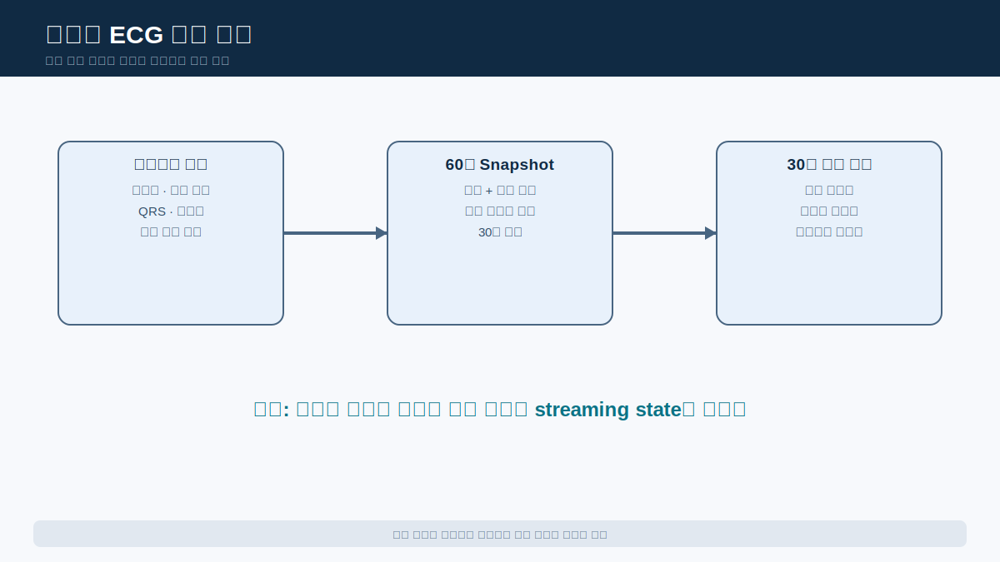
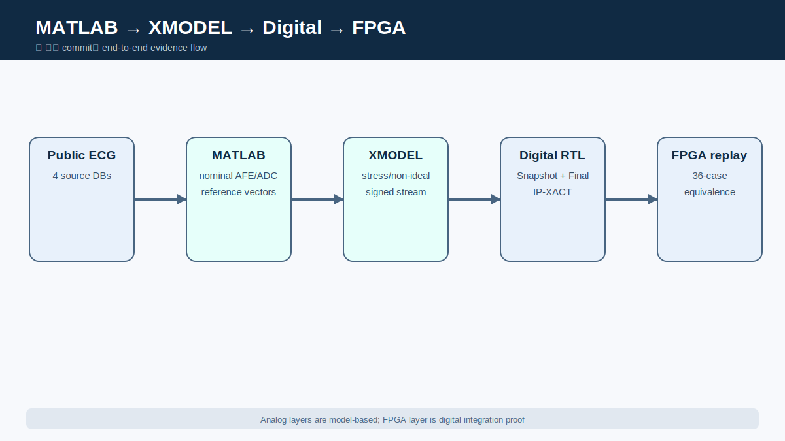
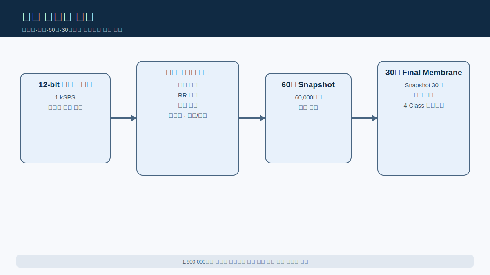
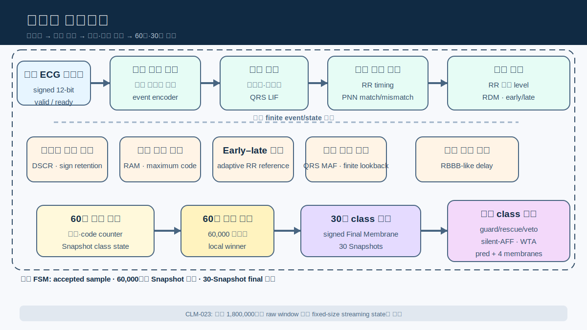
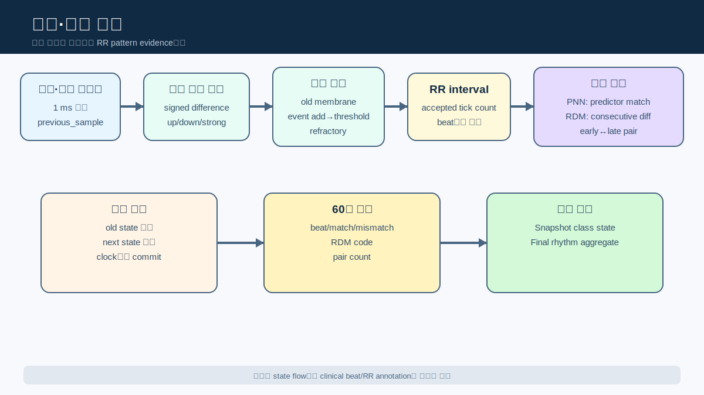
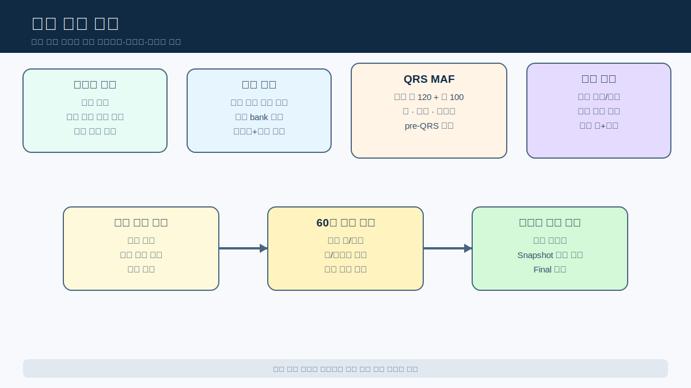
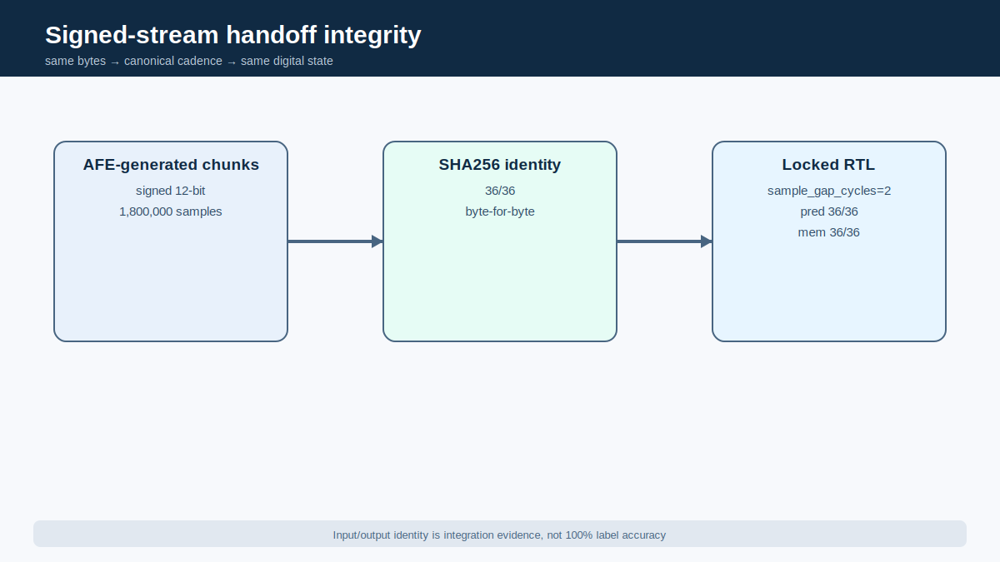
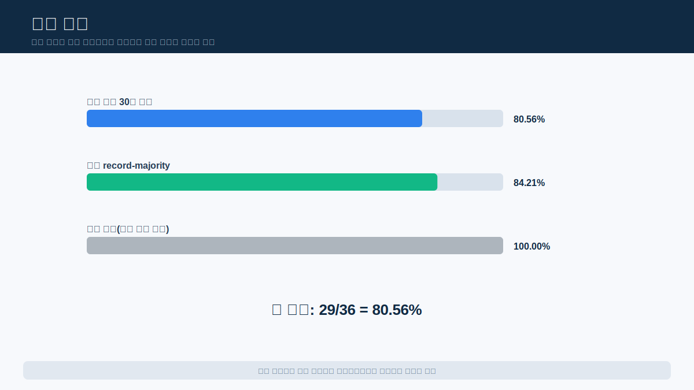

# 장시간 ECG 4-Class 분류를 위한 다중 시간축 SNN-Inspired Streaming RTL Accelerator IP

# 초록

장시간 심전도(electrocardiogram, ECG) 분석에서는 한 박동의 모양뿐 아니라 박동 간격과 파형 특징이 수십 분 동안 어떻게 반복되는지도 함께 보아야 한다. 본 연구는 이 문제를 위해 60초 Snapshot과 30분 Final Membrane을 결합한 다중 시간축 네 클래스 분류 구조를 제안하고, 초당 1,000개의 signed 12-bit 표본값을 처리하는 streaming RTL accelerator IP로 구현하였다. 회로는 인접 표본값의 차이에서 파형 변화 사건을 만들고, 반복되는 강한 사건을 막전위형 누적값에 더해 박동을 검출한다. 이어서 RR 간격의 규칙성과 변동성, 기울기 방향 전환, 최대 진폭, QRS 주변의 폭·복잡도·에너지와 말단 활동도를 고정 폭 정수 상태로 압축한다. 60,000표본 동안 모은 국소 증거는 Snapshot 클래스 상태가 되고, Snapshot 30개의 승자 횟수와 집계 특징은 Final Membrane에 누적되어 NSR·CHF·ARR·AFF 가운데 하나를 선택한다. MATLAB 공칭 AFE+ADC, SystemVerilog XMODEL, signed-stream SHA256, Python 정수 기준 모델, RTL/XSim, Vivado, AXI/IP-XACT, Vitis/MicroBlaze와 FPGA 재생을 하나의 검증 사슬로 연결하였다. 원천 record 단위로 분리한 고정 최종 시험에서 30분 구간 정확도는 29/36=80.56%, record-majority 정확도는 16/19=84.21%였다. Pure RTL은 LUT 9,719, FF 5,038, BRAM 0, DSP 0으로 구현되었으며, FPGA의 `final_pred`와 `final_mem`은 XSim 기준과 각각 36/36 일치하였다. 다만 클래스와 데이터베이스의 결합, 실제 AFE/ADC·임상 검증 부재, 미완료 가속기 benchmark가 남아 있으므로 본 결과는 임상 진단 성능이 아니라 장시간 ECG 분류 과정을 설명 가능한 사건·상태 회로로 구현한 RTL/IP/FPGA 공학 결과로 한정한다.

# 핵심어

심전도, 장시간 모니터링, SNN-inspired 구조, 사건 기반 처리, Snapshot 판독, Final Membrane, streaming RTL, FPGA 가속기

# 1. 서론

## 1.1 연구 배경과 문제 정의

ECG는 심장의 전기적 활동을 시간에 따라 기록한 전압 파형이다. 짧은 구간에서는 개별 박동의 모양을 자세히 볼 수 있지만, 장시간 기록에서는 박동 간격의 반복과 불규칙성, 특정 파형 특징이 얼마나 오래 지속되는지가 함께 중요하다. Ambulatory ECG가 증상 빈도와 관찰 목적에 따라 24/48시간 Holter 또는 더 긴 감시 방식을 사용하는 이유도 한 시점의 파형만으로 장시간 상태를 대표하기 어렵기 때문이다[2].

대표적인 소비자용 단일유도 ECG 앱의 FDA 문서 사례는 정상 동율동과 심방세동 중심의 리듬 선별 범위를 설명한다[1]. 본 연구는 그 제품과 정확도를 비교하지 않는다. 공개 데이터에서 NSR(normal sinus rhythm), CHF-labelled, ARR(arrhythmia-labelled), AFF(atrial-fibrillation-labelled) 네 범주를 다루는 장시간 공학 문제를 정의하고, 국소 리듬·파형 증거를 30분 동안 누적하는 투명한 하드웨어 구조를 설계한다. NSR은 질병이 아니며 ARR은 넓은 표지이고 CHF 역시 해당 원천 데이터베이스의 표지다. 따라서 출력은 네 질환의 확진이 아니라 현재 공개 데이터 구성에서 정의한 네 클래스다 [CLM-001].

장시간 파형을 다루는 가장 직접적인 방법은 전체 기록을 저장한 뒤 소프트웨어에서 일괄 분석하는 것이다. 그러나 wearable용 반도체 IP를 목표로 할 경우에는 입력이 들어오는 동안 필요한 정보만 작은 상태로 남기는 구조가 더 적합하다. 이때 해결해야 할 문제는 단순히 계산을 빠르게 만드는 것이 아니다. 1 ms마다 들어오는 표본값의 변화, 수백 ms 규모의 박동, 60초 구간의 리듬과 30분 동안 반복되는 특징을 하나의 회로에서 잃지 않고 연결해야 한다.

이를 위해 다음 세 시간척도를 동시에 유지한다.

- **표본값 시간척도:** 1 ms마다 파형 변화와 검출기 상태를 갱신한다.
- **박동 시간척도:** 검출된 박동 사이 간격과 박동 중심 파형 구간을 평가한다.
- **구간·장시간 시간척도:** 60초 증거를 Snapshot으로 확정하고 30개 Snapshot을 Final Membrane에 누적한다.



*그림 1. 표본값·박동·60초·30분으로 이어지는 문제의 시간 계층. Holter-oriented는 설계 방향이며 임상 인증을 뜻하지 않는다. [근거: CLM-001, CLM-003]*

## 1.2 연구 목표와 주요 기여

연구 목표는 공개 ECG를 공통 signed 12-bit 스트림으로 변환하고, 리듬과 파형 형태를 사건 신호와 지속 상태로 압축하여 30분 클래스를 출력하는 RTL IP를 만드는 것이다. 속도 자체가 주 기여는 아니다. 핵심은 장시간 네 클래스 분류 구조를 설명 가능한 고정 폭 회로로 구현하고, 모델로 정의한 아날로그 의도부터 FPGA 출력까지 같은 신호와 상태를 추적하는 데 있다.

주요 기여는 다음 여섯 가지다.

1. NSR·CHF·ARR·AFF를 대상으로 하는 장시간 4-Class 공학 목표를 정의하였다.
2. 60초 Snapshot과 30분 Final Membrane을 결합해 국소 증거와 장기 지속성을 분리·재결합하였다.
3. 인접 표본값 변화, 막전위형 박동 검출, RR 리듬과 파형 형태를 정수 계수기·비교기·누산기로 구현하였다.
4. 전체 30분 원시 관찰 구간을 저장하지 않고 고정 크기 지속 상태를 갱신하는 streaming datapath를 구현하였다 [CLM-023].
5. MATLAB→XMODEL→부호 있는 스트림→RTL/IP→FPGA로 이어지는 기능 등가성 사슬을 구축하였다.
6. 고정 commit, 산출물 hash, 데이터셋 manifest, 담당자·claim registry와 checker로 수치와 해석 경계를 통제하였다.

이후 제2장에서는 기존 접근의 한계에서 설계 요구를 도출하고 전체 시스템과 평가 방법을 설명한다. 제3장은 표본값이 사건, 박동, Snapshot과 Final Membrane으로 변환되는 회로 동작을 다룬다. 제4장과 제5장은 각각 구현·검증 방법과 정량 결과를 제시한다. 제6장에서 결과의 의미와 한계를 논의한 뒤 제7장에서 결론을 정리한다.

| 목표 | 구현·검증 결과 | 해석 경계 |
|---|---|---|
| 장시간 네 클래스 분류 | 60초 Snapshot×30, 최종 29/36 | 공개 데이터셋 기반 공학 결과 |
| 사건/상태형 RTL | 고정 폭 계수기·비교·부호 막전위 | 학습된 심층 SNN 아님 |
| 전체 관찰 구간 비저장 | 표본별 지속 상태 갱신 | 측정된 메모리 절감량 아님 |
| Mixed-signal 인계 | SHA256와 canonical pred/mem 36/36 | 모델 기반 아날로그 |
| FPGA IP | Vivado·IP-XACT·MicroBlaze·보드 재생 | 임상 장치/ASIC 아님 |
| 가속기 효과 | `PENDING_EXTERNAL_BENCHMARK_IMPORT` | 속도·전력·에너지 미확정 |

*표 1. 연구 목표와 달성 결과. 각 행은 서로 다른 증거 범위를 갖는다. [근거: CLM-003, CLM-004, CLM-008~CLM-013, CLM-018, CLM-023]*

표 1에서 구조·분류·통합·FPGA 구현은 산출물로 확인되지만 가속기 benchmark는 아직 완료되지 않았다. 이 구분은 “FPGA에 올라갔다”는 사실을 곧바로 고속·저전력 우월성으로 바꾸지 않기 위한 것이다.

# 2. 관련 기술과 시스템 설계

## 2.1 기존 접근의 한계와 설계 요구

장시간 ECG 분류에는 서로 다른 장단점을 가진 접근이 사용된다. 전체 파형을 저장하고 소프트웨어에서 특징을 계산하는 방법은 알고리즘을 바꾸기 쉽지만 저장 공간과 실행 환경에 의존한다. 반대로 짧은 구간의 파형만 보는 회로는 국소 박동 검출에는 적합해도 수십 분 동안 반복되는 리듬 특징을 직접 표현하기 어렵다. 학습된 심층 SNN을 그대로 구현하는 방법은 사건 기반 처리를 제공할 수 있지만 가중치 메모리와 추론 구조가 커지고 내부 판단 과정을 설명하기 어려울 수 있다.

본 설계는 원시 30분 파형 전체를 저장하거나 대규모 학습망을 탑재하는 대신, 표본값 변화에서 사건을 만들고 그 사건을 시간 단계별 상태로 압축한다. 1 ms 표본값은 박동 검출 상태를 갱신하고, 박동은 RR와 파형 형태 상태를 만든다. 60초 Snapshot은 국소 클래스 증거를, 30분 Final Membrane은 장기 지속성을 표현한다. 표 1의 목표는 이 구조에서 도출한 설계 요구이자 각 요구의 현재 검증 범위다.

이 요구를 구현한 전체 신호 흐름은 다음과 같다.

전체 신호 흐름은 `공개 ECG → MATLAB nominal AFE+ADC → SystemVerilog XMODEL → 1 kSPS signed 12-bit stream → 사건/상태형 digital core → RTL/IP/FPGA replay`다. MATLAB은 공칭 filter·gain·ADC 범위와 기준 벡터를 제공한다. XMODEL은 전원선 간섭, 기준선 변동, 부품 오차, 연산증폭기와 ADC 비이상성을 모델로 검토하고 장시간 부호 스트림을 만든다. 디지털 코어는 이 스트림을 표본값 단위로 받아 Snapshot과 Final Membrane을 계산한다.



*그림 2. 공개 ECG에서 모델 기반 AFE/ADC와 디지털 IP를 거쳐 FPGA 재생 검증으로 이어지는 흐름. 아날로그 계층은 물리 측정 결과가 아니다.*

인계의 기준 인터페이스는 표 2와 같다. `sample_valid && sample_ready`가 참인 클록에서만 한 표본값을 수락한다. XSim 통합에서는 수락된 표본값 사이에 canonical `sample_gap_cycles=2`를 사용한다. 이 클록 간격은 1 kSPS라는 실제 입력 표본률과 다른 개념이며 가속기 처리량 수치도 아니다.

| 항목 | 기준 규약 | 의미 |
|---|---:|---|
| 입력 표현 | signed 12-bit two’s-complement | AFE/ADC 모델과 디지털 코어의 코드 규약 |
| 입력 표본률 | 1,000표본/s | 한 표본값 간격 1 ms |
| Snapshot | 수락 표본값 60,000개 | 60초 국소 상태 확정 |
| Final decision | Snapshot 30개 | 1,800,000표본=30분 |
| XSim 입력 간격 | `sample_gap_cycles=2` | 보드 대상 기준 검증 조건 |
| 출력 | `final_pred`+4개 `final_mem` | 클래스 승자와 내부 부호 있는 최종 상태 |

*표 2. 전체 인터페이스 규약. [근거: CLM-002, CLM-003, CLM-013; `components/digital_accelerator/reports/final/digital_input_contract.md`]*

구현 책임은 서민우(MATLAB 공칭 검증·벡터), 이수환(XMODEL 비이상성·통합), 양건(디지털 구조·평가·RTL/IP/FPGA·총괄)으로 분리한다. 인계 hash와 출력 비교가 세 구성요소를 연결하지만 협업이 각 구현 책임을 이전하지는 않는다.

## 2.2 데이터셋과 평가 프로토콜

네 클래스는 서로 다른 PhysioNet 데이터베이스에서 왔다. 원시 파형은 공개 Git에 포함하지 않고 version 1.0.0, DOI, 원 표본률, 사용 record와 예상 SHA256를 manifest로 고정한다. 내려받기·검증 도구는 저장소 밖에 원본을 복원하며 ODC-By 1.0 표시와 데이터베이스별 인용 조건을 따른다[3]–[8].

| 클래스 | 원천/version | 원 표본률 | DOI | 최종 시험 record 수 |
|---|---|---:|---|---:|
| NSR | nsrdb 1.0.0 | 128 Hz | 10.13026/C2NK5R | 5 |
| CHF | chfdb 1.0.0 | 250 Hz | 10.13026/C29G60 | 4 |
| ARR | mitdb 1.0.0 | 360 Hz | 10.13026/C2F305 | 9 |
| AFF | afdb 1.0.0 | 250 Hz | 10.13026/C2MW2D | 1 |

*표 3. 데이터셋 원천과 최종 시험 record 구성. [근거: EXT-003~EXT-008; 데이터셋 manifest·license]*

각 원천 데이터는 공통 1 kSPS signed 12-bit 규약으로 변환되지만 이것이 유도·장비·대상군·잡음 차이를 제거했다는 뜻은 아니다. 클래스와 데이터베이스가 일대일로 결합되므로 database–class confounding이 남는다 [CLM-017]. 고정 버전 원시 파형은 저장소에 포함하지 않는다. 데이터셋 manifest·license·예상 SHA와 내려받기·검증 도구로 저장소 밖에 복원하고, 보고서에 쓰는 고정 파생 근거만 보존한다.

분할 단위는 `source_record_id`다. 한 원본 record에서 생성된 모든 30분 구간은 학습, 검증, 최종 시험 가운데 하나에만 속한다. 이 방법은 같은 record가 여러 partition에 섞이는 직접 누출을 막지만, 데이터베이스의 정체성과 클래스의 결합까지 해소하지는 않는다 [CLM-016].

| 분할 | 클래스별 30분 구간 | 전체 | 역할 |
|---|---:|---:|---|
| 학습 | 17×4 | 68 | 모델 적합 확인 |
| 검증 | 8×4 | 32 | Final Membrane 모델 선택 |
| 고정 최종 시험 | 9×4 | 36 | 고정 후 1회 평가 |
| 최종 시험 원본 record | 5/4/9/1 | 19 | record-majority 집계 단위 |

*표 4. 엄격한 원천 record 단위 분할. [근거: CLM-007, CLM-016; 고정 split 설정]*

고정 모델 `structural_guarded_silent_aff_1008710`은 학습·검증 결과로 선택한 뒤 문턱값·가중치·구조 보정 논리를 동결했다. 최종 시험은 모델 선택이나 파라미터 탐색에 사용하지 않았고 평가 횟수는 1, `test_used_for_selection=false`다 [CLM-007]. 정확도, macro F1, balanced accuracy와 클래스 재현율을 사용한다. Record-majority는 같은 최종 partition의 30분 구간을 원본 record별 다수결로 합친 값이므로 별도의 독립 시험이 아니다.

# 3. 제안 SNN-Inspired 디지털 아키텍처

이 장은 입력 숫자 하나가 최종 클래스 상태로 바뀌는 순서에 맞춰 회로를 설명한다. 먼저 표본값·사건·막전위의 뜻을 정의하고, 박동·리듬 경로와 파형 형태 경로를 차례로 다룬다. 마지막에는 두 경로의 증거가 60초 Snapshot과 30분 Final Membrane에서 결합되는 과정을 정리한다.

## 3.1 핵심 개념과 다중 시간축 처리

AFE와 ADC를 통과한 ECG는 더 이상 종이에 그려진 곡선이 아니다. 디지털 블록이 받는 입력은 `... -18, -12, 5, 41, 96 ...`처럼 시간 순서대로 들어오는 부호 있는 숫자의 나열이다. 회로에는 이 숫자가 P파인지 QRS파인지 알려 주는 표지가 없다. 따라서 디지털 IP는 숫자의 움직임에서 먼저 “파형이 급하게 변했다”는 사건을 만들고, 여러 사건의 시간 관계를 이용해 박동과 리듬을 스스로 구성해야 한다.

**표본값(sample).** 숫자 나열에서 값 하나가 한 시점의 ECG 전압을 나타낸다. 이를 표본값이라고 한다. 본 설계는 초당 1,000개를 받으므로 새로운 표본값은 1 ms마다 하나씩 들어온다. 60초에는 60,000개, 30분에는 1,800,000개의 표본값이 들어온다.

**파형 변화 사건 신호(event).** 현재 표본값에서 직전 표본값을 빼면 두 시점 사이 변화량이 나온다. 변화량이 양수면 파형이 상승했고 음수면 하강했으며, 절댓값이 클수록 짧은 시간에 크게 변했다는 뜻이다. 회로는 변화량이 기준을 넘은 순간 한 클록 길이의 사건 신호를 만든다. 사건 신호는 “조건이 지금 발생했다”는 알림이지 원래 파형을 저장한 값은 아니다.

**막전위형 누적값(membrane state).** 생물학적 뉴런은 입력 자극을 막전위에 모으고, 막전위가 임계점에 도달하면 발화한 뒤 다시 초기 상태로 돌아간다. 본 설계는 이 생각을 레지스터와 덧셈기로 구현한다. 사건이 들어올 때마다 누적값을 올리고, 누적값이 문턱값(threshold)을 넘으면 한 클록의 스파이크를 출력한 뒤 누적값을 0으로 되돌린다.

**누설(leak).** 일반적인 LIF 뉴런은 시간이 지나면 누적값을 조금씩 줄인다. 서로 멀리 떨어진 사건은 영향이 약해지고, 짧은 시간에 연속해서 들어온 사건만 손실을 이겨 내고 발화하게 만들기 위해서다. 본 QRS 검출 RTL도 누설 연산을 지원한다. 다만 현재 고정 제출 설정에서는 QRS 누설값이 0이므로, 실제 제출 회로의 누적값은 사건 사이에서 감소하지 않는다. 따라서 본문에서는 LIF의 일반 원리와 현재 설정의 실제 동작을 구분한다.

**불응기(refractory period).** 하나의 QRS파 안에서는 큰 상승과 하강이 여러 번 나타날 수 있다. 첫 발화 뒤에도 사건을 계속 누적하면 같은 QRS파를 두세 개의 박동으로 잘못 셀 수 있다. 이를 막기 위해 박동을 검출한 직후에는 일정 수의 표본값 동안 누적을 중지한다.

**박동과 RR 간격.** QRS 막전위형 누적값이 문턱값을 넘으면 회로는 “박동을 하나 찾았다”는 신호를 한 클록 동안 낸다. 이것이 내부 박동(beat)이다. 첫 박동부터 다음 박동까지 몇 개의 표본값이 들어왔는지를 세면 RR 간격이 된다. 외부의 R-peak 정답표를 읽는 것이 아니라 회로가 스스로 검출한 두 박동 사이 시간을 재는 방식이다.

**Snapshot.** Snapshot은 이미지가 아니라 60초 동안 관찰한 결과의 요약이다. 60,000개의 표본값에서 박동이 몇 번 발생했는지, RR 간격이 얼마나 일정했는지, 파형 방향 전환·진폭·폭·에너지가 어떤 경향을 보였는지를 작은 계수와 클래스 누적값으로 압축한다.

**Final Membrane.** 한 번의 60초 결과만으로 30분 전체를 판단하지 않기 위해 Snapshot 30개의 결과를 다시 네 개의 장시간 클래스 누적값에 모은다. 이것이 Final Membrane이다. 어떤 특징이 클래스를 지지하면 해당 누적값을 올리고, 반대하면 내린다. 마지막에는 네 누적값 가운데 가장 큰 값을 고른다.

**왜 SNN-inspired인가.** 이 구조는 모든 표본값을 저장한 뒤 한꺼번에 행렬 연산을 하는 대신, 의미 있는 변화가 생겼을 때 사건을 만들고 그 사건을 막전위형 누적값에 더한다. 누적값, 문턱값, 발화, 초기화와 승자독식이라는 뉴로모픽 개념을 정수형 RTL로 옮겼기 때문에 SNN-inspired라고 부른다. 다만 학습된 심층 SNN, STDP, 온라인 학습, 생물물리 뉴런 시뮬레이션이나 생물학적 등가성을 주장하는 구조는 아니다.



*그림 3. 1 ms 표본값, 박동, 60초 Snapshot, 30분 Final Membrane의 세 단계 상태 이동. [근거: CLM-003, CLM-023]*



*그림 4. 독자 개념을 중심으로 정리한 디지털 아키텍처. 모듈 이름은 구현 확인용 보조 표기이며 실제 넷리스트를 대체하지 않는다.*

전체 흐름을 한 문장으로 연결하면 다음과 같다. 숫자로 들어온 ECG가 급하게 오르내리면 강한 사건이 생기고, 강한 사건이 충분히 모이면 박동이 된다. 박동 사이 표본 수는 RR 간격이 되고, 박동 주변 숫자의 움직임은 기울기 전환·진폭·폭·에너지 정보가 된다. 이 값들을 60초 동안 모아 Snapshot을 만들고, Snapshot 30개를 Final Membrane에 모아 최종 클래스를 고른다. 이는 회로 흐름을 설명하기 위한 예이지 실제 환자 진단 예가 아니다.

## 3.2 박동 및 리듬 정보 추출



*그림 5. 인접 표본값 차이에서 박동, RR, PNN/RDM/early–late 증거로 이어지는 상태 전이. [근거: 고정 디지털 RTL `c6b80de...`]*

### 3.2.1 표본값에서 강한 상승과 하강 찾기

ECG의 절대 전압은 사람, 유도와 측정 환경에 따라 달라질 수 있다. 반면 현재 숫자에서 바로 앞 숫자를 뺀 변화량은 지금 파형이 얼마나 빠르게 상승하거나 하강하는지를 직접 보여 준다. 첫 번째 표본값은 비교 대상이 없으므로 직전 값 레지스터에 저장만 한다. 두 번째 표본값부터 매 클록 다음 계산을 반복한다.

```text
변화량 = 현재 표본값 - 직전 표본값
변화 크기 = |변화량|

변화량이 양의 기준보다 크면  → 상승 사건
변화량이 음의 기준보다 작으면 → 하강 사건
변화 크기가 강한 변화 기준보다 크면 → 강한 사건

계산이 끝나면 현재 표본값을 다음 비교의 직전 값으로 저장
```

상승·하강·강한 사건은 조건을 만족한 클록에서만 1이 되고 다음 클록에는 다시 0이 된다. 변화 기준은 처음부터 하나로 고정하지 않는다. 60초 구간의 초기 표본에서 12개의 변화 크기 후보를 각각 몇 번 넘는지 세고, 사건이 지나치게 많거나 적지 않은 후보를 선택한다. 선택이 끝나기 전에는 기본 문턱값을 사용한다. 뉴로모픽 관점에서는 이 한 클록 펄스를 “Strong Event 뉴런이 발화했다”고 해석할 수 있다. 다만 실제 RTL에는 별도의 Strong Event 막전위가 있는 것이 아니라 뺄셈기·절댓값·문턱 비교기가 이 펄스를 직접 만든다. 이렇게 만든 사건은 박동 검출과 파형 형태 분석 경로에 동시에 전달된다. 이 기능을 RTL에서는 `ecg_event_encoder_adaptive`가 담당한다.

### 3.2.2 여러 강한 변화를 하나의 박동으로 묶기

잡음 하나가 큰 변화량을 만들었다고 곧바로 박동이라고 판단하면 오검출이 늘어난다. 반대로 QRS파 안에서 발생한 상승과 하강을 각각 박동으로 세면 한 박동을 여러 번 세게 된다. 이를 막기 위해 강한 사건 출력을 QRS 막전위형 누적값에 연결한다. 뉴런 관점에서 보면 Strong Event 발화가 시냅스를 통해 QRS LIF 뉴런으로 들어오고, 사건 가중치가 시냅스 가중치 역할을 하는 구조다.

```text
1. 불응기가 남아 있으면 누적값을 0으로 유지하고 남은 시간을 1 줄인다.
2. 불응기가 아니면 이전 누적값에서 설정된 누설량을 뺀다.
3. 현재 클록에 강한 사건이 있으면 사건 가중치를 더한다.
4. 결과가 박동 문턱값 미만이면 다음 클록의 누적값으로 저장한다.
5. 문턱값 이상이면 박동 사건을 한 클록 발생시키고 누적값을 0으로 지운다.
6. 동시에 불응기 계수기를 채워 같은 QRS파의 후속 변화를 잠시 무시한다.
```

일반적인 LIF 설명에서는 시간에 따른 누설 때문에 가까이 모인 사건이 더 쉽게 발화를 만든다. 그러나 현재 고정 설정의 QRS 누설량은 0이다. 따라서 제출 회로에서는 강한 사건이 들어올 때 누적값이 증가하고, 문턱값을 넘은 뒤 초기화와 불응기가 중복 박동을 막는다. QRS파는 보통 여러 인접 표본에서 큰 변화를 만들기 때문에 실제 입력에서는 강한 사건이 짧은 구간에 모여 박동 사건을 만드는 경향이 있지만, 현재 설정의 누설이 그 시간 간격을 강제하는 것은 아니다. 이 기능을 RTL에서는 `qrs_lif_detector`가 담당한다.

### 3.2.3 두 박동 사이 시간 재기

첫 박동이 검출되면 0에서 시작하는 표본 계수기를 연다. 이후 새로운 표본값을 받을 때마다 계수기를 1씩 올린다. 다음 박동이 들어오면 현재 표본까지 포함한 계수값을 RR 간격으로 확정하고 계수기를 다시 0으로 만든다. 첫 박동은 앞선 박동이 없으므로 시간 측정의 시작점만 된다. 즉 RR 간격은 어려운 추상 상태가 아니라 “직전 박동 이후 들어온 표본값의 개수”다. 1 kSPS이므로 계수값 1,000은 약 1초에 해당한다.

### 3.2.4 다음 RR 간격의 반복성 보기

일정한 리듬이라면 연속된 RR 간격은 비슷한 값 주변에 모인다. 회로는 가능한 RR 간격을 나타내는 46개의 기준 눈금을 가지고 있다. 새 RR 간격이 들어오면 한 클록에 46개를 모두 비교하지 않고, 매 클록 기준 눈금 하나와의 차이를 계산한다. 지금까지 가장 차이가 작은 눈금과 오차만 저장하므로 큰 병렬 비교기를 만들지 않아도 된다. 같은 거리의 눈금이 두 개면 먼저 검사한 낮은 번호를 유지한다.

가장 가까운 눈금은 다음 박동을 위한 예상 RR 간격으로 기억한다. 실제 다음 RR 간격이 이 눈금의 허용 범위 안에 들어오면 “예상과 일치”, 밖이면 “예상과 불일치” 사건을 만든다. Snapshot은 60초 동안 일치와 불일치가 각각 몇 번 발생했는지를 센다. 여기서 PNN은 범용 probabilistic neural network가 아니라 고정된 RR 눈금 가운데 가장 가까운 값을 찾고 다음 간격을 비교하는 회로다. 이 기능을 RTL에서는 `pnn_rhythm_predictor`가 담당한다.

### 3.2.5 연속 RR 간격의 변화량 보기

앞의 회로가 예상 간격과의 일치 여부를 본다면, 이 경로는 현재 RR 간격과 바로 직전 RR 간격의 절대 차이를 구한다. 첫 RR은 비교할 값이 없으므로 직전 값으로 저장만 한다. 두 번째 RR부터 차이가 15개의 변화 수준 가운데 어디까지 넘었는지를 표시하고, 가장 높은 수준을 4비트 코드로 만든다. 계산이 끝나면 현재 RR을 다음 비교의 직전 값으로 바꾼다. 따라서 PNN은 “예상한 반복 간격을 따르는가”를, RDM은 “두 번의 연속 간격이 얼마나 달라졌는가”를 서로 다르게 답한다. 이 기능을 RTL에서는 `rdm_variability_neuron`이 담당한다.

### 3.2.6 짧은 간격과 긴 간격의 교대 찾기

회로는 최근 RR 간격을 천천히 따라가는 기준값을 하나 유지한다. 새 RR이 기준보다 충분히 짧으면 early, 충분히 길면 late로 표시한다. 정상 범위라면 이전 비정상 표시를 그대로 둔다. 직전 비정상 간격과 현재 비정상 간격이 early→late 또는 late→early처럼 서로 반대이면 한 번의 쌍 사건을 만든다. 매 RR마다 기준값은 현재 RR 방향으로 조금만 이동하므로 갑작스러운 한 간격이 기준 전체를 즉시 바꾸지 않는다. 60초가 새로 시작되면 기준과 이전 패턴을 지운다. 쌍 사건은 Snapshot의 리듬·파형 형태 점수와 30분 집계에 전달된다. 이 기능을 RTL에서는 `ectopic_pair_neuron`이 담당한다.

| 관찰 대상 | 필요한 이유 | 구체적인 하드웨어 처리 | 생성 상태 | 사용 위치 | 구현 모듈 |
|---|---|---|---|---|---|
| 파형 변화 | QRS 후보와 기울기 방향 | 직전 표본값과의 부호 있는 차분, 절댓값, 적응형 문턱 후보 | 상승/하강/강한 사건 | QRS·DSCR·QRS MAF·지연 경로 | `ecg_event_encoder_adaptive` |
| 박동 | 여러 변화 펄스를 한 박동으로 결합 | 이전 막전위→누설→사건 가산→문턱값, 불응기 감소 | `beat_spike`, QRS 막전위 | RR 및 박동 관찰 구간 시작 | `qrs_lif_detector` |
| RR 패턴 | 반복 간격의 일관성 | 46개 중심 순차 거리 탐색, 이전 승자의 다음 RR 예측 | 일치/불일치 스파이크 | Snapshot 클래스 상태 | `pnn_rhythm_predictor` |
| RR 변화량 | 연속 간격의 변동 크기 | 직전 RR과의 절대 차이, 15개 문턱 수준 | RDM 수준/코드 | Snapshot 계수기와 Final 집계 | `rdm_variability_neuron` |
| Early–late 조합 | 보상성 간격 패턴 | 적응 기준, 직전 비정상 패턴 유지 | 쌍 스파이크 | 파형 형태·리듬 기여 | `ectopic_pair_neuron` |

*표 5. 리듬 경로의 실제 상태 기구. 모듈 이름은 마지막 열의 구현 확인 정보다.*

**통합 해석 경계.** 이 경로의 박동, RR, PNN, RDM과 ectopic-pair는 고정 하드웨어 내부의 공학적 대리지표다. 임상 QRS annotation, 표준 HRV 지표, probabilistic neural network 또는 ectopic diagnosis와 동일하다고 주장하지 않는다. 이 제한은 각 블록마다 반복하지 않고 이 절 전체에 적용한다.

## 3.3 파형 형태 및 진폭 정보 추출

리듬만으로는 같은 간격 패턴 안의 파형 차이를 설명하기 어렵고, 파형 형태만으로는 장기 규칙성을 설명하기 어렵다. 따라서 박동 경로와 병렬로 기울기 방향 전환, 최대 진폭 코드, QRS 주변 폭·복잡도·에너지와 말단 지연을 추출한다.



*그림 6. DSCR·RAM·QRS MAF·RBBB-like 경로가 유한 상태로 파형을 압축하는 과정. [근거: 고정 디지털 RTL `c6b80de...`]*

### 3.3.1 파형이 꺾인 횟수 세기

QRS파의 모양을 알려면 전압이 단순히 높았는지만 보는 것이 아니라 상승하던 파형이 언제 하강으로 바뀌었는지도 보아야 한다. 그러나 원시 표본값 두 개만 바로 빼면 작은 잡음에도 방향이 자주 바뀔 수 있다. 그래서 회로는 입력을 천천히 따라가는 기준값을 하나 유지한다. 현재 표본값과 기준값의 차이를 구하고, 그 차이를 오른쪽으로 이동해 작은 갱신량으로 만든 뒤 기준값에 더한다.

```text
오차 = 현재 표본값 - 필터 기준값
기준 갱신량 = 오차를 정해진 비트 수만큼 오른쪽 이동
다음 필터 기준값 = 현재 필터 기준값 + 기준 갱신량
```

갱신량이 양수면 파형이 상승하는 중이고, 음수면 하강하는 중이다. 갱신량의 절댓값이 기울기 기준을 넘을 때만 유효한 기울기로 인정하므로 작은 흔들림은 방향 판단에서 제외한다.

유효한 기울기가 생기면 그 부호를 “직전 유효 방향”으로 기억한다. 다음 유효 기울기의 부호가 이전 부호와 다를 때만 방향 전환 사건을 한 번 만든다. 유효 기울기가 없는 표본은 이전 부호를 바꾸지 않는다. 따라서 작은 잡음 사이에서도 마지막으로 확인한 실제 상승·하강 방향을 유지할 수 있다.

```text
유효 기울기 부호:  +  →  +  →  -
이전 부호와 비교:  없음   동일   다름
flip 사건 신호:     0      0      1

유효 기울기 부호:  +  →  +  →  +
flip 사건 신호:     0      0      0
```

새 60초 구간이 시작되면 필터 기준, 상승·하강 상태와 이전 유효 부호를 지운다. 60초 동안 유효 기울기 횟수와 방향 전환 횟수를 각각 세고, 방향 전환 사건은 Snapshot의 파형 형태 클래스 누적값에 전달한다. 이 기능을 RTL에서는 `dscr_spike_counter`가 담당한다.

### 3.3.2 한 박동의 최대 진폭을 코드로 남기기

30분 전체에서 최고점 하나만 찾으면 어느 박동의 값인지 알 수 없고 서로 다른 박동이 섞인다. 그래서 앞에서 예측한 다음 RR 시점 주변에만 짧은 관찰 구간을 연다. 예측 시점에 가까워지면 지금까지의 최대값과 “박동을 보았는가” 표시를 0으로 초기화한다. 현재 고정 설정에서는 별도 입력 정규화를 사용하지 않고 기준선을 숫자 0으로 두므로, 각 표본값에서 0을 뺀 뒤 음수는 0으로 잘라 양의 진폭만 본다.

진폭은 여러 단계의 문턱과 비교한다. 예를 들어 낮은 문턱부터 세 번째 문턱까지 넘었다면 진폭 코드 3이 된다. 새 코드가 지금까지의 최대 코드보다 클 때만 최대값을 교체한다. 관찰 구간 안에서 박동이 검출되면 박동 직후의 표본도 놓치지 않도록 일정 기간 관찰을 더 유지한다. 이 기간이 끝났고 실제 박동이 있었다면 최대 진폭 코드와 “코드가 유효하다”는 사건을 출력한다. 60초 동안 유효 코드의 횟수와 코드 합을 모아 Snapshot의 진폭 증거로 사용하고, 코드 합은 30분 Final Membrane에도 전달한다. 즉 박동 파형 전체를 저장하는 대신 박동 하나를 작은 최대 진폭 코드 하나로 압축한다. 이 기능을 RTL에서는 `ram_peak_accumulator`가 담당한다.

### 3.3.3 박동 전후에서 폭·복잡도·에너지 구하기

같은 RR 간격을 가진 박동이라도 QRS 주변 활동이 얼마나 오래 이어지는지, 방향이 몇 번 바뀌는지, 기준선에서 얼마나 크게 벗어나는지는 다를 수 있다. 이를 구하려면 박동이 검출된 한 시점만 보는 것이 아니라 앞뒤의 숫자를 함께 보아야 한다. 회로는 박동 전 120표본을 계속 보관하다가 박동이 검출되면 박동 후 100표본을 추가로 관찰한다.

- **박동 전 120표본:** 가장 오래된 표본은 버리고 새 표본을 넣는 방식으로 강한 사건, 방향 전환과 에너지 코드 이력을 유지한다. 동시에 강한 사건의 횟수, 방향 전환 횟수, 에너지 합과 첫·마지막 강한 사건 위치를 갱신한다.
- **박동 시작:** 박동이 검출되면 직전 120표본의 횟수와 합을 별도 상태에 복사하고 100표본의 박동 후 관찰을 시작한다. 박동 전에 강한 사건이 있었다면 가장 오래된 사건을 시작 위치, 가장 최근 사건을 마지막 위치로 잡는다.
- **박동 후 100표본:** 강한 사건 신호가 나타날 때 첫 위치와 마지막 위치를 갱신하고, DSCR 방향 전환을 세며, 매 표본값의 `abs(sample-baseline)>>ENERGY_SHIFT` 코드를 포화 누산값에 더한다.
- **폭(width):** 박동 전후를 하나의 시간축으로 놓고 첫 강한 사건 위치에서 마지막 강한 사건 위치를 뺀다. 사건이 없으면 폭은 0이다. 계산한 폭이 고정 기준보다 넓거나 최근 박동으로 만든 평균적 폭에서 크게 벗어나면 폭 이상 사건을 만든다.
- **복잡도(complexity):** 같은 220표본 안에서 앞의 DSCR 방향 전환이 몇 번 발생했는지 센다. 개별 방향 전환 사건을 박동 하나의 관찰 구간으로 다시 묶은 값이다.
- **에너지:** 각 표본값이 기준선에서 떨어진 거리를 절댓값으로 구하고, 비트 이동으로 작은 8비트 코드로 만든 뒤 220표본 동안 더한다. 합을 다시 작은 6비트 코드로 줄이고 최근 박동의 에너지 기준과 비교한다. 기준에서 크게 벗어나면 에너지 이상 사건을 만든다.
- **박동 전 활동도:** 박동 직전 120표본에 강한 사건이 있었는지, 방향 전환이 반복되었는지, 에너지 합이 충분히 컸는지를 함께 보고 박동 전 활동 사건을 만든다.

박동 후 100표본을 모두 본 뒤 폭·복잡도·에너지 값을 먼저 저장한다. 다음 클록에는 최근 기준과의 차이를 계산하고, 그 다음 클록에 유효 사건과 폭·복잡도·에너지·박동 전 활동 이상 사건을 출력한다. 폭과 에너지의 최근 기준도 이때 새 값 쪽으로 조금 이동한다. 이렇게 관찰, 비교, 출력 단계를 서로 다른 클록으로 나누어 긴 조합 경로를 피한다. 새 60초 구간이 시작되면 박동 전 이력, 진행 중인 관찰, 최근 기준과 출력 준비 상태를 모두 초기화한다. 출력 사건과 코드는 Snapshot의 파형 형태 점수와 60초 계수기에 들어가고, 관련 횟수와 코드 합은 Final Membrane의 장시간 집계로 전달된다. 이 기능을 RTL에서는 `qrs_maf_neuron`이 담당한다.

### 3.3.4 QRS 뒤쪽의 지연 활동 확인하기

이 경로는 앞의 박동 사건을 그대로 시작점으로 쓰지 않는다. 강한 변화나 유효 기울기 활동이 0에서 1로 바뀌는 순간을 별도의 QRS-like 시작점으로 잡는다. 시작 직후에는 같은 파형에서 다시 시작하지 않도록 짧은 불응기를 둔다. 이후 표본값이 들어올 때마다 시작점 이후 경과 표본 수를 1씩 올린다. 경과 80~160표본 사이에서는 10표본 간격의 위치 표시를 남기고, 90~170표본의 말단 구역에서는 활동이 나타난 표본 수를 센다. 활동이 일정 기간 사라지거나 최대 관찰 길이에 도달하면 한 박동의 관찰을 끝낸다.

활동이 나타난 가장 늦은 위치를 폭의 대리지표로 사용한다. 이 위치가 충분히 늦으면 넓은 파형 사건을 만들고, 말단 구역의 활동 횟수가 기준을 넘으면 말단 활동 사건을 만든다. 두 조건이 동시에 참일 때만 박동 단위의 RBBB-like 사건이 된다. 60초 동안 넓은 파형 횟수, 말단 활동 횟수와 두 조건의 결합 횟수를 따로 센다. 60초 경계에서는 결합 박동이 여러 번 반복되었는지와 리듬이 지나치게 불규칙하지 않은지를 함께 확인한 뒤 구간 단위 증거를 만든다. 이 증거는 Snapshot 클래스 점수와 Final Membrane의 장시간 집계에 전달된다. 따라서 한 박동의 늦은 활동만으로 클래스를 정하지 않는다. 이 기능을 RTL에서는 `rbbb_qrs_delay_bank`가 담당한다.

| 관찰 대상 | 필요한 이유 | 구체적인 하드웨어 처리 | 생성 상태 | 사용 위치 | 구현 모듈 |
|---|---|---|---|---|---|
| 기울기 방향 | 파형 굴곡과 방향 전환 | 필터 기준 오차, 유효 부호 유지, 부호 전환 검출 | 기울기/전환 스파이크 | Snapshot 파형 형태 횟수 | `dscr_spike_counter` |
| 최대 진폭 | 박동별 양의 최고점 압축 | 예측 박동 관찰 구간, 문턱 후보 코드, 최댓값 유지, 후속 유지 구간 | 최대 코드+유효 스파이크 | 코드 합/횟수 | `ram_peak_accumulator` |
| QRS 폭 | 활동 구간 길이 대리지표 | 박동 전·후 유한 구간의 첫/마지막 강한 사건 위치 | 폭 값/이상 스파이크 | 클래스 상태+Final 집계 | `qrs_maf_neuron` |
| QRS 복잡도 | 박동 구간 내 반복 굴곡 | DSCR 방향 전환 횟수를 6비트 포화 코드로 확정 | 복잡도 코드/스파이크 | 파형 형태 기여 | `qrs_maf_neuron` |
| QRS 에너지 | 기준 대비 박동 에너지 편차 | 표본별 절대 편차 코드 합, 적응 기준 | 에너지 코드/스파이크 | 파형 형태 기여 | `qrs_maf_neuron` |
| Pre-QRS 활동 | 주 사건 직전 작은 활동 | 120표본 강한 사건/방향 전환/에너지 이력 저장 | bump 스파이크 | Snapshot/Final 계수기 | `qrs_maf_neuron` |
| 말단 지연 | 넓고 늦은 활동의 반복 | 시작 나이, 말단 구역 활동도, 반복 박동 횟수, 리듬 조건 | 박동/구간 사건 | 클래스 점수 조건 | `rbbb_qrs_delay_bank` |

*표 6. 파형 형태·진폭 경로의 실제 유한 상태 기구.*

**통합 해석 경계.** DSCR, RAM, QRS MAF와 RBBB-like 경로는 파형을 압축한 공학적 대리지표다. 유도와 데이터베이스 스케일의 영향을 받을 수 있고, 표준 파형 형태 측정이나 임상 RBBB 검출기가 아니다. 현재 원천에서 안전하게 확인되지 않는 parameterized aggregate 상태 총량은 `UNRESOLVED_FROM_STATIC_AUDIT`로 유지한다.

## 3.4 60초 Snapshot과 30분 Final Membrane

개별 사건 하나는 클래스를 결정하기에 충분하지 않다. RR 불일치 하나는 일시적 잡음일 수 있고, 높은 최대 코드 하나는 유도 스케일의 영향일 수 있으며, 기울기 방향 전환 하나는 정상 QRS 굴곡에서도 발생할 수 있다. 따라서 사건 신호를 바로 label로 바꾸지 않고 60초와 30분 두 단계에서 결합한다.

### 3.4.1 60초 Snapshot 누적

`class_score_neurons`는 PNN 일치/불일치, RDM 코드, DSCR 기울기/전환, RAM 코드, ectopic pair, QRS MAF 이상 사건, pre-QRS bump와 RBBB-like 구간 사건을 입력으로 받는다. 각 사건에는 네 클래스에 대한 고정된 부호 기여값이 있다. 양의 기여는 해당 클래스 상태를 올리는 흥분, 음의 기여는 내리는 억제다. 리듬과 파형 형태의 국소 상태는 분리되어 갱신되다가 판독에서 더해진다. 동시에 박동 수, 사건 수, 코드 합과 일정 비율·평균 조건을 60초 계수기로 유지한다.

60,000번째 수락 표본에서 최상위 FSM이 `segment_done`을 만들면 계수기의 이전 값만 읽어 마지막 사건을 놓치지 않도록 `*_count_next`를 Snapshot 레지스터에 확정한다. 클래스 판독 파이프라인은 사건 단위 변화량, 60초 단위 비율·평균 변화량과 구조 조건을 순서대로 막전위에 반영한다. 이어서 네 64비트 Snapshot 클래스 상태를 엄격한 WTA로 비교해 국소 `pred_class/pred_valid`를 만든다. 다음 `segment_start`에서 국소 이력·계수기·적응 기준을 초기화한다. 반면 이미 확정된 Snapshot 승자와 집계 특징은 `final_membrane_layer`가 받아 30분 상태에 더한다.

### 3.4.2 60초 승자의 의미

Snapshot 예측은 “이 60초에서 어느 클래스 누적값이 가장 컸는가”라는 중간 결론이다. 30분 전체의 정답이 아니므로 한 Snapshot이 불규칙해 보여도 나머지 29개가 다른 클래스를 계속 지지하면 최종 판정은 달라질 수 있다.

### 3.4.3 30분 Final Membrane 누적

60초 Snapshot 하나가 끝날 때마다 Final Membrane에는 다음 정보가 더해진다.

- 네 Snapshot 승자 횟수
- 박동, PNN 불일치, ectopic-pair, QRS MAF, RBBB-like와 pre-QRS 횟수
- 이상·리듬·파형 형태 집계값
- RDM 유효 횟수와 코드 합, RAM 코드 합

30번째 Snapshot에서는 마지막 60초의 값까지 빠뜨리지 않고 30분 집계 레지스터에 먼저 저장한다. 그 뒤의 판정 단계는 이렇게 완전히 고정된 30분 값만 사용한다. 네 클래스의 기본 누적값은 각 클래스가 60초 승자가 된 횟수에서 시작한다. 여기에 박동·리듬·파형 형태가 30분 동안 얼마나 반복되었는지를 더하거나 뺀다. 따라서 Final Membrane은 단순 다수결보다 더 많은 장시간 정보를 사용한다.

### 3.4.4 장시간 보정과 최종 선택

단순히 60초 승자 횟수만 비교하면 짧은 잡음 구간이나 약하게 반복되는 특징을 놓칠 수 있다. 이를 줄이기 위해 다음 순서로 네 클래스 누적값을 보정한다.

1. **기본값:** 60초 승자 횟수로 네 클래스의 시작 누적값을 만든다.
2. **충돌 억제(guard):** 승자 횟수는 한 클래스를 가리키지만 30분 리듬·파형 정보가 강하게 반대하면 과도한 보정을 막는다.
3. **구조 보강(rescue):** 60초 승자 횟수에서는 밀렸더라도 한 클래스를 지지하는 특징이 여러 구간에서 지속되면 그 클래스 누적값을 보강한다.
4. **반대 증거 억제(veto):** 특정 클래스와 모순되는 증거가 충분하면 그 클래스 누적값을 낮춘다.
5. **조용한 AFF 보정(silent-AFF):** AFF가 60초 승자로 자주 나타나지 않더라도 장시간 집계가 특정 AFF 형태를 계속 지지하면 AFF를 보강하고 경쟁 CHF를 낮춘다.

이 보정은 임상 진단 규칙이 아니라 고정 classifier가 60초 다수결의 실패를 줄이기 위해 사용하는 정수 누적 규칙이다. 실제 문턱값과 가중치는 고정 설정 파일을 따르며 본문에서 새 숫자를 만들지 않는다.

**설명용 장시간 예.** 30개 중 한 60초 구간에서 잡음 때문에 불규칙 사건이 많아 ARR 국소 승자가 되었더라도, 나머지 구간의 승자와 리듬·파형 형태 집계값이 일관되게 다른 상태를 지지하면 그 한 구간이 최종 판정을 자동 지배하지 않는다. 반대로 약한 국소 증거가 여러 구간에 반복되면 승자 횟수와 집계 상태 양쪽에 누적되어 장시간 지속성이 된다. 이 예 역시 상태 동작 설명이며 임상 사례가 아니다.

**가장 큰 누적값 선택.** 모든 보정이 끝나면 NSR 누적값을 첫 후보로 두고 CHF, ARR, AFF를 차례로 비교한다. 새 값이 현재 후보보다 **클 때만** 후보를 바꾼다. 값이 같으면 먼저 있던 후보를 유지하므로 동률 우선순위는 NSR→CHF→ARR→AFF로 항상 같다. 가장 큰 클래스 번호가 `final_pred`, 비교 직전 네 누적값이 `final_mem`이다. 보드 검증에서 클래스 번호뿐 아니라 네 누적값까지 비교한 이유는 승자만 우연히 같고 내부 계산이 다른 오류까지 찾기 위해서다.

```text
60초 Snapshot이 끝날 때마다:
    해당 60초의 승자 횟수를 1 올린다.
    박동·리듬·파형 형태의 횟수와 코드 합을 30분 합계에 더한다.

30번째 Snapshot이 끝나면:
    승자 횟수로 네 클래스의 기본 누적값을 만든다.
    30분 특징 합으로 충돌 억제·구조 보강·반대 증거 억제를 적용한다.
    네 누적값을 차례로 비교해 가장 큰 클래스를 출력한다.
```

[근거: CLM-003; Snapshot 점수·Final Membrane RTL; digital commit `c6b80de...`]

## 3.5 Streaming state와 하드웨어 구현 방식

최상위 제어기는 다음 순서로 동작한다. 시작 명령을 기다리고, 내부 상태를 지운 뒤, 새 60초 구간을 연다. 그다음 입력과 준비 신호가 모두 참일 때만 표본값을 하나씩 받는다. 60,000번째 표본값을 받으면 입력을 잠시 멈추고, 아직 파이프라인에 남아 있는 사건과 점수가 모두 계수기에 반영될 때까지 기다린다. 계산이 끝나면 60초 Snapshot을 Final Membrane에 전달하고 다음 구간을 시작한다. 이 과정을 30번 반복한 뒤에만 최종 출력이 유효하다는 신호를 낸다. RTL에서는 이 순서를 `IDLE→CORE_RESET→SEG_START→RUN→SEG_DONE→FLUSH→COMMIT→DONE` 상태로 구현하며, 최상위 모듈은 `snn_ecg_30min_final_top`이다.

RTL에 적합한 특성은 다음과 같다.

- 표본값마다 부호 있는 뺄셈, 비트 이동, 비교와 작은 누산기만 갱신한다.
- 박동 중심 이력은 QRS MAF의 박동 전 120표본과 박동 후 100표본처럼 길이가 정해져 있다.
- 60초 계수기는 구간 시작에서 초기화되고 Final Membrane만 30개 Snapshot에 걸쳐 지속된다.
- 부동소수점 추론, 행렬 곱셈기, 추론 중 학습 메모리가 없다.
- Pure RTL은 전체 30분 원시 파형을 저장하지 않는다 [CLM-023].

```text
1,800,000 samples × 12 bits
= 21,600,000 bits
= 2,700,000 bytes
≈ 2.7 MB (decimal)
```

이 값은 전체 원시 입력 구간 저장을 피한 양, 즉 **avoided full raw-input window storage**다. 실제 합성 레지스터 총량, MicroBlaze 메모리, 측정된 메모리 절감량, 전력 또는 속도 증거가 아니다. 일부 파라미터형 상태 묶음은 정적 감사만으로 정확한 전체 비트 수를 안전하게 합산하지 않았으므로 절감률도 계산하지 않는다.

| 시간 유지 범위 | 대표 상태 | 갱신/확정 시점 | 초기화 범위 |
|---|---|---|---|
| 표본값 사이 | 직전 표본값, 필터, QRS 막전위, 불응기 | 수락 표본값 | 코어/60초 구간별 규칙 |
| 박동 사이 | 직전 박동 이후 표본 수, RR 예측값, 직전 RR, 적응 RR 기준 | 박동 또는 새 표본 | 60초 구간 시작 |
| 박동 관찰 구간 | 최대 진폭 코드, 박동 전후 상태, 시작점 이후 표본 수 | 표본/박동/관찰 종료 | 박동/60초 구간 |
| 60초 | 사건/코드 계수기, Snapshot 클래스 막전위 | 사건과 `segment_done` | 다음 60초 구간 시작 |
| 30분 | 승자 횟수, 집계 합, Final Membrane | Snapshot/30분 종료 | 첫 60초 구간의 초기화 신호 |

*표 7. 지속 상태의 시간 범위. [근거: CLM-023; `tables/streaming_state_inventory.csv`; `docs/STREAMING_STATE_MEMORY_KR.md`]*

표 7은 상태가 없다는 뜻이 아니라 상태 크기가 1,800,000표본 원시 배열로 증가하지 않는다는 뜻이다. 이 상태 계층이 표본값→박동→Snapshot→Final로 정보를 옮기는 핵심 하드웨어 아키텍처다.

# 4. 구현 및 검증 방법

이 장은 제안 구조를 어떤 단계와 기준으로 검증했는지 설명한다. 공칭 AFE·ADC와 비이상 XMODEL의 역할을 먼저 구분하고, 이어서 디지털 RTL·IP·FPGA 구현 범위를 제시한다. 마지막에는 입력 byte, 내부 상태와 정답 표지의 비교가 각각 무엇을 뜻하는지 분리한다.

## 4.1 AFE·ADC 모델 검증

디지털 코어 앞단은 실제 전극 PCB가 아니라 두 단계 모델 검증으로 구성된다. 먼저 MATLAB에서 고역통과필터, 계측증폭기 이득, 60 Hz 제거필터, 저역통과필터와 ±1.65 V 12-bit ADC의 공칭 동작을 계산한다. 이 단계의 목적은 각 블록의 주파수·이득 의도와 ADC 입력 범위가 대표 ECG에서 맞는지 확인하는 것이다. 대표 NSR·CHF·ARR·AFF 60초 record에서 ADC 상·하한에 닿거나 잘린 표본은 모두 0%였고, 가장 작은 여유 전압은 ARR record의 1.019633440086 V였다 [CLM-015, CLM-024].

| 클래스 | ADC 코드 범위 | 잘림 비율 | 최소 여유 전압 |
|---|---:|---:|---:|
| NSR | 1909–2525 | 0% | 1.264815619462 V |
| CHF | 1701–2739 | 0% | 1.092577998716 V |
| ARR | 1265–2626 | 0% | 1.019633440086 V |
| AFF | 1612–2452 | 0% | 1.299625888976 V |

*표 8. MATLAB 공칭 동적 범위. 선택한 네 record의 모델 결과이며 실제 전원 한계 측정값은 아니다. [근거: CLM-015, CLM-024; 담당 서민우; MATLAB 동적 범위 결과]*

표 8은 공칭 신호 사슬이 선택한 입력을 ADC 범위 안에 두었다는 것을 보이지만 부품 오차나 전체 대상군을 보장하지 않는다. MATLAB package는 클래스별 단계 출력, 부호 있는 십진 코드, offset-binary와 two’s-complement 기준 벡터를 SHA256 manifest와 함께 제공한다. 이 벡터가 다음 XMODEL과 디지털 RTL 인계의 기준이 된다.

다음으로 SystemVerilog XMODEL은 MATLAB 의도를 디지털 시뮬레이션에서 사용할 수 있는 AFE·ADC 모델로 옮긴다. 연속시간 emulator 파형과의 차이뿐 아니라 전원선 간섭, offset·기준선 변동, R/C 오차, 유한 GBW·입력 offset과 ADC 비이상성을 각각 가한다. 36개 60초 구간에서 초기 안정화 부분을 제외한 emulator↔XMODEL 평균 RMS 차이는 1.95 LSB, 시간 지연은 0이었다. 이는 두 모델의 전체 파형이 평균적으로 정렬되었다는 뜻이며, 급한 QRS 구간의 모든 표본이 bit-exact하다는 뜻은 아니다 [CLM-014].

| XMODEL 검증 항목 | 결과 | 보여주는 것 | 보여주지 않는 것 |
|---|---:|---|---|
| Emulator↔XMODEL | 평균 RMS 1.95 LSB, 지연 0 | 36×60초 파형 모델 정합 | 아날로그·물리 정확도의 bit-exact 보증 |
| 전원선 간섭 | 60 Hz 0.92 mV, 50 Hz 118 mV RMS 잔류 | 60 Hz 제거 목표와 50 Hz 민감도 | 50 Hz 재조정 회로의 성능 |
| R/C 오차 | 0.1%에서 CMRR 100.7 dB, 1%에서 80.0 dB | 모델 부품 오차 민감도 | 직접적인 30분 `final_pred` sweep |
| ADC 비이상성 | 대표 `final_pred` 15/16 유지 | 4개 구간×4개 교란의 민감도 | 모든 ADC 비이상성에 대한 불변성 |
| 장시간 부호 스트림 | 최종 입력 SHA 36/36 | AFE 출력과 디지털 입력 byte 동일성 | 정답 표지 일치 여부 |

*표 9. XMODEL 교란 검증과 인계 결과. [근거: CLM-012, CLM-014, CLM-025~CLM-027; 담당 이수환; XMODEL 검증 보고서]*

표 9의 전원선 간섭, 부품 오차와 ADC 회귀 검증은 시험 단위가 서로 다르므로 하나의 광범위한 “아날로그 강건성” 수치로 합치지 않는다. 실제 AFE PCB, ADC silicon, transistor/post-layout와 생체 전극 획득은 수행하지 않았다 [CLM-020].

## 4.2 RTL/IP/FPGA 구현

디지털 구현은 Python 고정 기준 모델→전체 최상위 RTL/XSim→Vivado 구현→AXI/IP-XACT package→Vitis/MicroBlaze 재생→Nexys A7 FPGA 순서로 진행하였다. Pure RTL 범위는 가속기 코어만 포함한다. MicroBlaze 전체 system 범위는 processor, local memory, UART, 표본값 공급기와 코어를 모두 포함하므로 두 결과는 같은 면적 범위가 아니다.

| 구현 범위 | LUT | FF/register | BRAM | DSP | timing 결과 |
|---|---:|---:|---:|---:|---:|
| Pure RTL 가속기 | 9,719 | 5,038 | 0 | 0 | WNS 8.184 ns |
| MicroBlaze 전체 재생 system | 12,494 | 8,494 | 16 | 3 | setup WNS 0.097 ns |

*표 10. FPGA 자원과 timing closure. [근거: CLM-008, CLM-009, CLM-010; 고정 Vivado 결과]*

Pure RTL의 0 BRAM/0 DSP는 고정 폭 streaming datapath와 일관된다. 그러나 BRAM 0 하나만으로 전체 관찰 구간을 저장하지 않는다는 사실을 증명하지는 못한다. 그 근거는 RTL에서 확인한 직전 표본, 계수기, 유한 박동 구간과 장시간 누적 상태다. MicroBlaze의 BRAM/DSP에는 software와 재생 기반 구조가 포함되므로 pure core와 단순 감소율을 계산할 수 없다. WNS는 구현 제약에서 가장 여유가 작은 경로의 timing slack이며 한 30분 판정의 처리 지연시간이 아니다.

AXI wrapper는 표본값 공급기와 제어·상태 레지스터를 통해 시작 신호, valid/ready, 최종 클래스와 네 막전위를 연결하고 IP-XACT `component.xml`로 묶는다. MicroBlaze application은 고정 `.mem`을 표본값 공급기로 전달한다. 코어가 수락 표본값 1,800,000개와 Snapshot 30개를 처리하면 최종 출력을 UART로 반환한다. 이는 묶음화한 디지털 IP가 보드 system 안에서 동작했다는 증거이지 외부 전극 획득이나 fabricated SoC 증거가 아니다.

## 4.3 End-to-end 기능 등가성 검증

End-to-end 기능 등가성 검증은 “36/36”이라는 같은 표기 안에서도 서로 다른 질문을 분리한다.

1. **입력 SHA256 36/36:** XMODEL AFE에서 만든 최종 시험 구간과 보드 재생용 `.mem`의 byte가 모두 같은가?
2. **Canonical AFE→RTL pred/mem 36/36:** 같은 byte를 `sample_gap_cycles=2`로 넣었을 때 고정 RTL이 디지털 기준 클래스와 네 막전위를 재현하는가?
3. **XSim→FPGA pred/mem 36/36:** package된 보드 system이 XSim의 예상 상태를 재현하는가?
4. **정답 표지 29/36:** 그렇게 재현한 출력 클래스가 공개 데이터셋의 정답과 같은가?



*그림 7. 입력 byte 동일성, 기준 RTL 상태 동일성과 정답 표지 일치의 분리.*

| 비교 경계 | 결과 | 증명하는 것 | 증명하지 않는 것 |
|---|---:|---|---|
| AFE 구간↔보드 입력 | SHA256 36/36 | 입력 byte 동일성 | 실제 아날로그 정확도 |
| AFE 구간↔고정 RTL | pred/mem 36/36 | 기준 상태 재현 | 정답 표지 100% 일치 |
| XSim↔FPGA | pred/mem 36/36 | package된 디지털 기능 등가성 | 임상 유효성 |
| FPGA 출력↔정답 표지 | 29/36 | 현재 데이터셋 분류 결과 | 다른 환경으로의 일반화 |

*표 11. End-to-end 기능 등가성과 분류 정확도의 경계. [근거: CLM-011~CLM-013, CLM-021]*

예측과 네 막전위를 함께 비교하는 이유는 클래스 승자만 우연히 같고 내부 점수가 다른 숨은 상태 불일치를 검출하기 위해서다. 따라서 FPGA 36/36은 같은 입력에 대해 RTL의 내부 상태까지 보드가 재현했음을 강하게 지지하지만, classifier의 정답 표지 정확도를 100%로 만들지는 않는다.

# 5. 실험 결과

실험 결과는 분류 성능, 혼합신호-디지털 인계, 하드웨어 구현의 세 범주로 나누어 제시한다. 같은 36/36 표기라도 입력 무결성, 기능 등가성과 정답 정확도는 서로 다른 질문에 답하므로 하나의 성능 수치로 합치지 않는다.

## 5.1 분류 성능

학습 결과 61/68=89.71%는 고정 특징과 가중치가 학습 자료의 패턴을 어느 정도 표현하는지 확인한 값이다. 검증 결과 32/32=100.00%는 Final Membrane 모델 선택에 사용했으므로 새로운 자료에 대한 최종 일반화 성능으로 승격하지 않는다 [CLM-006]. 모델을 고정한 뒤 한 번만 평가한 최종 시험 30분 구간은 29/36=80.56%, macro F1 80.44%, balanced accuracy 80.56%였다 [CLM-004]. 이 값이 본 보고서의 주 분류 결과다. 같은 최종 partition을 원본 record별 다수결로 합치면 16/19=84.21%, macro F1 80.80%, balanced accuracy 88.19%였다 [CLM-005]. Record-majority는 여러 30분 구간의 흔들림이 원본 record 단위에서 얼마나 완화되는지를 보여주지만 별도의 독립 시험은 아니다.



*그림 8. 검증 결과는 모델 선택용으로 분리하고 고정 최종 시험 결과를 중심에 둔 분류 요약.*

| 평가 구간 | 정답/전체 | 정확도 | Macro F1 | 해석 |
|---|---:|---:|---:|---|
| 학습 | 61/68 | 89.71% | — | 모델 적합 확인 |
| 검증 | 32/32 | 100.00% | — | 모델 선택 전용 |
| 고정 최종 30분 구간 | 29/36 | 80.56% | 80.44% | 주 held-out 결과 |
| 최종 record-majority | 16/19 | 84.21% | 80.80% | 같은 partition의 집계 |

*표 12. 분류 결과. [근거: CLM-004~CLM-007; 고정 최종 metrics]*

Record-majority의 상승은 일부 원본 record에서 30분 구간의 오류가 다수결로 완화되었음을 보이지만 독립 시험 재현은 아니다. 클래스별 최종 구간의 혼동 행렬은 표 13과 같다.

| 정답\예측 | NSR | CHF | ARR | AFF | 재현율 |
|---|---:|---:|---:|---:|---:|
| NSR | 9 | 0 | 0 | 0 | 100.00% |
| CHF | 0 | 6 | 0 | 3 | 66.67% |
| ARR | 2 | 0 | 7 | 0 | 77.78% |
| AFF | 1 | 0 | 1 | 7 | 77.78% |

*표 13. 고정 최종 시험 30분 구간의 혼동 행렬. 행은 정답, 열은 예측이다. [근거: CLM-004]*

CHF 3건이 AFF로, ARR 2건이 NSR로, AFF 각 1건이 NSR과 ARR로 분류되었다. CHF 재현율 66.67%가 가장 낮고 클래스당 시험 구간이 9개뿐이므로 전체 정확도 하나만으로 모든 클래스가 균일하게 분류된다고 주장하지 않는다.

## 5.2 Mixed-signal 및 디지털 통합 결과

MATLAB 공칭 검증은 선택한 입력이 ADC 상·하한 안에 있음을 보였다. XMODEL의 RMS와 지연 결과는 연속시간 solver 모델과 디지털 emulator가 안정화 이후 유사한 파형을 냈음을 보였다. SHA256 36/36은 그 결과로 만든 디지털 byte가 보드 입력까지 바뀌지 않았음을 보였고, canonical AFE→RTL 36/36은 동일 byte에서 클래스와 네 막전위 상태가 보존되었음을 보였다.

이 네 결과는 차례로 공칭 입력 범위, 모델 간 정합, 입력 무결성과 디지털 상태 재현을 답한다. 어느 하나도 실제 전극에서 silicon까지의 정확도나 임상 효능을 직접 증명하지 않는다. 반대로 모델 기반 아날로그 한계가 남더라도 이미 고정한 byte에 대한 RTL 상태 재현 결과는 유효하다.

## 5.3 하드웨어 구현 결과

Pure RTL 구현에서 양의 WNS와 0 BRAM/0 DSP를 확인했고, 묶음화한 MicroBlaze system도 양의 setup WNS를 보였다. 보드 36개 사례 모두 수락 표본값 1,800,000개, Snapshot 30개와 한 번의 판정을 완료했다. `final_pred`와 `final_mem`은 각각 36/36 예상 출력과 일치했으므로 FPGA 묶음화 과정에서도 고정 RTL의 상태 전이가 보존되었다. 그러나 같은 출력의 정답 표지 비교는 29/36이므로 기능 등가성과 분류 정확도는 서로 다른 결과다.

가속기 지연시간, 처리량, CPU 대비 향상, 전력, 에너지와 보드 timing은 아직 통합 근거로 들어오지 않았다. 상태는 `PENDING_EXTERNAL_BENCHMARK_IMPORT`다 [CLM-018]. Exact C++ 기준선 측정이 외부에서 진행 중이어도 commit, 입력 hash, 실행 환경, 원시 결과와 측정 범위를 확인하기 전에는 수치를 인용하지 않는다.

| Benchmark 항목 | 현재 상태 | 정식 반영 조건 |
|---|---|---|
| CPU/Exact C++ 지연시간 | 대기 | compiler·host·입력 hash·원시 실행 결과 |
| RTL 처리 주기/처리량 | 대기 | 수락 표본값과 판정 범위 |
| 향상 배수/실시간 여유 | 대기 | 같은 작업 단위 비교 |
| 전력/에너지 | 대기 | 추정값과 측정값 분리 |
| 보드 지연시간/전력 | 대기 | 전송과 계산 시간을 분리한 계측 |

*표 14. 가속기 benchmark 대기 상태. 값이 비어 있다는 것은 0이라는 뜻이 아니다. [근거: CLM-018; benchmark placeholder]*

# 6. 종합 논의와 한계

이 장에서는 앞의 수치를 다시 나열하기보다 설계가 기존 접근과 달라지는 지점, 결과가 지지하는 범위와 아직 확인하지 못한 범위를 해석한다.

## 6.1 설계적 차별성과 기술적 의의

본 설계의 차별성은 “ECG를 FPGA에서 빠르게 계산했다”는 문장보다 입력 신호를 시간 계층과 상태 전이로 재구성한 데 있다. 인접 표본값은 사건 신호가 되고, 사건의 반복은 박동이 되며, 박동 사이 시간은 리듬 상태가 된다. 박동 중심의 유한 관찰 구간은 최대 진폭·폭·복잡도·에너지·말단 활동도로 압축된다. 이 국소 증거가 60초 Snapshot으로 모이고, 다시 30분 Final Membrane으로 올라간다. 따라서 한 입력 표본값이 최종 클래스에 영향을 주는 경로를 직전 표본 레지스터, 사건 펄스, 계수기, Snapshot과 Final Membrane 순서로 추적할 수 있다.

SNN-inspired 구조의 의미도 여기서 분명해진다. 모든 파형값을 밀집 벡터로 보존하는 대신 의미 있는 변화가 일어날 때 사건을 만들고, 막전위형 누산값과 문턱값으로 시간 증거를 판정에 반영한다. QRS 검출기의 일반 구조는 누설을 지원하지만 현재 고정 설정의 누설값은 0이다. Final Membrane은 양·음의 클래스 상태와 승자독식을 사용한다. 이는 생물학적 뉴런의 충실한 모사가 아니라 사건 신호와 지속 상태를 이용한 하드웨어 추상화다.

하드웨어 기술성은 고정 폭 연산뿐 아니라 표본 수락과 상태 확정의 클록 순서에 있다. 사건 인코더의 직전 표본 갱신, QRS의 이전→다음 막전위, PNN 순차 탐색, QRS MAF의 다중 클록 평가, 60초 계수기의 `*_next` 저장과 Final `BASE→STRUCT→WTA`가 모두 정확한 순서를 요구한다. XSim, Vivado, IP-XACT와 보드 막전위 36/36은 이 순서가 package된 system에서도 보존되었음을 보여준다.

재현성은 재실행 여부만이 아니라 어떤 원천과 claim을 사용했는지까지 포함한다. 고정 component commit, 데이터셋 DOI/hash, 산출물 manifest, 담당자 표와 SAFE/CAREFUL/FORBIDDEN registry가 보고서 문장의 범위를 고정한다. 긴 경로와 hash는 부록 B/C로 이동하여 본문은 공학적 논리에 집중시켰다.

## 6.2 결과의 해석 범위와 향후 과제

가장 큰 과학적 한계는 클래스와 원천 데이터베이스가 결합된 database–class confounding이다. 원천 record 단위 분할은 직접 누출을 막지만 획득 장비, 유도, 대상군의 특징을 제거하지 않는다. 최종 시험은 36개 구간·19개 record이고 AFF는 한 record뿐이므로 구간 수의 균형이 대상자 다양성을 뜻하지 않는다. 다음 우선순위는 같은 획득 장비·유도·protocol에서 수집한 고정 다중 클래스 외부 시험이다.

구조 차원에서는 Snapshot 단독, guard 없는 투표, 기본 막전위와 전체 구조 보정을 같은 untouched cohort에서 비교한 보고서용 ablation이 없다. 그러므로 Final Membrane이 정확도를 얼마나 높였는지 수치로 주장하지 않는다. 고정 변형 구조와 같은 분할·표본 입력 간격을 사용한 ablation이 필요하다.

아날로그·물리 검증 범위는 MATLAB/XMODEL까지다. PCB 기생성분, 전극 임피던스, ADC INL/DNL, post-layout와 fabricated silicon은 포함하지 않는다. 실제 AFE/ADC 코드를 같은 부호 인터페이스로 획득해 기준 벡터 및 XMODEL과 비교한 뒤, standard-cell 합성·배치배선·STA·측정으로 확장해야 한다.

| 한계 | 영향 | 현재도 유효한 증거 | 다음 검증 |
|---|---|---|---|
| DB–클래스 confounding | 생리 특징과 획득 환경 분리 불가 | 고정 분류·RTL 등가성 | 동일 획득/교차 영역 cohort |
| 제한된 record 수 | 클래스 불확실성 | 36개 구간 1회 시험 | 더 큰 독립 record 집합 |
| Ablation 부재 | 시간 계층 기여량 미확정 | 고정 전체 구조 | Snapshot/기본/전체 고정 변형 |
| 실제 AFE/ADC 부재 | 실제 강건성 미확정 | MATLAB/XMODEL 인계 | PCB/ADC 코드 측정 |
| ASIC/post-layout 부재 | 면적·전력 sign-off 없음 | FPGA 구현 가능성 | 배치배선·추출 STA·silicon |
| 임상 검증 부재 | 진단 claim 불가 | 공학 결과 | 승인된 전향 연구 protocol |
| Benchmark 대기 | 속도·에너지 효과 미확정 | 자원·timing closure | 정식 benchmark 반영 |

*표 15. 한계, 영향, 남는 증거와 구체적인 다음 검증. [근거: CLM-017~CLM-020, CLM-022]*

이 한계는 일반화와 물리·상용 claim을 제한하지만 같은 byte에서 확인한 RTL/IP/FPGA 기능 등가성을 소급해 무효화하지 않는다. 본 prototype은 임상 검증된 진단 장치, fabricated silicon 또는 상용 wearable보다 우수한 제품이 아니다.

# 7. 결론

본 연구는 장시간 ECG 네 클래스 분류를 위해 1 ms 표본값에서 시작해 박동, 60초 Snapshot, 30분 Final Membrane으로 이어지는 다중 시간축 SNN-inspired RTL 구조를 제안하였다. 인접 표본값의 부호 있는 차이와 적응형 사건 문턱 bank가 파형 변화 펄스를 만들고, QRS 막전위·문턱값·불응기가 여러 펄스를 한 박동으로 묶는다. PNN은 반복 RR 가설과 다음 간격의 일치 여부를 보고, RDM은 연속 RR 절대 차이를 수준 코드로 바꾸며, ectopic 경로는 적응 기준에 대한 early–late 교대를 검출한다.

파형 경로는 필터 기울기 부호를 보존해 DSCR 방향 전환을 검출하고, 예측 박동 관찰 구간에서 RAM 최대 진폭 코드를 남긴다. QRS MAF는 박동 전 120표본과 후 100표본의 강한 사건 위치, 기울기 방향 전환, 기준선 편차 에너지와 pre-QRS 활동도를 파이프라인으로 확정한다. RBBB-like 경로는 독립 활동 시작, 말단 관찰 구간과 반복되는 넓은 파형·지연 패턴을 구간 증거로 만든다. 이 사건과 코드는 고정 부호 기여값으로 Snapshot 클래스 상태를 갱신하고, 30개 승자 횟수와 집계값은 Final의 기본 막전위·guard·rescue·veto·silent-AFF 보정을 거쳐 결정적 WTA 출력이 된다.

엄격한 원천 record 단위 분할의 고정 최종 결과는 30분 구간 29/36=80.56%, record-majority 16/19=84.21%였다. Pure RTL은 9,719 LUT, 5,038 FF, 0 BRAM, 0 DSP와 양의 WNS를 보였다. AFE 입력 SHA, canonical AFE→RTL과 FPGA pred/mem은 각 경계에서 36/36 일치하였다. 전체 1,800,000표본 원시 관찰 구간을 저장하지 않지만 2.7 MB는 회피한 원시 입력 구간일 뿐 측정 절감량이 아니다.

따라서 기여는 임상 진단이나 고속·저전력 우월성 주장이 아니라, 장시간 ECG 증거가 실제 레지스터·계수기·관찰 구간·FSM을 거쳐 최종 클래스가 되는 과정을 설명 가능하고 재현 가능한 반도체 IP로 완성한 데 있다. 데이터베이스 결합, 실제·임상·ASIC 검증 공백, ablation과 benchmark를 다음 검증 과제로 남긴다.

# 참고문헌

[1] U.S. Food and Drug Administration, “De Novo 클래스ification Request for ECG App (DEN180044),” 2018. https://www.accessdata.fda.gov/cdrh_docs/reviews/DEN180044.pdf

[2] ACC/AHA/HRS, “2018 Guideline on Bradycardia and Cardiac Conduction Delay,” 2018. https://doi.org/10.1161/CIR.0000000000000628

[3] PhysioNet, “MIT-BIH Normal Sinus Rhythm Database v1.0.0,” doi:10.13026/C2NK5R. https://physionet.org/content/nsrdb/1.0.0/

[4] PhysioNet, “BIDMC Congestive Heart Failure Database v1.0.0,” doi:10.13026/C29G60. https://physionet.org/content/chfdb/1.0.0/

[5] PhysioNet, “MIT-BIH Arrhythmia Database v1.0.0,” doi:10.13026/C2F305. https://physionet.org/content/mitdb/1.0.0/

[6] PhysioNet, “MIT-BIH Atrial Fibrillation Database v1.0.0,” doi:10.13026/C2MW2D. https://physionet.org/content/afdb/1.0.0/

[7] Goldberger AL et al., “PhysioBank, PhysioToolkit, and PhysioNet,” Circulation 101(23), 2000. https://doi.org/10.1161/01.CIR.101.23.e215

[8] Open Data Commons, “Attribution License v1.0.” https://opendatacommons.org/licenses/by/1-0/

# 부록 A. 핵심 수치

| 범주 | 수치 | Claim/scope |
|---|---|---|
| 입력 | signed 12-bit, 1 kSPS | CLM-002 |
| 시간축 | 60,000표본×30 | CLM-003 |
| Final chunk | 29/36=80.56%, F1 80.44% | CLM-004 |
| Record majority | 16/19=84.21%, F1 80.80% | CLM-005 |
| MATLAB | clipping 0%, min headroom 1.019633440086 V | CLM-015,024 |
| XMODEL | mean RMS 1.95 LSB, lag 0 | CLM-014 |
| Integration | SHA 36/36, gap=2 pred/mem 36/36 | CLM-012,013 |
| Pure RTL | 9719 LUT, 5038 FF, 0 BRAM, 0 DSP, WNS 8.184 ns | CLM-008,009 |
| MicroBlaze | 12494 LUT, 8494 reg, 16 BRAM, 3 DSP, WNS 0.097 ns | CLM-010 |
| Board | pred/mem 36/36; label 29/36 | CLM-011 |
| Streaming | 회피한 원시 입력 구간 2,700,000 bytes≈2.7 MB | CLM-023 |
| Benchmark | `PENDING_EXTERNAL_BENCHMARK_IMPORT` | CLM-018 |

# 부록 B. Claim/증거 mapping

| 본문 범주 | Claim | 핵심 증거 |
|---|---|---|
| Identity/interface/time hierarchy | CLM-001~003 | digital report, top RTL, 입력 contract |
| Evaluation/protocol | CLM-004~007,016~017 | lock/split/final metrics |
| Hardware/board | CLM-008~011 | Vivado and board artifacts |
| XMODEL/integration | CLM-012~014,025~027 | stress report and comparison CSV |
| MATLAB | CLM-015,024 | dynamic-range CSV/vector manifest |
| Pending/forbidden | CLM-018~022 | claim registry/benchmark placeholder |
| Streaming memory | CLM-023 | direct RTL inventory |

전체 machine-readable 경로, 고정 commit, 담당자와 제한은 `reports/INTEGRATED_TECHNICAL_REPORT_EVIDENCE_MAP.csv` 및 `source_of_truth/claim_registry.csv`를 따른다.

# 부록 C. 주요 artifact와 재현 절차

고정 component commit은 MATLAB `907f7e1...`, XMODEL `4756a508...`, digital `c6b80de...`다. PhysioNet raw source는 `tools/fetch_physionet_datasets.py`와 `tools/verify_physionet_datasets.py`로 저장소 밖에 복원한다. 통합 그림은 `tools/generate_integrated_figures.py`로 생성하며 보고서·저장소 checker를 연속 실행한다.

직접 architecture 증거:

- 사건 신호/QRS/RR: `components/digital_accelerator/rtl/core/ecg_event_encoder_adaptive.v`, `qrs_lif_detector.v`, `pnn_rhythm_predictor.v`
- Rhythm: `rdm_variability_neuron.v`, `ectopic_pair_neuron.v`
- 파형 형태: `dscr_spike_counter.v`, `ram_peak_accumulator.v`, `qrs_maf_neuron.v`, `rbbb_qrs_delay_bank.v`
- Snapshot/final: `class_score_neurons.v`, `snn_ecg_30min_final_top.v`, `final_membrane_layer.v`
- 상태 inventory: `tables/streaming_state_inventory.csv`

```powershell
python tools/generate_integrated_figures.py
python tools/check_integrated_technical_report.py
python tools/check_integrated_repository.py
```

Application form의 page 제한, 소속·지도교수·서명 등 개인정보 입력은 이 public repository 밖의 private HWP 편집 단계에서 수행한다.
