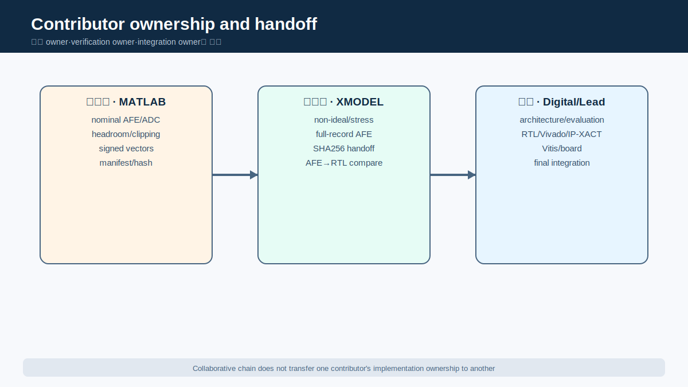

# Holter형 장시간 ECG 4-Class 분류를 위한 다중 시간축 SNN-Inspired Streaming Accelerator IP 설계 및 검증

# 초록

본 연구는 Holter형 장시간 심전도(ECG)의 국소 박동·파형 증거와 장기 지속성을 함께 반영하는 다중 시간축 SNN-inspired 분류 구조를 제안하고 streaming RTL accelerator IP로 구현·검증하였다. 공개 ECG의 NSR, CHF, ARR, AFF label을 1 kSPS signed 12-bit two’s-complement stream으로 변환하고, adaptive event, QRS LIF, RR variability, morphology, R-peak, ectopic-pair와 QRS-delay 증거를 정수형 event/state로 갱신하였다. 60초 Snapshot Readout은 국소 증거를 요약하고, 30개 Snapshot의 signed evidence를 Final Membrane에 누적해 WTA로 30분 decision을 생성한다. MATLAB nominal AFE+ADC, SystemVerilog XMODEL stress, signed-stream SHA256, Python reference, RTL/XSim, Vivado, AXI/IP-XACT, Vitis/MicroBlaze와 FPGA replay를 연속 evidence chain으로 구성하였다. Strict source-record-wise split과 final-test lock에서 chunk 결과는 29/36=80.56%, record-majority는 16/19=84.21%였다. Pure RTL은 LUT 9,719, FF 5,038, BRAM 0, DSP 0이며, FPGA final_pred/final_mem은 XSim과 각각 36/36 일치하였다. Direct RTL audit는 1,800,000-sample raw window 없이 고정 크기 persistent state를 갱신함을 보인다. 다만 database–class confounding, 모델 기반 analog 검증, physical AFE/ADC·임상 검증 부재가 남고 latency·power·energy benchmark는 `PENDING_EXTERNAL_BENCHMARK_IMPORT`다. 이는 임상 진단이 아니라 장시간 네 class 분류를 다중 시간축 state와 재현 가능한 RTL/IP/FPGA artifact로 연결한 반도체 IP 공학 결과다.

# 핵심어

ECG, Holter monitoring, SNN-inspired architecture, neuromorphic processing, streaming RTL, FPGA accelerator, Snapshot Readout, Final Membrane

# 1. 서론

## 1.1 연구 배경

대표적인 소비자용 단일유도 ECG 앱의 규제 문서 사례에서는 sinus rhythm과 atrial fibrillation 중심의 rhythm-screening 범위를 제시한다[1]. 이는 특정 제품 문서 사례이며 모든 wearable 제품이 동일한 기능을 가진다는 뜻이 아니다.

Ambulatory monitoring은 증상의 빈도와 관찰 목적에 따라 24/48시간 Holter 또는 더 긴 monitoring 방식이 사용될 수 있다[2].


*그림 1. Sample/beat 수준의 국소 evidence가 60초 Snapshot을 거쳐 30분 Final Membrane으로 축적되는 연구 동기. 이 그림은 architecture motivation을 설명하며 임상 Holter 인증이나 진단 기능을 의미하지 않는다.*

그림 1은 본 연구의 질문을 요약한다.

## 1.2 기존 기능 범위와 문제 정의

위 규제 문서 사례의 AF/sinus screening과 본 연구의 NSR/CHF/ARR/AFF 분류는 class 수만 다른 동일 문제가 아니다. Intended use와 dataset composition이 다르므로 commercial clinical 성능과 본 연구의 80.56% engineering result를 직접 비교하지 않는다.

또한 네 출력 모두를 “네 질환 진단”으로 표현해서는 안 된다.

## 1.3 장시간 ECG 분석의 공학적 필요성

ECG 분류에 사용되는 정보는 rhythm과 morphology 양쪽에 분포한다.

본 설계에서 Snapshot Readout은 60초 동안 관찰된 local rhythm/morphology evidence를 class score state로 요약한다.

## 1.4 연구 목표

본 연구의 목표는 공개 ECG에서 생성한 AFE+ADC-compatible signed 12-bit stream을 sample-by-sample으로 받아 네 public-dataset class를 분류하는 hardware-oriented architecture를 설계하고, model-based analog intent에서 FPGA replay까지 traceable하게 검증하는 것이다.

| 연구 목표 | 달성 결과 | 해석 경계 |
|---|---|---|
| 장시간 네 class 분류 | 30분 final-test 29/36=80.56% | public-dataset engineering result |
| 다중 시간축 구조 | 60초 Snapshot × 30 → Final Membrane | clinical temporal model claim 아님 |
| Streaming RTL | sample-by-sample fixed-size state, pure RTL BRAM 0/DSP 0 | BRAM 0만으로 전체 memory architecture를 증명하지 않음 |
| Mixed-signal handoff | input SHA256 36/36, gap=2 pred/mem 36/36 | model-based, physical analog 아님 |
| FPGA integration | board pred/mem 36/36 | functional equivalence, accuracy 100% 아님 |
| Accelerator benefit | 외부 benchmark import 대기 | latency/power/energy claim 보류 |

*표 1. 프로젝트 목표와 현재 달성 결과. 수치의 scope는 `global_metrics.yaml`과 claim registry를 따른다. [근거: CLM-003, CLM-004, CLM-008, CLM-011~CLM-018]*

표 1에서 accelerator benchmark만 pending이며, 구조·분류·통합·FPGA 목표는 각기 다른 evidence scope로 달성되었다.

## 1.5 주요 기여

본 연구의 기여는 다음 여섯 항목으로 명확히 구분된다.

1. 서로 다른 공개 DB의 NSR·CHF·ARR·AFF를 대상으로 하는 네 class 장시간 ECG 공학 문제를 정의하였다.
2. 60초 Snapshot과 30분 Final Membrane을 결합해 국소 증거와 장기 지속성을 분리·재결합하는 시간 계층을 제안하였다.
3. 리듬·형태 증거를 정수 counter, comparator, signed accumulator와 persistent state로 표현하는 SNN-inspired streaming 구조를 구현하였다.
4. MATLAB nominal intent, XMODEL non-ideal model, signed 12-bit stream과 locked digital output 사이의 traceable handoff를 구축하였다.
5. Python reference부터 RTL/XSim, Vivado, AXI/IP-XACT, Vitis/MicroBlaze와 FPGA replay까지 구현 사슬을 완결하였다.
6. Fixed commit, artifact SHA256, dataset manifest, ownership matrix, metric/claim registry와 자동 checker로 재현성과 주장 경계를 통제하였다.

[근거: CLM-001, CLM-003, CLM-007, CLM-011~CLM-013, CLM-023; `docs/CONTRIBUTIONS_AND_NOVELTY_KR.md`]

## 1.6 연구 범위

본 연구의 범위는 공개 digitized ECG를 이용한 model-based mixed-signal-to-digital classifier IP prototype이다. MATLAB/XMODEL은 실제 전극·PCB·silicon을 대체하지 않으며, FPGA는 packaged digital IP의 기능 등가성을 검증한다. 네 class는 동일 임상 cohort의 네 질환 확진이 아니고, 상용 wearable과의 clinical 성능 비교도 수행하지 않는다. 속도·전력은 구조의 부가 구현 평가 항목이며 primary contribution이 아니다.

# 2. 전체 시스템 구성

## 2.1 End-to-end signal and evidence flow

전체 흐름은 public ECG→MATLAB nominal→XMODEL stress→signed stream→Snapshot→Final Membrane→RTL/IP/FPGA replay다.


*그림 2. 세 fixed upstream component와 FPGA replay를 연결한 end-to-end flow. MATLAB/XMODEL은 model-based analog layer이고 FPGA는 digital integration proof이므로 physical mixed-signal SoC를 의미하지 않는다.*

그림 2는 signal contract와 단계별 equivalence를 연결한다.

## 2.2 MATLAB nominal AFE+ADC pre-validation

서민우의 MATLAB layer는 HPF, IA gain, 60 Hz notch, LPF와 12-bit ADC의 nominal transfer·dynamic range·coding을 검증하고 waveform/vector/CSV를 XMODEL로 전달한다. Physical tolerance나 silicon 검증은 아니다.

## 2.3 SystemVerilog XMODEL AFE+ADC verification

이수환의 XMODEL은 waveform agreement, PLI, wander/offset, R/C mismatch, GBW/VOS와 ADC non-ideal을 검토하고 long signed stream을 출력한다. Model-based handoff이며 transistor/post-layout/PCB/silicon 검증은 아니다.

## 2.4 Signed 12-bit digital interface

Analog-model output과 digital input의 boundary는 1 kSPS signed 12-bit two’s-complement stream으로 고정한다.

| Interface item | Canonical contract | 비고 |
|---|---:|---|
| Sample representation | signed 12-bit two’s-complement | analog voltage가 아니라 quantized code |
| Sample rate | 1,000 samples/s | accelerator throughput 수치가 아님 |
| Snapshot length | 60,000 samples | 60초 local readout |
| Final window | 30 snapshots | 1,800,000 samples, 30분 |
| Canonical XSim cadence | `sample_gap_cycles=2` | noncanonical debug cadence 제외 |
| Output | class + four signed Final Membranes | functional comparison 대상 |

*표 2. 완전한 input/output interface contract. 표의 1 kSPS는 input convention이지 accelerator throughput이 아니다. [근거: CLM-002, CLM-003, CLM-013; `components/digital_accelerator/reports/final/digital_input_contract.md`]*

표 2는 값·시간 경계·비교 대상을 고정하며 noncanonical cadence로 claim을 확장하지 않는다.

## 2.5 SNN-inspired digital accelerator

양건의 digital accelerator는 sample/beat evidence를 spike·counter·code·signed membrane으로 바꾸어 Snapshot, 네 Final Membrane과 class를 출력한다. Python/RTL을 비교하며 trained deep SNN이나 clinical rule engine을 주장하지 않는다.

## 2.6 RTL/IP/FPGA integration

Locked RTL은 XSim·Vivado·AXI/IP-XACT를 거쳐 Vitis/MicroBlaze와 FPGA에서 replay된다. Packaged digital 기능 등가성과 label accuracy는 분리한다.

## 2.7 Contributor ownership and handoff

Ownership은 서민우(MATLAB nominal/vector), 이수환(XMODEL/stress/signed handoff), 양건(digital/evaluation/RTL/IP/FPGA/총괄)으로 분리된다. [근거: `source_of_truth/ownership_matrix.csv`; `source_of_truth/upstream_commits.yaml`]



*그림 3. Fixed upstream의 ownership과 handoff. Physical/clinical validation owner는 없다.*

SHA256와 canonical output comparison이 분리된 ownership을 하나의 system evidence로 결합한다.

# 3. 데이터셋 및 평가 방법

## 3.1 Source databases

NSR·CHF·ARR·AFF는 각각 nsrdb[3]·chfdb[4]·mitdb[5]·afdb[6]에서 유래하며 표 3에 출처를 고정한다.

| Class | Fixed source/version | Source rate | DOI | License | Engineering label scope |
|---|---|---:|---|---|---|
| NSR | nsrdb 1.0.0 | 128 Hz | 10.13026/C2NK5R | ODC-By 1.0 | normal-sinus-rhythm labelled |
| CHF | chfdb 1.0.0 | 250 Hz | 10.13026/C29G60 | ODC-By 1.0 | CHF-database labelled |
| ARR | mitdb 1.0.0 | 360 Hz | 10.13026/C2F305 | ODC-By 1.0 | broad arrhythmia labelled |
| AFF | afdb 1.0.0 | 250 Hz | 10.13026/C2MW2D | ODC-By 1.0 | atrial-fibrillation labelled |

*표 3. 데이터베이스 출처·version·license. 동일 acquisition cohort가 아니다. [근거: EXT-003~008; `datasets/dataset_manifest.yaml`; `datasets/DATASET_LICENSES.md`]*

고정 version/DOI는 복원을 가능하게 할 뿐 lead·장비·population 차이를 제거하지 않으며 CHF·ARR label을 임상 확진으로 확대하지 않는다.

## 3.2 Dataset license and reproducible retrieval

Public repository는 raw waveform을 번들하지 않는다. Manifest가 version·DOI·records·rate·preprocessing을, expected-hash 파일이 source SHA256을 고정한다. Fetch/verify는 저장소 밖에 복원하고 license는 `DATASET_LICENSES.md`를 따르며 locked `.mem`과 평가/integration evidence만 유지한다.

## 3.3 Common 1 kSPS signed 12-bit conversion

서로 다른 source rate를 digital interface 앞에서 공통 1 kSPS signed 12-bit convention으로 변환한다. 이는 interface 통일이지 domain 차이 제거가 아니다.

## 3.4 60-second Snapshot construction

Snapshot은 60,000 accepted samples의 event/rhythm/morphology를 요약하는 60초 local readout이다.

## 3.5 30-minute chunk construction

Final chunk는 1,800,000 samples=30 Snapshots다. Final 36 chunks는 19 records에서 왔고 record-majority는 이 19개를 집계한다.

## 3.6 Source-record-wise split

Split unit은 `source_record_id`이며 한 record의 모든 chunk는 한 partition에만 속한다 [CLM-016].


*그림 3. 같은 source record의 chunk를 하나의 partition에만 배치하는 평가 흐름. 이 protocol은 direct record leakage를 막지만 database–class confounding을 제거하지 않는다.*

| Partition | Class별 chunk | 전체 chunk | Source-record support/역할 |
|---|---:|---:|---|
| Train | 17 × 4 | 68 | model fitting 확인 |
| Validation | 8 × 4 | 32 | Final Membrane model selection |
| Locked final-test | 9 × 4 | 36 | lock 후 1회 평가 |
| Final-test source records | class별 5/4/9/1 | 19 | record-majority aggregation unit |

*표 4. Dataset split. [근거: CLM-007,016; `components/digital_accelerator/configs/recordwise_resplit_seed20260808/strict_recordwise_split_seed20260808.json`]*

Chunk 균형은 record 균형이 아니며 final AFF 9 chunks는 한 record에서 왔다.

## 3.7 Model selection and final-test lock

Train/validation으로 `structural_guarded_silent_aff_1008710`을 선택·동결했다. Final test는 selection/search에 쓰지 않았고 count=1, `test_used_for_selection=false`다 [CLM-007].

## 3.8 Evaluation metrics

Accuracy, macro F1, balanced accuracy와 recall을 사용한다. Record-majority는 같은 final partition의 record별 다수결이며 독립 test가 아니다.

## 3.9 Database–class confounding

네 class는 네 source database와 각각 결합되어 있다. Record-wise split은 direct leakage를 막지만 database–class confounding을 제거하지 않는다. Database-specific acquisition 조건이나 장비·노이즈 특성이 class와 함께 학습될 가능성이 있으며, filename·path·database name·record ID는 입력 feature로 사용하지 않았다. 모든 class에 동일한 AFE/ADC와 signed 12-bit stream 규약을 적용했지만, 이것만으로 domain confounding이 제거되었다고 주장하지 않는다.


*그림 4. Record leakage 방지와 unresolved domain confounding을 분리한 claim boundary. 이 한계는 classification generalization에 영향을 주지만 RTL correctness, bit-exact equivalence, IP packaging, board replay와 implementation resource evidence를 무효화하지 않는다.*

# 4. 제안 SNN-Inspired 디지털 구조

## 4.1 설계 철학

Waveform을 긴 feature array로 저장하지 않고 ECG observation을 event/persistent state로 바꾸어 sample·beat·segment boundary에서 계층적으로 갱신한다.


*그림 5. Event/state→Snapshot→Final Membrane 시간 계층. Threshold를 새로 정의하지 않는다.*


*그림 5-1. Verified RTL block을 묶은 상세 구조. Conceptual grouping이며 literal netlist/threshold 주장이 아니다. [근거: CLM-023; `tables/streaming_state_inventory.csv`]*

## 4.2 Adaptive event encoder

`ecg_event_encoder_adaptive`는 현재/이전 signed sample의 delta를 계산해 up/down/strong event를 만들고 adaptive calibration state로 QRS·morphology front end를 구동한다. Amplitude invariance 보장은 아니다.

## 4.3 QRS LIF detector

`qrs_lif_detector`는 strong event를 leak membrane에 적분하고 threshold에서 `beat_spike`·reset·refractory를 발생시킨다. 임상 QRS annotation은 아니다.

## 4.4 Beat/RR timing

`beat_spike` 사이 tick으로 RR code를 만들고 PNN·RDM·ectopic block에 전달한다. 내부 detector event 간격이지 clinical annotation은 아니다.

## 4.5 PNN rhythm predictor

`pnn_rhythm_predictor`는 RR hypothesis winner를 순차 탐색하고 다음 RR의 match/mismatch spike를 Snapshot rhythm state로 보낸다. Probabilistic neural network 주장은 아니다.

## 4.6 RDM variability

`rdm_variability_neuron`은 연속 RR의 absolute difference를 multi-level spike/code로 변환해 variability를 표현하며 표준 HRV metric과 동일하지 않다.

## 4.7 DSCR morphology

`dscr_spike_counter`는 filter/slope membrane에서 valid slope와 sign-flip event를 만들어 morphology counter로 전달한다.

## 4.8 RAM peak evidence

`ram_peak_accumulator`는 beat window의 baseline 대비 peak를 code로 만들고 Snapshot sum/count에 누적한다. Lead/domain 영향이 가능하다.

## 4.9 Ectopic-pair evidence

`ectopic_pair_neuron`은 RR의 early/late 교대에서 pair spike를 만들어 compensation-like rhythm evidence를 제공하나 ectopic annotation을 확정하지 않는다.

## 4.10 QRS MAF evidence

`qrs_maf_neuron`은 120-sample finite lookback에서 width·complexity·energy·pre-QRS evidence를 Snapshot에 보낸다. 30분 buffer도 임상 QRS 측정도 아니다.

## 4.11 RBBB-like delay evidence

`rbbb_qrs_delay_bank`는 terminal activity와 반복 wide/delay pattern을 morphology evidence로 만들며 RBBB 진단을 출력하지 않는다.

## 4.12 Snapshot class readout

`class_score_neurons`는 PNN match/mismatch, RDM level, DSCR slope/flip, RAM code, ectopic pair, QRS-MAF, width/energy, RBBB-like delay 등의 event를 60초 window 동안 counter와 signed class membrane으로 통합한다. Feature별 fixed signed contribution은 특정 class membrane을 excitation하거나 inhibition한다.

| Block | ECG-domain motivation | RTL event/state | Snapshot 기여 | 해석 한계 |
|---|---|---|---|---|
| Adaptive encoder | 급격한 slope 변화 | delta/up/down/strong event | beat·morphology front end | amplitude invariance 보장 아님 |
| QRS LIF | QRS-like event burst | membrane, leak, refractory, beat spike | 모든 beat-based block timing | clinical QRS detector claim 아님 |
| PNN | RR prediction consistency | match/mismatch spike | regular/irregular rhythm | probabilistic NN 아님 |
| RDM | RR 변화량 | level spike/code | variability strength | standard HRV metric과 동일 아님 |
| DSCR | slope sign complexity | valid slope/sign flip | morphology complexity | 특정 질환 morphology 확정 아님 |
| RAM | R-peak amplitude | threshold-bank peak code | amplitude behavior | database/lead 영향 가능 |
| Ectopic pair | early/late compensation pattern | pair spike | ARR-like rhythm evidence | ectopic annotation 확정 아님 |
| QRS MAF | width/complexity/energy | abnormal spikes/codes | morphology abnormality | proxy evidence |
| RBBB delay bank | wide terminal activity | delay/segment spikes | conduction-delay-like evidence | clinical RBBB 진단 아님 |

*표 5. Feature/event block. Threshold authority는 locked RTL/config다. [근거: CLM-003; digital `c6b80de...`; `components/digital_accelerator/rtl/core/`]*

각 block은 독립 diagnosis가 아니라 Snapshot signed class state의 입력이다.

## 4.13 Final Membrane accumulation

`final_membrane_layer`는 Snapshot winner만으로 확정하지 않고 beat·rhythm·morphology evidence를 signed 32-bit long-window state에 누적한다. 30번째 boundary에서 base membrane과 structural overlay를 계산해 장기 persistence를 표현한다 [CLM-003].

## 4.14 Guard/rescue/veto/silent-AFF

Locked overlay는 base guard, rescue/veto와 silent-AFF gate로 membrane update를 제한한다. 이는 clinical rule engine이나 단일 feature 진단이 아니다.

## 4.15 Final WTA

네 membrane은 strict `>`와 NSR→CHF→ARR→AFF 순서의 승자독식 방식(winner-take-all, WTA)으로 비교되어 tie까지 결정적이다. Threshold authority는 locked RTL/config다.

## 4.16 SNN-inspired claim boundary

Event, leak/threshold membrane, spike/counter, time accumulation과 WTA 때문에 SNN-inspired라 부른다. Trained deep SNN, backpropagation-through-time, STDP, online learning, biophysical equivalence는 주장하지 않는다.

# 5. MATLAB 및 XMODEL 기반 AFE/ADC 검증

## 5.1 Nominal analog-chain intent

MATLAB nominal chain은 HPF 약 0.4823 Hz, IA gain 201, 60 Hz notch, LPF 약 150.15 Hz와 ±1.65 V 12-bit ADC를 정의한다.

## 5.2 Frequency and gain response

Frequency artifact는 5/10/40 Hz passband, cutoff와 60 Hz notch target을 기록한다.

## 5.3 ADC range, clipping and headroom

대표 네 class 60초 record는 clipping 0%였고 최소 headroom은 ARR의 1.019633440086 V였다.


*그림 6. 대표 네 class nominal record의 clipping 0%와 최소 headroom. Selected model-based record에 대한 결과이며 physical rail measurement가 아니다.*

| Class | ADC code range | Clipping | Minimum rail headroom |
|---|---:|---:|---:|
| NSR | 1909–2525 | 0% | 1.264815619462 V |
| CHF | 1701–2739 | 0% | 1.092577998716 V |
| ARR | 1265–2626 | 0% | 1.019633440086 V |
| AFF | 1612–2452 | 0% | 1.299625888976 V |

*표 6. MATLAB nominal dynamic range. 대표 60초 record이며 physical 보증이 아니다. [근거: CLM-015, CLM-024; `components/matlab_prevalidation/matlab_afe_validation/results_dataset/afe_dynamic_range_headroom_summary.csv`; 서민우; `907f7e1...`]*

모든 selected record가 rail 안이지만 tolerance/offset stress는 XMODEL과 분리한다.

## 5.4 Reference-vector package

MATLAB package는 class별 input/stage/signed/offset-binary/two’s-complement vector와 SHA256 manifest를 제공한다.

## 5.5 Emulator–XMODEL waveform agreement

36개 60초 segment의 settling 후 emulator↔XMODEL mean RMS는 1.95 LSB, lag는 0이었다 [CLM-014].


*그림 7. XMODEL evidence의 세 범위. Waveform agreement, stress scope와 digital handoff를 요약하지만 transistor-level, post-layout, PCB 또는 silicon validation은 포함하지 않는다.*

## 5.6 PLI and baseline stress

PLI stress에서 60 Hz target의 RMS residual은 0.92 mV였지만 50 Hz injection은 118 mV로 커졌다. 설계 notch target은 60 Hz이며, 50 Hz 환경은 center-frequency retuning과 별도 system verification이 필요하다 [CLM-025].

Offset/wander는 HPF settling과 residual을 확인했으며 ±200 mV의 settling 후 clip 0은 model scope다.

## 5.7 Component mismatch

Worst-direction R/C model은 0.1%/1% mismatch CMRR 100.7/80.0 dB, 1% residual 6.54 mV와 clip 0을 보였다. 30분 final_pred direct sweep은 아니므로 분류 robustness로 확대하지 않는다 [CLM-026].

## 5.8 Op-amp and ADC non-ideal stress

GBW/VOS model은 output/headroom을 검토했다. 대표 4-class ADC perturbation 16 case는 final_pred 15/16을 유지했고 2 LSB rms noise의 NSR 한 건만 변했다. 전 조건 불변 주장은 아니다 [CLM-027].

## 5.9 Long-record signed-stream generation

Full-record AFE에서 만든 36 final chunks는 board-replay input과 SHA256 36/36 동일했다.


*그림 8. AFE-generated chunk의 byte identity와 canonical gap=2 output identity. Identity는 functional handoff를 증명하지만 label correctness나 physical analog accuracy를 100%로 만들지 않는다.*

| XMODEL item | Verified result | Direct scope | Limitation |
|---|---:|---|---|
| Emulator↔XMODEL | mean RMS 1.95 LSB, lag 0 | 36×60초, settling 후 | model-to-model; local QRS deviation 존재 |
| 60/50 Hz PLI | RMS residual 0.92/118 mV | 0.5 V common + 1 mV differential injection | 60 Hz target; 50 Hz retuning 미검증 |
| Offset/wander | ±200 mV settling 후 clipping 0 | XMODEL stress | transient·physical electrode 미포함 |
| R/C mismatch | 0.1%: 100.7 dB; 1%: 80.0 dB | modeled CMRR | 30분 final_pred direct sweep 아님 |
| ADC non-ideal regression | final_pred 15/16 유지 | 대표 4 chunks×4 perturbations | 2 LSB rms NSR 1건 변화 |
| Signed handoff | input SHA256 36/36; gap=2 pred/mem 36/36 | 36 final chunks | identity/equivalence, label accuracy 아님 |

*표 7. XMODEL stress/signed handoff. 행별 scope를 합치지 않는다. [근거: CLM-012~014,025~027; `components/afe_xmodel/docs/afe_stress/AFE_xmodel_verification.md`; 이수환; `4756a508...`]*

Waveform·stress·classifier regression·identity의 단위가 다르므로 AFE의 전 환경 분류 보장을 주장하지 않는다.

## 5.10 Model-based verification boundary

MATLAB과 XMODEL은 nominal behavior와 non-ideal sensitivity를 빠르게 탐색하고 digital input contract를 검증하는 데 유용하다. 그러나 이는 physical mixed-signal SoC를 의미하지 않는다. 실제 전극 acquisition, fabricated SoC, ADC silicon, transistor-level 및 post-layout 결과는 본 연구에서 검증하지 않았다.

# 6. RTL 및 FPGA 구현

## 6.1 RTL datapath

`snn_ecg_30min_final_top`은 sample acceptance, 60초 start/run/commit과 Final Membrane pipeline을 연결한다.

## 6.2 Streaming persistent-state structure

Complete raw window 대신 sample마다 fixed-size event/state를 갱신한다 [CLM-023]. 근거는 top/core/final RTL의 direct inventory이며 BRAM/FF만의 추론이 아니다. 30분 raw storage는 다음과 같다.

```text
1,800,000 × 12 bits
= 21,600,000 bits
= 2,700,000 bytes
≈ 2.7 MB (decimal)
```

설계는 previous sample, finite lookback, RR/counter와 membrane을 유지한다. 2.7 MB는 회피한 raw window이지 measured saving이 아니며 unresolved width는 inventory에 남긴다.

| State group | 대표 persistent state | Update boundary | Full-window relation |
|---|---|---|---|
| Input/event | previous sample, delta, adaptive histogram | accepted sample/calibration | 30분 raw array 아님 |
| Beat/rhythm | QRS membrane, refractory, RR/predictor/RDM | sample 또는 beat | finite counters/state |
| Morphology | DSCR, RAM peak, ectopic, QRS MAF, RBBB-like | sample/beat | QRS MAF lookback 120 samples |
| Snapshot | 19 evidence counters, class-score state | event/60초 boundary | Snapshot에서 reset/commit |
| Final | 4 vote states, 12 evidence sums, base/struct/final membranes | Snapshot/30분 boundary | 30 Snapshot에 걸쳐 유지 |
| Unresolved aggregate | parameterized PNN/RAM/QRS/class-score groups | module-specific | exact total bit 절감률 미산출 |

*표 8. Streaming-state evidence. 2.7 MB는 measured saving이 아니다. [근거: CLM-023; `docs/STREAMING_STATE_MEMORY_KR.md`; `tables/streaming_state_inventory.csv`; `c6b80de...`]*

State는 존재하지만 1,800,000-sample array로 증가하지 않는다. Exact aggregate가 unresolved이므로 절감률은 없다.

## 6.3 Top-level FSM

Top FSM은 chunk 초기화, Snapshot segment start, sample run, segment commit과 final completion을 순차 제어한다.

## 6.4 Snapshot and final-decision control

Accepted sample은 `valid&&ready`, Snapshot은 timer terminal, final은 30번째 commit에서 발생한다. Latched valid/class와 pipeline이 경계를 보존하며 canonical cadence는 gap=2다.

## 6.5 Pure RTL implementation

Vivado pure RTL implementation은 LUT 9,719, FF 5,038, BRAM 0, DSP 0을 사용했고 WNS는 8.184 ns였다.

## 6.6 AXI/IP-XACT packaging

Core는 AXI wrapper/sample feeder와 함께 IP-XACT component로 package됐다.

## 6.7 Vitis/MicroBlaze replay system

MicroBlaze whole system(processor/memory/UART/feeder/core)은 LUT 12,494, register 8,494, BRAM 16, DSP 3, setup WNS 0.097 ns였다.

| Implementation profile | LUT | FF/register | BRAM | DSP | Timing closure |
|---|---:|---:|---:|---:|---:|
| Pure RTL accelerator | 9,719 | 5,038 | 0 | 0 | WNS 8.184 ns |
| MicroBlaze full-replay system | 12,494 | 8,494 | 16 | 3 | setup WNS 0.097 ns |

*표 9. RTL/MicroBlaze resources. Scope가 다르고 WNS는 latency가 아니다. [근거: CLM-008, CLM-009, CLM-010; `components/digital_accelerator/reports/final/final_metrics.json`]*

두 행은 core와 whole system이므로 차이를 accelerator overhead로 해석하지 않는다.

## 6.8 FPGA replay

MicroBlaze가 36 `.mem` case를 feeder로 보내고 core가 1,800,000 samples·30 Snapshots 뒤 class/membranes를 UART로 출력한다.


*그림 9. Locked integer reference에서 RTL/XSim, Vivado/IP, MicroBlaze system, FPGA replay로 이어지는 validation hierarchy. 각 layer는 implementation reproduction을 검증하며 ground-truth label correctness는 별도 축이다.*

## 6.9 Accuracy and equivalence separation

Board final prediction은 expected output과 36/36 일치했고 Final Membrane도 36/36 exact match였다. 이 board 36/36은 locked expected output에 대한 functional equivalence이며, ground-truth label 기준 분류 정확도 100%를 의미하지 않는다.

# 7. 실험 결과

## 7.1 Train and validation

Train은 61/68=89.71%, validation은 32/32=100.00%였다. Validation은 model-selection only이며 validation 100%를 final generalization result로 보고하지 않는다.

## 7.2 Locked final-test chunk result

Locked 30분 chunk는 29/36=80.56%, macro F1 80.44%, balanced accuracy 80.56%였다 [CLM-004].

## 7.3 Record-majority result

같은 final partition의 record-majority는 16/19=84.21%, macro F1 80.80%, balanced accuracy 88.19%였다 [CLM-005].

## 7.4 Class-wise confusion analysis

Chunk confusion matrix에서 NSR은 9/9, CHF는 6/9, ARR은 7/9, AFF는 7/9였다.


*그림 10. Final-test chunk와 record-majority를 중심에 두고 validation은 model-selection로 분리한 결과. Database–class confounding과 small record support가 남는다.*

| Evaluation | Correct/total | Accuracy | Macro F1 | 해석 |
|---|---:|---:|---:|---|
| Train | 61/68 | 89.71% | — | fitting evidence |
| Validation | 32/32 | 100.00% | — | model selection only |
| Locked final-test chunk | 29/36 | 80.56% | 80.44% | primary held-out result |
| Final-test record-majority | 16/19 | 84.21% | 80.80% | same partition aggregation |

*표 10. Classification results. Validation은 final 성능이 아니다. [근거: CLM-004~007; `components/digital_accelerator/reports/final/final_metrics.json`]*

Record-majority는 같은 test의 집계이므로 독립 재현이 아니다.

| Ground truth \ Prediction | NSR | CHF | ARR | AFF | Recall |
|---|---:|---:|---:|---:|---:|
| NSR | 9 | 0 | 0 | 0 | 100.00% |
| CHF | 0 | 6 | 0 | 3 | 66.67% |
| ARR | 2 | 0 | 7 | 0 | 77.78% |
| AFF | 1 | 0 | 1 | 7 | 77.78% |

*표 11. Final chunk confusion matrix(행=truth, 열=prediction). [근거: CLM-004; `components/digital_accelerator/reports/final/final_metrics.json`; `c6b80de...`]*

CHF 3건→AFF, ARR 2건→NSR, AFF 각 1건→NSR/ARR이며 CHF recall 66.67%가 가장 낮다. Support=9이므로 균질 성능을 주장하지 않는다.

## 7.5 MATLAB nominal result

MATLAB nominal은 clipping 0%, minimum headroom 약 1.0196 V와 signed vectors를 제공했다.

## 7.6 XMODEL result

Emulator–XMODEL mean RMS 1.95 LSB, lag 0은 model-to-model 정합성을 지원한다.

## 7.7 AFE input SHA256 identity

AFE final chunks와 board inputs는 SHA256 36/36 동일했다 [CLM-012].

## 7.8 Canonical AFE-to-RTL equivalence

Canonical `sample_gap_cycles=2`에서 AFE→RTL pred/mem은 36/36 일치했다 [CLM-013].

## 7.9 FPGA functional equivalence

FPGA pred/mem은 expected output과 36/36 일치해 hidden-state mismatch도 검사했다. Label accuracy는 29/36이다 [CLM-011].

| Integration boundary | Result | 증명하는 것 | 증명하지 않는 것 |
|---|---:|---|---|
| AFE chunk ↔ board input | SHA256 36/36 | byte-level input identity | analog physical accuracy |
| AFE chunk ↔ locked RTL | pred/mem 36/36 | canonical gap=2 functional reproduction | label accuracy 100% |
| XSim ↔ FPGA board | pred/mem 36/36 | packaged digital system equivalence | clinical validity |
| Board output ↔ label | 29/36 | current dataset classification | domain generalization |

*표 12. Integration equivalence와 경계. [근거: CLM-011~013,021; `components/afe_xmodel/docs/integration_latest/afe_locked_rtl_integration_36case_compare.csv`; `components/digital_accelerator/reports/final/board_replay_36_batch_summary.json`]*

세 36/36은 bytes/RTL/board identity이고 29/36만 label accuracy다.

## 7.10 Hardware resource and timing closure

Pure RTL 0 BRAM/0 DSP와 두 profile의 positive WNS는 FPGA feasibility를 지원한다.

## 7.11 Streaming-memory evidence

RTL inventory는 fixed-size event/state와 60초/30분 commit을 확인했다. 21,600,000 bits=2,700,000 bytes≈2.7 MB는 회피한 raw window이지 measured memory가 아니다 [CLM-023].

## 7.12 Accelerator benchmark status

Accelerator-benefit benchmark status는 `PENDING_EXTERNAL_BENCHMARK_IMPORT`이다.

| Benchmark item | Current value | Import gate |
|---|---|---|
| CPU kernel/end-to-end latency | Pending independent benchmark import | environment와 raw runs 검증 |
| RTL processing latency | Pending independent benchmark import | cycle definition과 scope 검증 |
| RTL throughput/realtime headroom | Pending independent benchmark import | input/decision unit 검증 |
| Power/energy | Pending independent benchmark import | estimated vs measured 분리 |
| Board latency/power | Pending independent benchmark import | instrumented board evidence 필요 |

*표 13. Benchmark pending status. Null은 zero가 아니다. [근거: CLM-018; `benchmarks/accelerator_benefit/README.md`]*

Exact C++는 외부 작업 중이며 정식 import 전에는 latency·throughput·speedup·power·energy 결론이 없다.

# 8. 종합 논의

## 8.1 Classification result interpretation

Locked chunk 80.56%와 record-majority 84.21%는 현 공개 데이터 구성에서 장시간 four-class decision이 동작했음을 보인다. CHF 6/9와 ARR·AFF 7/9는 class별 차이를 드러내지만, database confounding과 AFF 한 record 때문에 임상 일반화를 증명하지 않는다. 따라서 validation 100%가 아니라 one-time locked final test를 중심 결과로 둔다.

## 8.2 Multi-timescale architecture significance

Snapshot은 60초 event를 국소 class evidence로 압축하고 Final Membrane은 30개 구간의 signed persistence를 누적한다. 일시적 local winner와 30분 결론을 분리했다는 구조적 의미가 있으나, Snapshot-only 대조가 없어 정확도 향상량은 주장하지 않는다.

## 8.3 SNN-inspired realization significance

Dense network의 full-vector 연산과 달리 accepted sample/event에서 정수 state를 갱신하고 beat·Snapshot·final boundary에서 상위 state를 commit한다. LIF, event pulse, class membrane과 WTA가 SNN-inspired 성격을 주지만 fixed weight·structural overlay를 쓰므로 trained deep SNN과 구분한다.

## 8.4 Hardware implementation significance

RTL, positive WNS, IP-XACT, MicroBlaze와 FPGA replay는 cadence·reset·boundary·tie-break가 hardware에서도 보존됨을 검증한다. BRAM 0·DSP 0은 integer streaming 구조와 일관되지만 저전력 증거가 아니며, board 36/36은 accuracy 29/36과 별개의 구현 재현성이다.

## 8.5 Mixed-signal-to-digital traceability

MATLAB intent, XMODEL stress, signed stream, input SHA256와 RTL output을 연결해 analog–digital 호환을 artifact boundary로 고정하였다. Input bytes와 pred/mem identity를 분리해 coding과 state 오류를 구분하며, physical analog 검증은 아니지만 향후 PCB/ADC 비교 기준을 제공한다.

## 8.6 Reproducibility and evidence control

Fixed commit, file SHA256, dataset version/DOI/hash, owner와 claim status는 어떤 byte와 수치를 어떤 범위로 인용했는지 재현하게 한다. Raw data 비번들 정책은 manifest로 보완하고 checker는 benchmark와 equivalence/accuracy 혼동을 차단한다.

## 8.7 Comparison scope and claim boundaries

FDA 문서는 기능 범위의 배경 사례일 뿐 성능 비교 대상이 아니다. Accuracy는 public-DB engineering result, XMODEL은 model-based result, 자원/WNS는 fixed implementation evidence다. 상용 우월성·physical SoC·저전력을 주장할 수 없지만 confounding이 same-input RTL/IP/FPGA 등가성을 무효화하지도 않는다.

# 9. 창의성·기술성·완성도

## 9.1 설계적 차별성

60초 Snapshot과 30분 Final Membrane이 국소 증거와 장기 persistence를 분리하며, rhythm/morphology를 fixed-width event/state로 바꿔 full raw window 없이 처리한다. 이는 임상 우월성이 아니라 RTL에서 확인되는 시간·상태 구조의 차별성이다 [CLM-003, CLM-023].

## 9.2 기술적 난이도

Signed coding, accepted-sample cadence, QRS/RR/morphology, Snapshot commit, Final Membrane와 WTA를 fixed-width RTL로 연결하고 XMODEL–gap=2–IP-XACT–MicroBlaze–FPGA까지 같은 contract를 유지한 점이 기술적 난이도다.

## 9.3 구현 완결성

Locked reference, synthesizable RTL, XSim, Vivado, packaged IP, Vitis artifact와 36-case board evidence가 존재한다. Pure RTL과 whole MicroBlaze 자원을 분리하고 WNS를 latency로 오해하지 않는다.

## 9.4 검증 완결성

Final-test 29/36, XMODEL RMS, input SHA, canonical RTL과 board equivalence를 다른 검증 축으로 분리했다. Commit·hash·owner·claim registry와 fail-closed checker가 수치와 금지 범위를 유지한다.

## 9.5 대회 평가 관점의 핵심 가치

핵심 가치는 장시간 four-class 문제, 다중 시간축 state, mixed-signal handoff와 FPGA IP가 한 evidence chain에서 닫힌다는 점이다. Confounding을 공개하면서 hardware correctness를 독립적으로 방어하며, benchmark는 네 class streaming classifier라는 중심 기여를 보조한다.

# 10. 한계 및 향후 과제

표 15는 한계의 영향, 남는 evidence와 다음 실험을 함께 고정한다.

| Limitation | 현재 영향 | 여전히 유효한 evidence | 다음 검증 |
|---|---|---|---|
| Database–class confounding | physiology와 domain 기여 분리 불가 | locked accuracy·RTL equivalence | same-acquisition/cross-database protocol |
| 제한된 source records | class별 불확실성, AFF 1 record | 36-chunk one-time result | larger independent record cohort |
| Snapshot/Final ablation 부재 | 시간 계층의 성능 기여량 미확정 | locked full architecture | 같은 split의 Snapshot-only/base/full ablation |
| Physical AFE/ADC 부재 | 실제 electrode·component robustness 미확정 | MATLAB/XMODEL model result | AFE PCB·ADC 계측과 signed stream 비교 |
| ASIC/post-layout 부재 | area·timing·power sign-off 없음 | FPGA implementation | synthesis-to-layout, STA, extraction, measurement |
| Clinical validation 부재 | 진단·의료 효능 주장 불가 | public-dataset engineering result | IRB/clinical cohort와 전문가 reference |
| Exact C++ baseline 진행 중 | software comparison 미확정 | RTL function/resource | 동일 input·decision 범위의 formal import |
| Accelerator benchmark pending | speed·energy 이득 미확정 | positive WNS | latency/throughput/power package import |
| Board timing/power 미측정 | system latency·energy 미확정 | 36/36 board equivalence | transport와 compute를 분리한 계측 |
| Same-acquisition cohort 부재 | DB와 class 분리 불가 | interface·IP evidence | 동일 device/lead의 multi-class evaluation |

*표 14. 한계, 영향, 잔존 evidence와 필요한 다음 검증. Pending work를 완료로 표현하지 않는다. [근거: CLM-017~CLM-020, CLM-022; `docs/LIMITATIONS_AND_CLAIM_BOUNDARY_KR.md`; `benchmarks/accelerator_benefit/README.md`]*

이 한계는 generalization과 physical/commercial claim을 제한하지만 same-input 기능 등가성과 fixed implementation evidence는 유지한다.

## 10.1 Database–class confounding

Record-wise split은 동일 record leakage를 막지만 class와 DB의 결합은 남는다. 다음은 same-acquisition 또는 cross-domain protocol이며 locked final test는 재튜닝에 쓰지 않는다.

## 10.2 Dataset support and generalization

Final test는 36 chunks·19 records이고 class별 record support는 5/4/9/1이다. AFF 한 record 때문에 chunk 균형이 subject 다양성을 보장하지 않으므로 독립 records가 더 필요하다.

## 10.3 Snapshot/Final Membrane ablation

Snapshot-only, majority, base와 full overlay의 locked ablation이 없어 Final Membrane의 향상량은 미확정이다. Frozen variants를 별도 untouched cohort에서 비교해야 하며 fixed evidence 구조와 trained SNN 비교도 후속 과제다.

## 10.4 Physical AFE/ADC validation

MATLAB/XMODEL은 electrode·PCB parasitic·ADC INL/DNL를 포함한 물리 측정이 아니다. Physical AFE/ADC code를 reference vector와 비교해야 하며 현재 signed handoff는 유효하다.

## 10.5 ASIC/post-layout validation

FPGA 자원/WNS는 ASIC sign-off가 아니다. Standard-cell synthesis, place-and-route, extracted STA, post-layout simulation과 silicon 계측 전에는 RTL/IP prototype만 주장한다.

## 10.6 Clinical validation

Public-dataset label은 임상 확진이 아니다. Accuracy/equivalence는 engineering evidence로 남지만 임상 확장은 승인 protocol, 전문가 reference와 prospective cohort가 필요하다.

## 10.7 Exact C++ CPU baseline

Exact C++는 외부 작업 중이며 검증된 commit·hash·환경·raw result가 없어 수치를 인용하지 않는다. Import 때 kernel/end-to-end와 30분 decision unit을 고정한다.

## 10.8 Accelerator-benefit benchmark

Positive WNS는 implementability만 보인다. Cycle-derived RTL, measured software/board와 estimated/measured power를 분리한 package가 필요하며 상태는 `PENDING_EXTERNAL_BENCHMARK_IMPORT`다 [CLM-018].

## 10.9 Board latency and power

Board 36/36은 유효하지만 UART/host와 accelerator active interval을 분리한 latency·rail power는 없다. Counter/GPIO/ILA와 idle/active power 계측이 필요하다.

## 10.10 Same-acquisition multi-class validation

동일 device·lead·protocol의 frozen record-wise test가 database identity와 physiology를 분리하는 핵심 다음 단계다. 그 전에는 wearable 적용을 architecture potential로만 표현한다.

# 11. 결론

본 연구는 Holter형 장시간 ECG에서 local beat/morphology evidence와 long-term persistence를 함께 반영하기 위해 60초 Snapshot Readout과 30분 Final Membrane Readout을 결합한 multi-timescale SNN-inspired event/state architecture를 제안하였다. Public ECG를 1 kSPS signed 12-bit stream으로 통일하고, adaptive event, QRS LIF, RR prediction/variability, morphology, amplitude, ectopic-like와 delay evidence를 integer state로 변환하였다. Direct RTL state audit에 따라 전체 1,800,000-sample raw window를 먼저 저장하지 않고 streaming state를 갱신하며 [CLM-023], locked Final Membrane과 WTA가 네 public-dataset class를 결정한다.

Strict source-record-wise split과 one-time locked final-test evaluation에서 29/36=80.56%, macro F1 80.44%를 얻었고 record-majority는 16/19=84.21%였다. Pure RTL은 9,719 LUT, 5,038 FF, 0 BRAM, 0 DSP와 positive WNS를 달성하였다. MATLAB nominal pre-validation, XMODEL stress, AFE-generated input SHA256 36/36, canonical AFE-to-RTL pred/mem 36/36, FPGA board pred/mem 36/36을 연결함으로써 model-based analog intent에서 packaged digital IP까지 traceable한 verification chain을 구축하였다.

본 결과의 의미는 “100% 정확한 임상 진단기”나 “fabricated low-power SoC”가 아니라, 장시간 ECG evidence를 다중 시간축 state로 구성하고 이를 재현 가능한 RTL/IP/FPGA artifact로 완성했다는 데 있다. Database–class confounding, 제한된 cohort, physical analog/silicon gap과 pending benchmark를 명시적으로 남겼으며, 향후 same-acquisition validation, ablation, independent accelerator benchmark와 ASIC implementation으로 확장해야 한다.

# 참고문헌

[1] U.S. Food and Drug Administration, “De Novo Classification Request for ECG App (DEN180044),” regulatory decision summary, 2018-08-14. https://www.accessdata.fda.gov/cdrh_docs/reviews/DEN180044.pdf

[2] ACC/AHA/HRS, “2018 ACC/AHA/HRS Guideline on the Evaluation and Management of Patients With Bradycardia and Cardiac Conduction Delay,” peer-reviewed clinical guideline, 2018. https://doi.org/10.1161/CIR.0000000000000628

[3] George Moody / PhysioNet, “MIT-BIH Normal Sinus Rhythm Database v1.0.0,” doi:10.13026/C2NK5R, ODC-By 1.0. https://physionet.org/content/nsrdb/1.0.0/

[4] PhysioNet, “BIDMC Congestive Heart Failure Database v1.0.0,” doi:10.13026/C29G60, ODC-By 1.0; Baim et al., JACC 7(3), 1986. https://physionet.org/content/chfdb/1.0.0/

[5] George Moody and Roger Mark / PhysioNet, “MIT-BIH Arrhythmia Database v1.0.0,” doi:10.13026/C2F305, ODC-By 1.0; Moody and Mark, IEEE EMBS 20(3), 2001. https://physionet.org/content/mitdb/1.0.0/

[6] George Moody and Roger Mark / PhysioNet, “MIT-BIH Atrial Fibrillation Database v1.0.0,” doi:10.13026/C2MW2D, ODC-By 1.0; Moody and Mark, Computers in Cardiology 10, 1983. https://physionet.org/content/afdb/1.0.0/

[7] Goldberger AL et al., “PhysioBank, PhysioToolkit, and PhysioNet,” Circulation 101(23):e215–e220, 2000, RRID:SCR_007345. https://doi.org/10.1161/01.CIR.101.23.e215

[8] Open Data Commons, “Attribution License v1.0.” https://opendatacommons.org/licenses/by/1-0/

# 부록 A. 핵심 수치 표

| 범주 | 핵심 수치 | Claim/scope |
|---|---|---|
| 입력·시간축 | signed 12-bit, 1 kSPS; 60초×30 | CLM-002,003 |
| 평가 | train 61/68; validation 32/32(selection only) | CLM-006,007 |
| Final | 29/36=80.56%, F1 80.44%; record 16/19=84.21%, F1 80.80% | CLM-004,005 |
| MATLAB | clipping 0%; min headroom 약 1.0196 V | CLM-015,024; representative nominal |
| XMODEL | RMS 1.95 LSB, lag 0 | CLM-014; model-to-model |
| 통합 | SHA 36/36; gap=2 pred/mem 36/36 | CLM-012,013 |
| Pure RTL | 9719 LUT, 5038 FF, 0 BRAM, 0 DSP; WNS 8.184 ns | CLM-008,009 |
| MicroBlaze | 12494 LUT, 8494 reg, 16 BRAM, 3 DSP; WNS 0.097 ns | CLM-010; whole system |
| Streaming | 21,600,000 bit=2,700,000 byte≈2.7 MB raw window 회피 | CLM-023; measured saving 아님 |
| Board/benchmark | pred/mem 36/36; `PENDING_EXTERNAL_BENCHMARK_IMPORT` | CLM-011,018 |

*표 A-1. Integrated source-of-truth 핵심 수치. 상세 evidence path와 limitation은 `source_of_truth/global_metrics.yaml`을 따른다.*

# 부록 B. Claim 및 evidence 추적

| 범주 | Claim | 핵심 evidence / owner |
|---|---|---|
| 구조·stream | CLM-001~003,023 | digital report/RTL/inventory / 양건 |
| 평가·protocol | CLM-004~007,016~017 | `final_metrics.json`, split/limitation docs / 양건 |
| RTL/IP/board | CLM-008~011 | Vivado/board JSON / 양건 |
| XMODEL·통합 | CLM-012~014,025~027 | XMODEL report/integration CSV / 이수환 |
| MATLAB | CLM-015,024 | dynamic-range CSV / 서민우 |
| Pending·금지 | CLM-018~022 | claim registry/benchmark placeholder / team |

*표 B-1. Major report statement의 claim/evidence mapping. 전체 machine-readable mapping은 `reports/INTEGRATED_TECHNICAL_REPORT_EVIDENCE_MAP.csv`을 사용한다.*

# 부록 C. 주요 artifact 및 재현 절차

고정 commit은 MATLAB `907f7e1...`, XMODEL `4756a508...`, digital `c6b80de...`다. Raw PhysioNet은 `tools/fetch_physionet_datasets.py`와 `verify_physionet_datasets.py`로 저장소 밖에 복원한다. Integrated metrics/figures는 `build_global_metrics.py`, `generate_integrated_figures.py`로 생성하고 `check_integrated_technical_report.py`, `check_integrated_repository.py`로 원고와 저장소를 검증한다. 전체 path·SHA256는 `source_of_truth/artifact_manifest.csv`가 authority다.
