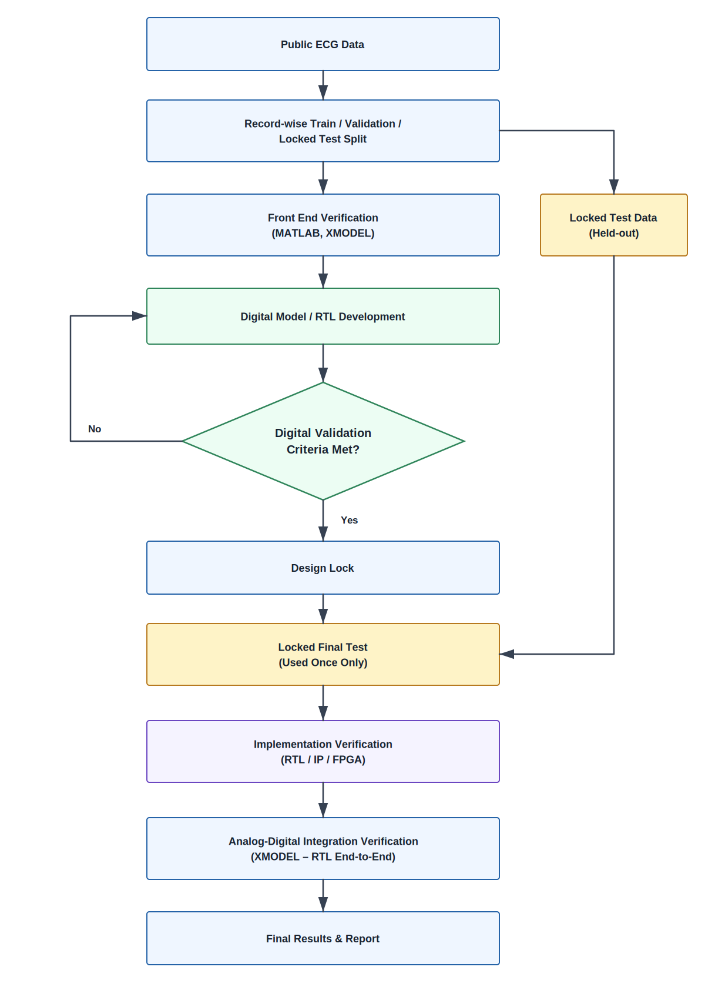
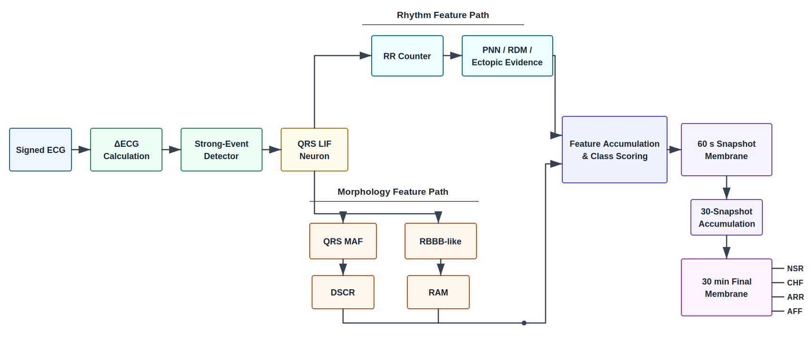
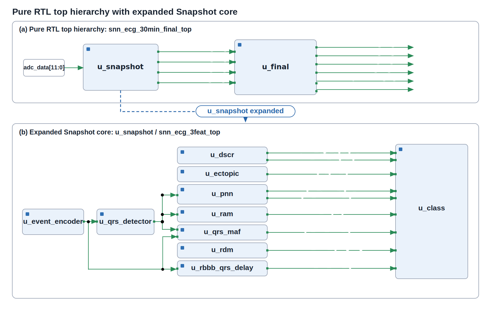

# 장시간 ECG 4-클래스 분류를 위한 다중 시간축 SNN-Inspired Streaming RTL Accelerator IP

# 초록

장시간 ECG 분류에서는 짧게 나타나는 이상 구간을 놓치지 않으면서 기록 전체의 상태를 판단해야 한다. 본 연구는 1 kSPS ECG를 60초 단위로 순차 처리하고, 각 구간의 리듬·파형 증거를 30분 동안 누적해 NSR·CHF·ARR·AFF를 분류하는 streaming RTL IP를 구현하였다. 아날로그 앞단은 MATLAB 사전설계, LTspice 회로 검증, SystemVerilog XMODEL 순서로 개발했으며, 동일한 10초 ECG에 대해 LTspice와 XMODEL의 ADC 출력은 MAE 0.6445 LSB와 상관계수 0.999518을 보였다. 이는 회로에서 확인한 파형을 XMODEL이 RTL 입력으로 거의 동일하게 전달함을 뜻한다. 고정 최종 시험 정확도는 29/36=80.56%였고, FPGA의 최종 출력과 내부 상태는 XSim 기준과 36/36 일치했으며, 저장 데이터의 가속기 코어 처리시간은 Exact C++보다 약 32.9배 짧았다. 현재 결과는 공개 데이터의 30분 입력과 모델 기반 AFE 검증에 한정되며, 실제 AFE/ADC·24시간 ECG·임상 성능 및 보드 실측 전력은 후속 검증이 필요하다.

# 핵심어

심전도, 장시간 모니터링, MATLAB, LTspice, XMODEL, SNN-inspired 구조, 사건 기반 처리, Snapshot 판독, Final Membrane, streaming RTL, FPGA 가속기

# 1. 서론

## 1.1 연구 배경과 문제 정의

ECG는 심장의 전기적 활동을 시간에 따라 기록한 전압 파형이다. 짧은 구간에서는 개별 박동의 모양을 자세히 볼 수 있지만, 장시간 기록에서는 박동 간격의 반복과 불규칙성, 특정 파형 특징이 얼마나 오래 지속되는지가 함께 중요하다. Ambulatory ECG가 증상 빈도와 관찰 목적에 따라 24/48시간 Holter 또는 더 긴 감시 방식을 사용하는 이유도 한 시점의 파형만으로 장시간 상태를 대표하기 어렵기 때문이다[2].

원래 설계 목표는 이러한 24시간 Holter 관찰 흐름을 사건·상태형 반도체 IP로 처리하는 것이었다. 그러나 이번 네 클래스는 길이가 같은 단일 cohort가 아니라 서로 다른 공개 데이터베이스에서 왔다. 특히 ARR에 사용한 MIT-BIH Arrhythmia Database는 24시간 ambulatory 원본 집합에서 선택한 48개의 **30분 excerpt**로 구성된다[11]. 한 클래스에만 없는 시간을 반복하거나 0으로 채우지 않고 모든 클래스에 동일한 실제 관찰 길이를 적용하기 위해 30분을 현재 공통 비교 단위로 선택하였다 [CLM-035]. 따라서 `Holter-oriented`는 24시간 장기 관찰을 지향하는 구조적 동기이고, 현재 결과는 30분 prototype 검증이다. 30분 결과가 임상적 24시간 Holter를 대체하거나 동등하다는 뜻은 아니다.

대표적인 소비자용 단일유도 ECG 앱의 FDA 문서 사례는 정상 동율동과 심방세동 중심의 리듬 선별 범위를 설명한다[1]. 본 연구는 그 제품과 정확도를 비교하지 않는다. 공개 데이터에서 NSR(normal sinus rhythm), CHF-labelled, ARR(arrhythmia-labelled), AFF(atrial-fibrillation-labelled) 네 범주를 다루는 장시간 공학 문제를 정의하고, 국소 리듬·파형 증거를 30분 동안 누적하는 투명한 하드웨어 구조를 설계한다. NSR은 질병이 아니며 ARR은 넓은 표지이고 CHF 역시 해당 원천 데이터베이스의 표지다. 따라서 출력은 네 질환의 확진이 아니라 현재 공개 데이터 구성에서 정의한 네 클래스다 [CLM-001].

장시간 파형을 다루는 가장 직접적인 방법은 전체 기록을 저장한 뒤 소프트웨어에서 일괄 분석하는 것이다. 그러나 wearable용 반도체 IP를 목표로 할 경우에는 입력이 들어오는 동안 필요한 정보만 작은 상태로 남기는 구조가 더 적합하다. 이때 해결해야 할 문제는 단순히 계산을 빠르게 만드는 것이 아니다. 1 ms마다 들어오는 표본값의 변화, 수백 ms 규모의 박동, 60초 구간의 리듬과 30분 동안 반복되는 특징을 하나의 회로에서 잃지 않고 연결해야 한다.

이를 위해 다음 세 시간척도를 동시에 유지한다.

- **표본값 시간척도:** 1 ms마다 파형 변화와 검출기 상태를 갱신한다.
- **박동 시간척도:** 검출된 박동 사이 간격과 박동 중심 파형 구간을 평가한다.
- **구간·장시간 시간척도:** 60초 증거를 Snapshot으로 확정하고 30개 Snapshot을 Final Membrane에 누적한다.


*그림 1. 표본값·박동·제한 길이 Snapshot·장시간 기록 상태로 이어지는 문제의 시간 계층. 그림의 60초·30분은 현재 공개 데이터 검증 설정이며 architecture의 고정된 본질이나 임상 인증을 뜻하지 않는다. [근거: CLM-001, CLM-003, CLM-035, CLM-042]*

## 1.2 연구 목표와 주요 기여

연구 목표는 공개 ECG를 공통 signed 12-bit 스트림으로 변환하고, 장시간 기록을 순차 Snapshot으로 처리하면서 간헐적으로 강하게 나타나는 리듬·파형 형태·질환별 증거를 보존하여 기록 단위 클래스를 출력하는 RTL IP를 만드는 것이다. 속도 자체나 60초·30분이라는 특정 길이가 주 기여는 아니다. 핵심은 Snapshot별 증거의 강도, 출현 빈도, 반복성과 장시간 일관성을 설명 가능한 고정 폭 상태로 구현하고, 모델로 정의한 아날로그 의도부터 FPGA 출력까지 같은 신호와 상태를 추적하는 데 있다 [CLM-042].

주요 기여는 다음 여섯 가지다.

1. NSR·CHF·ARR·AFF를 대상으로 하는 장시간 4-클래스 공학 목표를 정의하였다.
2. 대부분 정상인 장시간 기록에서 질환성이 강한 Snapshot을 포착하고, 국소 증거의 강도·빈도·반복성과 장시간 일관성을 기록 단위 상태로 재결합하였다.
3. 인접 표본값 변화, 막전위형 박동 검출, RR 리듬과 파형 형태를 정수 계수기·비교기·누산기로 구현하였다.
4. 전체 장시간 원시 관찰 구간을 저장하지 않고 고정 크기 지속 상태를 갱신하는 streaming datapath를 구현하였다. 현재 검증 입력은 30분이다 [CLM-023, CLM-035].
5. MATLAB→LTspice→XMODEL→부호 있는 스트림→RTL/IP→FPGA로 이어지는 검증·기능 등가성 사슬을 구축하였다.
6. 고정 commit, 산출물 hash, 데이터셋 manifest, 담당자·claim registry와 checker로 수치와 해석 경계를 통제하였다.

이후 제2장에서는 기존 접근의 한계에서 설계 요구를 도출하고 전체 시스템과 평가 방법을 설명한다. 제3장은 MATLAB에서 공칭 AFE·ADC 응답과 기준 벡터를 먼저 고정한다. 제4장은 설계값을 실제 LTspice schematic으로 구현·검증한 뒤 같은 회로 계약을 XMODEL로 옮겨 정합성과 비이상성을 확인한다. 제5장은 signed stream을 받아 네 클래스를 판정하는 디지털 가속기 IP와 FPGA 구현을 설명한다. 제6장은 가속기 benchmark의 반영 범위와 AFE·디지털 통합 검증을 분리해 제시한다. 제7장에서 결과를 모아 비교하고, 제8장에서 의미와 한계를 논의한 뒤 제9장에서 결론을 정리한다.

| 목표 | 구현·검증 결과 | 해석 경계 |
|---|---|---|
| 장시간 네 클래스 분류 | 60초 Snapshot×30, 최종 29/36 | 공개 데이터셋 기반 공학 결과 |
| 사건/상태형 RTL | 고정 폭 계수기·비교·부호 막전위 | 학습된 심층 SNN 아님 |
| 전체 관찰 구간 비저장 | 표본별 지속 상태 갱신 | 측정된 메모리 절감량 아님 |
| 아날로그 검증·Mixed-signal 인계 | LTspice 35 run, XMODEL 대비 ±5 LSB 98.74%; SHA256와 canonical pred/mem 36/36 | schematic/행동모델 기반 |
| FPGA IP | Vivado·IP-XACT·MicroBlaze·보드 재생 | 임상 장치/ASIC 아님 |
| 가속기 효과 | Exact C++ 1,777.699800 ms 대 cycle-derived core 54.012600 ms | 32.912687배 추정; board 측정 아님 |

*표 1. 연구 목표와 달성 결과. 각 행은 서로 다른 증거 범위를 갖는다. [근거: CLM-003, CLM-004, CLM-008~CLM-013, CLM-018, CLM-023]*

표 1의 가속기 benchmark는 저장 데이터의 CPU kernel과 FPGA accelerator-core 처리범위를 맞춘 보조 구현 결과다. 분류 구조가 주 기여이며, 32.912687배는 measured CPU와 cycle-derived core를 결합한 추정이므로 물리 보드 전체의 고속·저전력 우월성으로 확대하지 않는다 [CLM-043~CLM-046].

# 2. 관련 기술과 시스템 설계

## 2.1 관련 연구가 답하는 질문

관련 연구를 이해하는 가장 쉬운 기준은 알고리즘 이름이 아니라 **입력으로 얼마만큼의 ECG를 보고, 마지막에 무엇을 출력하는가**이다. 기존 연구의 출력은 크게 `한 심박의 종류`, `이상 구간 알림`, `환자의 미래 위험도`, `긴 기록 전체의 분류`로 나뉜다.

본 연구가 답하려는 질문은 **“짧게 나타난 질환 증거를 모았을 때, 이 장시간 기록은 NSR·CHF·ARR·AFF 중 무엇인가?”**이다. 즉 한 심박이나 한 이상 순간에서 끝나지 않고, 여러 구간에서 같은 증거가 얼마나 강하고 반복적으로 나타났는지를 기록 전체의 판정으로 연결한다 [CLM-035, CLM-042].

### 2.1.1 한 심박을 분류하는 연구

Amirshahi–Hashemi[3]와 Chen et al.[5]은 입력 표현은 다르지만 최종적으로 **심박 하나의 종류**를 정한다. 전자는 R-peak 주위 파형을 스파이크로 바꿔 STDP/R-STDP로 학습하고, 후자는 ECG가 전압 단계를 지날 때 만든 사건으로 N·SVEB·VEB·F를 분류한다. 본 연구는 이 심박 정보를 여러 구간에 걸쳐 누적해 **기록 전체의 클래스**를 정한다는 점에서 판정 범위가 다르다 [CLM-036, CLM-038].

### 2.1.2 이상이 나타난 순간을 알리는 연구

**사건 구동형(event-driven)**은 모든 표본을 같은 비중으로 보는 대신, QRS처럼 파형이 빠르게 변한 순간을 사건으로 만들어 처리한다. Bauer et al.[4]은 이 방식으로 연속 ECG를 감시하고 병리적 패턴이 문턱을 넘으면 이상 신호를 출력한다. 이 연구의 답은 **“지금 이상이 나타났는가?”**이다.

본 연구도 이상 순간을 찾지만, 알림에서 끝내지 않는다. 여러 Snapshot에서 같은 질환 증거가 다시 나타나는지를 클래스별 상태에 남겨 **기록 전체의 네 클래스 판정**으로 연결한다 [CLM-037].

### 2.1.3 긴 기록에서 중요한 구간을 모으는 연구

Shanmugam et al.[6]은 약 48시간 ECG에서 위험도가 높은 구간을 골라 환자의 **향후 심혈관 사망 위험**을 예측한다. 대부분 정상처럼 보이는 긴 기록에서도 일부 중요한 구간을 버리지 않는다는 점은 본 연구와 가깝다. 다만 본 연구의 출력은 미래 위험도가 아니라 **현재 ECG 기록의 NSR·CHF·ARR·AFF 클래스**다 [CLM-039].

### 2.1.4 여러 구간을 하나의 장시간 결과로 합치는 연구

Zihlmann et al.[7]은 9–61초 ECG를 네 리듬 범주로 분류한다. 짧은 기록의 네 클래스 분류는 이미 존재하므로, 본 연구의 차이는 클래스 수가 아니라 **드물게 나타난 구간의 증거를 장시간 판정에 남기는 방식**에 있다 [CLM-040].

DeepHHF[8]는 24시간 Holter를 30초 구간으로 나누고 Transformer로 합쳐 5년 심부전 위험을 예측한다. **구간 분할과 장시간 통합 흐름은 가장 유사**하지만, DeepHHF의 답은 미래 위험도이고 본 연구의 답은 현재 기록의 네 클래스다. 또한 본 연구의 현재 검증 입력은 공개 데이터 길이 제약에 따른 30분이므로 24시간 성능을 주장하지 않는다 [CLM-035, CLM-041, CLM-042].

### 2.1.5 한눈에 보는 차이

| 연구 | 보는 범위 | 마지막에 답하는 질문 | 본 연구와의 차이 |
|---|---|---|---|
| Amirshahi–Hashemi[3] | 한 심박 | 이 심박은 어떤 종류인가? | 본 연구는 기록 전체를 판정한다. |
| Bauer et al.[4] | 연속 ECG | 지금 이상이 나타났는가? | 본 연구는 여러 이상 구간을 클래스별로 누적한다. |
| Chen et al.[5] | 한 심박 | 이 심박은 N·SVEB·VEB·F 중 무엇인가? | 사건 입력은 유사하지만 장시간 판정이 아니다. |
| Shanmugam et al.[6] | 약 48시간 | 미래 심혈관 사망 위험이 높은가? | 본 연구는 현재 기록의 클래스를 출력한다. |
| Zihlmann et al.[7] | 9–61초 | 이 짧은 기록의 리듬은 무엇인가? | 장시간의 간헐 증거 누적이 중심이 아니다. |
| DeepHHF[8] | 24시간 | 5년 심부전 위험은 얼마인가? | 장시간 통합은 유사하지만 예후 예측이다. |
| 본 연구 | 현재 30분 | 이 기록은 NSR·CHF·ARR·AFF 중 무엇인가? | 구간별 증거를 모아 현재 기록을 분류한다. |

*표 2. 입력 범위보다 각 연구가 마지막에 답하는 질문을 중심으로 비교하였다. 과업이 다르므로 정확도를 직접 순위 비교하지 않는다. [근거: EXT-009~EXT-014; CLM-036~CLM-042]*

정리하면 기존 연구는 한 심박, 한 이상 순간 또는 미래 위험도를 주로 출력한다. 본 연구는 **이상 구간 탐지와 장시간 통합을 현재 기록의 다중 클래스 판정으로 연결**한다. 검토한 대표 선행연구 범위에서 확인한 차이이며, 문헌 전체에 대한 최초성 주장은 아니다 [CLM-042].

## 2.2 전체 시스템 흐름과 역할

설계 요구는 두 가지다. 첫째, 30분 원시 파형 전체를 저장하지 않고 입력이 들어오는 즉시 필요한 상태만 갱신한다. 둘째, 정상처럼 보이는 구간이 많아도 드물게 나타난 강한 질환 증거는 버리지 않고 반복 횟수와 지속성을 함께 남긴다 [CLM-023, CLM-042].

시스템 흐름은 `공개 ECG → MATLAB → LTspice → XMODEL → 디지털 RTL → FPGA`다. 각 도구의 역할은 다음처럼 분명히 나뉜다.

| 단계 | 이 단계가 답하는 질문 | 다음 단계로 넘기는 결과 |
|---|---|---|
| MATLAB | 필요한 필터·이득·ADC 범위는 무엇인가? | 공칭 설계값과 기준 파형 |
| LTspice | 그 설계값으로 만든 회로가 실제 schematic에서도 동작하는가? | 검증된 회로 응답과 ADC 출력 |
| XMODEL | 검증된 회로를 RTL과 함께 실행할 수 있는가? | 1 kSPS signed 12-bit 스트림 |
| 디지털 RTL | 짧은 이상 증거를 모아 기록 전체를 분류할 수 있는가? | 네 클래스 점수와 최종 클래스 |
| FPGA | RTL과 같은 결과를 실제 하드웨어 흐름에서 재현하는가? | 구현 자원·timing·기능 등가성 |



*그림 2. 학습·검증 데이터로 MATLAB–LTspice–XMODEL과 RTL을 개발한 뒤 설계를 잠그고, 분리해 둔 최종 시험 데이터로 한 번 평가한다. FPGA 단계에서는 설계를 다시 조정하지 않고 같은 결과가 재현되는지만 확인한다. [근거: CLM-007, CLM-012, CLM-013, CLM-049~CLM-052]*

평가 원칙은 단순하다. 학습·검증 데이터에서는 회로와 분류기를 수정할 수 있지만, 최종 시험 데이터는 설계를 잠근 뒤 한 번만 사용한다. 이후 XMODEL–RTL–FPGA 비교는 성능을 다시 높이는 과정이 아니라 **잠근 설계가 같은 입력에서 같은 결과를 내는지 확인하는 과정**이다 [CLM-007, CLM-012, CLM-013].

인계의 기준 인터페이스는 표 3과 같다. `sample_valid && sample_ready`가 참인 클록에서만 한 표본값을 수락한다. XSim 통합에서는 수락된 표본값 사이에 canonical `sample_gap_cycles=2`를 사용한다. 이 클록 간격은 1 kSPS라는 실제 입력 표본률과 다른 개념이며 가속기 처리량 수치도 아니다.

| 항목 | 기준 규약 | 의미 |
|---|---:|---|
| 입력 표현 | signed 12-bit two’s-complement | AFE/ADC 모델과 디지털 코어의 코드 규약 |
| 입력 표본률 | 1,000표본/s | 한 표본값 간격 1 ms |
| Snapshot | 수락 표본값 60,000개 | 60초 국소 상태 확정 |
| Final decision | Snapshot 30개 | 1,800,000표본=30분 |
| XSim 입력 간격 | `sample_gap_cycles=2` | 보드 대상 기준 검증 조건 |
| 출력 | `final_pred`+4개 `final_mem` | 클래스 승자와 내부 부호 있는 최종 상태 |

*표 3. 전체 인터페이스 규약. [근거: CLM-002, CLM-003, CLM-013; `components/digital_accelerator/reports/final/digital_input_contract.md`]*

## 2.3 데이터와 평가 원칙

네 클래스는 서로 다른 PhysioNet 데이터베이스에서 가져왔다. 표 4는 각 클래스의 출처와 최종 시험 record 수를 보여준다. 고정 버전 원시 파형은 저장소에 포함하지 않는다. 대신 버전·DOI·SHA256을 기록해 같은 데이터를 다시 받을 수 있게 했다[9]–[14].

| 클래스 | 원천/version | 원 표본률 | DOI | 최종 시험 record 수 |
|---|---|---:|---|---:|
| NSR | nsrdb 1.0.0 | 128 Hz | 10.13026/C2NK5R | 5 |
| CHF | chfdb 1.0.0 | 250 Hz | 10.13026/C29G60 | 4 |
| ARR | mitdb 1.0.0 | 360 Hz | 10.13026/C2F305 | 9 |
| AFF | afdb 1.0.0 | 250 Hz | 10.13026/C2MW2D | 1 |

*표 4. 데이터셋 원천과 최종 시험 record 구성. [근거: EXT-003~EXT-008; 데이터셋 manifest·license]*

**왜 30분인가.** 네 데이터베이스가 공통으로 제공하는 최대 길이가 30분이기 때문이다. 특정 클래스만 반복하거나 빈 값을 채우지 않고 같은 시간을 비교하기 위해 `60초 Snapshot × 30개`로 통일했다. 따라서 30분은 공정한 공개 데이터 비교를 위한 조건이지, 임상 Holter에 충분한 관찰 시간이라는 뜻은 아니다 [CLM-035].

모든 입력은 1 kSPS signed 12-bit로 변환되지만 원래 장비·유도·대상군의 차이까지 사라지는 것은 아니다. 클래스와 데이터베이스가 일대일로 연결되어 있어 분류기가 질환 특징뿐 아니라 데이터베이스 차이를 이용할 가능성이 남는다 [CLM-017].

누출을 막기 위해 같은 원본 record에서 나온 구간은 학습·검증·최종 시험 중 한 곳에만 넣었다. 즉 **원천 record 단위 분할은 직접 누출을 막지만**, 데이터베이스와 클래스의 결합 문제까지 해결하지는 않는다 [CLM-016].

| 분할 | 클래스별 30분 구간 | 전체 | 역할 |
|---|---:|---:|---|
| 학습 | 17×4 | 68 | 모델 적합 확인 |
| 검증 | 8×4 | 32 | Final Membrane 모델 선택 |
| 고정 최종 시험 | 9×4 | 36 | 고정 후 1회 평가 |
| 최종 시험 원본 record | 5/4/9/1 | 19 | record-majority 집계 단위 |

*표 5. 엄격한 원천 record 단위 분할. [근거: CLM-007, CLM-016; 고정 split 설정]*

학습·검증으로 모델을 선택한 뒤 문턱값과 가중치를 고정하고 최종 시험을 한 번 수행했다. Record-majority는 같은 최종 시험 결과를 원본 record별로 다시 묶은 값이므로 별도의 독립 시험으로 해석하지 않는다 [CLM-007].

# 3. MATLAB 공칭 AFE·ADC 사전검증

공개 ECG를 곧바로 회로 모델이나 RTL에 넣기 전에, 먼저 MATLAB에서 앞단의 공칭 설계가 의도대로 동작하는지 확인하였다. 이 단계의 목적은 물리 회로를 측정하는 것이 아니라 필터 차단주파수, 계측증폭기 이득, 60 Hz 제거, ADC 동적 범위와 디지털 인계 형식을 수치와 기준 벡터로 고정하는 것이다. 여기서 정한 파라미터와 벡터가 다음 장의 LTspice schematic 구현 기준이 되고, LTspice로 확인한 회로 계약이 XMODEL의 기준이 된다.

## 3.1 MATLAB 사전검증의 역할과 흐름

MATLAB·LTspice·XMODEL은 같은 일을 반복하는 도구가 아니다. MATLAB은 공칭 R/C·이득·주파수 응답·ADC 동적 범위와 기준 벡터를 정의한다. LTspice는 이를 실제 schematic, 전원, op-amp abstraction, S/H와 ADC mapping으로 구현해 회로 응답과 stress를 확인한다. XMODEL은 LTspice로 확인한 계약을 solver 기반 SystemVerilog 회로망으로 재현하고, RTL과 함께 전원선 간섭·offset·baseline wander·R/C mismatch·유한 GBW/VOS·ADC 비이상성과 장시간 스트림을 검토한다. 즉 `MATLAB 공칭 기준 → LTspice 회로 구현·검증 → XMODEL 행동모델·RTL 인계 → locked RTL` 순서로 역할이 이어진다 [CLM-049~CLM-052].


*그림 3. 고정 MATLAB component의 pre-validation 흐름. LTspice 구현 전 공칭 기준을 정의하는 단계이지 MATLAB–LTspice 또는 LTspice–XMODEL bit-exact 완료를 뜻하지 않는다. [직접 근거: `components/matlab_prevalidation/matlab_afe_validation/figures/fig_matlab_prevalidation_flow.png`; `components/matlab_prevalidation/README.md`]*

## 3.2 공칭 주파수응답과 동적 범위 검증

이 검증에서 확인할 핵심은 **ECG의 주요 파형은 유지하고, 그보다 느린 기준선 이동과 빠른 잡음은 줄이는가**이다. 통과대역 중심인 10 Hz에서 전체 이득은 46.0269 dB, 즉 약 200배였고 5–40 Hz의 이득 변화는 0.58 dB 이내였다. 이는 주요 ECG 대역을 거의 같은 비율로 증폭한다는 뜻이다. 반면 0.4823 Hz와 150 Hz 부근부터 응답이 약 3 dB씩 줄어들어, 매우 느린 기준선 이동과 고주파 성분을 통과대역 밖으로 밀어낸다.

다음 질문은 **증폭한 ECG가 ADC 범위를 넘지 않는가**이다. 대표 네 클래스 모두 잘린 표본이 0%였고, 가장 불리한 ARR 입력도 전원 한계까지 1.019633440086 V가 남았다. 즉 선택한 대표 입력에서는 파형을 충분히 키우면서도 ADC 포화 없이 디지털 단계로 넘길 여유가 있었다 [CLM-015, CLM-024].

| 클래스 | AFE 출력 범위 | ADC 코드 범위 | 잘림 비율 | 최소 rail 여유 |
|---|---:|---:|---:|---:|
| NSR | −0.111193~0.385184 V | 1909–2525 | 0% | 1.264815619462 V |
| CHF | −0.278713~0.557422 V | 1701–2739 | 0% | 1.092577998716 V |
| ARR | −0.630367~0.466399 V | 1265–2626 | 0% | 1.019633440086 V |
| AFF | −0.350374~0.326538 V | 1612–2452 | 0% | 1.299625888976 V |

*표 6. MATLAB 공칭 동적 범위. 선택한 네 record의 모델 결과이며 전체 대상군이나 물리 rail 측정값이 아니다. [직접 근거: `components/matlab_prevalidation/matlab_afe_validation/results_dataset/afe_dynamic_range_headroom_summary.csv`; CLM-015, CLM-024]*

MATLAB에서 정한 설계가 LTspice 회로에서도 유지되는지도 확인했다. 두 환경은 약 200배의 통과대역 이득과 HPF·60 Hz notch·150 Hz LPF 위치를 같은 곳에 만들었다. ADC 출력의 평균 절대 오차는 0.678 LSB로 한 양자화 단계보다 작고 상관계수는 0.998591이었다. 따라서 두 구현의 세부 계산은 다르지만, **같은 ECG 대역을 보존하고 같은 잡음을 줄인다는 설계 의도는 유지됐다**고 판단했다 [CLM-049].


*그림 4a. MATLAB 공칭 기준과 XMODEL-aligned LTspice schematic의 전체 주파수응답 비교. [직접 근거: `validation/afe_ltspice_xmodel_aligned/tables/matlab_ltspice_comparison.csv`; `validation/afe_ltspice_xmodel_aligned/tables/xmodel_aligned_nominal_ac_metrics.csv`; CLM-049]*


*그림 4b. 60 Hz 부근 MATLAB–LTspice dense response 비교. [직접 근거: `validation/afe_ltspice_xmodel_aligned/tables/xmodel_aligned_nominal_ac_metrics.csv`; CLM-049]*


*그림 4c. 고정 MATLAB component의 대표 클래스별 최소 rail 여유. [직접 근거: `components/matlab_prevalidation/matlab_afe_validation/figures/fig_dynamic_range_headroom.png`; `components/matlab_prevalidation/matlab_afe_validation/results_dataset/afe_dynamic_range_headroom_summary.csv`]*


*그림 4d. 네 대표 입력의 ADC 코드 분포. 이 그림의 x축은 ADC 물리 규약 확인용 offset-binary이고 RTL canonical 입력은 signed two’s-complement다. [직접 근거: `components/matlab_prevalidation/matlab_afe_validation/figures/fig_adc_code_distribution.png`; `components/matlab_prevalidation/matlab_afe_validation/results_dataset/adc_code_mapping_test.csv`]*

## 3.3 기준 벡터 생성과 LTspice 인계

MATLAB은 클래스마다 `input.csv`, 단계별 `matlab_stage_outputs.csv`, ADC 물리 규약 확인용 `adc_offset_binary.mem`, signed 수치 확인용 `adc_signed.txt`, 공식 replay용 `adc_signed_twos_complement.mem`을 만든다. 네 클래스×5개 파일의 byte 수와 SHA256은 manifest로 고정되고, LF line ending과 3자리 대문자 hex 형식까지 검사한다. 그림 6의 reference vector 규약은 LTspice 입력·ADC 비교에 먼저 사용되고, 검증된 회로 계약을 거쳐 XMODEL과 locked RTL replay로 이어진다.


*그림 5. 고정 MATLAB component의 reference-vector handoff. 공식 replay 파일은 `adc_signed_twos_complement.mem`이며 LTspice 비교 후 XMODEL/RTL 인계에 사용한다. [직접 근거: `components/matlab_prevalidation/matlab_afe_validation/figures/fig_reference_vector_handoff.png`; `components/matlab_prevalidation/matlab_afe_validation/reference_vectors/reference_vector_manifest.csv`; `components/matlab_prevalidation/matlab_afe_validation/docs/MATLAB_TO_XMODEL_HANDOFF.md`; `validation/afe_ltspice_xmodel_aligned/tables/matlab_ltspice_comparison.csv`]*

# 4. LTspice AFE·ADC 구현과 XMODEL 검증

MATLAB에서 확인한 공칭 설계값을 먼저 LTspice의 실제 AFE+ADC/S&H schematic으로 옮겼다. AC, 10초 transient, ADC mapping, timestep convergence, mismatch, GBW, VOS와 PLI를 통과한 회로 계약을 SystemVerilog XMODEL 회로망과 ADC 모델로 구현하였다. 이 장은 실제 R/C·전원·이득·양자화 값과 LTspice 결과를 먼저 설명하고, 이어서 XMODEL 정합과 장시간 비이상성 검증을 분리해 제시한다.

## 4.1 LTspice AFE·ADC 회로 구현 및 검증

디지털 분류기 앞단의 목적은 공개 ECG 전압을 증폭만 하는 것이 아니라, 기준선 이동과 전원선 간섭을 줄이고 1 kSPS signed 12-bit 스트림으로 일관되게 넘기는 것이다. 정본 LTspice 회로는 `FULL_AFE_ADC_SH_xmodel_aligned.asc`이며 기존 ±5 V 후보와 분리해 ±1.65 V 전원, XMODEL형 op-amp abstraction, `ECG+=patient100`, `ECG−=0 V`, 1 ms ADC aperture와 S/H를 적용하였다. 그림 6a는 전체 신호 경로와 비이상성 주입 위치, 그림 6b는 실제 graphical schematic이다 [CLM-034, CLM-049].


*그림 6a. ECG+와 ECG−가 각각 HPF를 통과한 뒤 3-op-amp IA에서 합류하고, Active Twin-T 60 Hz notch, buffer를 포함한 150 Hz LPF, 12비트 ADC와 부호 있는 12비트 스트림으로 이어지는 AFE·ADC 구조. 입력 교란, R/C 불일치, GBW/VOS와 ADC 비이상성의 주입 위치를 함께 표시한다. [직접 근거: `validation/afe_ltspice_xmodel_aligned/schematics/xmodel_aligned/FULL_AFE_ADC_SH_xmodel_aligned.asc`; `validation/afe_ltspice_xmodel_aligned/reference/xmodel_fixed_4756a50_subset/analog/ecg_afe_xmodel.sv`; CLM-049]*

유한 GBW는 능동 연산증폭기 단계 전체에서 평가했고 VOS 스트레스는 IA 입력쌍에 적용했다.


*그림 6b. ±1.65 V 전원과 S/H·ADC mapping을 포함한 실제 LTspice graphical schematic. 기존 ±5 V pre-alignment 회로와 구분한다. [직접 근거: `validation/afe_ltspice_xmodel_aligned/schematics/xmodel_aligned/FULL_AFE_ADC_SH_xmodel_aligned.asc`; `validation/afe_ltspice_xmodel_aligned/schematics/xmodel_aligned/FULL_AFE_ADC_SH_xmodel_aligned.net`; CLM-034, CLM-049]*

| 확인한 성능 | LTspice 결과 | 이 결과가 뜻하는 것 |
|---|---:|---|
| 느린 기준선 제거 | HPF 0.481174 Hz (목표 0.4823 Hz) | 약 0.5 Hz보다 느린 변화를 이득단 전에 줄인다. |
| 작은 ECG 증폭 | IA 200.594 V/V (목표 201 V/V) | mV 수준 차동 ECG를 ADC가 구분하기 쉬운 크기로 키운다. |
| 전원선 간섭 제거 | 60 Hz에서 −83.557 dB | 60 Hz 성분의 진폭을 약 1/15,000로 줄인다. |
| 고주파 제한 | LPF 150.211 Hz (목표 150.15 Hz) | 150 Hz보다 빠른 성분을 점차 줄여 ADC로 넘긴다. |
| 포화 방지 | clipping 0, 최소 headroom 1.403 V | 대표 10초 ECG가 ±1.65 V 범위를 안전하게 사용한다. |
| 표본 유지 | S/H droop 최대 0.0276 LSB | 변환 대기 중 전압 변화가 한 ADC 단계보다 훨씬 작다. |

*표 7a. XMODEL-aligned LTspice 공칭 회로 결과. LTspice 26.0.1의 35개 nominal/stress 실행은 모두 `EXECUTED`이며 fatal/warning signature는 0건이다. [직접 근거: `validation/afe_ltspice_xmodel_aligned/tables/xmodel_aligned_nominal_ac_metrics.csv`; `validation/afe_ltspice_xmodel_aligned/tables/xmodel_aligned_nominal_transient_metrics.csv`; `validation/afe_ltspice_xmodel_aligned/tables/xmodel_aligned_track_hold_metrics.csv`; `validation/afe_ltspice_xmodel_aligned/tables/xmodel_aligned_execution_manifest.csv`; CLM-049]*

전체 경로는 `ECG 입력 → HPF → 3-op-amp IA → active Twin-T 60 Hz notch와 buffer → 150 Hz LPF와 buffer → 12-bit ADC → offset-binary → signed two’s-complement stream`이다 [CLM-028]. 그림 7은 같은 순서를 MATLAB 공칭 모델 관점에서 보여준다.


*그림 7. 고정 MATLAB component의 `fig_afe_chain_overview`. 공칭 블록 순서를 보여주는 기준 그림이며 LTspice/XMODEL 검증 또는 물리 회로 측정을 뜻하지 않는다. [직접 근거: `components/matlab_prevalidation/matlab_afe_validation/figures/fig_afe_chain_overview.png`; `components/matlab_prevalidation/matlab_afe_validation/figures/FIGURE_CAPTIONS.md`]*

### 4.1.1 기준선 이동을 이득단 전에 제거하는 HPF

**왜 필요한가.** ECG에는 원하는 박동 성분 외에 전극 DC offset과 느린 기준선 이동이 포함될 수 있다. 이 성분을 ×201 IA에 먼저 넣으면 신호보다 offset이 크게 증폭되어 rail 여유를 소모한다. 따라서 양·음 전극 경로 각각에 HPF를 두고 IA 앞에서 DC와 느린 변화를 줄인다.

**어떻게 구성했는가.** 각 차동 입력은 33 nF 직렬 커패시터를 지나고, 출력 노드는 10 MΩ 저항으로 0 V 기준에 연결된다. 두 입력에 같은 구조를 사용하여 차동 경로를 보존한다. 초기 버전에서 음전극 커패시터가 접지 쪽으로 잘못 연결되어 차동 입력과 CMRR 검증이 불가능했던 문제도 XMODEL 정본에서 `ana_neg→C2→n_hpfn` 경로로 수정하였다.

**어떤 값으로 설계했는가.** 차단주파수는 `fc=1/(2πRC)=1/(2π×10 MΩ×33 nF)=0.482287706339 Hz`다. 시정수는 330 ms이고 약 5τ인 1.65 s 뒤에 정착하므로 XMODEL 비교는 일반적으로 앞 2 s를 제외한다.

**무엇을 검증했고 다음 블록에 어떻게 연결되는가.** XMODEL offset 시험에서 ±200 mV를 인가해도 정착 뒤 clipping은 0이었고, 0.1 Hz 1 mV와 0.2 Hz 2 mV 기준선 이동은 차단주파수에 따라 서로 다른 잔류를 보였다. 이 결과는 HPF가 모든 저주파 성분을 완전히 지운다는 뜻이 아니라, 큰 DC offset을 IA 이득 전에 줄인다는 것을 보여준다. HPF의 두 출력은 다음 3-op-amp IA의 비반전 입력으로 들어간다.

### 4.1.2 작은 차동 ECG를 ×201로 키우는 3-op-amp IA

**왜 필요한가.** mV 수준 ECG를 ±1.65 V ADC 범위에서 충분한 코드 변화로 변환하면서 양 전극에 함께 들어오는 공통모드 간섭은 억제해야 한다. 이를 위해 입력 임피던스와 CMRR에 유리한 3-op-amp 계측증폭기 구조를 사용한다.

**어떻게 구성했는가.** U1·U2의 두 비반전 증폭기는 100 kΩ 피드백 저항 두 개와 그 사이 1 kΩ 이득 저항을 사용한다. 뒤의 U3 차동증폭기는 R5·R7·R8·R9를 모두 10 kΩ으로 두어 U1·U2 출력 차이를 단일 출력으로 바꾼다. 2단 차동증폭기 이득은 1이므로 전체 이득은 1단과 같다.

```text
Av_IA = 1 + 2Rfb/Rg
      = 1 + 2×100 kΩ/1 kΩ
      = 201 V/V
```

**실제 설계에서 무엇을 수정했는가.** 초기 XMODEL의 이산 relaxation op-amp는 3-op-amp 피드백망에서 차동모드가 수렴하지 않아 ADC가 1939 부근에 고정되었다. 정본은 `vcvs` 회로 solver primitive로 개루프 차동·공통모드 이득을 표현해 폐루프 ×201을 회복하였다. op-amp CMRR 설정도 경계값 100 dB에서 110 dB로 올려 목표보다 모델 여유를 두었다. 이 110 dB는 소자 실측 CMRR이 아니며 실제 영향은 저항비 오차에 제한된다.

**무엇을 검증했고 다음 블록에 어떻게 연결되는가.** XMODEL 주파수 특성에서 통과대역 이득은 약 200으로 목표 201의 약 99%였다. 저항·커패시터 오차가 0.1%에서 1%로 커지자 공통모드 제거 능력을 나타내는 CMRR은 100.7 dB에서 80.0 dB로 낮아졌다. 즉 부품 오차가 커질수록 같은 방향으로 들어온 잡음을 덜 제거하지만, 시험한 1% 조건에서도 60 Hz 잔류는 6.54 mV 이하였고 clipping은 없었다 [CLM-026]. IA 출력은 active Twin-T의 두 T 경로에 동시에 들어간다.

### 4.1.3 60 Hz만 선택적으로 줄이는 active Twin-T와 buffer

**왜 필요한가.** 전극선에 유입되는 60 Hz 전원선 간섭은 IA를 통과한 ECG에 겹칠 수 있다. 단순 LPF만으로 60 Hz를 충분히 줄이려 하면 QRS 형태에 필요한 대역까지 손상될 수 있으므로 60 Hz 부근만 좁게 억제하는 notch가 필요하다.

**어떻게 구성했는가.** Twin-T의 저항 경로는 `R–R–2C`, 커패시터 경로는 `C–C–R/2`로 구성한다. 기준값은 R=26.526 kΩ, C=100 nF이므로 RT1=RT2=26.526 kΩ, CT=200 nF, CB1=CB2=100 nF, RB=13.263 kΩ이다. 60 Hz에서 두 경로가 반대 위상으로 만나 상쇄되도록 했다.

**수동 구조에서 왜 변경했는가.** 수동 Twin-T는 Q가 약 0.25로 낮고 출력 임피던스가 높다. 여기에 후단 1 kΩ LPF가 직접 연결되자 notch 출력이 loading되어 실효이득이 36까지 낮아졌고, 수동 notch를 포함한 전체 −3 dB 대역폭도 약 17 Hz로 줄었다. 정본은 notch 뒤 unity buffer를 추가하여 1 kΩ LPF를 격리하고, buffer 출력의 95%를 CT·RB 공통 노드에 되먹이는 active Twin-T로 변경하였다. Rk1=5 kΩ, Rk2=95 kΩ이므로 `k=Rk2/(Rk1+Rk2)=0.95`, `Q≈1/[4(1−k)]=5`다.

**무엇을 검증했고 다음 블록에 어떻게 연결되는가.** 여기서 중요한 질문은 **60 Hz 간섭은 강하게 줄이면서 주변 ECG 대역은 남기는가**이다. MATLAB과 LTspice 모두 60 Hz에서 약 −83.56 dB를 보였는데, 이는 간섭 진폭을 약 1/15,000로 줄인다는 뜻이다. 동시에 전체 통과대역은 150 Hz까지 유지되어 notch 때문에 ECG 대역 전체가 사라지지 않았다. 반면 50 Hz 감쇠는 −1.131 dB에 불과하므로 이 회로는 60 Hz 환경용이며, 50 Hz 환경에는 중심주파수 재설계가 필요하다 [CLM-029, CLM-049].


*그림 8. HPF·IA·디지털 notch 근사·LPF를 결합한 MATLAB 공칭 전체 응답. 60 Hz ideal zero는 물리 감쇠량이 아니다. [직접 근거: `components/matlab_prevalidation/matlab_afe_validation/figures/fig_total_frequency_response.png`; `components/matlab_prevalidation/matlab_afe_validation/results_dataset/afe_frequency_response_metrics.csv`]*


*그림 9. active Twin-T의 MATLAB nodal dense sweep. 60 Hz 공칭 중심과 bandwidth/Q를 보여주지만 측정된 물리 Q는 아니다. [직접 근거: `components/matlab_prevalidation/matlab_afe_validation/figures/fig_notch_dense_sweep.png`; `components/matlab_prevalidation/matlab_afe_validation/results_dataset/notch_dense_sweep_metrics.csv`]*

### 4.1.4 150 Hz LPF, 12-bit ADC와 signed stream 변환

**왜 필요한가.** notch 뒤에는 1 kSPS ADC의 Nyquist 주파수보다 높은 성분과 EMI를 줄이는 LPF가 필요하다. 이어지는 ADC는 연속 전압을 디지털 RTL이 받는 고정 폭 코드로 바꾸어야 한다.

**어떻게 구성했고 어떤 값으로 설계했는가.** LPF는 1 kΩ과 1.06 µF의 1차 RC 구조이며 `fc=150.146172728 Hz`다. 초기 1 µF 값은 약 159 Hz였으므로 1.06 µF로 수정하였다. LPF 뒤 unity buffer가 ADC 입력을 구동한다. ADC 모델은 ±1.65 V의 3.3 V span, 12 bit, 1 kSPS이며 `LSB=3.3/4095=0.000805860805861 V`다 [CLM-028].

```text
offset_binary = floor((Vin + 1.65)/3.3 × 4095), 0…4095로 제한
signed_decimal = offset_binary − 2048
two's-complement hex = mod(signed_decimal, 4096), 한 줄당 3자리
```

floor 방식 때문에 0 V는 offset-binary 2047, signed −1(`FFF`)에 대응하고 +1 LSB 부근이 2048, signed 0(`000`)에 대응한다. 따라서 offset-binary 파일을 signed 입력 포트에 직접 넣지 않는다. XMODEL은 1 kHz `clk_samp`의 하강 edge에서 양자화한다. 초기 testbench는 같은 edge에서 nonblocking 갱신 전 값을 `$fdisplay`로 기록해 ADC log가 한 표본 밀렸다. 정본 testbench는 timestep 종료에 갱신값을 읽는 `$fstrobe`와 지연 기록 완료 뒤 file close를 사용하여 off-by-one을 수정하였다 [CLM-030]. 최종 출력은 1 kSPS signed 12-bit two’s-complement `.mem`으로 변환되어 디지털 RTL에 전달된다.

## 4.2 LTspice→XMODEL 정합과 비이상성 검증

XMODEL 검증의 핵심 질문은 **LTspice에서 확인한 회로 출력을 RTL 입력으로 충분히 정확하게 재현하는가**이다. 같은 10초 ECG에서 얻은 10,000개 ADC 값을 비교한 결과 평균 절대 오차는 0.6445 LSB, RMS 오차는 1.3020 LSB였고 상관계수는 0.999518, 시간 지연은 0표본이었다. 즉 일반적인 차이는 한두 ADC 단계 수준이고 파형의 모양과 시점은 거의 같았다. 다만 최대 오차는 빠른 QRS 가장자리에서 13 LSB였으므로 모든 표본이 bit-exact한 것은 아니다 [CLM-050].


*그림 10a. 10초 10,000표본의 signed ADC 양자화 오차. 큰 편차는 QRS 급경사의 sub-sample solver timing 부근에 집중된다. [직접 근거: `validation/afe_ltspice_xmodel_aligned/tables/xmodel_ltspice_handoff_metrics.csv`; CLM-050]*


*그림 10b. 오차 분포는 0 LSB 부근에 집중되지만 sample-wise bit-exact는 56.49%다. [직접 근거: `validation/afe_ltspice_xmodel_aligned/tables/xmodel_ltspice_handoff_metrics.csv`; CLM-050]*

오차의 크기를 전압으로 보면 5 LSB는 약 4.03 mV, 10 LSB는 약 8.06 mV다. 전체 표본의 98.74%가 ±5 LSB, 99.89%가 ±10 LSB 안에 있었고 10 LSB를 넘은 표본은 10,000개 중 11개였다. 따라서 XMODEL은 대부분의 구간에서 LTspice 출력을 작은 오차로 전달하지만, 급격한 QRS 구간까지 완전히 같은 코드를 내는 모델은 아니다 [CLM-051].


*그림 10c. exact, ±1, ±2, ±3, ±5, ±10 LSB 누적 일치율. [직접 근거: `validation/afe_ltspice_xmodel_aligned/tables/xmodel_ltspice_handoff_metrics.csv`; CLM-051]*


*그림 10d. full 10초와 1초 이후 settled 구간의 ADC 정량 비교. [직접 근거: `validation/afe_ltspice_xmodel_aligned/tables/xmodel_ltspice_handoff_metrics.csv`; CLM-050, CLM-051]*

36개 60초 구간 비교는 **긴 실행에서 오차나 시간 지연이 누적되는가**를 확인한다. 평균 RMS 차이는 1.95 LSB였고 시간 지연은 0표본이어서, 60초 동안 파형이 점차 밀리는 현상은 없었다. 다만 QRS 급경사에서는 최대 30 LSB 차이가 있어 이 결과도 bit-exact를 뜻하지 않는다 [CLM-014].

XMODEL의 두 번째 역할은 부품 오차와 외부 간섭을 넣었을 때 어디서 성능이 무너지는지 찾는 것이다. 60 Hz 간섭의 잔류는 RMS 0.92 mV였지만 50 Hz에서는 118 mV가 남았다. 즉 현재 notch는 60 Hz 전원 환경에는 맞지만 50 Hz 환경에는 그대로 사용할 수 없다. 나머지 한계는 표 7b에 정리하였다 [CLM-025].

| XMODEL 검증 항목 | 직접 결과 | 해석 경계 |
|---|---:|---|
| Emulator↔XMODEL 36×60초 | 평균 RMS 1.95 LSB, lag 0, max ≤30 LSB | 모델 간 파형 정합; sample-wise bit-exact 아님 |
| 60/50 Hz PLI | 0.92 mV / 118 mV RMS 잔류 | 60 Hz target; 50 Hz retuned 성능 미검증 |
| R/C worst-direction mismatch | CMRR 100.7 dB@0.1%, 80.0 dB@1%; 1% 잔류 ≤6.54 mV | 직접 30분 mismatch `final_pred` sweep 아님 |
| finite GBW | 100 kHz에서 ideal 대비 2.04 code; clipping 0 | XMODEL dominant-pole model 범위 |
| 입력 VOS | 0.5/1/2 mV→출력 약 203/405/810 mV; 2 mV까지 clipping 0 | ×201 기준선 이동; 저 offset op-amp/DC servo 권장 |
| 분류 입력 60초 chunk clipping | train/val/test 1,200개 모두 0 | emulator/XMODEL-derived dataset; 실제 ADC 아님 |
| 전체 record 장시간 clipping | 35.9 billion sample에서 0.00007% | 모델로 만든 전체 길이 스트림; 물리 계측 아님 |
| R-peak/RR 보존 | shift 중앙값 1.0 ms, RR 오차 중앙값 0 ms | 공개 digitized ECG 기반 분석 |
| ADC non-ideal locked RTL | 대표 final_pred 15/16 유지 | 2 LSB rms noise의 NSR 한 건 flip; 보편 불변성 아님 |

*표 7b. XMODEL 파형·교란·ADC 검증. 시험 단위가 서로 다르므로 하나의 “전체 강건성” 수치로 합치지 않는다. [직접 근거: `components/afe_xmodel/docs/afe_stress/AFE_xmodel_verification.md`; `components/afe_xmodel/docs/afe_stress/clipping_report.csv`; `components/afe_xmodel/docs/afe_stress/rpeak_timing_test.csv`; `components/afe_xmodel/docs/afe_stress/adc_nonideal_finalpred_xsim.csv`; CLM-014, CLM-025~CLM-033]*

실제 설계 수정도 검증 결과에 포함된다. IA relaxation 미수렴은 `vcvs` solver 모델로, notch 출력 loading은 unity buffer로, 159 Hz LPF는 1.06 µF로, 경계 CMRR 설정은 110 dB로, ADC log off-by-one은 `$fstrobe`로 수정하였다. 수동 Twin-T가 17 Hz부터 통과대역을 훼손한 문제는 k=0.95 active Twin-T로 변경해 150 Hz 대역을 회복하였다 [CLM-030]. 이는 단순 최종 수치보다 “문제를 관측하고 회로 구조를 수정한 과정”을 보여주는 설계 근거다.

# 5. 디지털 가속기 IP 설계 및 구현

이 장은 입력 숫자 하나가 최종 클래스 상태로 바뀌는 순서에 맞춰 회로를 설명한다. 먼저 표본값·사건·막전위의 뜻을 정의하고, 박동·리듬 경로와 파형 형태 경로를 차례로 다룬다. 마지막에는 두 경로의 증거가 60초 Snapshot과 30분 Final Membrane에서 결합되는 과정을 정리한다.

## 5.1 핵심 개념과 다중 시간축 처리

AFE와 ADC를 통과한 ECG는 더 이상 종이에 그려진 곡선이 아니다. 디지털 블록이 받는 입력은 `... -18, -12, 5, 41, 96 ...`처럼 시간 순서대로 들어오는 부호 있는 숫자의 나열이다. 회로에는 이 숫자가 P파인지 QRS파인지 알려 주는 표지가 없다. 따라서 디지털 IP는 숫자의 움직임에서 먼저 “파형이 급하게 변했다”는 사건을 만들고, 여러 사건의 시간 관계를 이용해 박동과 리듬을 스스로 구성해야 한다.

**표본값(sample).** 숫자 나열에서 값 하나가 한 시점의 ECG 전압을 나타낸다. 이를 표본값이라고 한다. 본 설계는 초당 1,000개를 받으므로 새로운 표본값은 1 ms마다 하나씩 들어온다. 60초에는 60,000개, 30분에는 1,800,000개의 표본값이 들어온다.

**파형 변화 사건 신호.** 현재 표본값에서 직전 표본값을 빼면 두 시점 사이 변화량이 나온다. 변화량이 양수면 파형이 상승했고 음수면 하강했으며, 절댓값이 클수록 짧은 시간에 크게 변했다는 뜻이다. 회로는 변화량이 기준을 넘은 순간 한 클록 길이의 사건 신호를 만든다. 사건 신호는 “조건이 지금 발생했다”는 알림이지 원래 파형을 저장한 값은 아니다.

**막전위형 누적값(membrane state).** 생물학적 뉴런은 입력 자극을 막전위에 모으고, 막전위가 임계점에 도달하면 발화한 뒤 다시 초기 상태로 돌아간다. 본 설계는 이 생각을 레지스터와 덧셈기로 구현한다. 사건이 들어올 때마다 누적값을 올리고, 누적값이 문턱값(threshold)을 넘으면 한 클록의 스파이크를 출력한 뒤 누적값을 0으로 되돌린다.

**누설(leak).** 일반적인 LIF 뉴런은 시간이 지나면 누적값을 조금씩 줄인다. 서로 멀리 떨어진 사건은 영향이 약해지고, 짧은 시간에 연속해서 들어온 사건만 손실을 이겨 내고 발화하게 만들기 위해서다. 본 QRS 검출 RTL도 누설 연산을 지원한다. 다만 현재 고정 제출 설정에서는 QRS 누설값이 0이므로, 실제 제출 회로의 누적값은 사건 사이에서 감소하지 않는다. 따라서 본문에서는 LIF의 일반 원리와 현재 설정의 실제 동작을 구분한다.

**불응기(refractory period).** 하나의 QRS파 안에서는 큰 상승과 하강이 여러 번 나타날 수 있다. 첫 발화 뒤에도 사건을 계속 누적하면 같은 QRS파를 두세 개의 박동으로 잘못 셀 수 있다. 이를 막기 위해 박동을 검출한 직후에는 일정 수의 표본값 동안 누적을 중지한다.

**박동과 RR 간격.** QRS 막전위형 누적값이 문턱값을 넘으면 회로는 “박동을 하나 찾았다”는 신호를 한 클록 동안 낸다. 이것이 내부 박동(beat)이다. 첫 박동부터 다음 박동까지 몇 개의 표본값이 들어왔는지를 세면 RR 간격이 된다. 외부의 R-peak 정답표를 읽는 것이 아니라 회로가 스스로 검출한 두 박동 사이 시간을 재는 방식이다.

**Snapshot.** Snapshot은 이미지가 아니라 60초 동안 관찰한 결과의 요약이다. 60,000개의 표본값에서 박동이 몇 번 발생했는지, RR 간격이 얼마나 일정했는지, 파형 방향 전환·진폭·폭·에너지가 어떤 경향을 보였는지를 작은 계수와 클래스 누적값으로 압축한다.

**Final Membrane.** 한 번의 60초 결과만으로 30분 전체를 판단하지 않기 위해 Snapshot 30개의 결과를 다시 네 개의 장시간 클래스 누적값에 모은다. 이것이 Final Membrane이다. 어떤 특징이 클래스를 지지하면 해당 누적값을 올리고, 반대하면 내린다. 마지막에는 네 누적값 가운데 가장 큰 값을 고른다.

**왜 SNN-inspired인가.** 이 구조는 모든 표본값을 저장한 뒤 한꺼번에 행렬 연산을 하는 대신, 의미 있는 변화가 생겼을 때 사건을 만들고 그 사건을 막전위형 누적값에 더한다. 누적값, 문턱값, 발화, 초기화와 승자독식이라는 뉴로모픽 개념을 정수형 RTL로 옮겼기 때문에 SNN-inspired라고 부른다. 다만 학습된 심층 SNN, STDP, 온라인 학습, 생물물리 뉴런 시뮬레이션이나 생물학적 등가성을 주장하는 구조는 아니다.



*그림 11. signed ECG는 `ΔECG Calculation`, `Strong-Event Detector`, `QRS LIF Neuron`을 차례로 거친다. Rhythm 경로는 기존 구조를 유지하고, 파형 형태 경로의 DSCR·RAM·QRS MAF·RBBB-like는 서로 독립적인 병렬 증거 경로로 표시한다. 두 경로는 `Feature Accumulation & Class Scoring`에서만 합류한다. `60 s Snapshot Membrane` 30개는 `30-Snapshot Accumulation`을 거쳐 `30 min Final Membrane`으로 누적되고 NSR·CHF·ARR·AFF 기록 클래스를 판정한다. 네 파형 형태 블록은 독자를 위한 개념적 묶음이며 실제 post-synthesis netlist 연결을 뜻하지 않는다.*

전체 흐름을 한 문장으로 연결하면 다음과 같다. 숫자로 들어온 ECG가 급하게 오르내리면 강한 사건이 생기고, 강한 사건이 충분히 모이면 박동이 된다. 박동 사이 표본 수는 RR 간격이 되고, 박동 주변 숫자의 움직임은 기울기 전환·진폭·폭·에너지 정보가 된다. 이 값들을 60초 동안 모아 Snapshot을 만들고, Snapshot 30개를 Final Membrane에 모아 최종 클래스를 고른다. 이는 회로 흐름을 설명하기 위한 예이지 실제 환자 진단 예가 아니다.

## 5.2 박동 및 리듬 정보 추출

### 5.2.1 표본값에서 강한 상승과 하강 찾기

ECG의 절대 전압은 사람, 유도와 측정 환경에 따라 달라질 수 있다. 반면 현재 숫자에서 바로 앞 숫자를 뺀 변화량은 지금 파형이 얼마나 빠르게 상승하거나 하강하는지를 직접 보여 준다. 첫 번째 표본값은 비교 대상이 없으므로 직전 값 레지스터에 저장만 한다. 두 번째 표본값부터 매 클록 다음 계산을 반복한다.

```text
변화량 = 현재 표본값 - 직전 표본값
변화 크기 = |변화량|

변화량이 양의 기준보다 크면  → 상승 사건
변화량이 음의 기준보다 작으면 → 하강 사건
변화 크기가 강한 변화 기준보다 크면 → 강한 사건

계산이 끝나면 현재 표본값을 다음 비교의 직전 값으로 저장
```

상승·하강·강한 사건은 조건을 만족한 클록에서만 1이 되고 다음 클록에는 다시 0이 된다. 변화 기준은 처음부터 하나로 고정하지 않는다. 60초 구간의 초기 표본에서 12개의 변화 크기 후보를 각각 몇 번 넘는지 세고, 사건이 지나치게 많거나 적지 않은 후보를 선택한다. 선택이 끝나기 전에는 기본 문턱값을 사용한다. 뉴로모픽 관점에서는 이 한 클록 펄스를 “Strong Event 뉴런이 발화했다”고 해석할 수 있다. 다만 실제 RTL에는 별도의 Strong Event 막전위가 있는 것이 아니라 뺄셈기·절댓값·문턱 비교기가 이 펄스를 직접 만든다. 이렇게 만든 사건은 박동 검출과 파형 형태 분석 경로에 동시에 전달된다. 이 기능을 RTL에서는 `ecg_event_encoder_adaptive`가 담당한다.

### 5.2.2 여러 강한 변화를 하나의 박동으로 묶기

잡음 하나가 큰 변화량을 만들었다고 곧바로 박동이라고 판단하면 오검출이 늘어난다. 반대로 QRS파 안에서 발생한 상승과 하강을 각각 박동으로 세면 한 박동을 여러 번 세게 된다. 이를 막기 위해 강한 사건 출력을 QRS 막전위형 누적값에 연결한다. 뉴런 관점에서 보면 Strong Event 발화가 시냅스를 통해 QRS LIF 뉴런으로 들어오고, 사건 가중치가 시냅스 가중치 역할을 하는 구조다.

```text
1. 불응기가 남아 있으면 누적값을 0으로 유지하고 남은 시간을 1 줄인다.
2. 불응기가 아니면 이전 누적값에서 설정된 누설량을 뺀다.
3. 현재 클록에 강한 사건이 있으면 사건 가중치를 더한다.
4. 결과가 박동 문턱값 미만이면 다음 클록의 누적값으로 저장한다.
5. 문턱값 이상이면 박동 사건을 한 클록 발생시키고 누적값을 0으로 지운다.
6. 동시에 불응기 계수기를 채워 같은 QRS파의 후속 변화를 잠시 무시한다.
```

일반적인 LIF 설명에서는 시간에 따른 누설 때문에 가까이 모인 사건이 더 쉽게 발화를 만든다. 그러나 현재 고정 설정의 QRS 누설량은 0이다. 따라서 제출 회로에서는 강한 사건이 들어올 때 누적값이 증가하고, 문턱값을 넘은 뒤 초기화와 불응기가 중복 박동을 막는다. QRS파는 보통 여러 인접 표본에서 큰 변화를 만들기 때문에 실제 입력에서는 강한 사건이 짧은 구간에 모여 박동 사건을 만드는 경향이 있지만, 현재 설정의 누설이 그 시간 간격을 강제하는 것은 아니다. 이 기능을 RTL에서는 `qrs_lif_detector`가 담당한다.

### 5.2.3 두 박동 사이 시간 재기

첫 박동이 검출되면 0에서 시작하는 표본 계수기를 연다. 이후 새로운 표본값을 받을 때마다 계수기를 1씩 올린다. 다음 박동이 들어오면 현재 표본까지 포함한 계수값을 RR 간격으로 확정하고 계수기를 다시 0으로 만든다. 첫 박동은 앞선 박동이 없으므로 시간 측정의 시작점만 된다. 즉 RR 간격은 어려운 추상 상태가 아니라 “직전 박동 이후 들어온 표본값의 개수”다. 1 kSPS이므로 계수값 1,000은 약 1초에 해당한다.

### 5.2.4 다음 RR 간격의 반복성 보기

일정한 리듬이라면 연속된 RR 간격은 비슷한 값 주변에 모인다. 회로는 가능한 RR 간격을 나타내는 46개의 기준 눈금을 가지고 있다. 새 RR 간격이 들어오면 한 클록에 46개를 모두 비교하지 않고, 매 클록 기준 눈금 하나와의 차이를 계산한다. 지금까지 가장 차이가 작은 눈금과 오차만 저장하므로 큰 병렬 비교기를 만들지 않아도 된다. 같은 거리의 눈금이 두 개면 먼저 검사한 낮은 번호를 유지한다.

가장 가까운 눈금은 다음 박동을 위한 예상 RR 간격으로 기억한다. 실제 다음 RR 간격이 이 눈금의 허용 범위 안에 들어오면 “예상과 일치”, 밖이면 “예상과 불일치” 사건을 만든다. Snapshot은 60초 동안 일치와 불일치가 각각 몇 번 발생했는지를 센다. 여기서 PNN은 범용 probabilistic neural network가 아니라 고정된 RR 눈금 가운데 가장 가까운 값을 찾고 다음 간격을 비교하는 회로다. 이 기능을 RTL에서는 `pnn_rhythm_predictor`가 담당한다.

### 5.2.5 연속 RR 간격의 변화량 보기

앞의 회로가 예상 간격과의 일치 여부를 본다면, 이 경로는 현재 RR 간격과 바로 직전 RR 간격의 절대 차이를 구한다. 첫 RR은 비교할 값이 없으므로 직전 값으로 저장만 한다. 두 번째 RR부터 차이가 15개의 변화 수준 가운데 어디까지 넘었는지를 표시하고, 가장 높은 수준을 4비트 코드로 만든다. 계산이 끝나면 현재 RR을 다음 비교의 직전 값으로 바꾼다. 따라서 PNN은 “예상한 반복 간격을 따르는가”를, RDM은 “두 번의 연속 간격이 얼마나 달라졌는가”를 서로 다르게 답한다. 이 기능을 RTL에서는 `rdm_variability_neuron`이 담당한다.

### 5.2.6 짧은 간격과 긴 간격의 교대 찾기

회로는 최근 RR 간격을 천천히 따라가는 기준값을 하나 유지한다. 새 RR이 기준보다 충분히 짧으면 early, 충분히 길면 late로 표시한다. 정상 범위라면 이전 비정상 표시를 그대로 둔다. 직전 비정상 간격과 현재 비정상 간격이 early→late 또는 late→early처럼 서로 반대이면 한 번의 쌍 사건을 만든다. 매 RR마다 기준값은 현재 RR 방향으로 조금만 이동하므로 갑작스러운 한 간격이 기준 전체를 즉시 바꾸지 않는다. 60초가 새로 시작되면 기준과 이전 패턴을 지운다. 쌍 사건은 Snapshot의 리듬·파형 형태 점수와 30분 집계에 전달된다. 이 기능을 RTL에서는 `ectopic_pair_neuron`이 담당한다.

| 관찰 대상 | 필요한 이유 | 구체적인 하드웨어 처리 | 생성 상태 | 사용 위치 | 구현 모듈 |
|---|---|---|---|---|---|
| 파형 변화 | QRS 후보와 기울기 방향 | 직전 표본값과의 부호 있는 차분, 절댓값, 적응형 문턱 후보 | 상승/하강/강한 사건 | QRS·DSCR·QRS MAF·지연 경로 | `ecg_event_encoder_adaptive` |
| 박동 | 여러 변화 펄스를 한 박동으로 결합 | 이전 막전위→누설→사건 가산→문턱값, 불응기 감소 | `beat_spike`, QRS 막전위 | RR 및 박동 관찰 구간 시작 | `qrs_lif_detector` |
| RR 패턴 | 반복 간격의 일관성 | 46개 중심 순차 거리 탐색, 이전 승자의 다음 RR 예측 | 일치/불일치 스파이크 | Snapshot 클래스 상태 | `pnn_rhythm_predictor` |
| RR 변화량 | 연속 간격의 변동 크기 | 직전 RR과의 절대 차이, 15개 문턱 수준 | RDM 수준/코드 | Snapshot 계수기와 Final 집계 | `rdm_variability_neuron` |
| Early–late 조합 | 보상성 간격 패턴 | 적응 기준, 직전 비정상 패턴 유지 | 쌍 스파이크 | 파형 형태·리듬 기여 | `ectopic_pair_neuron` |

*표 8. 리듬 경로의 실제 상태 기구. 모듈 이름은 마지막 열의 구현 확인 정보다.*

**통합 해석 경계.** 이 경로의 박동, RR, PNN, RDM과 ectopic-pair는 고정 하드웨어 내부의 공학적 대리지표다. 임상 QRS annotation, 표준 HRV 지표, probabilistic neural network 또는 ectopic diagnosis와 동일하다고 주장하지 않는다. 이 제한은 각 블록마다 반복하지 않고 이 절 전체에 적용한다.

## 5.3 파형 형태 및 진폭 정보 추출

리듬만으로는 같은 간격 패턴 안의 파형 차이를 설명하기 어렵고, 파형 형태만으로는 장기 규칙성을 설명하기 어렵다. 따라서 박동 경로와 병렬로 기울기 방향 전환, 최대 진폭 코드, QRS 주변 폭·복잡도·에너지와 말단 지연을 추출한다.

### 5.3.1 파형이 꺾인 횟수 세기

QRS파의 모양을 알려면 전압이 단순히 높았는지만 보는 것이 아니라 상승하던 파형이 언제 하강으로 바뀌었는지도 보아야 한다. 그러나 원시 표본값 두 개만 바로 빼면 작은 잡음에도 방향이 자주 바뀔 수 있다. 그래서 회로는 입력을 천천히 따라가는 기준값을 하나 유지한다. 현재 표본값과 기준값의 차이를 구하고, 그 차이를 오른쪽으로 이동해 작은 갱신량으로 만든 뒤 기준값에 더한다.

```text
오차 = 현재 표본값 - 필터 기준값
기준 갱신량 = 오차를 정해진 비트 수만큼 오른쪽 이동
다음 필터 기준값 = 현재 필터 기준값 + 기준 갱신량
```

갱신량이 양수면 파형이 상승하는 중이고, 음수면 하강하는 중이다. 갱신량의 절댓값이 기울기 기준을 넘을 때만 유효한 기울기로 인정하므로 작은 흔들림은 방향 판단에서 제외한다.

유효한 기울기가 생기면 그 부호를 “직전 유효 방향”으로 기억한다. 다음 유효 기울기의 부호가 이전 부호와 다를 때만 방향 전환 사건을 한 번 만든다. 유효 기울기가 없는 표본은 이전 부호를 바꾸지 않는다. 따라서 작은 잡음 사이에서도 마지막으로 확인한 실제 상승·하강 방향을 유지할 수 있다.

```text
유효 기울기 부호:  +  →  +  →  -
이전 부호와 비교:  없음   동일   다름
flip 사건 신호:     0      0      1

유효 기울기 부호:  +  →  +  →  +
flip 사건 신호:     0      0      0
```

새 60초 구간이 시작되면 필터 기준, 상승·하강 상태와 이전 유효 부호를 지운다. 60초 동안 유효 기울기 횟수와 방향 전환 횟수를 각각 세고, 방향 전환 사건은 Snapshot의 파형 형태 클래스 누적값에 전달한다. 이 기능을 RTL에서는 `dscr_spike_counter`가 담당한다.

### 5.3.2 한 박동의 최대 진폭을 코드로 남기기

30분 전체에서 최고점 하나만 찾으면 어느 박동의 값인지 알 수 없고 서로 다른 박동이 섞인다. 그래서 앞에서 예측한 다음 RR 시점 주변에만 짧은 관찰 구간을 연다. 예측 시점에 가까워지면 지금까지의 최대값과 “박동을 보았는가” 표시를 0으로 초기화한다. 현재 고정 설정에서는 별도 입력 정규화를 사용하지 않고 기준선을 숫자 0으로 두므로, 각 표본값에서 0을 뺀 뒤 음수는 0으로 잘라 양의 진폭만 본다.

진폭은 여러 단계의 문턱과 비교한다. 예를 들어 낮은 문턱부터 세 번째 문턱까지 넘었다면 진폭 코드 3이 된다. 새 코드가 지금까지의 최대 코드보다 클 때만 최대값을 교체한다. 관찰 구간 안에서 박동이 검출되면 박동 직후의 표본도 놓치지 않도록 일정 기간 관찰을 더 유지한다. 이 기간이 끝났고 실제 박동이 있었다면 최대 진폭 코드와 “코드가 유효하다”는 사건을 출력한다. 60초 동안 유효 코드의 횟수와 코드 합을 모아 Snapshot의 진폭 증거로 사용하고, 코드 합은 30분 Final Membrane에도 전달한다. 즉 박동 파형 전체를 저장하는 대신 박동 하나를 작은 최대 진폭 코드 하나로 압축한다. 이 기능을 RTL에서는 `ram_peak_accumulator`가 담당한다.

### 5.3.3 박동 전후에서 폭·복잡도·에너지 구하기

같은 RR 간격을 가진 박동이라도 QRS 주변 활동이 얼마나 오래 이어지는지, 방향이 몇 번 바뀌는지, 기준선에서 얼마나 크게 벗어나는지는 다를 수 있다. 이를 구하려면 박동이 검출된 한 시점만 보는 것이 아니라 앞뒤의 숫자를 함께 보아야 한다. 회로는 박동 전 120표본을 계속 보관하다가 박동이 검출되면 박동 후 100표본을 추가로 관찰한다.

- **박동 전 120표본:** 가장 오래된 표본은 버리고 새 표본을 넣는 방식으로 강한 사건, 방향 전환과 에너지 코드 이력을 유지한다. 동시에 강한 사건의 횟수, 방향 전환 횟수, 에너지 합과 첫·마지막 강한 사건 위치를 갱신한다.
- **박동 시작:** 박동이 검출되면 직전 120표본의 횟수와 합을 별도 상태에 복사하고 100표본의 박동 후 관찰을 시작한다. 박동 전에 강한 사건이 있었다면 가장 오래된 사건을 시작 위치, 가장 최근 사건을 마지막 위치로 잡는다.
- **박동 후 100표본:** 강한 사건 신호가 나타날 때 첫 위치와 마지막 위치를 갱신하고, DSCR 방향 전환을 세며, 매 표본값의 `abs(sample-baseline)>>ENERGY_SHIFT` 코드를 포화 누산값에 더한다.
- **폭(width):** 박동 전후를 하나의 시간축으로 놓고 첫 강한 사건 위치에서 마지막 강한 사건 위치를 뺀다. 사건이 없으면 폭은 0이다. 계산한 폭이 고정 기준보다 넓거나 최근 박동으로 만든 평균적 폭에서 크게 벗어나면 폭 이상 사건을 만든다.
- **복잡도(complexity):** 같은 220표본 안에서 앞의 DSCR 방향 전환이 몇 번 발생했는지 센다. 개별 방향 전환 사건을 박동 하나의 관찰 구간으로 다시 묶은 값이다.
- **에너지:** 각 표본값이 기준선에서 떨어진 거리를 절댓값으로 구하고, 비트 이동으로 작은 8비트 코드로 만든 뒤 220표본 동안 더한다. 합을 다시 작은 6비트 코드로 줄이고 최근 박동의 에너지 기준과 비교한다. 기준에서 크게 벗어나면 에너지 이상 사건을 만든다.
- **박동 전 활동도:** 박동 직전 120표본에 강한 사건이 있었는지, 방향 전환이 반복되었는지, 에너지 합이 충분히 컸는지를 함께 보고 박동 전 활동 사건을 만든다.

박동 후 100표본을 모두 본 뒤 폭·복잡도·에너지 값을 먼저 저장한다. 다음 클록에는 최근 기준과의 차이를 계산하고, 그 다음 클록에 유효 사건과 폭·복잡도·에너지·박동 전 활동 이상 사건을 출력한다. 폭과 에너지의 최근 기준도 이때 새 값 쪽으로 조금 이동한다. 이렇게 관찰, 비교, 출력 단계를 서로 다른 클록으로 나누어 긴 조합 경로를 피한다. 새 60초 구간이 시작되면 박동 전 이력, 진행 중인 관찰, 최근 기준과 출력 준비 상태를 모두 초기화한다. 출력 사건과 코드는 Snapshot의 파형 형태 점수와 60초 계수기에 들어가고, 관련 횟수와 코드 합은 Final Membrane의 장시간 집계로 전달된다. 이 기능을 RTL에서는 `qrs_maf_neuron`이 담당한다.

### 5.3.4 QRS 뒤쪽의 지연 활동 확인하기

이 경로는 앞의 박동 사건을 그대로 시작점으로 쓰지 않는다. 강한 변화나 유효 기울기 활동이 0에서 1로 바뀌는 순간을 별도의 QRS-like 시작점으로 잡는다. 시작 직후에는 같은 파형에서 다시 시작하지 않도록 짧은 불응기를 둔다. 이후 표본값이 들어올 때마다 시작점 이후 경과 표본 수를 1씩 올린다. 경과 80~160표본 사이에서는 10표본 간격의 위치 표시를 남기고, 90~170표본의 말단 구역에서는 활동이 나타난 표본 수를 센다. 활동이 일정 기간 사라지거나 최대 관찰 길이에 도달하면 한 박동의 관찰을 끝낸다.

활동이 나타난 가장 늦은 위치를 폭의 대리지표로 사용한다. 이 위치가 충분히 늦으면 넓은 파형 사건을 만들고, 말단 구역의 활동 횟수가 기준을 넘으면 말단 활동 사건을 만든다. 두 조건이 동시에 참일 때만 박동 단위의 RBBB-like 사건이 된다. 60초 동안 넓은 파형 횟수, 말단 활동 횟수와 두 조건의 결합 횟수를 따로 센다. 60초 경계에서는 결합 박동이 여러 번 반복되었는지와 리듬이 지나치게 불규칙하지 않은지를 함께 확인한 뒤 구간 단위 증거를 만든다. 이 증거는 Snapshot 클래스 점수와 Final Membrane의 장시간 집계에 전달된다. 따라서 한 박동의 늦은 활동만으로 클래스를 정하지 않는다. 이 기능을 RTL에서는 `rbbb_qrs_delay_bank`가 담당한다.

| 관찰 대상 | 필요한 이유 | 구체적인 하드웨어 처리 | 생성 상태 | 사용 위치 | 구현 모듈 |
|---|---|---|---|---|---|
| 기울기 방향 | 파형 굴곡과 방향 전환 | 필터 기준 오차, 유효 부호 유지, 부호 전환 검출 | 기울기/전환 스파이크 | Snapshot 파형 형태 횟수 | `dscr_spike_counter` |
| 최대 진폭 | 박동별 양의 최고점 압축 | 예측 박동 관찰 구간, 문턱 후보 코드, 최댓값 유지, 후속 유지 구간 | 최대 코드+유효 스파이크 | 코드 합/횟수 | `ram_peak_accumulator` |
| QRS 폭 | 활동 구간 길이 대리지표 | 박동 전·후 유한 구간의 첫/마지막 강한 사건 위치 | 폭 값/이상 스파이크 | 클래스 상태+Final 집계 | `qrs_maf_neuron` |
| QRS 복잡도 | 박동 구간 내 반복 굴곡 | DSCR 방향 전환 횟수를 6비트 포화 코드로 확정 | 복잡도 코드/스파이크 | 파형 형태 기여 | `qrs_maf_neuron` |
| QRS 에너지 | 기준 대비 박동 에너지 편차 | 표본별 절대 편차 코드 합, 적응 기준 | 에너지 코드/스파이크 | 파형 형태 기여 | `qrs_maf_neuron` |
| Pre-QRS 활동 | 주 사건 직전 작은 활동 | 120표본 강한 사건/방향 전환/에너지 이력 저장 | bump 스파이크 | Snapshot/Final 계수기 | `qrs_maf_neuron` |
| 말단 지연 | 넓고 늦은 활동의 반복 | 시작 나이, 말단 구역 활동도, 반복 박동 횟수, 리듬 조건 | 박동/구간 사건 | 클래스 점수 조건 | `rbbb_qrs_delay_bank` |

*표 9. 파형 형태·진폭 경로의 실제 유한 상태 기구.*

**통합 해석 경계.** DSCR, RAM, QRS MAF와 RBBB-like 경로는 파형을 압축한 공학적 대리지표다. 유도와 데이터베이스 스케일의 영향을 받을 수 있고, 표준 파형 형태 측정이나 임상 RBBB 검출기가 아니다. 현재 원천에서 안전하게 확인되지 않는 parameterized aggregate 상태 총량은 `UNRESOLVED_FROM_STATIC_AUDIT`로 유지한다.

## 5.4 60초 Snapshot과 30분 Final Membrane

개별 사건 하나는 클래스를 결정하기에 충분하지 않다. RR 불일치 하나는 일시적 잡음일 수 있고, 높은 최대 코드 하나는 유도 스케일의 영향일 수 있으며, 기울기 방향 전환 하나는 정상 QRS 굴곡에서도 발생할 수 있다. 따라서 사건 신호를 바로 label로 바꾸지 않고 60초와 30분 두 단계에서 결합한다.

여기서 30분은 생리학적으로 최적이라고 새로 가정한 시간이 아니다. 24시간 Holter형 장기 관찰을 최종 지향점으로 두되, 현재 네 공개 원천에 공통으로 적용할 수 있는 실제 record 길이가 30분이므로 Final Membrane 깊이를 Snapshot 30개로 고정한 것이다 [CLM-035]. 이 선택은 클래스별 입력 길이를 같게 만들어 평가 조건을 통제하지만, 24시간 동안 드물게 나타나는 사건을 검증하지는 못한다.

### 5.4.1 60초 Snapshot 누적

`class_score_neurons`는 PNN 일치/불일치, RDM 코드, DSCR 기울기/전환, RAM 코드, ectopic pair, QRS MAF 이상 사건, pre-QRS bump와 RBBB-like 구간 사건을 입력으로 받는다. 각 사건에는 네 클래스에 대한 고정된 부호 기여값이 있다. 양의 기여는 해당 클래스 상태를 올리는 흥분, 음의 기여는 내리는 억제다. 리듬과 파형 형태의 국소 상태는 분리되어 갱신되다가 판독에서 더해진다. 동시에 박동 수, 사건 수, 코드 합과 일정 비율·평균 조건을 60초 계수기로 유지한다.

60,000번째 수락 표본에서 최상위 FSM이 `segment_done`을 만들면 계수기의 이전 값만 읽어 마지막 사건을 놓치지 않도록 `*_count_next`를 Snapshot 레지스터에 확정한다. 클래스 판독 파이프라인은 사건 단위 변화량, 60초 단위 비율·평균 변화량과 구조 조건을 순서대로 막전위에 반영한다. 이어서 네 64비트 Snapshot 클래스 상태를 엄격한 WTA로 비교해 국소 `pred_class/pred_valid`를 만든다. 다음 `segment_start`에서 국소 이력·계수기·적응 기준을 초기화한다. 반면 이미 확정된 Snapshot 승자와 집계 특징은 `final_membrane_layer`가 받아 30분 상태에 더한다.

### 5.4.2 60초 승자의 의미

Snapshot 예측은 “이 60초에서 어느 클래스 누적값이 가장 컸는가”라는 중간 결론이다. 30분 전체의 정답이 아니므로 한 Snapshot이 불규칙해 보여도 나머지 29개가 다른 클래스를 계속 지지하면 최종 판정은 달라질 수 있다.

### 5.4.3 30분 Final Membrane 누적

60초 Snapshot 하나가 끝날 때마다 Final Membrane에는 다음 정보가 더해진다.

- 네 Snapshot 승자 횟수
- 박동, PNN 불일치, ectopic-pair, QRS MAF, RBBB-like와 pre-QRS 횟수
- 이상·리듬·파형 형태 집계값
- RDM 유효 횟수와 코드 합, RAM 코드 합

30번째 Snapshot에서는 마지막 60초의 값까지 빠뜨리지 않고 30분 집계 레지스터에 먼저 저장한다. 그 뒤의 판정 단계는 이렇게 완전히 고정된 30분 값만 사용한다. 네 클래스의 기본 누적값은 각 클래스가 60초 승자가 된 횟수에서 시작한다. 여기에 박동·리듬·파형 형태가 30분 동안 얼마나 반복되었는지를 더하거나 뺀다. 따라서 Final Membrane은 단순 다수결보다 더 많은 장시간 정보를 사용한다.

### 5.4.4 장시간 보정과 최종 선택

단순히 60초 승자 횟수만 비교하면 짧은 잡음 구간이나 약하게 반복되는 특징을 놓칠 수 있다. 이를 줄이기 위해 다음 순서로 네 클래스 누적값을 보정한다.

1. **기본값:** 60초 승자 횟수로 네 클래스의 시작 누적값을 만든다.
2. **충돌 억제(guard):** 승자 횟수는 한 클래스를 가리키지만 30분 리듬·파형 정보가 강하게 반대하면 과도한 보정을 막는다.
3. **구조 보강(rescue):** 60초 승자 횟수에서는 밀렸더라도 한 클래스를 지지하는 특징이 여러 구간에서 지속되면 그 클래스 누적값을 보강한다.
4. **반대 증거 억제(veto):** 특정 클래스와 모순되는 증거가 충분하면 그 클래스 누적값을 낮춘다.
5. **조용한 AFF 보정(silent-AFF):** AFF가 60초 승자로 자주 나타나지 않더라도 장시간 집계가 특정 AFF 형태를 계속 지지하면 AFF를 보강하고 경쟁 CHF를 낮춘다.

이 보정은 임상 진단 규칙이 아니라 고정 classifier가 60초 다수결의 실패를 줄이기 위해 사용하는 정수 누적 규칙이다. 실제 문턱값과 가중치는 고정 설정 파일을 따르며 본문에서 새 숫자를 만들지 않는다.

**설명용 장시간 예.** 30개 중 한 60초 구간에서 잡음 때문에 불규칙 사건이 많아 ARR 국소 승자가 되었더라도, 나머지 구간의 승자와 리듬·파형 형태 집계값이 일관되게 다른 상태를 지지하면 그 한 구간이 최종 판정을 자동 지배하지 않는다. 반대로 약한 국소 증거가 여러 구간에 반복되면 승자 횟수와 집계 상태 양쪽에 누적되어 장시간 지속성이 된다. 이 예 역시 상태 동작 설명이며 임상 사례가 아니다.

**가장 큰 누적값 선택.** 모든 보정이 끝나면 NSR 누적값을 첫 후보로 두고 CHF, ARR, AFF를 차례로 비교한다. 새 값이 현재 후보보다 **클 때만** 후보를 바꾼다. 값이 같으면 먼저 있던 후보를 유지하므로 동률 우선순위는 NSR→CHF→ARR→AFF로 항상 같다. 가장 큰 클래스 번호가 `final_pred`, 비교 직전 네 누적값이 `final_mem`이다. 보드 검증에서 클래스 번호뿐 아니라 네 누적값까지 비교한 이유는 승자만 우연히 같고 내부 계산이 다른 오류까지 찾기 위해서다.

```text
60초 Snapshot이 끝날 때마다:
    해당 60초의 승자 횟수를 1 올린다.
    박동·리듬·파형 형태의 횟수와 코드 합을 30분 합계에 더한다.

30번째 Snapshot이 끝나면:
    승자 횟수로 네 클래스의 기본 누적값을 만든다.
    30분 특징 합으로 충돌 억제·구조 보강·반대 증거 억제를 적용한다.
    네 누적값을 차례로 비교해 가장 큰 클래스를 출력한다.
```

[근거: CLM-003; Snapshot 점수·Final Membrane RTL; 디지털 commit `c6b80de...`]

## 5.5 Streaming state와 하드웨어 구현 방식

최상위 제어기는 다음 순서로 동작한다. 시작 명령을 기다리고, 내부 상태를 지운 뒤, 새 60초 구간을 연다. 그다음 입력과 준비 신호가 모두 참일 때만 표본값을 하나씩 받는다. 60,000번째 표본값을 받으면 입력을 잠시 멈추고, 아직 파이프라인에 남아 있는 사건과 점수가 모두 계수기에 반영될 때까지 기다린다. 계산이 끝나면 60초 Snapshot을 Final Membrane에 전달하고 다음 구간을 시작한다. 이 과정을 30번 반복한 뒤에만 최종 출력이 유효하다는 신호를 낸다. RTL에서는 이 순서를 `IDLE→CORE_RESET→SEG_START→RUN→SEG_DONE→FLUSH→COMMIT→DONE` 상태로 구현하며, 최상위 모듈은 `snn_ecg_30min_final_top`이다.

### Pure RTL 설계회로 구성



*그림 12. Vivado RTL Elaborated Schematic에서 확인한 `snn_ecg_30min_final_top`과 `u_snapshot` 내부의 실제 계층. 상단은 `u_snapshot`의 네 클래스 막전위가 `u_final`의 최종 막전위·클래스·유효 신호로 이어지는 관계이고, 하단은 사건 인코더·QRS 검출기·일곱 병렬 증거 모듈·클래스 점수 모듈 사이의 선택 신호 연결이다. 실제 모듈 인스턴스와 연결을 유지하고 배치·크기와 비핵심 표기만 정리한 재구성도이며, 합성 소자 수준 회로망이나 배치배선도가 아니다. [직접 근거: `artifacts/rtl_elaborated_schematic/FIG-RTL-A_top_hierarchy.svg`; `artifacts/rtl_elaborated_schematic/FIG-RTL-B_snapshot_core_hierarchy.svg`; `artifacts/rtl_elaborated_schematic/hierarchy_report.txt`; digital commit `c6b80de...`]*

RTL에 적합한 특성은 다음과 같다.

- 표본값마다 부호 있는 뺄셈, 비트 이동, 비교와 작은 누산기만 갱신한다.
- 박동 중심 이력은 QRS MAF의 박동 전 120표본과 박동 후 100표본처럼 길이가 정해져 있다.
- 60초 계수기는 구간 시작에서 초기화되고 Final Membrane만 30개 Snapshot에 걸쳐 지속된다.
- 부동소수점 추론, 행렬 곱셈기, 추론 중 학습 메모리가 없다.
- Pure RTL은 전체 30분 원시 파형을 저장하지 않는다 [CLM-023].

```text
1,800,000 samples × 12 bits
= 21,600,000 bits
= 2,700,000 bytes
≈ 2.7 MB (decimal)
```

이 값은 전체 원시 입력 구간 저장을 피한 양, 즉 **avoided full raw-input window storage**다. 실제 합성 레지스터 총량, MicroBlaze 메모리, 측정된 메모리 절감량, 전력 또는 속도 증거가 아니다. 일부 파라미터형 상태 묶음은 정적 감사만으로 정확한 전체 비트 수를 안전하게 합산하지 않았으므로 절감률도 계산하지 않는다.

| 시간 유지 범위 | 대표 상태 | 갱신/확정 시점 | 초기화 범위 |
|---|---|---|---|
| 표본값 사이 | 직전 표본값, 필터, QRS 막전위, 불응기 | 수락 표본값 | 코어/60초 구간별 규칙 |
| 박동 사이 | 직전 박동 이후 표본 수, RR 예측값, 직전 RR, 적응 RR 기준 | 박동 또는 새 표본 | 60초 구간 시작 |
| 박동 관찰 구간 | 최대 진폭 코드, 박동 전후 상태, 시작점 이후 표본 수 | 표본/박동/관찰 종료 | 박동/60초 구간 |
| 60초 | 사건/코드 계수기, Snapshot 클래스 막전위 | 사건과 `segment_done` | 다음 60초 구간 시작 |
| 30분 | 승자 횟수, 집계 합, Final Membrane | Snapshot/30분 종료 | 첫 60초 구간의 초기화 신호 |

*표 10. 지속 상태의 시간 범위. [근거: CLM-023; `tables/streaming_state_inventory.csv`; `docs/STREAMING_STATE_MEMORY_KR.md`]*

표 10은 상태가 없다는 뜻이 아니라 상태 크기가 1,800,000표본 원시 배열로 증가하지 않는다는 뜻이다. 이 상태 계층이 표본값→박동→Snapshot→Final로 정보를 옮기는 핵심 하드웨어 아키텍처다.

## 5.6 RTL/IP/FPGA 구현

디지털 구현은 Python 고정 기준 모델→전체 최상위 RTL/XSim→Vivado 구현→AXI/IP-XACT package→Vitis/MicroBlaze 재생→Nexys A7 FPGA 순서로 진행하였다. Pure RTL 범위는 가속기 코어만 포함한다. MicroBlaze 전체 system 범위는 processor, local memory, UART, 표본값 공급기와 코어를 모두 포함하므로 두 결과는 같은 면적 범위가 아니다.

| 구현 범위 | LUT | FF/register | BRAM | DSP | timing 결과 |
|---|---:|---:|---:|---:|---:|
| Pure RTL 가속기 | 9,719 | 5,038 | 0 | 0 | WNS 8.184 ns |
| MicroBlaze 전체 재생 system | 12,494 | 8,494 | 16 | 3 | setup WNS 0.097 ns |

*표 11. FPGA 자원과 timing closure. [근거: CLM-008, CLM-009, CLM-010; 고정 Vivado 결과]*

실제 Vivado Device View에 routed checkpoint의 계층별 배치 좌표를 정합한 주석 Figure와 Vivado native Block Design·timing schematic은 부록 D에 제시한다.

Pure RTL의 0 BRAM/0 DSP는 고정 폭 streaming datapath와 일관된다. 그러나 BRAM 0 하나만으로 전체 관찰 구간을 저장하지 않는다는 사실을 증명하지는 못한다. 그 근거는 RTL에서 확인한 직전 표본, 계수기, 유한 박동 구간과 장시간 누적 상태다. MicroBlaze의 BRAM/DSP에는 software와 재생 기반 구조가 포함되므로 pure core와 단순 감소율을 계산할 수 없다. WNS는 구현 제약의 timing slack이며 한 30분 판정의 처리 지연시간이 아니다.

AXI wrapper는 시작 신호, valid/ready, 최종 클래스와 네 막전위를 연결하고 IP-XACT `component.xml`로 묶는다. MicroBlaze application은 고정 `.mem`을 표본값 공급기로 전달한다. 코어가 표본값 1,800,000개와 Snapshot 30개를 처리하면 최종 출력을 UART로 반환한다. 이는 디지털 IP가 보드 system 안에서 동작했다는 증거이지 live 전극 획득이나 fabricated SoC 증거가 아니다.

# 6. 가속기 Benchmark와 아날로그·디지털 통합 검증

디지털 IP 구현 뒤에는 두 질문을 분리해 확인한다. 첫째, 동일한 30분 분류 작업에서 가속기 코어가 저장 데이터를 얼마나 빨리 처리하는가. 둘째, AFE XMODEL이 만든 signed stream이 디지털 RTL과 FPGA 경계까지 변형 없이 전달되고 같은 내부 상태와 판정을 만드는가. 첫 질문은 완료된 NO_BOARD benchmark의 measured CPU와 cycle-derived core 결과로, 두 번째 질문은 SHA256과 bit-exact 비교로 검증하였다.

## 6.1 가속기 Benchmark 결과와 해석 범위

Benchmark는 고정 분류기와 RTL을 바꾸지 않고 digital 저장소 `main`의 `09e4d840...`에서 수행했다. 36개 입력은 각각 1,800,000개 표본이며 Exact C++ 측정 전에 최종 예측 36/36, 네 막전위 144/144와 Snapshot 경계 1,080/1,080 일치를 확인하였다. 즉 CPU 기준선이 다른 계산을 빠르게 수행한 것이 아니라 고정 RTL과 같은 결과를 만드는지 먼저 통과시켰다 [CLM-018, CLM-047].

여기서 묻는 질문은 **같은 저장 ECG를 같은 결과로 처리할 때 가속기 코어가 얼마나 계산 여유를 갖는가**이다. hand-written single-thread transaction-level Exact C++는 30분 입력을 평균 약 1.78초에 처리했고, Pure RTL 코어는 5,401,260 cycles와 100 MHz 기준 약 54 ms가 필요했다. 같은 계산 범위의 비율은 32.912687×다 [CLM-043~CLM-045].

이 값은 measured CPU와 cycle-derived FPGA 코어를 비교한 speedup estimate다. Python 주기 모델은 검증용이고 Verilator host runtime도 RTL simulation 시간이므로 CPU 기준선에서 제외했다. 또한 host 전송·MicroBlaze·UART는 포함하지 않았으므로 측정 보드 speedup으로 해석하지 않는다.

| 구현·범위 | 처리시간 | 처리량 | 상태와 해석 |
|---|---:|---:|---|
| Exact C++ kernel | 1,777.699800 ms | 1,012,544.413 samples/s | measured, single thread, 입력 적재 후 결과까지 |
| Exact C++ end-to-end | 2,007.549250 ms | 896,615.633 samples/s | measured, 파일 입력과 결과 기록 포함 |
| Pure RTL FPGA core | 54.012600 ms | 33,325,557.369947 samples/s | cycle-derived, 저장 데이터 accelerator-core 범위 |
| 기존 FPGA replay | 미측정 | 미측정 | pred/mem 36/36 기능 검증만 완료 |
| 물리 board timing·power | `PENDING_BOARD` | `PENDING_BOARD` | timer 실행과 실측 전력 필요 |

*표 12. 저장된 30분 ECG의 CPU와 FPGA-core 처리 비교. 동일 분류 입력을 사용하지만 measured CPU와 cycle-derived core를 결합한 비교이며 물리 board speedup이 아니다. [직접 근거: `benchmarks/accelerator_benefit/results/cpu_fpga_comparison.csv`; `benchmarks/accelerator_benefit/results/rtl_cycle_summary.json`; CLM-043~CLM-045]*

`54.012600 ms`는 이미 저장된 표본을 처리하는 active compute time이다. 실제 ECG가 1 kSPS로 들어오면 1,800,000개 표본을 모으는 데 30분이 걸리므로 live 환경의 최종 판정시간이 54 ms가 되는 것은 아니다. 이 처리 여유는 입력이 들어오는 동안 표본별 상태를 갱신하고 다른 시스템 작업과 전력 절감을 설계할 가능성을 보여주는 값이다.

Vivado 추정 전력 0.099 W에 cycle-derived 처리시간을 곱하면 0.005347247400 J/decision이다. 두 값은 모두 추정 범위이며 물리 보드에서 측정한 전력·에너지가 아니다. 물리 board timing, power와 energy는 계속 `PENDING_BOARD`다 [CLM-046].

## 6.2 AFE·디지털 통합 XMODEL 검증

End-to-end 검증은 같은 “36/36” 표기 안의 서로 다른 질문을 분리한다.

1. **입력 SHA256 36/36:** XMODEL AFE에서 만든 최종 시험 구간과 보드 재생용 `.mem`의 byte가 같은가?
2. **Canonical AFE→RTL pred/mem 36/36:** 같은 byte와 `sample_gap_cycles=2`에서 고정 RTL이 기준 클래스와 네 막전위를 재현하는가?
3. **XSim→FPGA pred/mem 36/36:** package된 보드 system이 XSim 상태를 재현하는가?
4. **정답 표지 29/36:** 재현한 출력 클래스가 공개 데이터셋 정답과 같은가?


*그림 13. 입력 byte 동일성, 기준 RTL 상태 동일성과 정답 표지 일치의 분리. [직접 근거: `components/afe_xmodel/docs/integration_latest/afe36_sha256_bitidentity.csv`; `components/afe_xmodel/docs/integration_latest/afe_locked_rtl_integration_36case_compare.csv`; `components/digital_accelerator/reports/final/board_replay_36_batch_summary.json`]*

| 비교 경계 | 결과 | 증명하는 것 | 증명하지 않는 것 |
|---|---:|---|---|
| AFE 구간↔보드 입력 | SHA256 36/36 | 입력 byte 동일성 | 실제 아날로그 정확도 |
| AFE 구간↔고정 RTL | pred/mem 36/36 | canonical 상태 재현 | 정답 표지 100% 일치 |
| XSim↔FPGA | pred/mem 36/36 | package된 디지털 기능 등가성 | 임상 유효성 |
| FPGA 출력↔정답 표지 | 29/36 | 현재 데이터셋 분류 결과 | 다른 환경으로의 일반화 |

*표 13. End-to-end 기능 등가성과 분류 정확도의 경계. [근거: CLM-011~CLM-013, CLM-021]*

예측과 네 막전위를 함께 비교하는 이유는 클래스 승자만 우연히 같고 내부 점수가 다른 오류까지 찾기 위해서다. 따라서 FPGA 36/36은 같은 입력에 대해 내부 상태까지 재현했음을 지지하지만 classifier의 정답 표지 정확도를 100%로 만들지는 않는다. 실제 AFE PCB, ADC silicon, transistor/post-layout, live electrode와 clinical 검증은 수행하지 않았다 [CLM-020].

XMODEL/emulator로 만든 full-record signed stream은 `start=2000+chunk_id×1,800,000` 규칙으로 최종 시험 36개 구간을 자른다. 이 36개가 board-replay 입력과 SHA256 36/36 동일했고, canonical `sample_gap_cycles=2`에서 locked full-top RTL의 `final_pred`와 네 `final_mem`도 각각 36/36 bit-exact였다 [CLM-012, CLM-013]. 이는 MATLAB 공칭 벡터 하나가 곧 장시간 분류 정확도를 증명한다는 뜻이 아니라, 파라미터 정의→XMODEL stream→RTL 입력 사이의 형식과 byte 경계가 추적된다는 뜻이다.

# 7. 실험 결과

앞 절까지의 설계와 검증 절차를 바탕으로 분류 성능, mixed-signal 인계와 디지털 구현 결과를 구분해 제시한다. 기능 등가성 36/36은 같은 입력에 대한 구현 일치를 뜻하며 정답 표지 정확도와 동일한 지표가 아니다.

## 7.1 분류 성능

학습·검증 결과는 모델을 선택하는 데 사용했기 때문에 최종 성능으로 보지 않는다. 모델을 고정한 뒤 처음 평가한 30분 최종 시험은 29/36=80.56%로, 보지 않은 36개 구간 중 29개를 맞히고 7개를 틀렸다. 이것이 본 보고서의 주 분류 결과다 [CLM-004, CLM-006]. 같은 결과를 원본 record별 다수결로 묶으면 16/19=84.21%였다. 이는 구간별 흔들림이 일부 완화됨을 보여주지만, 같은 시험 자료를 다시 집계한 값이므로 별도의 독립 성능은 아니다 [CLM-005].


*그림 14. 검증 결과는 모델 선택용으로 분리하고 고정 최종 시험 결과를 중심에 둔 분류 요약.*

| 평가 구간 | 정답/전체 | 정확도 | Macro F1 | 해석 |
|---|---:|---:|---:|---|
| 학습 | 61/68 | 89.71% | — | 모델 적합 확인 |
| 검증 | 32/32 | 100.00% | — | 모델 선택 전용 |
| 고정 최종 30분 구간 | 29/36 | 80.56% | 80.44% | 주 held-out 결과 |
| 최종 record-majority | 16/19 | 84.21% | 80.80% | 같은 partition의 집계 |

*표 14. 분류 결과. [근거: CLM-004~CLM-007; 고정 최종 metrics]*

Record-majority의 상승은 일부 원본 record에서 30분 구간의 오류가 다수결로 완화되었음을 보이지만 독립 시험 재현은 아니다. 클래스별 최종 구간의 혼동 행렬은 표 15와 같다.

| 정답\예측 | NSR | CHF | ARR | AFF | 재현율 |
|---|---:|---:|---:|---:|---:|
| NSR | 9 | 0 | 0 | 0 | 100.00% |
| CHF | 0 | 6 | 0 | 3 | 66.67% |
| ARR | 2 | 0 | 7 | 0 | 77.78% |
| AFF | 1 | 0 | 1 | 7 | 77.78% |

*표 15. 고정 최종 시험 30분 구간의 혼동 행렬. 행은 정답, 열은 예측이다. [근거: CLM-004]*

CHF 3건이 AFF로, ARR 2건이 NSR로, AFF 각 1건이 NSR과 ARR로 분류되었다. CHF 재현율 66.67%가 가장 낮고 클래스당 시험 구간이 9개뿐이므로 전체 정확도 하나만으로 모든 클래스가 균일하게 분류된다고 주장하지 않는다.

## 7.2 Mixed-signal 및 디지털 통합 결과

아날로그 검증은 세 질문에 차례로 답한다. MATLAB은 **필요한 필터와 이득이 무엇인지**, LTspice는 **그 회로가 포화 없이 동작하는지**, XMODEL 비교는 **검증된 회로 출력을 RTL 입력으로 재현하는지** 확인한다. 동일한 10초 ECG에서 LTspice와 XMODEL은 시간 지연 0표본, MAE 0.6445 LSB, 상관계수 0.999518을 보였다. 따라서 XMODEL은 회로와 완전히 같은 코드 생성기는 아니지만, RTL 검증용 입력을 만들기에 충분히 가까운 파형을 제공한다 [CLM-049~CLM-051].


*그림 15a. `patient100` 10초, 1 kSPS, signed 12-bit 조건의 전체 ADC 파형. [직접 근거: `validation/afe_ltspice_xmodel_aligned/tables/xmodel_ltspice_handoff_metrics.csv`; CLM-050]*


*그림 15b. QRS 구간을 포함한 2~3초 확대 파형. [직접 근거: `validation/afe_ltspice_xmodel_aligned/tables/xmodel_ltspice_handoff_metrics.csv`; CLM-050]*

XMODEL의 기존 36×60초 emulator 비교는 평균 RMS 1.95 LSB, lag 0으로 장시간 행동모델 정합을 확인한다. SHA256 36/36은 그 결과로 만든 디지털 byte가 보드 입력까지 바뀌지 않았음을 보였고, canonical AFE→RTL 36/36은 동일 byte에서 클래스와 네 막전위 상태가 보존되었음을 보였다.

이 결과들은 차례로 MATLAB 공칭 입력 범위, LTspice schematic 구현, LTspice–XMODEL 회로 계약 정합, XMODEL 장시간 실행, 입력 무결성과 디지털 상태 재현을 답한다. 어느 하나도 실제 전극에서 silicon까지의 정확도나 임상 효능을 직접 증명하지 않는다. 반대로 schematic/behavioral model 기반 한계가 남더라도 이미 고정한 byte에 대한 RTL 상태 재현 결과는 유효하다.

## 7.3 하드웨어 구현 결과

Pure RTL 구현에서 양의 WNS와 0 BRAM/0 DSP를 확인했고, 묶음화한 MicroBlaze system도 양의 setup WNS를 보였다. 보드 36개 사례 모두 수락 표본값 1,800,000개, Snapshot 30개와 한 번의 판정을 완료했다. `final_pred`와 `final_mem`은 각각 36/36 예상 출력과 일치했으므로 FPGA 묶음화 과정에서도 고정 RTL의 상태 전이가 보존되었다. 그러나 같은 출력의 정답 표지 비교는 29/36이므로 기능 등가성과 분류 정확도는 서로 다른 결과다.

# 8. 종합 논의와 한계

이 장에서는 앞의 수치를 다시 나열하기보다 설계가 기존 접근과 달라지는 지점, 결과가 지지하는 범위와 아직 확인하지 못한 범위를 해석한다.

## 8.1 설계적 차별성과 기술적 의의

본 설계의 차별성은 “ECG를 FPGA에서 빠르게 계산했다”거나 “60초와 30분을 사용했다”는 문장보다 입력 신호를 시간 계층과 상태 전이로 재구성한 데 있다. 인접 표본값은 사건 신호가 되고, 사건의 반복은 박동이 되며, 박동 사이 시간은 리듬 상태가 된다. 박동 중심의 유한 관찰 구간은 최대 진폭·폭·복잡도·에너지·말단 활동도로 압축된다. 제한 길이 Snapshot은 대부분 정상인 기록 속에서 질환성이 강한 국소 구간을 포착하고, 기록 상태는 Snapshot별 증거 강도, 승자 빈도, 반복 사건과 장시간 일관성을 누적한다. 현재 구현에서는 이 계층을 60초 Snapshot과 30분 Final Membrane으로 검증하였다. 따라서 한 입력 표본값이 최종 클래스에 영향을 주는 경로를 직전 표본 레지스터, 사건 펄스, 계수기, Snapshot과 Final 상태 순서로 추적할 수 있다 [CLM-042].

SNN-inspired 구조의 의미도 여기서 분명해진다. 모든 파형값을 밀집 벡터로 보존하는 대신 의미 있는 변화가 일어날 때 사건을 만들고, 막전위형 누산값과 문턱값으로 시간 증거를 판정에 반영한다. QRS 검출기의 일반 구조는 누설을 지원하지만 현재 고정 설정의 누설값은 0이다. Final Membrane은 양·음의 클래스 상태와 승자독식을 사용한다. 이는 생물학적 뉴런의 충실한 모사가 아니라 사건 신호와 지속 상태를 이용한 하드웨어 추상화다.

### RTL timing bottleneck 분석과 pipeline 최적화

개발 중 timing report에서 초기 주요 병목은 `class_score_neurons` 내부의 `rdm_level_spike → pred_class` 조합 경로로 관측됐다. 이 경로는 약 90 logic levels와 52개 CARRY4를 거치며 RDM 사건의 누산, 클래스 점수 비교와 승자독식을 한 클록 안에서 연결했다. 당시 `class_score_neurons`는 약 17.5k LUT의 주요 자원·timing hotspot이었다. 이 값은 최적화 전 historical OOC 분석값이므로 최종 Pure RTL 9,719 LUT와 직접 비교하거나 감소율로 해석하지 않는다 [CLM-048].

해결 방법은 clock 제약 완화가 아니라 계산과 상태 확정 시점을 구조적으로 나누는 것이었다. `C24/global readout`과 `class WTA`를 분리하고, `segment_done`에서는 `*_next` 계수값을 저장해 마지막 사건을 보존했다. C24 사건·게이트·점수 증분을 등록하고 RDM·RAM 산술을 동일 정수 결과의 exact lookup table로 바꿨다. Snapshot 점수는 `update–adjust–commit` 단계로 나눴으며 RBBB gate 평가를 지연된 commit 시점에 맞췄다. QRS MAF의 긴 조합 탐색은 `timestamp FIFO` 기반 다중-cycle 처리로, PNN predictor center는 등록값과 `case` lookup으로 바꿨다. Final Membrane의 margin·WTA는 `pairwise stage`로 분리했고 ARR scale/commit과 post-segment flush timing도 함께 정렬했다.

검증은 **`critical path 관측 → pipeline 분할 → timing 재검증 → 기능 등가성 확인`** 순서로 수행했다. Historical OOC 보고서에서 기존 RDM-to-prediction path가 제거된 것을 확인한 뒤, 최종 고정 RTL에서는 Pure RTL WNS 8.184 ns와 MicroBlaze 전체 system setup WNS 0.097 ns를 각각 확인했다. Python 정수 기준과 full-top RTL/XSim은 잠금 최종시험 36개에서 `final_pred`·`final_mem` mismatch 0이었고, FPGA replay도 두 출력이 각각 36/36 일치했다. 즉 파이프라인 변경으로 기존 critical path를 제거하면서 기능을 유지한 채 timing closure를 달성했다. 과거 OOC timing·자원 수치는 개발 이력이며 표 11의 최종 구현 결과와 혼합하지 않는다 [CLM-008~CLM-010, CLM-048; `docs/RTL_TIMING_OPTIMIZATION_HISTORY_KR.md`; `components/digital_accelerator/reports/final/final_metrics.json`].

### Dense 신경망의 하드웨어 부담과 제안 구조의 대응

본 연구는 `generic dense neural network`를 FPGA에 이식한 구조가 아니라, ECG 영역 지식을 사건·박동·리듬·파형 형태 증거로 변환하고 이를 고정 폭 정수 상태에 누적하는 `domain-specific streaming accelerator`다.

| 일반적인 dense CNN/RNN/MLP FPGA 구현 부담 | 본 설계의 대응 |
|---|---|
| `multiplier`와 대규모 `MAC` 연산 | `comparator`, `counter`, `shift/add`, `signed accumulator` 중심의 정수 연산 |
| DSP 의존 가능성 | 현재 고정 Pure RTL 구현에서 DSP 0 |
| `weight·activation buffer`와 BRAM 요구 가능성 | 추론 시 가중치 메모리가 없으며 현재 고정 Pure RTL 구현에서 BRAM 0 |
| 전체 `window` 또는 대규모 `feature tensor` 보존 | 고정 크기 `streaming state`만 표본값 단위로 갱신 |
| 짧은 구간 결과를 장시간 판정으로 연결하기 어려움 | 60초 Snapshot의 국소 증거를 30개 Snapshot의 Final Membrane에 누적 |

표의 대응 관계는 설계 동기와 현재 구현 특성을 설명하며, dense CNN/RNN/MLP 기준선을 실제로 구현한 비교 결과가 아니다. 따라서 정확도·속도·전력·면적 우월성을 주장하지 않는다. 0 BRAM·0 DSP는 현재 고정 FPGA 구현에만 해당하고, 2.7 MB는 측정된 memory saving이 아니라 저장하지 않도록 설계한 30분 `raw-input window`의 크기다. `Sparse event rate`와 그에 따른 전력 절감률도 측정하지 않았다 [CLM-008, CLM-023].

하드웨어 기술성은 고정 폭 연산뿐 아니라 표본 수락과 상태 확정의 클록 순서에 있다. 사건 인코더의 직전 표본 갱신, QRS의 이전→다음 막전위, PNN 순차 탐색, QRS MAF의 다중 클록 평가, 60초 계수기의 `*_next` 저장과 Final `BASE→STRUCT→WTA`가 모두 정확한 순서를 요구한다. XSim, Vivado, IP-XACT와 보드 막전위 36/36은 이 순서가 package된 system에서도 보존되었음을 보여준다.

재현성은 재실행 여부만이 아니라 어떤 원천과 claim을 사용했는지까지 포함한다. 고정 component commit, 데이터셋 DOI/hash, 산출물 manifest, 담당자 표와 SAFE/CAREFUL/FORBIDDEN registry가 보고서 문장의 범위를 고정한다. 긴 경로와 hash는 부록 B/C로 이동하여 본문은 공학적 논리에 집중시켰다.

## 8.2 결과의 해석 범위와 향후 과제

가장 큰 과학적 한계는 클래스와 원천 데이터베이스가 결합된 database–class confounding이다. 원천 record 단위 분할은 직접 누출을 막지만 획득 장비, 유도, 대상군의 특징을 제거하지 않는다. 최종 시험은 36개 구간·19개 record이고 AFF는 한 record뿐이므로 구간 수의 균형이 대상자 다양성을 뜻하지 않는다. 다음 우선순위는 같은 획득 장비·유도·protocol에서 수집한 고정 다중 클래스 외부 시험이다.

관찰 시간도 제한된다. 구조의 동기는 24시간 Holter이지만 현재 학습·최종 시험·보드 재생은 모두 30분 창이다. 60초 Snapshot을 더 많이 누적하도록 계수 범위를 확장하는 것만으로 24시간 성능이 자동으로 보장되지는 않는다. 장시간에 맞춰 Final Membrane의 누적 폭, 문턱값, 간헐 사건의 희석과 시간대 변화 영향을 다시 고정하고, 동일 획득 조건의 24시간 다중 클래스 자료에서 재검증해야 한다 [CLM-035].

구조 차원에서는 Snapshot 단독, guard 없는 투표, 기본 막전위와 전체 구조 보정을 같은 untouched cohort에서 비교한 보고서용 ablation이 없다. 그러므로 Final Membrane이 정확도를 얼마나 높였는지 수치로 주장하지 않는다. 고정 변형 구조와 같은 분할·표본 입력 간격을 사용한 ablation이 필요하다.

아날로그·물리 검증 범위는 MATLAB 공칭 설계, LTspice schematic과 SystemVerilog XMODEL까지다. 실제 R/C와 op-amp abstraction을 사용한 회로·S/H·ADC mapping은 검증했지만 PCB 기생성분, 전극 임피던스, 실물 ADC INL/DNL, post-layout와 fabricated silicon은 포함하지 않는다. 실제 AFE/ADC 코드를 같은 부호 인터페이스로 획득해 기준 벡터, LTspice 및 XMODEL과 비교한 뒤 standard-cell 합성·배치배선·STA·측정으로 확장해야 한다.

| 한계 | 영향 | 현재도 유효한 증거 | 다음 검증 |
|---|---|---|---|
| DB–클래스 confounding | 생리 특징과 획득 환경 분리 불가 | 고정 분류·RTL 등가성 | 동일 획득/교차 영역 cohort |
| 30분 공통 평가 창 | 24시간의 희귀·간헐 사건 검증 불가 | 동일 길이 네 클래스 비교 | 24시간 동일 획득 다중 클래스 검증 |
| 제한된 record 수 | 클래스 불확실성 | 36개 구간 1회 시험 | 더 큰 독립 record 집합 |
| Ablation 부재 | 시간 계층 기여량 미확정 | 고정 전체 구조 | Snapshot/기본/전체 고정 변형 |
| 실제 AFE/ADC 부재 | 실제 강건성 미확정 | MATLAB/LTspice/XMODEL 인계 | PCB/ADC 코드 측정 |
| ASIC/post-layout 부재 | 면적·전력 sign-off 없음 | FPGA 구현 가능성 | 배치배선·추출 STA·silicon |
| 임상 검증 부재 | 진단 claim 불가 | 공학 결과 | 승인된 전향 연구 protocol |
| Physical board benchmark 미완료 | system latency·실측 전력 미확정 | Exact C++ 대 cycle-derived core 비교 | timer 실행·idle/active 전력 측정 |

*표 16. 한계, 영향, 남는 증거와 구체적인 다음 검증. [근거: CLM-017~CLM-020, CLM-022]*

이 한계는 일반화와 물리·상용 claim을 제한하지만 같은 byte에서 확인한 RTL/IP/FPGA 기능 등가성을 소급해 무효화하지 않는다. 본 prototype은 임상 검증된 진단 장치, fabricated silicon 또는 상용 wearable보다 우수한 제품이 아니다.

# 9. 결론

아날로그 앞단은 MATLAB에서 필요한 필터·이득·ADC 범위를 정하고, LTspice에서 그 회로가 포화 없이 동작하는지 확인한 뒤, XMODEL로 RTL 검증용 입력을 만들었다. LTspice의 60 Hz 감쇠 −83.557 dB는 전원선 간섭 진폭을 약 1/15,000로 줄였다는 뜻이며, clipping 0은 처리한 ECG가 ADC 범위를 벗어나지 않았다는 뜻이다. 같은 10초 ECG의 LTspice–XMODEL 비교에서 평균 오차는 0.6445 LSB로 ADC 한 단계보다 작았고, 상관계수는 0.999518이었다. 전체 표본의 98.74%가 ±5 LSB, 99.89%가 ±10 LSB 안에 있어 XMODEL이 회로 파형을 RTL 입력으로 거의 그대로 전달함을 확인했다. 다만 이는 실제 PCB·ADC·전극 또는 post-layout 실측을 대신하지 않는 모델 기반 검증이다 [CLM-049~CLM-052].

디지털 IP는 1 kSPS ECG를 저장하지 않고 순차 처리하면서 60초마다 리듬·파형 증거를 Snapshot으로 확정하고, 30개 Snapshot을 Final Membrane에 누적해 기록 전체를 분류한다. 고정 최종 시험 29/36=80.56%는 보지 않은 36개 구간 중 29개를 맞히고 7개를 틀렸다는 뜻이며, record-majority 16/19=84.21%는 같은 시험 결과를 원본 record별로 다시 묶은 보조 지표다. Pure RTL은 9,719 LUT와 5,038 FF를 사용하고 BRAM 0, DSP 0, 양의 WNS를 보였다. AFE 입력·RTL·FPGA 출력의 36/36 일치는 분류 정확도가 100%라는 뜻이 아니라, 같은 입력에 대해 구현 결과와 내부 상태가 바뀌지 않았다는 뜻이다 [CLM-004, CLM-005, CLM-008~CLM-013].

따라서 본 연구의 핵심 성과는 장시간 ECG의 간헐적 증거가 표본값·박동·Snapshot·Final 상태를 거쳐 최종 클래스가 되는 과정을 설명 가능하고 재현 가능한 RTL IP로 구현한 것이다. 저장 데이터에서는 Exact C++보다 cycle-derived core 처리시간이 32.912687배 짧았지만, 이는 물리 보드 전체의 실측 속도나 live 54 ms 진단을 뜻하지 않는다. 데이터베이스–클래스 결합, 30분 관찰 한계, 실제 AFE/ADC·24시간 ECG·임상·ASIC 검증과 보드 timing·power 측정은 후속 과제로 남는다 [CLM-017~CLM-020, CLM-035, CLM-043~CLM-046].

# 참고문헌

[1] U.S. Food and Drug Administration, “De Novo Classification Request for ECG App (DEN180044),” 2018. https://www.accessdata.fda.gov/cdrh_docs/reviews/DEN180044.pdf

[2] ACC/AHA/HRS, “2018 Guideline on Bradycardia and Cardiac Conduction Delay,” 2018. https://doi.org/10.1161/CIR.0000000000000628

[3] A. Amirshahi and M. Hashemi, “ECG Classification Algorithm Based on STDP and R-STDP Neural Networks for Real-Time Monitoring on Ultra Low-Power Personal Wearable Devices,” IEEE Transactions on Biomedical Circuits and Systems, vol. 13, no. 6, pp. 1483–1493, 2019. https://doi.org/10.1109/TBCAS.2019.2948920

[4] F. C. Bauer, D. R. Muir, and G. Indiveri, “Real-Time Ultra-Low Power ECG Anomaly Detection Using an Event-Driven Neuromorphic Processor,” IEEE Transactions on Biomedical Circuits and Systems, vol. 13, no. 6, pp. 1575–1582, 2019. https://doi.org/10.1109/TBCAS.2019.2953001

[5] J. Chen, F. Tian, J. Yang, and M. Sawan, “An Event-Driven Compressive Neuromorphic System for Cardiac Arrhythmia Detection,” 2022 IEEE International Symposium on Circuits and Systems (ISCAS), pp. 2690–2694, 2022. https://ieeexplore.ieee.org/document/9937756/

[6] D. Shanmugam, D. Blalock, and J. Guttag, “Multiple Instance Learning for ECG Risk Stratification,” Proceedings of the 4th Machine Learning for Healthcare Conference, PMLR, vol. 106, pp. 124–139, 2019. https://proceedings.mlr.press/v106/shanmugam19a.html

[7] M. Zihlmann, D. Perekrestenko, and M. Tschannen, “Convolutional Recurrent Neural Networks for Electrocardiogram Classification,” 2017 Computing in Cardiology (CinC), pp. 1–4, 2017. https://doi.org/10.22489/CinC.2017.070-060

[8] E. Zvuloni, R. Almog, M. Glikson, S. Brimer Biton, I. Green, I. Laufer, O. Amir, and J. A. Behar, “Modeling day-long ECG signals to predict heart failure risk with explainable AI,” npj Digital Medicine, vol. 9, article 486, 2026. https://doi.org/10.1038/s41746-026-02835-8

[9] PhysioNet, “MIT-BIH Normal Sinus Rhythm Database v1.0.0,” doi:10.13026/C2NK5R. https://physionet.org/content/nsrdb/1.0.0/

[10] PhysioNet, “BIDMC Congestive Heart Failure Database v1.0.0,” doi:10.13026/C29G60. https://physionet.org/content/chfdb/1.0.0/

[11] PhysioNet, “MIT-BIH Arrhythmia Database v1.0.0,” doi:10.13026/C2F305. https://physionet.org/content/mitdb/1.0.0/

[12] PhysioNet, “MIT-BIH Atrial Fibrillation Database v1.0.0,” doi:10.13026/C2MW2D. https://physionet.org/content/afdb/1.0.0/

[13] Goldberger AL et al., “PhysioBank, PhysioToolkit, and PhysioNet,” Circulation 101(23), 2000. https://doi.org/10.1161/01.CIR.101.23.e215

[14] Open Data Commons, “Attribution License v1.0.” https://opendatacommons.org/licenses/by/1-0/

# 부록 A. 핵심 수치

| 범주 | 수치 | Claim/scope |
|---|---|---|
| 입력 | signed 12-bit, 1 kSPS | CLM-002 |
| 시간축 | 60,000표본×30 | CLM-003 |
| Final chunk | 29/36=80.56%, F1 80.44% | CLM-004 |
| Record majority | 16/19=84.21%, F1 80.80% | CLM-005 |
| MATLAB | clipping 0%, min headroom 1.019633440086 V | CLM-015,024 |
| LTspice | 35 run executed; HPF 0.481174 Hz, IA 200.594 V/V, notch −83.557 dB, LPF 150.211 Hz | CLM-049 |
| LTspice↔XMODEL | 10,000표본, MAE 0.6445 LSB, corr. 0.999518, ±5 LSB 98.74%, ±10 LSB 99.89% | CLM-050,051 |
| XMODEL 장시간 | emulator 대비 mean RMS 1.95 LSB, lag 0 | CLM-014 |
| Integration | SHA 36/36, gap=2 pred/mem 36/36 | CLM-012,013 |
| Pure RTL | 9719 LUT, 5038 FF, 0 BRAM, 0 DSP, WNS 8.184 ns | CLM-008,009 |
| MicroBlaze | 12494 LUT, 8494 reg, 16 BRAM, 3 DSP, WNS 0.097 ns | CLM-010 |
| Board | pred/mem 36/36; label 29/36 | CLM-011 |
| Streaming | 회피한 원시 입력 구간 2,700,000 bytes≈2.7 MB | CLM-023 |
| Benchmark | Exact C++ 1,777.699800 ms; RTL 54.012600 ms; 32.912687× estimate | CLM-018, CLM-043~CLM-047 |

# 부록 B. Claim/증거 mapping

| 본문 범주 | Claim | 핵심 증거 |
|---|---|---|
| Identity/interface/time hierarchy | CLM-001~003 | digital report, top RTL, 입력 contract |
| Evaluation/protocol | CLM-004~007,016~017 | lock/split/final metrics |
| Hardware/board | CLM-008~011 | Vivado and board artifacts |
| LTspice/XMODEL/integration | CLM-012~014,025~034,049~052 | schematic, execution manifest, handoff metrics, stress report and comparison CSV |
| MATLAB | CLM-015,024,049 | dynamic-range CSV/vector manifest and MATLAB–LTspice comparison |
| Benchmark/physical limits | CLM-018~022, CLM-043~047 | claim registry/benchmark import audit |
| Streaming memory | CLM-023 | direct RTL inventory |

전체 machine-readable 경로, 고정 commit, 담당자와 제한은 `reports/INTEGRATED_TECHNICAL_REPORT_EVIDENCE_MAP.csv` 및 `source_of_truth/claim_registry.csv`를 따른다.

# 부록 C. 주요 artifact와 재현 절차

고정 component commit은 MATLAB `907f7e1...`, XMODEL `4756a508...`, digital `c6b80de...`다. LTspice 회로·로그·결과·재실행 스크립트는 `validation/afe_ltspice_xmodel_aligned/`에 보존하고 raw multi-GB waveform은 제외한다. PhysioNet raw source는 `tools/fetch_physionet_datasets.py`와 `tools/verify_physionet_datasets.py`로 저장소 밖에 복원한다. 통합 그림은 `tools/generate_integrated_figures.py`로 생성하며 보고서·저장소 checker를 연속 실행한다.

직접 architecture 증거:

- 사건 신호/QRS/RR: `components/digital_accelerator/rtl/core/ecg_event_encoder_adaptive.v`, `qrs_lif_detector.v`, `pnn_rhythm_predictor.v`
- Rhythm: `rdm_variability_neuron.v`, `ectopic_pair_neuron.v`
- 파형 형태: `dscr_spike_counter.v`, `ram_peak_accumulator.v`, `qrs_maf_neuron.v`, `rbbb_qrs_delay_bank.v`
- Snapshot/final: `class_score_neurons.v`, `snn_ecg_30min_final_top.v`, `final_membrane_layer.v`
- 상태 inventory: `tables/streaming_state_inventory.csv`

```powershell
python tools/generate_integrated_figures.py
python tools/check_integrated_technical_report.py
python tools/check_integrated_repository.py
```

Application form의 page 제한, 소속·지도교수·서명 등 개인정보 입력은 이 public repository 밖의 private HWP 편집 단계에서 수행한다.

# 부록 D. Vivado FPGA 구현 근거


*그림 16. 실제 Vivado Device View에 고정 routed checkpoint의 계층별 배치 셀 좌표를 정합한 post-route FPGA 구현 Figure. (a)는 SNN accelerator, MicroBlaze, local memory, 표본 공급기, AXI·UART·interrupt logic을 색으로 구분한 전체 system이며, (b)는 SNN accelerator에 속한 배치 셀만 분리 표시한다. (c)는 pure RTL과 MicroBlaze 통합 system의 자원·timing 범위를 구분한다. 색상은 실제 배치 좌표를 나타내지만 pblock 경계를 뜻하지 않으며, 본 그림은 ASIC layout이 아니다.*


*그림 17. MicroBlaze, AXI interconnect, 표본 공급기, SNN accelerator, UART와 IRQ 연결. Vivado `write_bd_layout`의 native SVG를 raster 변환 없이 회전·여백만 정규화한 벡터다.*


*그림 18. Vivado `write_schematic`으로 직접 export한 post-route 최악 setup path. data path delay 9.810 ns, requirement 10.000 ns, slack 0.097 ns이며 MicroBlaze 통합 system 범위다.*
